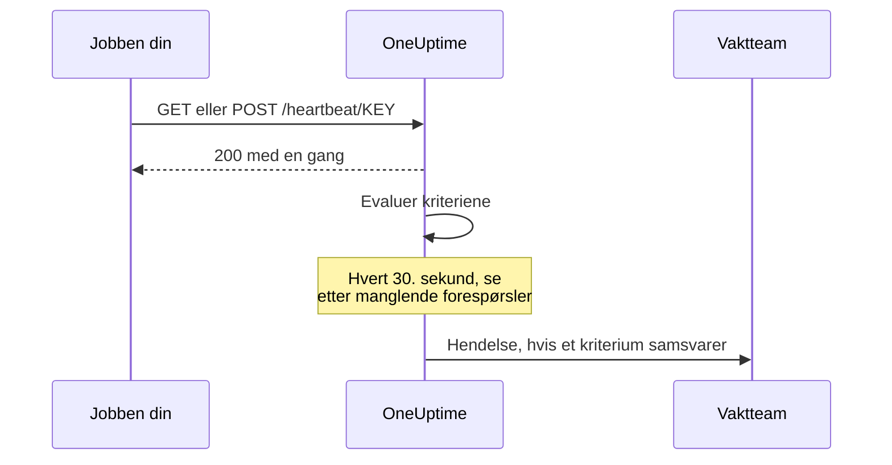

# Innkommende forespørsel-overvåking

En monitor for innkommende forespørsler gir deg en URL som andre systemer sender HTTP-forespørsler til. OneUptime evaluerer hver forespørsel mot kriteriene dine og kan endre monitorens status, erklære hendelser og tilkalle dem som har vakt.

Den dekker to ulike oppgaver:

- **Heartbeat-overvåking** — en cron-jobb, en worker eller en enhet kaller URL-en etter en tidsplan, og OneUptime oppretter en hendelse når kallene slutter å komme.
- **Motta varsler fra et annet system** — Prometheus Alertmanager, Grafana eller noe annet som kan sende JSON med POST, sender varsler inn, og OneUptime gjør hvert av dem til en hendelse med eskalering til vakten og automatisk løsning når problemet er borte.

Begge bruker samme monitortype. Det som skiller dem, er kriteriene du konfigurerer.

:::cards
- [Opprett monitoren](#opprett-en-monitor-for-innkommende-forespørsler): Få en heartbeat-URL i noen få trinn.
- [Send et heartbeat](#send-et-heartbeat): Fra curl, cron, Node.js, Python eller Go.
- [Varsle når kallene stopper](#marker-som-frakoblet-hvis-det-ikke-kommer-noe-heartbeat-på-10-minutter-en-dødmannsbryter): Gjør monitoren til en dødmannsbryter.
- [Motta varsler](#motta-varsler-fra-et-annet-system): Én hendelse per varsel fra Alertmanager eller Grafana.
:::

## Slik fungerer det

Ingenting sjekker systemet ditt utenfra: systemet ditt kaller monitorens URL, OneUptime svarer med en gang og evaluerer deretter forespørselen mot monitorens kriterier. Et kriterium som ser etter forespørsler som har *sluttet* å komme, sjekkes i tillegg på nytt i bakgrunnen hvert 30. sekund, slik at også stillhet kan opprette en hendelse.



Bruk den til å:

- Overvåke cron-jobber og planlagte oppgaver
- Bekrefte at bakgrunns-workers kjører
- Overvåke tjenester bak brannmurer som ikke kan nås utenfra
- Motta varsler fra Prometheus Alertmanager, Grafana og andre varslingssystemer
- Følge heartbeat-signaler fra ethvert system som kan snakke HTTP

## Opprett en monitor for innkommende forespørsler

:::steps
### Start en ny monitor

Gå til **Monitorer**, og klikk på **Opprett monitor**.

### Velg Incoming Request

Under **Monitortype** velger du **Incoming Request** — den er en av de vanlige typene øverst. Skriv inn et **Navn**, og klikk deretter på **Neste**.

### Gå gjennom kriteriene

Trinnet **Kriterier** starter med [standardkriteriene](#hva-du-får-fra-start). For et heartbeat klikker du på **Legg til kriterier** og gir det nye kriteriet et filter **Incoming Request** / **Not Recieved In Minutes** som endrer statusen til frakoblet og erklærer en hendelse, med **Løs hendelse automatisk** slått på. Dra det deretter øverst i listen — se [Eksempler på kriterier](#eksempler-på-kriterier) for hvorfor.

### Opprett monitoren

Klikk på **Opprett monitor**. Monitoren åpnes på siden **Oversikt**, der kortet **Send the first heartbeat** viser **Heartbeat URL** med en kopieringsknapp og en eksempelkommando med `curl`.

### Send den første forespørselen

Konfigurer tjenesten din til å sende forespørsler til den URL-en (se [Send et heartbeat](#send-et-heartbeat)). Når den første forespørselen kommer, gir kortet plass til monitorens historikk, og et kort **Heartbeat URL** viser URL-en og når den siste forespørselen kom.
:::

> [!NOTE]
> URL-en inneholder monitorens hemmelige nøkkel, så bare personer som kan redigere monitorer, kan se den. Du finner den igjen når som helst på monitorens side **Dokumentasjon**, i delen **Konfigurasjon** i sidemenyen.

## Forespørsels-URL-en

Monitoren din har en unik URL i dette formatet:

```text
https://oneuptime.com/heartbeat/YOUR_SECRET_KEY
```

Erstatt `https://oneuptime.com` med URL-en til OneUptime-instansen din hvis du drifter selv.

Send **GET**- eller **POST**-forespørsler til denne URL-en. HEAD godtas og behandles som GET; PUT, PATCH og DELETE returnerer 404. Den hemmelige nøkkelen i stien er den eneste legitimasjonen — det kreves ingen header eller token. Spørrestrenger ignoreres: send det kriteriene skal lese, i forespørselsteksten eller i headerne.

> [!WARNING]
> Alle som kjenner denne URL-en, kan markere monitoren som frisk, så behandle den som en hemmelighet. Hvis den lekker, åpner du monitorens side **Innstillinger** og klikker på **Tilbakestill hemmelig nøkkel for innkommende forespørsel**, og deretter oppdaterer du hver avsender. Alle headere du sender, lagres på monitoren og er synlige for alle som kan lese den — ikke send API-nøkler eller tokener i headere til dette endepunktet.

> [!IMPORTANT]
> OneUptime svarer `200` med et tomt JSON-objekt (`{}`) med en gang og behandler forespørselen via en kø. Svaret skrives før noen validering skjer, så en `200` er **ikke** en bekreftelse på at forespørselen ble godtatt — en feil hemmelig nøkkel, en slettet monitor og en deaktivert monitor returnerer også `200`. Sjekk monitorens egen tidslinje for å bekrefte at forespørslene kommer frem.

### Send en forespørselstekst

Hvis du vil bruke felt inne i forespørselsteksten — `{{requestBody.status}}` i en hendelsestittel, en JSON-sti i gruppering av hendelser eller et kriterium med et JavaScript-uttrykk — sender du `Content-Type: application/json`. Det er formatet denne dokumentasjonen går ut fra overalt. Teksten må være et JSON-objekt eller en JSON-matrise: ugyldig JSON, eller en enkeltstående verdi som `"error"`, avvises med en `500`.

| Innholdstype | Hva kriterier og maler ser |
| --- | --- |
| `application/json` | Den tolkede JSON-en. |
| `application/x-www-form-urlencoded` | Det tolkede skjemaet. Nøkler i hakeparenteser nestes (`alerts[0][status]=firing`), og alle verdier er strenger. |
| Alt annet, eller ingen | En tom tekst (`{}`), så hver henvisning til `requestBody` blir til ingenting. |

Tekster på opptil 50 MB godtas; en større avvises med en `413`. Ikke komprimer teksten med `Content-Encoding: gzip`: da lagres den ikke som JSON, og stier inn i den blir ikke løst opp.

### Send et heartbeat

Hvert eksempel sender én forespørsel. Erstatt `YOUR_SECRET_KEY` med nøkkelen fra URL-en til monitoren din.

:::tabs
@tab curl
```bash
# Simple GET request
curl https://oneuptime.com/heartbeat/YOUR_SECRET_KEY

# POST request with a JSON body
curl -X POST https://oneuptime.com/heartbeat/YOUR_SECRET_KEY \
  -H "Content-Type: application/json" \
  -d '{"status": "healthy", "version": "1.2.3"}'
```
@tab Cron
```bash
# Send a heartbeat every 5 minutes
*/5 * * * * curl -fsS https://oneuptime.com/heartbeat/YOUR_SECRET_KEY > /dev/null

# Or ping only when the job succeeds, so a failed run counts as a missed heartbeat
0 2 * * * /usr/local/bin/backup.sh && curl -fsS https://oneuptime.com/heartbeat/YOUR_SECRET_KEY > /dev/null
```
@tab Node.js
```javascript title="heartbeat.mjs"
// Node.js 18 or later: fetch is built in. Run with `node heartbeat.mjs`.
const response = await fetch(
  "https://oneuptime.com/heartbeat/YOUR_SECRET_KEY",
  {
    method: "POST",
    headers: { "Content-Type": "application/json" },
    body: JSON.stringify({ status: "healthy", version: "1.2.3" }),
  },
);

console.log(response.status); // 200
```
@tab Python
```python title="heartbeat.py"
# Python 3, standard library only. Run with `python3 heartbeat.py`.
import json
import urllib.request

request = urllib.request.Request(
    "https://oneuptime.com/heartbeat/YOUR_SECRET_KEY",
    data=json.dumps({"status": "healthy", "version": "1.2.3"}).encode(),
    headers={"Content-Type": "application/json"},
    method="POST",
)

with urllib.request.urlopen(request, timeout=10) as response:
    print(response.status)  # 200
```
@tab Go
```go title="heartbeat.go"
// Run with `go run heartbeat.go`.
package main

import (
	"bytes"
	"fmt"
	"net/http"
)

func main() {
	body := []byte(`{"status": "healthy", "version": "1.2.3"}`)

	resp, err := http.Post(
		"https://oneuptime.com/heartbeat/YOUR_SECRET_KEY",
		"application/json",
		bytes.NewReader(body),
	)
	if err != nil {
		panic(err)
	}
	defer resp.Body.Close()

	fmt.Println(resp.StatusCode) // 200
}
```
@tab PowerShell
```powershell
# Windows PowerShell 5.1 or PowerShell 7
Invoke-RestMethod -Method Post `
  -Uri "https://oneuptime.com/heartbeat/YOUR_SECRET_KEY" `
  -ContentType "application/json" `
  -Body '{"status": "healthy", "version": "1.2.3"}'
```
:::

## Overvåkingskriterier

Du kan konfigurere kriterier som avgjør når tjenesten din regnes som online, redusert eller frakoblet. Hvert kriteriefilter har en **Filtertype** (hva det ses på), et **Filtervilkår** (hvordan det sammenlignes) og en **Verdi**.

### Hva du får fra start

En ny monitor for innkommende forespørsler opprettes med to kriterier som leser forespørselsteksten:

| Kriterium | Filtertype | Filtervilkår | Verdi | Virkning |
| -------- | ------------ | ---------------- | ------- | -------------------------------------------- |
| Offline  | Forespørselstekst | Inneholder | `error` | Markerer monitoren som frakoblet, åpner en hendelse |
| Online   | Forespørselstekst | Not Contains | `error` | Markerer monitoren som online |

Dette passer for det vanlige tilfellet der avsenderen rapporterer sin egen helse i nyttelasten: en forespørsel der teksten nevner `error`, tar monitoren ned, og den neste forespørselen uten ordet får monitoren opp igjen og løser hendelsen. En forespørsel helt uten tekst regnes som "inneholder ikke `error`", så et rent heartbeat-kall holder monitoren online.

Endre verdien til det avsenderen faktisk sender (`"status":"firing"`, `FAILED` og så videre) — sammenligningen er et søk etter en delstreng i hele teksten, nøkler inkludert, som skiller mellom store og små bokstaver, så også `{"error":null}` samsvarer med `error`.

> [!NOTE]
> Disse standardene er **ikke** en dødmannsbryter: ingenting her utløses når forespørslene slutter å komme. Vil du bli varslet ved stillhet, legger du til et kriterium **Incoming Request** / **Not Recieved In Minutes** som beskrevet nedenfor.

### Tilgjengelige filtertyper

| Filtertype | Sjekker | Merknader |
| --------------------- | ------------------------------------------------------ | -------------------------------------------------------------------------------------------- |
| Incoming Request | Om en forespørsel er mottatt innenfor et tidsvindu | Den eneste kontrollen som kan utløses når ingenting kommer |
| Forespørselstekst | Forespørselsteksten | Søk etter en delstreng. Objekter som tekst sammenlignes som kompakt JSON |
| Request Header | Navnene på forespørselens headere | Nøyaktig sammenligning med et helt headernavn, uten hensyn til store og små bokstaver |
| Request Header Value | Verdiene til forespørselens headere | Nøyaktig sammenligning med en hel headerverdi, uten hensyn til store og små bokstaver |
| JavaScript Expression | Ethvert uttrykk over `requestBody` og `requestHeaders` | Det mest fleksible alternativet — se [JavaScript-uttrykk](/docs/monitor/javascript-expression) |

### Filtervilkår

Hver filtertype har sine egne vilkår:

| Filtertype | Vilkår |
| --- | --- |
| **Incoming Request** | **Recieved In Minutes** — en forespørsel er mottatt innenfor det angitte antallet minutter. **Not Recieved In Minutes** — ingen forespørsel er mottatt innenfor det angitte antallet minutter. (Dashbordet staver dem slik.) |
| **Forespørselstekst**, **Request Header**, **Request Header Value** | **Inneholder** og **Not Contains** |
| **JavaScript Expression** | **Evaluates To True** |

> [!NOTE]
> Headernavn og -verdier sammenlignes med små bokstaver og med hele navnet eller hele verdien, ikke som delstreng: `application/json` samsvarer ikke med `application/json; charset=utf-8`. Bare **Forespørselstekst** søker etter en delstreng. Headere som proxyen din eller OneUptimes egen lastbalanserer legger til (`x-forwarded-for`, `x-real-ip`), lagres også.

Objekter som tekst sammenlignes som kompakt JSON uten mellomrom, så et filter **Forespørselstekst** / **Inneholder** må skrives `"status":"firing"` — kopierer du `"status": "firing"` fra en pent formatert nyttelast, samsvarer det aldri.

### Eksempler på kriterier

#### Marker som frakoblet hvis det ikke kommer noe heartbeat på 10 minutter (en dødmannsbryter)

| Felt | Verdi |
| --- | --- |
| **Filtertype** | Incoming Request |
| **Filtervilkår** | Not Recieved In Minutes |
| **Verdi** | `10` |

#### Marker som redusert ut fra innholdet i forespørselsteksten

| Felt | Verdi |
| --- | --- |
| **Filtertype** | Forespørselstekst |
| **Filtervilkår** | Inneholder |
| **Verdi** | `"status":"degraded"` |

> [!IMPORTANT]
> Legg dødmannsbryteren **over** standardkriteriene. Kriteriene sjekkes ovenfra, og det første som samsvarer, avgjør. Bakgrunnskontrollen leser den siste forespørselen på nytt, så standardkriteriet for online — "Request Body Not Contains `error`" — fortsetter å samsvare med den, og et kriterium under det kommer aldri til. **Legg til kriterier** legger til et kriterium nederst: dra det opp.

> [!WARNING]
> En monitor evalueres bare på nytt i bakgrunnen hvis minst ett av kriteriene sjekker **Incoming Request**. En monitor der kriteriene bare sjekker forespørselsteksten, Request Header eller et JavaScript-uttrykk, evalueres når en forespørsel kommer, og ikke på noe annet tidspunkt — så den kan aldri bli frakoblet av seg selv. Vil du ha en alarm for manglende heartbeat, trenger du et kriterium med **Incoming Request**.

Bakgrunnskontrollen teller hele minutter og utløses så snart *mer* enn verdien har gått: "Not Recieved In Minutes: 10" utløses omtrent 11 minutter etter den siste forespørselen (kontrollen kjører hvert 30. sekund). En monitor som aldri har mottatt en forespørsel, behandles som om opprettelsestidspunktet var den siste forespørselen, så det samme kriteriet på en helt ny monitor utløses omtrent 11 minutter etter at du oppretter den, selv om avsenderen aldri ble koblet til. Bare minutter da OneUptime tok imot, teller med: minutter mens OneUptime selv starter på nytt, oppgraderes eller tar igjen etterslep, teller ikke, slik [Når OneUptime ikke mottar data](/docs/monitor/when-oneuptime-is-not-receiving) forklarer.

## Motta varsler fra et annet system

Alertmanager, Grafana og lignende verktøy sender med POST et JSON-dokument som beskriver ett eller flere varsler. Som standard åpner et kriterium **én** hendelse, så en nyttelast med fem varsler ville gi én enkelt hendelse. Gruppering av hendelser endrer det: den henter en verdi ut av nyttelasten og åpner **en egen hendelse per særskilt verdi**, som alle kan være åpne samtidig.

```mermaid title="Gruppering av hendelser: én hendelse per varsel i nyttelasten"
flowchart TB
    payload["Webhook-nyttelast"] --> keys["Én nøkkel per varsel"]
    keys --> state{"Varsel løst?"}
    state -->|Nei| open["Åpne eller behold hendelsen"]
    state -->|Ja| resolve["Løs hendelsen"]
```

### Slå på gruppering av hendelser

:::steps
1. Åpne kriteriet, og vis **Innstillinger**.
2. Slå på **Group incidents and alerts by a payload field**.
3. Fyll inn **Open a separate incident for each…**. Skal hver hendelse løse seg selv, fyller du også inn feltet og verdien under **Auto-resolve each incident when…** (se nedenfor). Lagre deretter monitoren.
:::

| Felt | Eksempel | Hva det gjør |
| ---------------------------------- | ---------------------------------------- | ---------------------------------------------------------------------- |
| Open a separate incident for each… | `requestBody.alerts[*].labels.alertname` | Stien der de særskilte verdiene deler opp hendelsene |
| Field that signals recovery | `requestBody.alerts[*].status` | Stien som sjekkes for å avgjøre at et varsel er over |
| Value that means recovered | `resolved` | Den nøyaktige verdien som markerer at problemet er over |
| Max incidents per request | `100` (standard) | Sikkerhetstak slik at et felt med mange verdier ikke kan åpne et ubegrenset antall hendelser |

### Syntaks for stier

Stier må starte med det bokstavelige prefikset `requestBody.`. En sti uten det — `alerts[*].labels.alertname` — samsvarer ikke med noe, uten å si fra. Innpakningen `{{ }}` er valgfri: `requestBody.status` og `{{requestBody.status}}` oppfører seg likt.

- `[*]` brer seg ut over en matrise — én hendelse per **særskilt** verdi. To elementer som gir samme verdi, slås sammen til én hendelse, og den hendelsens tilstand (aktiv/løst) hentes fra det **første** samsvarende elementet. **Bare den første `[*]` i en sti er et jokertegn**; `requestBody.groups[*].alerts[*].name` samsvarer ikke med noe.
- `[0]` og `[last]` velger ett enkelt element og kan komme etter en `[*]`.
- Objekt- og matriseverdier, tomme strenger og null-verdier hoppes over. `0` og `false` er gyldige nøkler.
- Teksten må være et JSON-objekt; en nyttelast der øverste nivå er en matrise, grupperes ikke.

### Løsning skjer ut fra hendelser

En webhook beskriver bare det som står i den nyttelasten, så OneUptime løser aldri en hendelse fordi nøkkelen sluttet å dukke opp. En hendelse løses bare når en nyttelast uttrykkelig sier at den nøkkelen er over. To ting må begge være sanne:

1. **Field that signals recovery** og **Value that means recovered** er fylt inn og samsvarer med nyttelasten. Sammenligningen er nøyaktig og skiller mellom store og små bokstaver — `Resolved` samsvarer ikke med `resolved`.
2. Hendelsen til kriteriet har **Løs hendelse automatisk** slått på, under **Flere felt** i hendelsesskjemaet. Uten det ignoreres samsvarende meldinger om at problemet er over, og hendelsene forblir åpne. (Det samme gjelder varsler og **Løs varsel automatisk**.) Standardkriteriet for frakoblet starter med det slått på; en hendelse du selv legger til i et kriterium, starter med det slått av.

**Max incidents per request** begrenser uthentingen, ikke bare opprettelsen. Nøkler forbi taket er også usynlige for løsningen, så i en nyttelast med flere særskilte nøkler enn taket lukker ikke et varsel som melder `resolved` forbi taket, hendelsen sin.

> [!NOTE]
> Når én monitor mottar forespørsler raskere enn OneUptime evaluerer dem, evaluerer OneUptime den nyeste og hopper over dem imellom, så en bølge av webhooks kan etterlate et aktivt eller et løst varsel uevaluert. På en selvhostet server får `INCOMING_REQUEST_INGEST_COALESCE_ENABLED=false` i miljøet til OneUptime-appen hver forespørsel til å bli evaluert for seg.

> [!WARNING]
> Hvis **Field that signals recovery** inneholder `[*]`, men **Open a separate incident for each…** ikke gjør det, blir ingenting noen gang løst. Bruk enten `[*]` i begge, eller i ingen av dem. En sti for løsning uten `[*]` evalueres mot hele nyttelasten, så en `status: resolved` på nyttelastnivå løser hver nøkkel i den nyttelasten — også varsler der egen status fortsatt er aktiv.

### Navngi hendelsene

Grupperingsnøkkelen gjøres tilgjengelig for hendelses- og varslingsmaler som en variabel oppkalt etter **det siste segmentet i stien**:

| Sti | Variabel |
| ---------------------------------------- | ----------------- |
| `requestBody.alerts[*].labels.alertname` | `{{alertname}}`   |
| `requestBody.alerts[*].fingerprint`      | `{{fingerprint}}` |
| `requestBody.commonLabels.severity`      | `{{severity}}`    |

Hele nyttelasten er tilgjengelig ved siden av, så både en hendelsestittel `{{alertname}}` og en beskrivelse som henviser til `{{requestBody.commonAnnotations.summary}}`, fungerer. Se [Hendelse- og varslingsmaler](/docs/monitor/incident-alert-templating).

> [!WARNING]
> Navnet på variabelen er en del av identiteten OneUptime bruker for å koble en melding om at problemet er over, til en åpen hendelse. Endrer du grupperingsstien til en med et annet siste segment, blir alle hendelser som står åpne under den gamle stien, foreldreløse — de kan ikke lenger løses automatisk og må lukkes manuelt.

`[*]` virker **bare** i de to feltene for grupperingsstier. Andre steder løses den ikke opp, og en plassholder som ikke løses opp, skrives **ordrett** i stedet for å bli tømt — en tittel `{{requestBody.alerts[*].labels.alertname}}` vises med klammeparentesene fortsatt i. En tittel `{{requestBody.alerts[0].annotations.summary}}` løses opp, men leser alltid det første varselet i nyttelasten, ikke det denne hendelsen ble åpnet for. Foretrekk grupperingsvariabelen pluss nyttelastens felles felt `commonAnnotations`.

### Gjennomgått eksempel

En fullstendig Alertmanager-konfigurasjon finner du under [Prometheus Alertmanager](/docs/integrations/prometheus-alertmanager). For Grafana, se [Grafana](/docs/integrations/grafana).

## Beste praksis

1. **Sett tidsvinduet riktig** — Hvis cron-jobben din kjører hvert 5. minutt, setter du terskelen for "Not Recieved In Minutes" til 10–15 minutter for å gi rom for forsinkelser av og til, og legger det kriteriet først.
2. **Send med meningsfulle data** — Send statusinformasjon i forespørselsteksten, slik at du kan sette opp detaljerte kriterier.
3. **Bruk POST med `Content-Type: application/json`** — alt som leser inne i teksten, avhenger av det.
4. **Ikke bland de to oppgavene på én monitor** — en monitor som mottar hendelsesdrevne varsler, har ingen fast rytme, så et kriterium "Not Recieved In Minutes" på den vil vippe frem og tilbake. Bruk en egen monitor til dødmannsbryteren.
5. **Overvåk overvåkingen** — Sørg for at tjenesten som sender forespørslene, håndterer feil skikkelig, slik at mislykkede forespørsler ikke går upåaktet hen.

## Feilsøking

:::details Avsenderen min får en 200, men ingenting vises på monitoren
`200` sendes før forespørselen valideres, så den beviser ikke at forespørselen ble godtatt. Sjekk at den hemmelige nøkkelen i URL-en samsvarer med monitorens **Heartbeat URL**, og at monitoren ikke er deaktivert. Se deretter på monitorens tidslinje om forespørslene kommer frem.
:::

:::details Monitoren blir aldri frakoblet når heartbeats stopper
Bare et kriterium med **Incoming Request** (**Not Recieved In Minutes**) kan merke stillhet. Legg til et hvis det ikke finnes, og dra det over standardkriteriene: standardkriteriet for online samsvarer med den siste forespørselen ved hver bakgrunnskontroll, og det første kriteriet som samsvarer, avgjør.
:::

:::details Et filter på Forespørselstekst samsvarer aldri
Send `Content-Type: application/json`, og skriv verdien som kompakt JSON — `"status":"firing"`, uten mellomrom etter kolonet. Uten en innholdstype for JSON eller skjema blir teksten ikke tolket.
:::

:::details Et filter på Request Header samsvarer aldri
Headernavn og -verdier sammenlignes i sin helhet. Oppgi hele verdien, som `application/json; charset=utf-8`, i stedet for en del av den.
:::

:::details Avsenderen får en 500
Forespørselen sier `Content-Type: application/json`, men teksten er ikke et JSON-objekt eller en JSON-matrise. Send gyldig JSON, eller en annen innholdstype.
:::

## Neste trinn

:::cards
- [Prometheus Alertmanager](/docs/integrations/prometheus-alertmanager): Et fullstendig oppsett for innkommende varsler.
- [Grafana](/docs/integrations/grafana): Det samme, for varsler fra Grafana.
- [Hendelse- og varslingsmaler](/docs/monitor/incident-alert-templating): Alle variabler som er tilgjengelige i titler og beskrivelser.
- [JavaScript-uttrykk](/docs/monitor/javascript-expression): Syntaks for uttrykk og regler for anførselstegn.
:::
