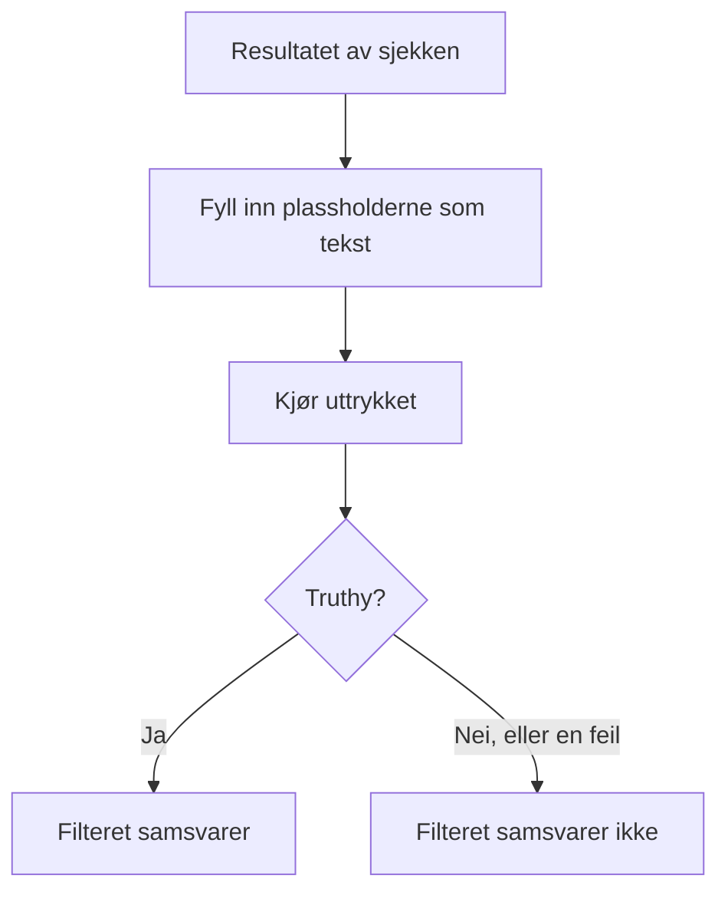

# JavaScript-uttrykk

Et kriteriefilter **JavaScript Expression** avgjør med én linje JavaScript i stedet for en fast sammenligning om en monitors kriterium er oppfylt. Bruk det når de innebygde filtrene ikke kan uttrykke betingelsen — et felt dypt inne i et JSON-svar, to verdier som sammenlignes med hverandre, eller flere sjekker kombinert med `&&` og `||`.

:::cards
- [Slik fungerer det](#slik-fungerer-det): Plassholderne fylles inn, deretter kjører uttrykket.
- [Variabler](#variabler-etter-monitortype): Hva hver monitortype gir deg.
- [Eksempler](#eksempler): Uttrykk for API-er, innkommende forespørsler og databaser.
- [Regler for anførselstegn](#regler-for-anførselstegn): Feilen nesten alle gjør.
:::

## Slik fungerer det

Før uttrykket kjører, erstattes hver plassholder `{{variable}}` i det med verdien fra monitorens siste sjekk — som ren tekst. Resultatet kjøres deretter som JavaScript. Hvis det gir en sann verdi (truthy), samsvarer filteret; alt annet, også en feil, betyr at det ikke samsvarer.



Fordi plassholderne erstattes som tekst, blir `{{responseBody.item}}` til den rå verdien. En streng må stå i anførselstegn for å være en JavaScript-streng; et tall eller en boolsk verdi skal ikke det — se [Regler for anførselstegn](#regler-for-anførselstegn). Uttrykk kjører på OneUptime-serveren, i en isolert sandkasse.

## Legg til et filter av typen JavaScript Expression

:::steps
### Åpne kriteriene

Åpne **Konfigurasjon → Kriterier** på monitoren, og klikk på **Rediger Overvåkingskriterier**, eller bruk trinnet **Kriterier** i **Opprett monitor**. Arbeid i kriteriet du vil endre, eller klikk på **Legg til kriterier** for et nytt.

### Legg til et filter

Klikk på **Legg til filter** under **Filtre**, og sett **Filtertype** til **JavaScript Expression**. **Filtervilkår** er **Evaluates To True**.

### Skriv uttrykket

Skriv inn uttrykket i **Verdi**, med [variablene for monitorens type](#variabler-etter-monitortype). Lenken under filteret, **Read documentation for using JavaScript expressions here.**, åpner denne siden.

### Lagre

Lagre monitoren. Filteret evalueres ved monitorens neste sjekk.
:::

## Variabler etter monitortype

JavaScript-uttrykk tilbys for monitorer av typen Website, API, Incoming Request, Incoming Email, SQL Query og Database Health.

### Nettsted- og API-monitorer

| Variabel | Beskrivelse | Type |
| --- | --- | --- |
| `responseBody` | Svarets brødtekst. Hvis brødteksten er JSON, tolkes den; ellers, for eksempel for HTML eller XML, er den en streng. | `string` eller `JSON` |
| `responseHeaders` | Svarets hoder, med navn i små bokstaver. | `Dictionary<string>` |
| `responseStatusCode` | Svarets statuskode. | `number` |
| `responseTimeInMs` | Svartiden i millisekunder. | `number` |
| `isOnline` | Om monitoren regner svaret som tilkoblet. | `boolean` |

### Monitorer for innkommende forespørsler

| Variabel | Beskrivelse | Type |
| --- | --- | --- |
| `requestBody` | Forespørselens brødtekst. | `string` eller `JSON` |
| `requestHeaders` | Forespørselens hoder, med navn i små bokstaver. | `Dictionary<string>` |

### Monitorer for SQL-spørringer

| Variabel | Beskrivelse | Type |
| --- | --- | --- |
| `rowCount` | Antallet rader spørringen returnerte. | `number` |
| `scalarValue` | Den første kolonnen i den første raden. | hvilken som helst |
| `firstRow` | Den første raden, som par av kolonne og verdi. | `JSON` |
| `executionTimeInMs` | Hvor lang tid spørringen tok, i millisekunder. | `number` |
| `queryError` | Feilen fra spørringen, hvis det var en. | `string` |
| `isOnline` | Om databasen kunne nås, og spørringen lyktes. | `boolean` |

### Monitorer for databasehelse

`isOnline`, `engineVersion`, `connectionError`, `collectedGroups`, `unavailableGroups` og `metrics`. Se [Variabler for JavaScript-uttrykk](/docs/monitor/database-health-monitor#variabler-for-javascript-uttrykk) på siden om databasehelse-overvåking.

### Monitorer for innkommende e-post

Filteret tilbys, men ingen e-postfelt er knyttet til det: et uttrykk kan ikke lese emnet, avsenderen, brødteksten eller mottakeren. Bruk e-postfiltertypene i stedet — se [Innkommende e-post-overvåking](/docs/monitor/incoming-email-monitor#tilgjengelige-kriteriefelt).

## Eksempler

Hver linje nedenfor er ett komplett uttrykk. For en JSON-brødtekst i et svar som denne:

```json
{
  "item": "hello",
  "count": 3,
  "items": [{ "name": "hello" }]
}
```

| Uttrykk | Samsvarer når |
| --- | --- |
| `"{{responseBody.item}}" === "hello"` | Feltet `item` er `hello`. |
| `{{responseBody.count}} > 2` | Feltet `count` er større enn 2. |
| `"{{responseBody.items[0].name}}" === "hello"` | Det første elementet i `items` har navnet `hello`. |
| `{{responseStatusCode}} === 200 && {{responseTimeInMs}} < 500` | Statusen er 200, og svaret tok mindre enn et halvt sekund. |
| `/hel+o/.test("{{responseBody.item}}")` | Feltet `item` samsvarer med et regulært uttrykk. |
| `"{{responseHeaders.content-type}}".startsWith("application/json")` | Svaret er JSON. Navn på hoder er med små bokstaver. |

Kombiner betingelser med `&&` og `||`, og grupper dem med parenteser:

```javascript
({{responseStatusCode}} === 200 || {{responseStatusCode}} === 204) && {{responseTimeInMs}} < 1000
```

For en monitor for innkommende forespørsler som mottar `{"status": "degraded", "region": "eu"}` som `Content-Type: application/json`:

```javascript
"{{requestBody.status}}" === "degraded" && "{{requestBody.region}}" === "eu"
```

For en monitor for SQL-spørringer der spørringen returnerer et antall, varsle ved et høyt antall eller en treg spørring:

```javascript
{{scalarValue}} > 50 || {{executionTimeInMs}} > 2000
```

For en monitor for databasehelse leser du én måling ved å slå opp i hele objektet `metrics` — navnene på seriene inneholder punktum, så de kan ikke stå inne i klammeparentesene:

```javascript
{{metrics}}['oneuptime.monitor.database.connections.used.percent'] > 90
```

## Regler for anførselstegn

`{{var}}` erstattes med verdien, som tekst. For å sammenligne en streng setter du den i anførselstegn, som i `"{{responseBody.item}}" === "hello"`; for å sammenligne et tall lar du det stå uten, som i `{{responseStatusCode}} === 200`.

| Verditype | Skriv den | Eksempel |
| --- | --- | --- |
| Streng | I anførselstegn | `"{{responseBody.status}}" === "ok"` |
| Tall | Uten anførselstegn | `{{responseTimeInMs}} < 500` |
| Boolsk verdi | Uten anførselstegn | `{{isOnline}} === true` |
| Objekt eller matrise | Uten anførselstegn, og slå så opp i det | `{{responseHeaders}}['content-type']` |

Tre ting å passe på:

- **En plassholder i anførselstegn er alene alltid sann.** `"{{responseBody.healthy}}"` er den ikke-tomme strengen `"false"` når feltet er `false`. Sammenlign den: `"{{responseBody.healthy}}" === "true"`, eller la den stå uten anførselstegn: `{{responseBody.healthy}} === true`.
- **Verdier escapes ikke.** En verdi som inneholder et dobbelt anførselstegn eller et linjeskift, avslutter strengen for tidlig, og uttrykket feiler. For å se etter tekst på en HTML-side bruker du filteret **Svartekst** i stedet.
- **En sti som mangler, blir stående som den er skrevet.** Hvis sjekken ikke har et slikt felt, blir `{{responseBody.item}}` stående i uttrykket som det er, noe som som regel er en syntaksfeil — så filteret samsvarer ikke.

## Begrensninger

Et uttrykk har 5 sekunder på seg til å kjøre. Et uttrykk som tar lenger tid, eller kaster en feil, samsvarer ikke, og feilen skrives til OneUptime-serverens logg.

## Feilsøking

:::details Uttrykket samsvarer aldri
Sjekk anførselstegnene først: en strengplassholder uten anførselstegn blir et løst ord, noe som er en syntaksfeil, og en feil samsvarer aldri. Sjekk deretter at stien finnes i resultatet av sjekken — en plassholder for en sti som ikke finnes, fylles ikke inn.
:::

:::details Uttrykket samsvarer alltid
En plassholder i anførselstegn er alene en ikke-tom streng, og den er alltid truthy. Sammenlign den med en verdi.
:::

## Neste steg

:::cards
- [Hendelse- og varslingsmaler](/docs/monitor/incident-alert-templating): Bruk de samme plassholderne i titler og beskrivelser av hendelser.
- [API-overvåking](/docs/monitor/api-monitor): Sjekk et HTTP-endepunkt og svaret fra det.
- [Innkommende forespørsel-overvåking](/docs/monitor/incoming-request-monitor): Vurder forespørsler som andre systemer sender deg.
:::
