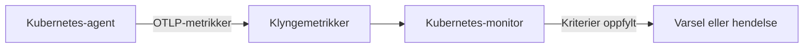

# Kubernetes-overvåking

En Kubernetes-monitor varsler på metrikkene som OneUptimes Kubernetes-agent sender fra en klynge: noder, poder, containere, arbeidsbelastninger, autoskalerere og kontrollplanet. Start fra en ferdig varslingsmal, velg én metrikk, eller skriv din egen spørring, og angi deretter terskelen som åpner et varsel eller en hendelse.

:::cards
- [Installer agenten](/docs/monitor/kubernetes-agent): Én Helm-kommando tar klyngen inn i OneUptime.
- [Opprett monitoren](#opprett-en-kubernetes-monitor): Velg klyngen, og deretter en mal, en metrikk eller en spørring.
- [Varslingsmaler](#ferdige-varslingsmaler): Sytten ferdige varsler, fra CrashLoopBackOff til etcd.
- [Kriterier](#overvåkingskriterier): Statiske terskler og avviksdeteksjon.
:::

## Slik fungerer det

Agenten sender klyngens metrikker til OneUptime over OTLP, hver merket med klyngens navn (`k8s.cluster.name`, chartets `clusterName`). De første dataene fra et nytt navn registrerer klyngen under **Kubernetes**, og fra da av kan klyngen velges i en Kubernetes-monitor. Hvert minutt spør monitoren etter disse metrikkene over sitt **Tidsintervall**, aggregerer dem og sammenligner resultatet med kriteriene sine.

## Før du begynner

- OneUptimes Kubernetes-agent kjører i klyngen. Se [Kubernetes-agent (Helm-installasjon)](/docs/monitor/kubernetes-agent); klyngen vises under **Kubernetes** noen minutter etter installasjonen.
- For kontrollplanmalene (**etcd No Leader**, **API Server Request Saturation**, **Scheduler Backlog**): agentens innsamling fra kontrollplanet, `controlPlane.enabled`. Administrerte klynger (EKS, GKE, AKS) eksponerer ikke disse endepunktene, så der mottar de monitorene aldri data.

## Opprett en Kubernetes-monitor

:::steps
### Start en ny monitor

Gå til **Monitorer** og klikk på **Opprett monitor**. Velg **Kubernetes** under **Flere monitortyper** – eller skriv `k8s` i søkefeltet.

### Velg klyngen

Velg den i **Kubernetes-klynge**. Listen inneholder hver klynge agenten har rapportert fra.

### Velg hva som skal overvåkes

Bruk en av de tre fanene:

| Fane | Hva du velger |
| --- | --- |
| **Quick Setup** | En [ferdig varslingsmal](#ferdige-varslingsmaler). Den fyller inn metrikken, omfanget, tidsintervallet og kriteriene; du kan fortsatt endre **Tidsintervall**. |
| **Custom Metric** | Én metrikk fra [metrikkatalogen](#metrikkatalog), deretter **Ressursomfang**, filtre, **Aggregering** (Gjennomsnitt, Maksimum, Minimum, Sum eller Antall) og **Tidsintervall**. |
| **Avansert** | **Ressursomfang**, filtre og **Tidsintervall**, og dine egne metrikkspørringer og formler under **Velg målinger**, med et livediagram over resultatet. |

### Angi kriteriene

Angi når monitoren endrer status, og når den åpner et varsel eller en hendelse – se [Overvåkingskriterier](#overvåkingskriterier). En mal har allerede fylt dem inn: gå gjennom tersklene, alvorlighetsgradene og vaktpolicyene.

### Lagre monitoren

Fullfør skjemaet og lagre. Monitoren vises under **Monitorer**, og statusen følger kriteriene dine fra den første evalueringen.
:::

## Konfigurasjonsalternativer

### Ressursomfang og filtre

**Ressursomfang** angir nivået metrikken evalueres på, og avgjør hvilke filtre skjemaet viser. Hvert filter er valgfritt.

| Omfang | Overvåker | Filtre |
| --- | --- | --- |
| Klynge | Hele klyngen | — |
| Navnerom | Ressurser i et navnerom | **Navnerom** |
| Arbeidsbelastning | En deployment, statefulset, daemonset, job eller cronjob | **Navnerom**, **Arbeidslastnavn** |
| Node | En node i klyngen | **Nodenavn** |
| Pod | En pod | **Navnerom**, **Pod-navn** |

### Tidsintervall

**Tidsintervall** er vinduet metrikkspørringen dekker hver gang monitoren evalueres, fra **Past 1 Minute** opp til **Past 365 Days**. Korte vinduer (1 til 15 minutter) passer til varsling; lengre vinduer jevner ut metrikker med mye støy.

### Metrikkspørringer og formler

På fanen **Avansert** angir hver spørring en metrikk, hvordan verdiene aggregeres, og valgfrie attributtfiltre. En **formel** kombinerer spørringer med aritmetikk – malene for nodeutnyttelse deler for eksempel bruken på den allokerbare kapasiteten.

## Metrikkatalog

Fanen **Custom Metric** tilbyr disse metrikkene, gruppert etter ressurstype:

| Kategori | Metrikker |
| --- | --- |
| Pod | Pod CPU Usage, Pod Memory Usage, Pod Phase (Code), Pod Filesystem Usage, Pod Memory Limit Utilization, Pod CPU Limit Utilization, Pod Network I/O (Cumulative, Both Directions) |
| Node | Node CPU Usage, Node Allocatable CPU, Node Memory Usage, Node Filesystem Usage, Node Allocatable Memory, Node Ready Condition, Node Filesystem Available |
| Container | Container Restarts, Container CPU Limit, Container CPU Request, Container Memory Limit, Container Memory Request, Container Ready |
| Arbeidsbelastning | Deployment Available Replicas, Deployment Desired Replicas, DaemonSet Misscheduled Nodes, DaemonSet Ready Nodes, StatefulSet Ready Replicas, Job Failed Pods, Job Successful Pods |
| HPA | HPA Current Replicas, HPA Desired Replicas, HPA Max Replicas, HPA Min Replicas |
| Kontrollplan | etcd Has Leader, API Server In-Flight Requests, Scheduler Pending Pods |

> [!NOTE]
> **Pod CPU Usage** og **Node CPU Usage** er i kjerner, ikke prosent: `0.18` er 0,18 av en kjerne. **Pod Phase (Code)** er en kode (1 Pending, 2 Running, 3 Succeeded, 4 Failed, 5 Unknown) – aggreger den med Maksimum eller Minimum, aldri Sum. Kontrollplanmetrikker kommer bare når agentens innsamling fra kontrollplanet er slått på.

## Overvåkingskriterier

### Hva som evalueres

Disse monitorene evaluerer alltid **Metric Value** – verdien av den konfigurerte metrikkspørringen eller formelen. Kriterieskjemaet har ingen velger for filtertype; det viser **Metrikk**, **Aggregering**, **Betingelse** og **Threshold**.

### Aggregeringstyper

| Aggregering | Beskrivelse |
| --- | --- |
| Gjennomsnitt | Gjennomsnittsverdi over tidsvinduet |
| Sum | Summen av alle verdier |
| Maximum Value | Høyeste verdi i tidsvinduet |
| Minimum Value | Laveste verdi i tidsvinduet |
| All Values | Alle verdier må samsvare med kriteriet |
| Any Value | Minst én verdi må samsvare |

### Betingelser

Statiske terskler sammenlignes med **Threshold** du angir: **Greater Than**, **Less Than**, **Greater Than Or Equal To**, **Less Than Or Equal To** og **Equal To**.

Avviksdeteksjon mot en grunnlinje trenger ingen terskel. Velg en av disse betingelsene, så viser skjemaet i stedet **Følsomhet** og **Grunnlinjevindu**:

| Betingelse | Samsvarer når verdien |
| --- | --- |
| **Anomalously High** | Stiger over det forventede området |
| **Anomalously Low** | Faller under det forventede området |
| **Anomalous** | Forlater det forventede området i en av retningene |

Hver måling sammenlignes med en grunnlinje for samme time i uken, bygget fra **Grunnlinjevindu** (14 dager som standard; 28, 60 eller 90 dager). **Følsomhet** angir hvor bredt det forventede området er: **Lav (4σ — kun grove avvik)**, **Middels (3σ — anbefalt)**, som er standard, eller **Høy (2σ — mer støy, svært stabile tjenester)**. Avviksbetingelser blir værende i en «Learning»-tilstand og gir ingen varsler før det finnes minst det valgte grunnlinjevinduet med metrikkhistorikk.

**Hvis ingen data**, under **Flere felt**, avgjør hva som skjer når spørringen ikke returnerer noe i vinduet: **Ignore** (standard) samsvarer ikke, **Trigger** behandler stillheten som problemet, og **Treat As Zero** sammenligner en null. Tid der OneUptime selv ikke mottok data, er aldri manglende data: en kontroll der vinduet inneholder slik tid, venter i stedet, slik [Når OneUptime ikke mottar data](/docs/monitor/when-oneuptime-is-not-receiving) forklarer.

## Ferdige varslingsmaler

Fanen **Quick Setup** viser disse malene, gruppert etter kategori. Hver fyller inn to kriterier: ett som markerer monitoren som frakoblet og åpner en hendelse og et varsel mens betingelsen gjelder, og ett som setter den tilkoblet igjen når betingelsen opphører.

| Mal | Kategori | Utløses når | Alvorlighetsgrad |
| --- | --- | --- | --- |
| CrashLoopBackOff Detection | Arbeidsbelastning | En container har startet på nytt mer enn 5 ganger siden poden ble opprettet | Kritisk |
| Pod Stuck in Pending | Planlegging | En pod er i fasen Pending i hver måling i et vindu på 15 minutter | Warning |
| Node Not Ready | Node | En node melder NotReady | Kritisk |
| High Node CPU Utilization | Node | En nodes gjennomsnittlige CPU-bruk er over 90 % av den allokerbare CPU-en | Warning |
| High Node Memory Utilization | Node | En nodes gjennomsnittlige minnebruk er over 85 % av det allokerbare minnet | Warning |
| Deployment Replica Mismatch | Arbeidsbelastning | En deployment har færre tilgjengelige replikaer enn ønsket i 15 minutter | Warning |
| Job Failures | Arbeidsbelastning | En job har mislykkede poder | Warning |
| etcd No Leader | Kontrollplan | etcd har ingen valgt leder | Kritisk |
| API Server Request Saturation | Kontrollplan | API-serveren holder 200 eller flere pågående forespørsler i hele vinduet | Kritisk |
| Scheduler Backlog | Planlegging | Schedulerens kø av ventende poder er ikke tom i 5 minutter | Warning |
| High Node Disk Usage | Lagring | En nodes filsystem er mer enn 90 % fullt | Warning |
| DaemonSet Misscheduled Nodes | Arbeidsbelastning | Et DaemonSet kjører poder på noder som ikke lenger samsvarer med nodeselektoren, affiniteten eller toleransene | Warning |
| High Node CPU Request Commitment | Node | En nodes summerte CPU-forespørsler fra containere overstiger 90 % av den allokerbare CPU-en | Warning |
| High Node Memory Request Commitment | Node | En nodes summerte minneforespørsler fra containere overstiger 90 % av det allokerbare minnet | Warning |
| HPA Saturated at Max Replicas | Arbeidsbelastning | En HPA kjører på 90 % eller mer av sin `maxReplicas` | Kritisk |
| Pod Memory Saturating Container Limit | Arbeidsbelastning | En pod bruker mer enn 90 % av minnegrensen til containerne sine | Kritisk |
| Pod CPU Saturating Container Limit | Arbeidsbelastning | En pod bruker mer enn 90 % av CPU-grensen til containerne sine | Warning |

Maler på metrikker per objekt evaluerer hver node, pod, deployment, job, DaemonSet eller HPA for seg, slik at en klynge med flere usunne poder får én hendelse per pod i stedet for én for hele klyngen.

> [!NOTE]
> **CrashLoopBackOff Detection** leser containerens totale antall omstarter for den nåværende poden, ikke en rate. En container som satt fast i en krasjløkke og deretter kom seg, holder varselet åpent til poden erstattes.

### Fang årsaker, ikke bare symptomer

Malene på nodenivå (High Node CPU Utilization, High Node Memory Utilization, Node Not Ready, Pod Stuck in Pending) utløses på *slutten* av en kjede av ressursuttømming, når klyngen allerede er redusert. Tre maler utløses i *starten* av den, der løsningen vanligvis finnes:

- **Pod Memory Saturating Container Limit** og **Pod CPU Saturating Container Limit** fanger en arbeidsbelastning som ligger tett opp mot sine egne grenser. Å krysse en minnegrense gir en umiddelbar OOMKill; å krysse en CPU-grense får kjernen til å strupe poden, så den blir tregere uten noen gang å feile. Begge er den vanlige årsaken bak CrashLoopBackOff og uforklarlig ventetid.
- **HPA Saturated at Max Replicas** fanger en autoskalerer uten mer spillerom. En arbeidsbelastning med for lave grenser per pod blir strupet eller drept, noe som blåser opp nettopp den metrikken HPA-en skalerer på – så autoskalereren fortsetter å legge til replikaer som alle mangler like mye, til den når taket sitt. Å heve grensene er løsningen; å heve `maxReplicas` gjør det verre.

Slå dem på sammen i hvert navnerom som kjører en autoskalert arbeidsbelastning: kombinasjonen skiller «trenger virkelig mer kapasitet» fra «for lite ressurser per pod».

> [!NOTE]
> De to podgrensemalene deler podens bruk på **summen** av containernes grenser, slik at poder med sidecars måles riktig. Kubelets tall for podminne inkluderer sidebuffer som kan frigjøres, så en filtung arbeidsbelastning kan ligge høyt på minnemalen uten noen gang å bli OOMKilled: les det som «nærmer seg grensen», ikke «er i ferd med å bli drept».

## Feilsøking

:::details Klyngen står ikke i listen Kubernetes-klynge
Klynger registrerer seg selv fra agentens data, under det `clusterName` agenten ble installert med. Kontroller at agentens poder kjører, og at klyngen står under **Produkter → Infrastruktur → Kubernetes → Alle klynger**. [Kubernetes-agent (Helm-installasjon)](/docs/monitor/kubernetes-agent) dekker installasjonen og hva du skal kontrollere når det ikke kommer data.
:::

:::details En kontrollplanmal utløses aldri
**etcd No Leader**, **API Server Request Saturation** og **Scheduler Backlog** leser metrikker som bare agentens innsamling fra kontrollplanet henter. Slå på `controlPlane.enabled` i agentens Helm-verdier; den er av som standard. Administrerte klynger (EKS, GKE, AKS) eksponerer ikke disse endepunktene, så på dem mottar disse monitorene aldri data.
:::

:::details En CPU-terskel utløses aldri
**Pod CPU Usage** og **Node CPU Usage** er i kjerner, ikke prosent, så en terskel på `80` betyr 80 kjerner. Angi terskelen i kjerner, eller start fra **High Node CPU Utilization** eller **Pod CPU Saturating Container Limit**, som sammenligner en prosentandel.
:::

:::details CrashLoopBackOff Detection forblir åpen etter at poden kom seg
Malen leser containerens totale antall omstarter for den nåværende poden, så tallet går ikke tilbake når det først har passert 5. Varselet løses når poden erstattes, for eksempel ved en ny utrulling, en utkastelse eller en tømming av noden.
:::

## Neste trinn

:::cards
- [Kubernetes-agent (Helm-installasjon)](/docs/monitor/kubernetes-agent): Installer, oppgrader og finjuster agenten med Helm.
- [Kubernetes-agent](/docs/telemetry/kubernetes-agent): Navneromsfiltre, kontrollplanmetrikker, filtre for loggalvorlighet og AI-agenten.
- [Metrikk-overvåking](/docs/monitor/metrics-monitor): Varsle på enhver metrikk, også agentens egendefinerte metrikker og eBPF-metrikker.
- [Hendelse- og varslingsmaler](/docs/monitor/incident-alert-templating): Sett poden eller noden som overskrider grensen, i hendelsestitler.
:::
