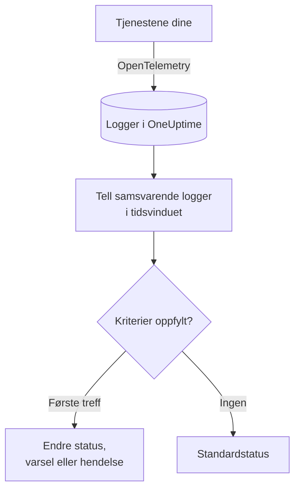
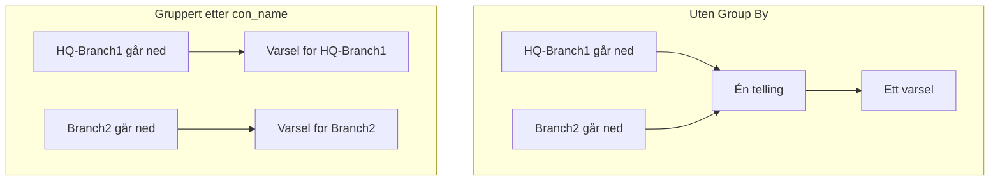

# Logg-overvåking

En loggmonitor teller innenfor et tidsvindu loggene tjenestene dine sender til OneUptime som samsvarer med filtrene dine (tekst, alvorlighetsgrad, tjeneste, attributter). Når antallet oppfyller kriteriene dine, endrer den monitorens status, oppretter et varsel eller erklærer en hendelse. Bruk den til å oppdage en økning i feil, en bestemt feilmelding eller en tjeneste som har sluttet å logge.

:::cards
- [Opprett monitoren](#opprett-en-loggmonitor): Velg hvilke logger som telles, og når du skal varsles.
- [Slik evalueres den](#slik-evalueres-den): Tidsvinduet, tellingen og syklusen på ett minutt.
- [Kriterier](#kriterier): Terskler, avviksdeteksjon og standardverdiene.
- [Varsler per gruppe](#varsler-per-gruppe-group-by): Ett varsel per tunnel, bruker eller grensesnitt.
:::

## Slik fungerer det



Hvert minutt teller OneUptime loggene som samsvarer med monitorens filtre og har kommet inn innenfor tidsvinduet. Antallet sammenlignes med monitorens kriterier fra topp til bunn, og det første kriteriet som samsvarer, avgjør hva som skjer. Når ingen samsvarer, går monitoren tilbake til standardstatusen sin.

## Før du starter

- Tjenestene dine sender logger til OneUptime via OpenTelemetry (eller en annen loggkilde som OneUptime tar inn). Se [OpenTelemetry](/docs/telemetry/open-telemetry).
- For å filtrere eller gruppere på en verdi inne i logglinjen, som navnet på en tunnel eller en bruker, gjør du den først om til et attributt med en [loggpipeline](/docs/telemetry/log-pipelines).

## Opprett en loggmonitor

:::steps
### Start en ny monitor

Gå til **Monitorer**, og klikk på **Opprett monitor**.

### Velg Logs

Under **Monitortype** klikker du på **Flere monitortyper** og velger **Logger** under **Telemetri**, eller du skriver `logs` i søkefeltet. Skriv inn et **Navn**, og klikk deretter på **Neste**.

### Velg loggene som skal telles

I **Loggmonitorkonfigurasjon** angir du **Overvåk logger som inkluderer denne teksten**, **Overvåk logger i (tid)** og **Loggalvorlighetsgrad**. Et filter du lar stå tomt, samsvarer med alle logger. **Loggforhåndsvisning** under filtrene viser loggene de samsvarer med akkurat nå.

### Snevre dem inn (valgfritt)

Åpne **Flere felt** for å filtrere etter telemetritjeneste, infrastrukturentitet eller attributt. Vil du ha ett varsel per tunnel, bruker eller grensesnitt i stedet for ett for hele monitoren, legger du til attributtet under **Group by Attributes** (se [Varsler per gruppe](#varsler-per-gruppe-group-by)).

### Angi kriteriene

Kortet **Monitorkriterier** starter med to kriterier: frakoblet, med en hendelse, når ingen logger samsvarer; tilkoblet når minst én gjør det. Endre dem til det du vil varsles om (se [Kriterier](#kriterier)).

### Opprett monitoren

Klikk på **Opprett monitor**. Monitoren åpnes på siden **Oversikt**, og den første evalueringen kjøres innen ett minutt.
:::

## Hva den spør etter

| Felt | Hva det samsvarer med | Standard |
| --- | --- | --- |
| **Overvåk logger som inkluderer denne teksten** | Logger der brødteksten inneholder denne teksten, uten forskjell på store og små bokstaver. | Tom: alle logger |
| **Overvåk logger i (tid)** | Logger fra de siste 5 sekundene opp til de siste 24 timene. | **Siste 1 minutt** |
| **Loggalvorlighetsgrad** | Logger med en av de valgte alvorlighetsgradene. | Tom: alle alvorlighetsgrader |
| **Group by Attributes** | Ikke et filter: teller hver kombinasjon av disse attributtenes verdier for seg. | Tom: én telling |
| **Filtrer etter telemetritjeneste** (under **Flere felt**) | Logger fra en av de valgte tjenestene. | Tom: alle tjenester |
| **Filter by Infrastructure Entity** (under **Flere felt**) | Logger fra en av de valgte vertene, podene, containerne og andre entitetene. | Tom: alle entiteter |
| **Filtrer etter attributter** (under **Flere felt**) | Logger der attributtene oppfyller alle vilkår. Hvert vilkår har sin egen operator, som «er lik» eller «inneholder». | Tom: ingen vilkår |

Alle filtrene du angir, må samsvare for at en logg skal telles.

### Loggalvorlighetsgrad

Hver logg lagres med en av sju alvorlighetsgrader. For logger fra OpenTelemetry kommer den fra loggens alvorlighetsnummer, så velg etter alvorlighetsgrad og ikke etter teksten loggeren skrev ut:

| Alvorlighetsgrad | OpenTelemetrys alvorlighetsnumre |
| --- | --- |
| **Spor** | 1–4 |
| **Debug** | 5–8 |
| **Information** | 9–12 |
| **Warning** | 13–16 |
| **Feil** | 17–20 |
| **Fatal** | 21–24 |
| **Uspesifisert** | Alt annet |

## Slik evalueres den

- **Hvert minutt.** En loggmonitor sjekkes ikke av sonder, så den har ikke noe intervall å angi og ingen side **Sonder og intervall**.
- **Ett tall per evaluering.** Monitoren teller loggene som samsvarer med alle filtre og har kommet inn innenfor **Overvåk logger i (tid)** før evalueringen. Med **Siste 5 minutter** ser hver evaluering fem minutter tilbake, så vinduene for evalueringer som følger etter hverandre, overlapper.
- **Ingen logger er et antall på 0.** En tjeneste som slutter å logge, gir 0, og det er det standardkriteriet for frakoblet ser etter.
- **OneUptimes eget nedetid er ikke stillhet.** Så lenge tidsvinduet inneholder tid da OneUptime selv ikke mottok data (det startet på nytt, ble oppgradert eller tok igjen et etterslep), venter sjekken: statusen endres ikke, og ingen hendelse eller varsel åpnes eller løses. Se [Når OneUptime ikke mottar data](/docs/monitor/when-oneuptime-is-not-receiving).
- **Kriterier fra topp til bunn.** Det første kriteriet som samsvarer, avgjør, så legg det mest alvorlige øverst. En gruppert monitor fungerer annerledes: den sjekker alle kriterier for hver gruppe (se [Evalueringen av kriterier er annerledes](#evalueringen-av-kriterier-er-annerledes)).

Hver statusendring registreres med årsaken på monitorens **Statustidslinje**.

## Kriterier

Kriteriene til en loggmonitor har én **Filtertype**: **Log Count**, antallet logger som samsvarte i vinduet. Velg et **Filtervilkår** og, for et tersklevilkår, en **Verdi**.

| Filtervilkår | Samsvarer når antallet logger er… |
| --- | --- |
| **Greater Than** | over verdien |
| **Greater Than Or Equal To** | lik verdien eller høyere |
| **Less Than** | under verdien |
| **Less Than Or Equal To** | lik verdien eller lavere |
| **Equal To** | nøyaktig verdien |
| **Anomalously High** | over det forventede området for denne timen i uken |
| **Anomalously Low** | under det området |
| **Anomalous** | utenfor det området, i hvilken som helst retning |

Avviksvilkårene har ingen **Verdi**. Velg en **Følsomhet** (Low, Medium, som er standard, eller High) og et **Grunnlinjevindu** på 14 (standard), 28, 60 eller 90 dager. OneUptime gjør antallet om til en rate per minutt og sammenligner den med samme time i uken over det vinduet. Grunnlinjen dekker bare monitorens tjenester og alvorlighetsgrader: tekst- og attributtfiltrene inngår ikke. Inntil den timen i uken har nok historikk, lærer kriteriet fortsatt og utløses ikke.

En ny loggmonitor starter med disse kriteriene:

| Kriterium | Filter | Virkning |
| --- | --- | --- |
| Check if … is offline | **Log Count** **Equal To** `0` | Setter monitoren som frakoblet og erklærer en hendelse som løses automatisk |
| Check if … is online | **Log Count** **Greater Than** `0` | Setter monitoren som tilkoblet |

> [!TIP]
> For å bli varslet om feil i stedet for om stillhet setter du **Loggalvorlighetsgrad** til **Feil** og endrer frakoblet-kriteriet til **Log Count** **Greater Than** det antallet feil du godtar i vinduet.

## Gjennomgått eksempel: en økning i feil

Du vil ha en hendelse når checkout-tjenesten logger mer enn 50 feil på fem minutter:

- **Loggalvorlighetsgrad**: **Feil**
- **Overvåk logger i (tid)**: **Siste 5 minutter**
- **Filtrer etter telemetritjeneste**: `checkout`
- Kriterium 1: **Log Count** **Greater Than** `50`: sett monitoren som frakoblet og erklær en hendelse
- Kriterium 2: **Log Count** **Less Than Or Equal To** `50`: sett monitoren som tilkoblet

Fire evalueringer etter hverandre:

| Tid | Feillogger de siste 5 minuttene | Kriterium som samsvarer | Hva som skjer |
| --- | --- | --- | --- |
| 10:00 | 12 | 2 | Monitoren er tilkoblet. |
| 10:01 | 64 | 1 | Monitoren blir frakoblet, og en hendelse erklæres. |
| 10:02 | 81 | 1 | Forblir frakoblet. Hendelsen er allerede åpen, så ingen ny erklæres. |
| 10:06 | 9 | 2 | Monitoren er tilkoblet igjen, og hendelsen løser seg selv fordi **Løs hendelse automatisk** er slått på. |

Fordi vinduene overlapper, holder én bølge av feil antallet høyt i opptil fem minutter etter at den er over. Bruk et kortere vindu for en monitor som skal komme seg raskere.

## Varsler per gruppe (Group By)

**Group by Attributes** deler en loggmonitors telling opp i én telling per særskilt kombinasjon av attributtverdier (én per IPsec-tunnel, per VPN-bruker, per brannmurgrensesnitt) og evaluerer kriteriene for hver gruppe for seg. Det er loggmotstykket til en metrikkmonitors [Group By](/docs/monitor/metrics-monitor#varsler-per-serie-group-by).

### Ett varsel per gruppe

Uten Group By er en monitor som følger med på avsluttede IPsec-tunneler, én samlet telling for hele monitoren og gir **ett varsel for hele monitoren**. Mens det varselet er åpent, gir det ingenting nytt at en tunnel til går ned: monitoren varsler allerede.

Med Group By på tunnelnavnet åpner avslutningen av tunnelen `HQ-Branch1` sitt eget varsel, og avslutningen av tunnelen `Branch2` ti minutter senere åpner et **andre, separat varsel** ved siden av.



### Uavhengig løsning

Hver gruppes varsel eller hendelse løses for seg. Så snart en gruppe ikke lenger oppfyller kriteriene (`HQ-Branch1` logger ikke flere avslutninger innenfor tidsvinduet), løses varselet dens, mens varselet for `Branch2` forblir åpent til `Branch2` også stopper. At én gruppe kommer seg, lukker aldri en annen gruppes varsel.

En loggmonitor ser hendelser i loggen, ikke tilstander: en gruppes varsel løses så snart gruppen ikke har logget noe som oppfyller kriteriene i et helt tidsvindu, enten tunnelen er oppe igjen eller ikke.

### Eksempel: ett varsel per Sophos-IPsec-tunnel

Dette forutsetter at brannmurens syslog-linjer deles opp i attributter med en [Key=Value-parser](/docs/telemetry/log-pipelines#keyvalue-parser) uten målprefiks, slik at tunnelnavnet er attributtet `con_name`:

```text
log_component="IPSec" con_name="HQ-Branch1" status="Terminated" message="IPSec Connection HQ-Branch1 between 10.171.4.117 and 10.171.4.118 for Child HQ-Branch1 terminated."
```

:::steps
1. Opprett en monitor av typen **Logger**.
2. Sett **Overvåk logger som inkluderer denne teksten** til `terminated` og **Overvåk logger i (tid)** til **Siste 5 minutter**.
3. Under **Flere felt** legger du til attributtfilteret `log_component` = `IPSec`.
4. Under **Group by Attributes** legger du til `con_name`.
5. Legg til et kriterium med filteret **Log Count** **Greater Than** `0` som oppretter et varsel eller en hendelse med tittelen `IPsec tunnel {{con_name}} terminated`.
:::

Hver tunnel som logger en avslutning, får nå sitt eget varsel (`IPsec tunnel HQ-Branch1 terminated`, `IPsec tunnel Branch2 terminated`), og hvert av dem løses for seg.

### Gruppeverdier i titler og beskrivelser

Verdien til hvert Group By-attributt er en [malvariabel](/docs/monitor/incident-alert-templating) i tittelen, beskrivelsen og utbedringsnotatene for varselet eller hendelsen, akkurat som etikettene på en metrikkserie: gruppering etter `con_name` gir deg `{{con_name}}`. En nøkkel med punktum leses som en sti, så `sophos.con_name` blir `{{sophos.con_name}}`. Når tittelen ikke allerede nevner gruppen, legges gruppen til i den (`IPsec tunnel terminated - Con Name: HQ-Branch1`), og `{{seriesResourceSuffix}}` og `{{seriesResourceSummary}}` virker som på metrikkmonitorer.

### Slik telles grupper

- Opptil 10 attributter. Hver særskilt kombinasjon av verdiene deres er en gruppe.
- En logg som mangler et Group By-attributt, telles med en **tom verdi** for det, så logger uten attributtet danner sin egen gruppe, der varselet ikke nevner noen verdi for det. Kommer alle varsler uten gruppeverdi, sjekker du attributtets nøkkel: en loggpipeline med målprefiks lagrer `con_name` som `sophos.con_name`.
- Gruppeverdier på mer enn 256 tegn kortes ned til 256.
- Høyst **100 grupper** evalueres per sjekk: de 100 med flest logger. Samsvarer flere grupper, hoppes resten over i den sjekken, og en advarsel logges; snevre inn monitorens filtre for å dekke dem.

### Evalueringen av kriterier er annerledes

- **Alle kriterier evalueres**, som på en gruppert metrikkmonitor, så ulike grupper kan oppfylle ulike kriterier samtidig. En gruppe som oppfyller to kriterier, får fortsatt bare ett varsel, fra det første; sorter derfor kriteriene fra mest til minst alvorlige.
- **En gruppe finnes bare hvis den har logget noe i tidsvinduet.** Kriterier som **Equal To 0** og **Less Than** utløses derfor bare for grupper som har logget minst én gang; for å bli varslet når logger slutter å komme helt, bruker du en monitor uten Group By.
- **Avviksdeteksjon** (**Anomalously High**, **Anomalously Low**, **Anomalous**) evalueres ikke per gruppe (grunnlinjen dekker hele monitoren), så de filtrene samsvarer aldri på en gruppert monitor.
- Monitorens status følger det første kriteriet en gruppe oppfyller. Når ingen gruppe oppfyller noe kriterium, går monitoren tilbake til standardstatusen sin.

## Feilsøking

:::details Monitoren er frakoblet, men tjenesten min logger
Antallet var 0, så filtrene samsvarer ikke med noen av loggene tjenesten sender. Åpne monitorens side **Kriterier** (under **Konfigurasjon**), og klikk på **Edit Monitoring Criteria**: **Loggforhåndsvisning** viser hva filtrene velger ut akkurat nå. De vanligste årsakene er en alvorlighetsgrad valgt etter teksten loggeren skriver ut i stedet for alvorlighetsnummeret (se [Loggalvorlighetsgrad](#loggalvorlighetsgrad)), et tjeneste- eller attributtfilter som ikke samsvarer, og et tidsvindu som er kortere enn tiden mellom tjenestens logger.
:::

:::details Det var en økning, men ingenting varslet
Kriteriene sjekkes fra topp til bunn, og det første treffet avgjør. Et bredt kriterium over det du forventet, som **Log Count** **Greater Than** `0`, samsvarer først og stopper resten. Legg det mest alvorlige kriteriet øverst.
:::

:::details Et avvikskriterium utløses aldri
Det lærer fortsatt: timen i uken det sammenligner med, har ikke nok historikk ennå. På en monitor med **Group by Attributes** samsvarer avviksvilkår aldri; bruk en terskel der.
:::

:::details Gruppevarsler kommer uten gruppeverdi
Logger som mangler Group By-attributtet, telles med en tom verdi. Sjekk det nøyaktige navnet på nøkkelen i loggutforskeren: en loggpipeline med målprefiks lagrer `con_name` som `sophos.con_name`.
:::

## Neste steg

:::cards
- [Loggpipelines](/docs/telemetry/log-pipelines): Del logglinjer opp i attributter du kan filtrere og gruppere på.
- [Hendelse- og varslingsmaler](/docs/monitor/incident-alert-templating): Sett gruppeverdier og antall inn i titler og beskrivelser.
- [Metrikk-overvåking](/docs/monitor/metrics-monitor): Bli varslet om en metrikk, per vert eller per container.
- [Trase-overvåking](/docs/monitor/traces-monitor): Bli varslet på samme måte om mislykkede spans.
:::
