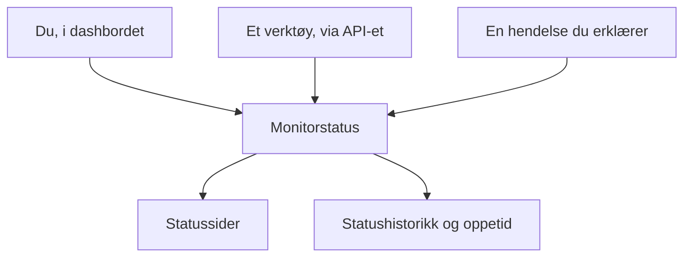

# Manuell overvåking

En manuell monitor har ingen automatiske sjekker: statusen er det du setter den til, i dashbordet eller via API-et. Bruk den til å representere noe OneUptime ikke kan sjekke selv — en avhengighet hos en tredjepart, et fysisk system, en forretningsprosess — på statussidene og i hendelsene dine.

:::cards
- [Opprett en](#opprett-en-manuell-monitor): Ett trinn i dashbordet.
- [Endre statusen](#oppdater-status): I dashbordet, eller fra dine egne verktøy via API-et.
- [Hendelser og varsler](#hendelser-og-varsler): Erklær en hendelse og sett statusen i samme trinn.
:::

## Når du bør bruke en manuell monitor

| Bruksområde | Beskrivelse |
| --- | --- |
| Tredjepartstjenester | Følg statusen til eksterne tjenester du er avhengig av, men ikke kan overvåke direkte. |
| Fysisk infrastruktur | Representer maskinvare eller fysiske systemer uten nettverksovervåking. |
| Forretningsprosesser | Følg ikke-tekniske prosesser som påvirker tjenestestatusen. |
| API-styrt status | La dine egne verktøy sette statusen via OneUptime-API-et. |
| Plassholdere på statussider | Vis komponenter på statussiden din som styres utenfor OneUptime. |

En leverandør som publiserer en statusside, trenger ikke en: en [monitor for ekstern statusside](/docs/monitor/external-status-page-monitor) følger den siden for deg.

## Slik fungerer det

En manuell monitor har ikke noe overvåkingsintervall, ingen sonder og ingen kriterier. Statusen blir stående slik du satte den, til du, et verktøy via API-et eller en hendelse du erklærer, endrer den — og den nye statusen vises overalt der monitoren vises.



Hver endring er en oppføring på monitorens **Statustidslinje**, så oppetiden og statushistorikken tas vare på som for enhver annen monitor. En manuell monitor er ikke en aktiv monitor, så på OneUptime Cloud legger den ingenting til regningen din.

## Opprett en manuell monitor

:::steps
### Start en ny monitor

Gå til **Monitorer**, og klikk på **Opprett monitor**.

### Velg Manual

Klikk på **Flere monitortyper** under **Monitortype**, og velg **Manual** under **Annet**.

### Gi den et navn og opprett den

Angi et **Navn** — og en **Beskrivelse** under **Flere felt**, om du vil — og klikk så på **Opprett monitor**. En manuell monitor trenger ikke noe mer, så den opprettes fra dette første trinnet.
:::

## Oppdater status

### I dashbordet

:::steps
1. Åpne monitoren, og klikk på **Statustidslinje** i sidemenyen.
2. Klikk på **Opprett Monitor Status Hendelse**.
3. Velg **Monitorstatus**. **Begynner den** er nå; angi et tidligere tidspunkt hvis endringen skjedde tidligere.
4. Klikk på **Opprett Monitor Status Hendelse**. Den nye statusen vises med en gang på monitoren og på hver statusside som viser den.
:::

### Via API-et

Send den nye statusen som en statushendelse for monitoren, med en [API-nøkkel](/docs/api-reference/api-reference) fra prosjektet ditt i hodet `ApiKey`:

```bash
curl -X POST https://oneuptime.com/api/monitor-status-timeline \
  -H "ApiKey: $ONEUPTIME_API_KEY" \
  -H "Content-Type: application/json" \
  -d '{"data": {"monitorId": "<monitor id>", "monitorStatusId": "<monitor status id>"}}'
```

- `monitorId` er monitorens ID: klikk på linjen **ID** på siden dens for å kopiere den.
- `monitorStatusId` er statusen som skal settes: velg **Vis ID** i raden for den statusen under **Monitorer → Innstillinger → Monitorstatus**.
- `startsAt` er valgfritt. Utelates det, starter endringen nå.
- På en selvdriftet installasjon sender du forespørselen til din egen vert i stedet for `oneuptime.com`.

Å sende statusen monitoren allerede har, avvises med `Monitor Status cannot be same as previous status.` og registrerer ingenting, så et verktøy som rapporterer ved hver kjøring, kan ignorere det svaret.

## Hendelser og varsler

En manuell monitor velges som enhver annen monitor overalt der monitorer velges:

- Erklær en hendelse, og velg monitoren under **Monitorer**. Med **Endre overvåkingsstatus til** setter erklæringen også monitorens status, og når hendelsen løses, settes monitoren tilbake til i drift, med mindre en annen hendelse på den fortsatt er åpen. Se [Opprette en hendelse](/docs/incidents/declaring-incidents#trinn-2-berørte-ressurser).
- Opprett et varsel om den, for et problem teamet ditt bør håndtere uten å si fra til kundene.
- Legg den til på en statusside, for å vise kundene en avhengighet du følger med på for hånd.

## Neste steg

:::cards
- [Opprett en monitor](/docs/monitor/create-monitor): Monitortypene som sjekker ting for deg.
- [Ekstern statusside-overvåking](/docs/monitor/external-status-page-monitor): Følg heller en leverandørs statusside automatisk.
- [Statussider – Oversikt](/docs/status-pages/index): Vis monitorens status til kundene dine.
:::
