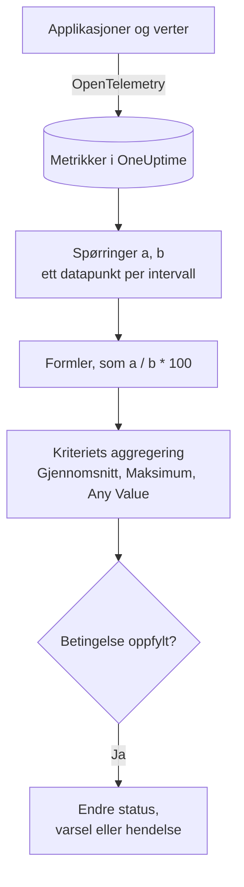

# Metrikk-overvåking

En metrikkmonitor spør etter metrikkene applikasjonene og infrastrukturen din sender til OneUptime, kombinerer dem med formler når du trenger et forhold eller en sum, og sammenligner resultatet med kriteriene dine over et glidende tidsintervall. Bruk den for forespørselsrater, feilforhold, kødybder, CPU, minne og disk (enhver numerisk serie), med ett varsel per vert eller per container når du grupperer den.

:::cards
- [Opprett monitoren](#opprett-en-metrikkmonitor): Spørringer, formler, et tidsintervall og kriterier.
- [Slik evalueres den](#slik-evalueres-den): Datapunkter, formler og kriterienes aggregering.
- [Gjennomgått eksempel](#gjennomgått-eksempel-en-kø-som-vokser): De samme dataene under hver aggregering.
- [Varsler per serie](#varsler-per-serie-group-by): Ett varsel per vert, container eller monteringspunkt.
:::

## Slik fungerer det

Hvert minutt kjører OneUptime hver av monitorens metrikkspørringer over tidsintervallet. En spørring returnerer ett datapunkt per tidsintervall, og formler kombinerer spørringene intervall for intervall. Hvert kriterium reduserer deretter datapunktene fra spørringen eller formelen det sjekker (til gjennomsnittet, maksimumet eller en test av hvert punkt), og sammenligner resultatet med terskelen sin.

## Før du starter

- Applikasjonene eller infrastrukturen din sender metrikker til OneUptime via OpenTelemetry. Se [OpenTelemetry](/docs/telemetry/open-telemetry).
- Kjenn navnet på metrikken og attributtene du vil filtrere eller gruppere på. Listene **Metrikk** og **Group by** tilbyr bare navn og attributter som OneUptime har mottatt.

## Opprett en metrikkmonitor

:::steps
### Start en ny monitor

Gå til **Monitorer**, og klikk på **Opprett monitor**.

### Velg Metrics

Under **Monitortype** klikker du på **Flere monitortyper** og velger **Målinger** under **Telemetri**, eller du skriver `metrics` i søkefeltet. Skriv inn et **Navn**, og klikk deretter på **Neste**.

### Velg tidsintervallet

I **Metrikkmonitorkonfigurasjon** velger du et **Tidsintervall**: hvor langt tilbake hver evaluering ser. Det starter på **Past 1 Minute**.

### Legg til metrikkspørringene

Under **Velg målinger** velger du en **Metrikk** og hvordan den aggregeres med **Aggregate by**. Åpne **Filters & grouping** for å filtrere etter attributter eller gruppere med **Group by**. Klikk på **Legg til metrikk** for en spørring til, eller på **Legg til formel** for å kombinere dem. Diagrammet under spørringene viser en forhåndsvisning av tidsintervallet, så du ser verdiene kriteriene kommer til å sjekke.

### Angi kriteriene

I **Monitorkriterier** velger hvert kriterium **Metrikk** som skal sjekkes (en spørring eller en formel), sin **Aggregering**, en **Betingelse** og en **Threshold**. Se [Kriterier](#kriterier) for kriteriene en ny monitor starter med.

### Opprett monitoren

Klikk på **Opprett monitor**. Monitoren åpnes på siden **Oversikt**, og den første evalueringen kjøres innen ett minutt.
:::

## Hva den spør etter

### Metrikkspørringer

| Felt | Hva det gjør | Standard |
| --- | --- | --- |
| **Metrikk** | Metrikken det spørres etter. | Påkrevd |
| **Aggregate by** | Hvordan verdiene i hvert tidsintervall kombineres til ett datapunkt: Gj.snitt, Sum, Min, Max, Antall eller en persentil (P50, P75, P90, P95 eller P99). | Gj.snitt |
| **Filter by attributes** (under **Filters & grouping**) | Bare serier der attributtene oppfyller disse vilkårene. | Ingen filter |
| **Group by** (under **Filters & grouping**) | Én serie per unike verdi av disse attributtene (se [Varsler per serie](#varsler-per-serie-group-by)). | Én serie |

Hver spørring og formel får en variabel (`a`, `b`, `c` og så videre) i den rekkefølgen du legger dem til.

### Formler

En formel kombinerer spørringsvariabler med `+`, `-`, `*`, `/`, `%`, `^` og parenteser, intervall for intervall. Du kan skrive variablene med eller uten `$` foran:

- `a / b * 100`: andelen av `b` som `a` utgjør, i prosent
- `a + b`: to metrikker lagt sammen
- `a - b`: forskjellen mellom dem

### Glidende tidsvindu

**Tidsintervall** bestemmer hvor langt tilbake hver evaluering ser: **Past 1 Minute**, **Past 5 Minutes**, **Past 10 Minutes**, **Past 15 Minutes**, **Past 30 Minutes**, **Past 1 Hour**, **Past 2 Hours**, **Past 3 Hours**, **Past 6 Hours**, **Past 12 Hours**, **Past 1 Day**, **Past 2 Days**, **Past 3 Days**, **Past 7 Days**, **Past 14 Days**, **Past 30 Days**, **Past 60 Days**, **Past 90 Days**, **Past 180 Days** eller **Past 365 Days**.

Jo lengre intervallet er, desto bredere er hvert tidsintervall, så ett datapunkt står for mer tid:

| Tidsintervall | Ett datapunkt per |
| --- | --- |
| Past 1 Minute til Past 3 Hours | minutt |
| Past 6 Hours, Past 12 Hours | 5 minutter |
| Past 1 Day | 15 minutter |
| Past 2 Days, Past 3 Days | 30 minutter |
| Past 7 Days | time |
| Past 14 Days, Past 30 Days | dag |
| Past 60 Days til Past 180 Days | uke |
| Past 365 Days | måned |

## Slik evalueres den

- **Hvert minutt.** En metrikkmonitor sjekkes ikke av sonder, så den har ikke noe intervall å angi og ingen side **Sonder og intervall**.
- **Først spørringer, så formler.** Hver spørring returnerer ett datapunkt per tidsintervall i tidsintervallet, med sin **Aggregate by**. Formler regnes ut for hvert intervall fra spørringenes datapunkter.
- **Deretter kriteriets aggregering.** Hvert kriterium reduserer datapunktene for sin **Metrikk** til det det sammenligner med terskelen:

| Aggregering | Betingelsen sjekkes mot… |
| --- | --- |
| Gjennomsnitt | gjennomsnittet av datapunktene |
| Sum | summen av datapunktene |
| Maximum Value | det høyeste datapunktet |
| Minimum Value | det laveste datapunktet |
| All Values | hvert datapunkt: alle må oppfylle betingelsen |
| Any Value | hvert datapunkt: det holder at ett av dem oppfyller betingelsen |

- **Kriterier fra topp til bunn.** På en monitor uten Group By avgjør det første kriteriet som samsvarer, så legg det mest alvorlige øverst. En gruppert monitor sjekker alle kriterier for hver serie (se [Evalueringen av kriterier er annerledes](#evalueringen-av-kriterier-er-annerledes)).
- **Ingen data er ikke null.** Når spørringen ikke returnerer noen datapunkter i tidsintervallet, gjør et kriterium det innstillingen **Hvis ingen data** sier, under **Flere felt**: **Ignore** (standard: kriteriet samsvarer ikke), **Treat As Zero** eller **Trigger**.
- **OneUptimes eget nedetid er ikke stillhet.** Så lenge tidsintervallet inneholder tid da OneUptime selv ikke mottok data (det startet på nytt, ble oppgradert eller tok igjen et etterslep), venter sjekken: statusen endres ikke, og ingen hendelse eller varsel åpnes eller løses, uansett hva **Hvis ingen data** sier. Se [Når OneUptime ikke mottar data](/docs/monitor/when-oneuptime-is-not-receiving).

## Kriterier

Disse monitorene evaluerer alltid **Metric Value**: den aggregerte verdien av den konfigurerte metrikkspørringen eller formelen. Kriterieskjemaet har ingen velger for filtertype; det viser **Metrikk**, **Aggregering**, **Betingelse** og **Threshold**. Når metrikken har en enhet, velger du terskelens enhet ved siden av den.

| Betingelse | Samsvarer når verdien er… |
| --- | --- |
| **Greater Than** | over terskelen |
| **Greater Than Or Equal To** | lik terskelen eller høyere |
| **Less Than** | under terskelen |
| **Less Than Or Equal To** | lik terskelen eller lavere |
| **Equal To** | nøyaktig terskelen |
| **Anomalously High** | over det forventede området for denne timen i uken |
| **Anomalously Low** | under det området |
| **Anomalous** | utenfor det området, i hvilken som helst retning |

Avviksvilkårene har ingen terskel. Skjemaet viser i stedet **Følsomhet** (Low, Medium, som er standard, eller High) og **Grunnlinjevindu** (14 dager, som er standard, 28, 60 eller 90), og sammenligner hvert datapunkt med grunnlinjen for samme time i uken, bygd fra det vinduet. Inntil den timen i uken har nok historikk, lærer kriteriet fortsatt og gir ingen varsler.

En ny metrikkmonitor starter med to kriterier på den første spørringen, begge med aggregeringen **Any Value**:

| Kriterium | Betingelse | Virkning |
| --- | --- | --- |
| Check if … is offline | **Equal To** `0` | Setter monitoren som frakoblet og erklærer en hendelse som løses automatisk |
| Check if … is online | **Greater Than** `0` | Setter monitoren som tilkoblet |

> [!NOTE]
> Frakoblet-kriteriet utløses av en rapportert verdi på 0, ikke av stillhet. For å bli varslet når en metrikk slutter å komme, setter du **Hvis ingen data** for den til **Trigger**.

## Gjennomgått eksempel: en kø som vokser

Du vil ha en hendelse når checkout-køen forblir dyp. Spørring `a` er måleren `checkout.queue.depth`, med **Aggregate by** Max, og **Tidsintervall** er **Past 5 Minutes**. Én evaluering ser disse fem datapunktene på ett minutt hver:

| Minutt | 10:01 | 10:02 | 10:03 | 10:04 | 10:05 |
| --- | --- | --- | --- | --- | --- |
| `a` | 640 | 980 | 1 500 | 1 620 | 1 100 |

Et kriterium med **Metrikk** `a`, **Betingelse** **Greater Than** og **Threshold** `1000` gir et ulikt svar for hver **Aggregering**:

| Aggregering | Sammenlignet med 1 000 | Samsvarer? |
| --- | --- | --- |
| Gjennomsnitt | 1 168 | Ja |
| Sum | 5 840 | Ja |
| Maximum Value | 1 620 | Ja |
| Minimum Value | 640 | Nei |
| All Values | 640, 980, 1 500, 1 620, 1 100 | Nei: to punkter er ikke over 1 000 |
| Any Value | 640, 980, 1 500, 1 620, 1 100 | Ja: 1 500 er det |

**Gjennomsnitt** varsler om et vedvarende etterslep og ignorerer ett enkelt dypt minutt; **All Values** venter til hvert minutt i intervallet er dypt; **Any Value** varsler ved det første dype minuttet.

## Varsler per serie (Group By)

**Group by** på en metrikkspørring deler spørringen opp i én serie per unike attributtverdi (én per vert, én per container, én per monteringspunkt), og en monitor med Group By evaluerer hver serie uavhengig. Den ene innstillingen er forskjellen mellom «flåten er usunn» og «`prod-db-01` er usunn».

### Ett varsel per gruppe

Med Group By satt til `host.name` gir en monitor for diskbruk som følger med på femti verter, **ett varsel (eller én hendelse) per vert over terskelen**. Når vert A fylles opp, åpner den sitt eget varsel; når vert B fylles opp ti minutter senere, åpner den et andre, separat varsel ved siden av.

Uten Group By er den samme monitoren én skalar: spørringen slår alle verter sammen til ett tall, og monitoren gir **ett varsel for hele monitoren**. Mens det varselet er åpent, gir en andre vert over terskelen ingenting (monitoren varsler allerede, så det er ikke noe nytt å gi), og vakthavende ingeniør hører aldri om vert B. **Group By er måten å få varsler per vert på.** Vil du bli tilkalt per vert, per container eller per monteringspunkt, angir du det.

### Uavhengig løsning

Hvert varsel per gruppe følger sin egen gruppe. Når vert A faller under terskelen igjen, løses varselet dens av seg selv, og varselet for vert B forblir åpent til vert B kommer seg. At én gruppe kommer seg, lukker aldri en annen gruppes varsel.

### Evalueringen av kriterier er annerledes

- **Grupperte monitorer evaluerer alle kriterier.** Alvorlighetsnivåer kan derfor utløses for ulike grupper samtidig: med «Critical: større enn 95» over «Warning: større enn 80» åpner en vert på 96 % et kritisk varsel, mens en vert på 85 % åpner et advarselsvarsel i samme sjekk. En vert som overskrider begge nivåene, får fortsatt nøyaktig ett varsel, fra det første kriteriet som samsvarer, så **sorter kriteriene med det mest alvorlige først**.
- **Ugrupperte monitorer stopper ved det første kriteriet som samsvarer.** Bare det ene kriteriet utløses, enda en grunn til å legge varslingskriteriet over det friske: et bredt friskt kriterium øverst samsvarer i nesten hver sjekk og hindrer at varslingskriteriet under det noen gang evalueres.

| Vert | Disk brukt | Critical (> 95) | Warning (> 80) | Varsel gitt |
| --- | --- | --- | --- | --- |
| `prod-db-01` | 96 % | Ja | Ja | Critical |
| `prod-db-02` | 85 % | Nei | Ja | Warning |
| `prod-db-03` | 40 % | Nei | Nei | Ingen |

### Velg et attributt å gruppere etter

Grupper etter et attributt som virkelig identifiserer en særskilt ting du ville tilkalt noen for: vertsattributtet for en vertsmetrikk på tvers av flåten, container- eller pod-attributtet for en containermetrikk, monteringspunkt- eller enhetsattributtet for en filsystem- eller disk-I/O-metrikk, grensesnittattributtet for en nettverksmetrikk. Nedtrekkslisten **Group by** fylles med attributtene collectoren din faktisk sender, så velg fra listen i stedet for å skrive en nøkkel for hånd.

Ikke grupper en metrikk som allerede er én skalar for hele systemet (et lederflagg for hele klyngen, et etterslep i planleggeren eller CPU-en på én vert i en monitor for én vert). Å gruppere slike metrikker gir nøyaktig én serie og endrer ingenting utenom varslenes titler.

Grupperingsattributtets verdier er også tilgjengelige som [malvariabler](/docs/monitor/incident-alert-templating) i tittelen, beskrivelsen og utbedringsnotatene for varselet eller hendelsen: gruppering etter `host.name` lar tittelen lyde `Disk almost full on {{host.name}}`.

## Feilsøking

:::details Diagrammet viser en overskridelse, men monitoren varslet ikke
Sjekk først kriteriets **Aggregering**: **All Values** samsvarer bare når hvert datapunkt i tidsintervallet overskrider terskelen, og **Gjennomsnitt** jevner ut en kort topp. Sjekk deretter at kriteriets **Metrikk** er spørringen eller formelen du mener (`a` er ikke formelen `c`), og at terskelen er i enheten du tror.
:::

:::details Metrikken sluttet å komme, og ingenting skjedde
Et tidsintervall uten datapunkter er ikke en verdi på 0. Med **Hvis ingen data** på standardverdien, **Ignore**, samsvarer ikke kriteriet. Sett det til **Trigger** under kriteriets **Flere felt** for å bli varslet om stillhet.
:::

:::details Jeg får ett varsel for hele flåten
Spørringen har ingen **Group by**, så alle verter slås sammen til ett tall. Grupper spørringen etter vert-, container- eller monteringspunktattributtet (se [Varsler per serie](#varsler-per-serie-group-by)).
:::

:::details Et avvikskriterium utløses aldri
Det lærer fortsatt: timen i uken det sammenligner med, har ikke nok historikk ennå innenfor **Grunnlinjevindu**.
:::

## Neste steg

:::cards
- [Hendelse- og varslingsmaler](/docs/monitor/incident-alert-templating): Sett verten og verdien inn i varslenes titler.
- [Logg-overvåking](/docs/monitor/logs-monitor): Bli varslet om loggmengde og -innhold, per gruppe.
- [Verts-overvåking](/docs/monitor/host-monitor): Ferdige sjekker av CPU, minne og disk for vertene dine.
- [OpenTelemetry](/docs/telemetry/open-telemetry): Send metrikker til OneUptime.
:::
