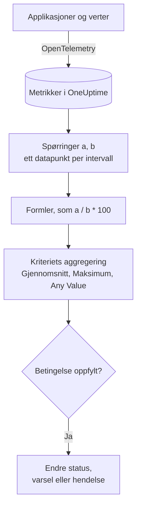

# Metrikk-overvåking

En metrikkmonitor spør etter metrikkene applikasjonene og infrastrukturen din sender til OneUptime, kombinerer dem med formler når du trenger et forhold eller en sum, og sammenligner resultatet med kriteriene dine over et glidende tidsintervall. Bruk den for forespørselsrater, feilforhold, kødybder, CPU, minne og disk (enhver numerisk serie), med ett varsel per vert eller per container når du grupperer den.

:::cards
- [Opprett monitoren](#opprett-en-metrikkmonitor): Spørringer, formler, et tidsintervall og kriterier.
- [Slik evalueres den](#slik-evalueres-den): Datapunkter, formler og kriterienes aggregering.
- [Gjennomgått eksempel](#gjennomgått-eksempel-en-kø-som-vokser): De samme dataene under hver aggregering.
- [Varsler per serie](#varsler-per-serie-group-by): Ett varsel per vert, container eller monteringspunkt.
:::

## Slik fungerer det

```mermaid title="Fra metrikkspørringer til en status, hvert minutt"
flowchart TB
    Src["Applikasjoner og verter"] -->|OpenTelemetry| Store[("Metrikker i OneUptime")]
    Store --> Query["Spørringer a, b<br/>ett datapunkt per intervall"]
    Query --> Formula["Formler, som a / b * 100"]
    Formula --> Reduce["Kriteriets aggregering<br/>Gjennomsnitt, Maksimum, Any Value"]
    Reduce --> Check{"Betingelse oppfylt?"}
    Check -->|Ja| Act["Endre status,<br/>varsel eller hendelse"]
```

Hvert minutt kjører OneUptime hver av monitorens metrikkspørringer over tidsintervallet. En spørring returnerer ett datapunkt per tidsintervall, og formler kombinerer spørringene intervall for intervall. Hvert kriterium reduserer deretter datapunktene fra spørringen eller formelen det sjekker (til gjennomsnittet, maksimumet eller en test av hvert punkt), og sammenligner resultatet med terskelen sin.

## Før du starter

- Applikasjonene eller infrastrukturen din sender metrikker til OneUptime via OpenTelemetry. Se [OpenTelemetry](/docs/telemetry/open-telemetry).
- Kjenn navnet på metrikken og attributtene du vil filtrere eller gruppere på. Listene **Metrikk** og **Grupper etter** tilbyr bare navn og attributter som OneUptime har mottatt.

## Opprett en metrikkmonitor

:::steps
### Start en ny monitor

Gå til **Monitorer**, og klikk på **Opprett monitor**. Eller bygg diagrammet du vil følge med på i metrikkutforskeren, og klikk på **Opprett monitor fra denne visningen**: den nye monitoren starter med spørringene derfra.

### Velg Metrics

Under **Monitortype** klikker du på **Flere monitortyper** og velger **Målinger** under **Telemetri**, eller du skriver `metrics` i søkefeltet. Skriv inn et **Navn**, og klikk deretter på **Neste**.

### Legg til metrikkspørringene

I **Metrikk å følge med på** velger du en **Metrikk** og hvordan den aggregeres med **Aggregate by**. Åpne **Filters & grouping** for å filtrere etter attributter eller gruppere med **Grupper etter**. Klikk på **Legg til metrikk** for en spørring til, eller på **Legg til formel** for å kombinere dem. Diagrammet under spørringene viser de siste timene, med regelens verdi som en rød linje, så du ser verdiene regelen kommer til å sjekke.

### Si når det skal varsles

I **Når det skal varsles** velger du under **Målt som** hvordan metrikken måles, og deretter et **Tidsvindu**, en **Betingelse** og en **Verdi**. Når trinnet har mer enn én spørring eller formel, velger du også **Metrikk** som regelen leser. Setningen under dem gjentar regelen med vanlige ord.

### Velg hva som skjer

I **Hva som skjer** velger du **Opprett et varsel**, **Erklær en hendelse** eller **Begge**, og gir det en tittel og en alvorlighetsgrad. Mens regelen samsvarer, viser monitoren statusen under **Flere felt**; når den slutter å samsvare, går monitoren tilbake til standardstatusen sin, og varselet eller hendelsen løser seg selv.

### Opprett monitoren

Klikk på **Opprett monitor**. Monitoren åpnes på siden **Oversikt**, og den første evalueringen kjøres innen ett minutt.
:::

## Hva den spør etter

### Metrikkspørringer

| Felt | Hva det gjør | Standard |
| --- | --- | --- |
| **Metrikk** | Metrikken det spørres etter. | Påkrevd |
| **Aggregate by** | Hvordan verdiene i hvert tidsintervall kombineres til ett datapunkt: Gj.snitt, Sum, Min, Max, Antall eller en persentil (P50, P75, P90, P95 eller P99). | Gj.snitt |
| **Filter by attributes** (under **Filters & grouping**) | Bare serier der attributtene oppfyller disse vilkårene. | Ingen filter |
| **Grupper etter** (under **Filters & grouping**) | Én serie per unike verdi av disse attributtene (se [Varsler per serie](#varsler-per-serie-group-by)). | Én serie |

Hver spørring og formel får en variabel (`a`, `b`, `c` og så videre) i den rekkefølgen du legger dem til.

### Formler

En formel kombinerer spørringsvariabler med `+`, `-`, `*`, `/`, `%`, `^` og parenteser, intervall for intervall. Du kan skrive variablene med eller uten `$` foran:

- `a / b * 100`: andelen av `b` som `a` utgjør, i prosent
- `a + b`: to metrikker lagt sammen
- `a - b`: forskjellen mellom dem

### Glidende tidsvindu

**Tidsvindu** i **Når det skal varsles** bestemmer hvor langt tilbake hver evaluering ser: **Siste 1 minutt**, **Siste 5 minutter**, **Siste 10 minutter**, **Siste 15 minutter**, **Siste 30 minutter**, **Siste 1 time**, **Siste 2 timer**, **Siste 3 timer**, **Siste 6 timer**, **Siste 12 timer**, **Siste 24 timer**, **Siste 2 dager**, **Siste 3 dager**, **Siste 7 dager**, **Siste 14 dager**, **Siste 30 dager**, **Siste 60 dager**, **Siste 90 dager**, **Siste 180 dager** eller **Siste 365 dager**.

Jo lengre vinduet er, desto bredere er hvert tidsintervall, så ett datapunkt står for mer tid:

| Tidsvindu | Ett datapunkt per |
| --- | --- |
| Siste 1 minutt til Siste 3 timer | minutt |
| Siste 6 timer, Siste 12 timer | 5 minutter |
| Siste 24 timer | 15 minutter |
| Siste 2 dager, Siste 3 dager | 30 minutter |
| Siste 7 dager | time |
| Siste 14 dager, Siste 30 dager | dag |
| Siste 60 dager til Siste 180 dager | uke |
| Siste 365 dager | måned |

## Slik evalueres den

- **Hvert minutt.** En metrikkmonitor sjekkes ikke av sonder, så den har ikke noe intervall å angi og ingen side **Sonder og intervall**.
- **Først spørringer, så formler.** Hver spørring returnerer ett datapunkt per tidsintervall i tidsintervallet, med sin **Aggregate by**. Formler regnes ut for hvert intervall fra spørringenes datapunkter.
- **Deretter regelens mål.** Regelen reduserer datapunktene for metrikken sin til det den sammenligner med verdien sin, slik **Målt som** sier:

| Målt som | I de egne kriteriene | Betingelsen sjekkes mot… |
| --- | --- | --- |
| Gjennomsnittet | Gjennomsnitt | gjennomsnittet av datapunktene |
| Summen | Sum | summen av datapunktene |
| Den høyeste verdien | Maximum Value | det høyeste datapunktet |
| Den laveste verdien | Minimum Value | det laveste datapunktet |
| Hver verdi (hele vinduet) | All Values | hvert datapunkt: alle må oppfylle betingelsen og dekke hele tidsintervallet |
| En hvilken som helst verdi (når som helst) | Any Value | hvert datapunkt: det holder at ett av dem oppfyller betingelsen |

- **Kriterier fra topp til bunn.** På en monitor uten Group By avgjør det første kriteriet som samsvarer, så legg det mest alvorlige øverst. En gruppert monitor sjekker alle kriterier for hver serie (se [Evalueringen av kriterier er annerledes](#evalueringen-av-kriterier-er-annerledes)).
- **Ingen data er ikke null.** Når spørringen ikke returnerer noen datapunkter i tidsintervallet, gjør regelen det **Hvis det ikke finnes data** sier, under **Flere felt** i **Når det skal varsles**: **Ingenting** (standard: regelen samsvarer ikke), **Tell det som null** eller **Varsle, som om den samsvarte**.
- **Hver verdi trenger hele tidsintervallet.** En serie oppfyller først en regel målt som **Hver verdi (hele vinduet)** når datapunktene dens dekker tidsintervallet, fra starten til nå, uten et hull på mer enn ett manglende datapunkt. Når alle monitorens data kommer forsinket, slik CloudWatchs gjør, trer det nyeste datapunktet i stedet for nå. En vert, container eller deployment som nettopp har begynt å sende data, eller som har vært stille en stund, venter til den har data for et helt tidsintervall, og evalueringsloggen viser hvor langt den har kommet: `Waiting for 15 minutes of data: 2 of 15 minutes so far`. En serie der varselet eller hendelsen allerede er åpen, bedømmes bare på datapunktene sine, så et kort hull i dataene løser det ikke. Når metrikken rapporterer sjeldnere enn tidsintervallet er langt, teller ett enkelt datapunkt for hele intervallet når det er noen minutter gammelt; for å bedømme hvor lenge en verdi varer, bør tidsintervallet være minst to rapporteringsintervaller langt.
- **OneUptimes eget nedetid er ikke stillhet.** Så lenge tidsintervallet inneholder tid da OneUptime selv ikke mottok data (det startet på nytt, ble oppgradert eller tok igjen et etterslep), venter sjekken: statusen endres ikke, og ingen hendelse eller varsel åpnes eller løses, uansett hva **Hvis det ikke finnes data** sier. Se [Når OneUptime ikke mottar data](/docs/monitor/when-oneuptime-is-not-receiving).

## Kriterier

Disse monitorene evaluerer alltid **Metric Value**: den aggregerte verdien av den konfigurerte metrikkspørringen eller formelen. **Når det skal varsles** setter opp ett kriterium ut fra **Målt som**, **Tidsvindu**, **Betingelse** og **Verdi**. Når metrikken har en enhet, velger du verdiens enhet ved siden av den. **Betingelse** er **Over**, **På eller over**, **Under**, **På eller under**, **Nøyaktig**, **Uvanlig høy**, **Uvanlig lav** eller **Uvanlig høy eller lav**. For flere kriterier, for eksempel alvorlighetsbånd, klikker du på **Rediger som egne kriterier** under **Flere felt** i **Hva som skjer**: hvert kriterium der har en **Metrikk**, en **Aggregering**, en **Betingelse** og en **Terskel**.

| Betingelse | Samsvarer når verdien er… |
| --- | --- |
| **Større enn** | over terskelen |
| **Større enn eller lik** | lik terskelen eller høyere |
| **Mindre enn** | under terskelen |
| **Mindre enn eller lik** | lik terskelen eller lavere |
| **Lik** | nøyaktig terskelen |
| **Anomalously High** | over det forventede området for denne timen i uken |
| **Anomalously Low** | under det området |
| **Anomalous** | utenfor det området, i hvilken som helst retning |
| **Ingen data** | fraværende: spørringen sendte ingenting i vinduet |
| **Har data** | til stede: spørringen sendte noe i vinduet |

Avviksvilkårene har ingen terskel. **Når det skal varsles** viser i stedet **Følsomhet** (Lav, Middels, som er standard, eller Høy), og de egne kriteriene også et **Grunnlinjevindu** (14 dager, som er standard, 28, 60 eller 90), og hvert datapunkt sammenlignes med grunnlinjen for samme time i uken, bygd fra det vinduet. Inntil den timen i uken har nok historikk, lærer kriteriet fortsatt og gir ingen varsler.

En metrikkmonitor som er opprettet i Opprett monitor, starter med én regel på den første spørringen: **Gjennomsnittet** over **Siste 5 minutter**, **Over** **Verdi** du angir, og **Opprett et varsel**.

En ny metrikkmonitor som er opprettet via API-et eller Terraform uten kriterier, starter med to kriterier på den første spørringen, begge med aggregeringen **Any Value**:

| Kriterium | Betingelse | Virkning |
| --- | --- | --- |
| Check if … is offline | **Lik** `0` | Setter monitoren som frakoblet og erklærer en hendelse som løses automatisk |
| Check if … is online | **Større enn** `0` | Setter monitoren som tilkoblet |

> [!NOTE]
> Frakoblet-kriteriet utløses av en rapportert verdi på 0, ikke av stillhet. For å bli varslet når en metrikk slutter å komme, setter du **Hvis ingen data** for den til **Utløser**.

## Gjennomgått eksempel: en kø som vokser

Du vil ha en hendelse når checkout-køen forblir dyp. Spørring `a` er måleren `checkout.queue.depth`, med **Aggregate by** Max, og **Tidsvindu** er **Siste 5 minutter**. Én evaluering ser disse fem datapunktene på ett minutt hver:

| Minutt | 10:01 | 10:02 | 10:03 | 10:04 | 10:05 |
| --- | --- | --- | --- | --- | --- |
| `a` | 640 | 980 | 1 500 | 1 620 | 1 100 |

En regel **Over** `1000` gir et ulikt svar for hvert valg under **Målt som**:

| Målt som | Sammenlignet med 1 000 | Samsvarer? |
| --- | --- | --- |
| Gjennomsnittet | 1 168 | Ja |
| Summen | 5 840 | Ja |
| Den høyeste verdien | 1 620 | Ja |
| Den laveste verdien | 640 | Nei |
| Hver verdi (hele vinduet) | 640, 980, 1 500, 1 620, 1 100 | Nei: to punkter er ikke over 1 000 |
| En hvilken som helst verdi (når som helst) | 640, 980, 1 500, 1 620, 1 100 | Ja: 1 500 er det |

**Gjennomsnittet** varsler om et vedvarende etterslep og ignorerer ett enkelt dypt minutt; **Hver verdi (hele vinduet)** venter til hvert minutt i intervallet er dypt; **En hvilken som helst verdi (når som helst)** varsler ved det første dype minuttet.

## Varsler per serie (Group By)

**Grupper etter** på en metrikkspørring deler spørringen opp i én serie per unike attributtverdi (én per vert, én per container, én per monteringspunkt), og en monitor med Group By evaluerer hver serie uavhengig. Den ene innstillingen er forskjellen mellom «flåten er usunn» og «`prod-db-01` er usunn».

### Ett varsel per gruppe

Med Group By satt til `host.name` gir en monitor for diskbruk som følger med på femti verter, **ett varsel (eller én hendelse) per vert over terskelen**. Når vert A fylles opp, åpner den sitt eget varsel; når vert B fylles opp ti minutter senere, åpner den et andre, separat varsel ved siden av.

Uten Group By er den samme monitoren én skalar: spørringen slår alle verter sammen til ett tall, og monitoren gir **ett varsel for hele monitoren**. Mens det varselet er åpent, gir en andre vert over terskelen ingenting (monitoren varsler allerede, så det er ikke noe nytt å gi), og vakthavende ingeniør hører aldri om vert B. **Group By er måten å få varsler per vert på.** Vil du bli tilkalt per vert, per container eller per monteringspunkt, angir du det.

### Uavhengig løsning

Hvert varsel per gruppe følger sin egen gruppe. Når vert A faller under terskelen igjen, løses varselet dens av seg selv, og varselet for vert B forblir åpent til vert B kommer seg. At én gruppe kommer seg, lukker aldri en annen gruppes varsel.

### Evalueringen av kriterier er annerledes

- **Grupperte monitorer evaluerer alle kriterier.** Alvorlighetsnivåer kan derfor utløses for ulike grupper samtidig: med «Critical: større enn 95» over «Warning: større enn 80» åpner en vert på 96 % et kritisk varsel, mens en vert på 85 % åpner et advarselsvarsel i samme sjekk. En vert som overskrider begge nivåene, får fortsatt nøyaktig ett varsel, fra det første kriteriet som samsvarer, så **sorter kriteriene med det mest alvorlige først**.
- **Ugrupperte monitorer stopper ved det første kriteriet som samsvarer.** Bare det ene kriteriet utløses, enda en grunn til å legge varslingskriteriet over det friske: et bredt friskt kriterium øverst samsvarer i nesten hver sjekk og hindrer at varslingskriteriet under det noen gang evalueres.

| Vert | Disk brukt | Critical (> 95) | Warning (> 80) | Varsel gitt |
| --- | --- | --- | --- | --- |
| `prod-db-01` | 96 % | Ja | Ja | Critical |
| `prod-db-02` | 85 % | Nei | Ja | Warning |
| `prod-db-03` | 40 % | Nei | Nei | Ingen |

### Velg et attributt å gruppere etter

Grupper etter et attributt som virkelig identifiserer en særskilt ting du ville tilkalt noen for: vertsattributtet for en vertsmetrikk på tvers av flåten, container- eller pod-attributtet for en containermetrikk, monteringspunkt- eller enhetsattributtet for en filsystem- eller disk-I/O-metrikk, grensesnittattributtet for en nettverksmetrikk. Nedtrekkslisten **Grupper etter** fylles med attributtene collectoren din faktisk sender, så velg fra listen i stedet for å skrive en nøkkel for hånd.

Ikke grupper en metrikk som allerede er én skalar for hele systemet (et lederflagg for hele klyngen, et etterslep i planleggeren eller CPU-en på én vert i en monitor for én vert). Å gruppere slike metrikker gir nøyaktig én serie og endrer ingenting utenom varslenes titler.

Grupperingsattributtets verdier er også tilgjengelige som [malvariabler](/docs/monitor/incident-alert-templating) i tittelen, beskrivelsen og utbedringsnotatene for varselet eller hendelsen: gruppering etter `host.name` lar tittelen lyde `Disk almost full on {{host.name}}`.

## Feilsøking

:::details Diagrammet viser en overskridelse, men monitoren varslet ikke
Sjekk først **Målt som**: **Hver verdi (hele vinduet)** samsvarer bare når hvert datapunkt i tidsintervallet overskrider verdien, og **Gjennomsnittet** jevner ut en kort topp. **Hver verdi (hele vinduet)** venter også til en serie har data for hele tidsintervallet, så en vert eller deployment som nettopp har begynt å sende data, blir ikke bedømt ennå. Sjekk deretter at regelen leser spørringen eller formelen du mener (`a` er ikke formelen `c`), og at **Verdi** er i enheten du tror.
:::

:::details Metrikken sluttet å komme, og ingenting skjedde
Et tidsintervall uten datapunkter er ikke en verdi på 0. Med **Hvis det ikke finnes data** på standardverdien, **Ingenting**, samsvarer ikke regelen. Sett det til **Varsle, som om den samsvarte** under **Flere felt** i **Når det skal varsles** for å bli varslet om stillhet.
:::

:::details Jeg får ett varsel for hele flåten
Spørringen har ingen **Grupper etter**, så alle verter slås sammen til ett tall. Grupper spørringen etter vert-, container- eller monteringspunktattributtet (se [Varsler per serie](#varsler-per-serie-group-by)).
:::

:::details Et avvikskriterium utløses aldri
Det lærer fortsatt: timen i uken det sammenligner med, har ikke nok historikk ennå innenfor **Grunnlinjevindu**.
:::

## Neste steg

:::cards
- [Hendelse- og varslingsmaler](/docs/monitor/incident-alert-templating): Sett verten og verdien inn i varslenes titler.
- [Logg-overvåking](/docs/monitor/logs-monitor): Bli varslet om loggmengde og -innhold, per gruppe.
- [Verts-overvåking](/docs/monitor/host-monitor): Ferdige sjekker av CPU, minne og disk for vertene dine.
- [OpenTelemetry](/docs/telemetry/open-telemetry): Send metrikker til OneUptime.
:::
