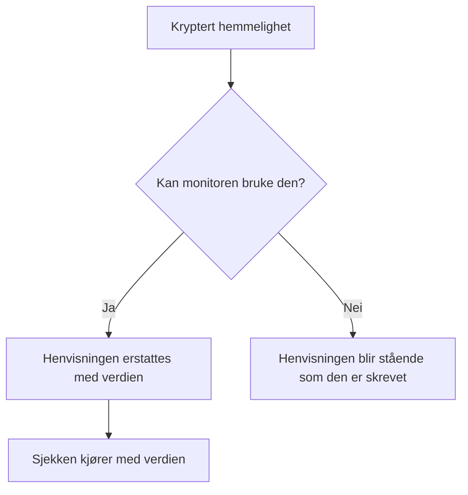

# Overvåkingshemmeligheter

Overvåkingshemmeligheter holder passordene, API-nøklene og tokenene som monitorene dine trenger, utenfor selve monitoren. Du lagrer en verdi én gang, kryptert, velger hvilke monitorer som kan bruke den, og viser til den som `{{monitorSecrets.NAME}}` der monitoren trenger den.

:::cards
- [Legg til en hemmelighet](#legg-til-en-hemmelighet): Lagre en verdi og velg hvem som kan bruke den.
- [Velg tilgang](#velg-hvilke-monitorer-som-kan-bruke-en-hemmelighet): Alle monitorer, bestemte monitorer eller monitorer med etiketter.
- [Bruk en hemmelighet](#bruk-en-hemmelighet): Hvor `{{monitorSecrets.NAME}}` fungerer.
:::

## Slik når hemmeligheter frem til en monitor

En hemmelighet lagres kryptert og vises aldri igjen etter at du har lagret den. Før OneUptime gir en monitor videre til en sonde, erstatter den hver henvisning som monitoren kan bruke, med den dekrypterte verdien; en henvisning som monitoren ikke kan bruke, blir stående som den er skrevet.

Sonden som kjører sjekken, mottar verdien, så en monitor som bruker en hemmelighet, bør kjøre på sonder du stoler på: OneUptimes egne, eller en [egendefinert sonde](/docs/probe/custom-probe) som du kjører selv.

## Før du starter

- **Growth-abonnementet eller høyere**, på OneUptime Cloud. Selvdriftede installasjoner har ingen abonnementer.
- **En rolle som kan administrere hemmeligheter**: Project Owner, Project Admin, eller en egendefinert rolle med tillatelsen Create Monitor Secret.

## Arbeid med hemmeligheter

### Legg til en hemmelighet

:::steps
1. Gå til **Monitorer → Innstillinger → Hemmeligheter**, og klikk på **Opprett Monitor Hemmelighet**.
2. Angi et **Navn** og **Verdi for hemmelighet**. Navnet er det du viser til, for eksempel `ApiKey`. Det kan bare inneholde bokstaver, tall, bindestreker (`-`) og understreker (`_`), og to hemmeligheter i et prosjekt kan ikke ha det samme.
3. Velg i trinnet **Tilgang** hvilke monitorer som kan bruke den (se neste avsnitt), og klikk så på **Opprett Monitor Hemmelighet**.
:::

> [!IMPORTANT]
> Hemmeligheter krypteres og lagres sikkert. Verdien til hemmeligheten vises aldri igjen etter at den er lagret — verken i tabellen, i redigeringsskjemaet eller via API-et. Hvis du mister verdien, må du hente den fra der den kom fra, og sette den på nytt. For å rotere en hemmelighet bruker du knappen **Oppdater hemmelig verdi** på raden dens; du trenger ikke å slette og opprette den på nytt.

### Velg hvilke monitorer som kan bruke en hemmelighet

Hver hemmelighet har ett av tre tilgangsalternativer:

| Alternativ | Hvilke monitorer som kan bruke hemmeligheten | Bruk det til |
| --- | --- | --- |
| **Alle overvåkere** | Hver monitor i prosjektet, også monitorer du oppretter senere. | En påloggingsinformasjon som mange monitorer deler. |
| **Bestemte overvåkere** | Bare monitorene du velger. Dette er standard, og hemmeligheter som ble opprettet før disse alternativene fantes, fungerer slik. | En påloggingsinformasjon for én eller noen få monitorer. |
| **Overvåkere med etiketter** | Monitorer som har minst én av etikettene du velger. Når en av de etikettene legges til på en monitor, får den tilgang, og når etiketten fjernes, mister den tilgangen neste gang monitoren kjører. | En påloggingsinformasjon for en gruppe monitorer som endrer seg over tid. |

Du kan når som helst endre alternativet med **Rediger** på raden til hemmeligheten. Bare listen for det valgte alternativet beholdes: å bytte til **Alle overvåkere** tømmer hemmelighetens lister over monitorer og etiketter, og å bytte mellom **Bestemte overvåkere** og **Overvåkere med etiketter** tømmer listen du bytter bort fra.

En hemmelighet er aldri tilgjengelig for monitorer i et annet prosjekt.

> [!WARNING]
> Alle som kan redigere en monitor som kan bruke en hemmelighet, kan sende den hemmeligheten dit monitoren kobler seg til. Med **Alle overvåkere** er det alle som kan opprette eller redigere monitorer i prosjektet. Med **Overvåkere med etiketter** omfatter det også alle som kan legge en av de etikettene til på en monitor.

Via API-et er tilgangsalternativet feltet `monitorAccess`: `All Monitors`, `Specific Monitors` eller `Monitors With Labels`. Feltene `monitors` og `labels` inneholder listene. En hemmelighet som opprettes uten `monitorAccess`, får `Specific Monitors`.

### Bruk en hemmelighet

For å bruke en hemmelighet skriver du `{{monitorSecrets.SECRET_NAME}}` i et felt som tar imot hemmeligheter. For eksempel sender forespørselshodet `Authorization: Bearer {{monitorSecrets.ApiKey}}` verdien til hemmeligheten `ApiKey`.

Disse monitortypene og feltene tar imot hemmeligheter:

| Monitortype | Felt |
| --- | --- |
| API | URL-en, forespørselens hoder og brødtekst, og klientsertifikatet, den private nøkkelen og passordfrasen (mTLS) |
| Nettsted | URL-en, og klientsertifikatet, den private nøkkelen og passordfrasen (mTLS) |
| Ping, IP, Port, NTP, SSL Certificate | Verten eller URL-en som sjekkes |
| DNS | Domenenavnet og DNS-serveren |
| DNSSEC, Domene | Domenenavnet |
| SQL Query | Verten, databasenavnet, brukernavnet, passordet og spørringen |
| Database Health | Verten, databasenavnet, brukernavnet og passordet |
| External Status Page | URL-en til statussiden |
| Synthetic Monitor, Custom JavaScript Code | Skriptet |
| Network Device | SNMP-fellesskapsstrengen, og autentiserings- og personvernnøklene for SNMPv3 |

Hemmeligheter fylles inn før skriptet til en monitor av typen Synthetic Monitor eller Custom JavaScript Code kjører, så en henvisning som `{{monitorSecrets.ApiKey}}` i skriptet er den dekrypterte verdien når det kjøres.

Hvis en monitor viser til en hemmelighet den ikke kan bruke, blir henvisningen stående som den er og erstattes ikke med verdien.

Når du tester en monitor før du lagrer den, fylles bare hemmeligheter som er tilgjengelige for **Alle overvåkere**, inn, fordi en ny monitor ikke står på noen liste og ikke har noen etiketter ennå. Etter at du har lagret monitoren, bruker testene hver hemmelighet som monitoren kan bruke.

## Feilsøking

:::details `{{monitorSecrets.NAME}}` sendes bokstavelig
Monitoren kan ikke bruke hemmeligheten, eller navnet stemmer ikke. Sjekk hemmelighetens tilgangsalternativ med **Rediger** på raden dens, og at navnet i henvisningen er nøyaktig navnet på hemmeligheten.
:::

:::details Når en ny monitor testes, fylles ikke hemmeligheten inn
Før en monitor er lagret, fylles bare hemmeligheter som er tilgjengelige for **Alle overvåkere**, inn. Lagre monitoren, og test den igjen.
:::

:::details Et felt ignorerer hemmeligheten
Bare feltene i tabellen ovenfor tar imot hemmeligheter. I ethvert annet felt sendes `{{monitorSecrets.NAME}}` som det er skrevet.
:::

## Neste steg

:::cards
- [API-overvåking](/docs/monitor/api-monitor): Send en hemmelighet i et forespørselshode.
- [Syntetisk overvåking](/docs/monitor/synthetic-monitor): Bruk en hemmelighet i et nettleserskript.
- [SQL-spørring-overvåking](/docs/monitor/sql-monitor): Hold et databasepassord kryptert.
:::
