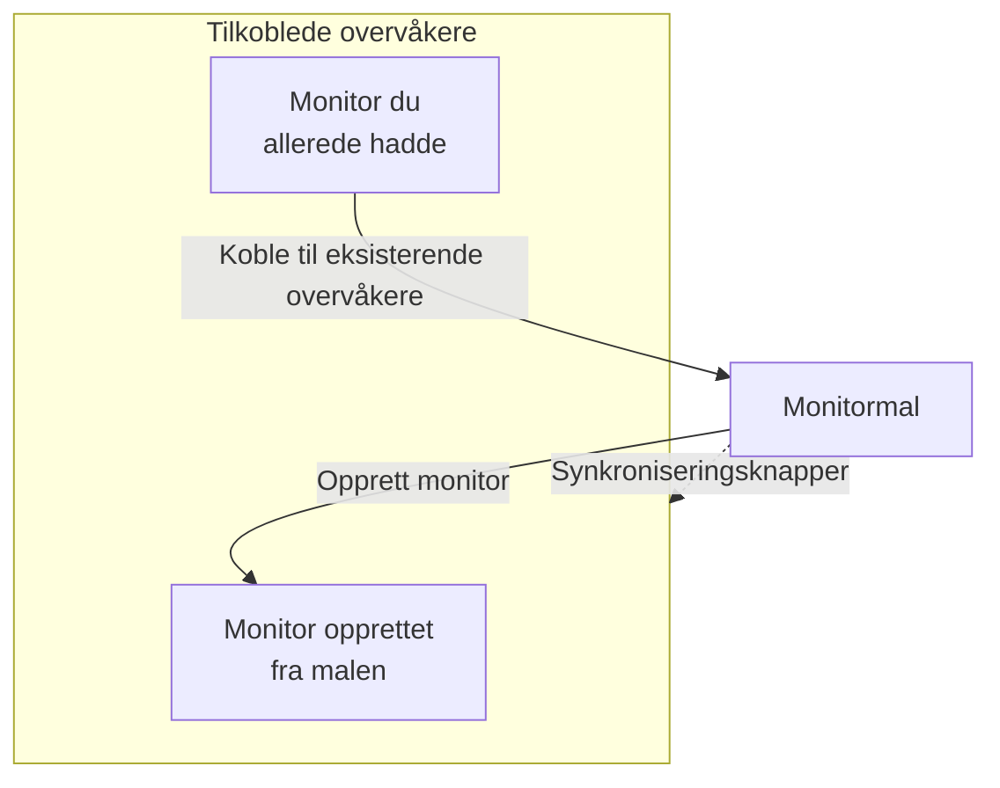

# Monitormaler

En monitormal er en lagret monitorkonfigurasjon (en type, kriterier, et intervall, etiketter og standardverdier for egendefinerte felt) som du oppretter monitorer fra med ett klikk. Monitorer som er opprettet fra den eller koblet til den, forblir koblet: endre malen, og synkroniser så endringen til alle sammen. Bruk maler når mange monitorer skal oppføre seg likt, som den samme helsesjekken på hver tjeneste, eller de samme API-sjekkene i produksjon og staging.

:::cards
- [Opprett en mal](#opprett-en-mal): Fire trinn, som Opprett monitor.
- [Opprett monitorer fra den](#opprett-monitorer-fra-en-mal): Ett klikk, eller koble til monitorer du allerede har.
- [Synkroniser endringer](#synkroniser-endringer-til-tilkoblede-monitorer): Hva hver synkroniseringsknapp kopierer.
- [Behold verdier for hver monitor](#behold-verdier-for-hver-monitor): Beskytt et mål eller hoder mot en synkronisering.
:::

## Slik fungerer maler

En mal overvåker ingenting selv. Monitorer opprettes fra den eller kobles til den, og malens side viser dem som **Tilkoblede overvåkere**. Når du endrer malen, endres ingenting på de monitorene før du synkroniserer: hver synkroniseringsknapp kopierer én del av malen til hver tilkoblede monitor, og felt du beskytter, beholder hver monitors egen verdi.



## Før du starter

- **En rolle som kan opprette maler**: Project Owner, Project Admin, Project Member, Monitor Admin eller Monitor Member, eller en egendefinert rolle med tillatelsen Create Monitor Template. Å endre en mal krever de samme rollene, eller tillatelsen Edit Monitor Template.
- **Tillatelse til å oppdatere de tilkoblede monitorene.** En synkronisering skriver til hver tilkoblede monitor som deg, og hopper over monitorene som tillatelsene dine ikke dekker.

## Opprett en mal

:::steps
### Åpne Maler

Gå til **Monitorer → Innstillinger → Maler**, og klikk på **Opprett Monitor Mal**.

### Gi malen et navn

Under **Malinformasjon** angir du et **Malnavn**, som `Production API Health`, og en **Malbeskrivelse**, og klikker så på **Neste**.

### Angi monitorens standardverdier

Under **Standardverdier for overvåking** velger du **Monitortype** med den samme velgeren som i Opprett monitor. Angi eventuelt et **Standard overvåkingsnavn**; står det tomt, får hver monitor navn etter ressursen den overvåker. **Standard overvåkingsbeskrivelse** og **Etiketter** venter under **Flere felt**. Klikk på **Neste**.

### Angi kriteriene og intervallet

Under **Kriterier** fyller du ut hva som skal sjekkes, og kriteriene, som i [Opprett monitor](/docs/monitor/create-monitor#kriterier). Med kortet **Template sync settings** øverst kan du beskytte felt mot synkroniseringer (se [Behold verdier for hver monitor](#behold-verdier-for-hver-monitor)). For en monitortype som sonder sjekker, ber det siste trinnet, **Intervall**, om **Overvåkingsintervall**. Klikk på **Opprett Monitor Mal** på det siste trinnet.
:::

Malen legges til i listen. Åpne den for å se siden, med et kort for hver del: **Malinformasjon**, **Standardverdier for overvåking**, **Overvåkingskriterier**, **Overvåkingsintervall** (med **Minimum sondeenighet**), **Etiketter**, **Custom Field Defaults** (når prosjektet har egendefinerte monitorfelt) og **Tilkoblede overvåkere**. Du endrer hver del på sitt eget kort, for eksempel med **Rediger Kriterier** eller **Rediger Intervall**.

## Opprett monitorer fra en mal

- **Ny monitor.** Klikk på **Opprett monitor** i malens rad i listen, eller på **Opprett overvåking fra mal** på siden dens. **Opprett monitor** åpner med malens type og innstillinger fylt ut; endre det du trenger, og opprett den. Den nye monitoren er koblet til malen.
- **Monitorer du allerede har.** Under **Tilkoblede overvåkere** klikker du på **Koble til eksisterende overvåkere** og velger dem. De beholder innstillingene sine til du synkroniserer.

Verdier som er satt under **Custom Field Defaults**, skrives til hver monitor som opprettes fra malen, også monitorer som regler for automatisk import og varslingspolicyer oppretter fra den.

## Synkroniser endringer til tilkoblede monitorer

Å redigere en mal endrer bare malen. For å kopiere en endring til de tilkoblede monitorene bruker du synkroniseringsknappen på kortet du endret. Hver knapp sier hvor mange monitorer den når, som **Sync Criteria to 3 Linked Monitors**, og er nedtonet så lenge ingenting er koblet til. En synkronisering kan ikke angres.

| Knapp | Kopierer til hver tilkoblede monitor | Lar være |
| --- | --- | --- |
| **Synkroniser kriterier til koblede overvåkere** | Kriteriene og trinninnstillingene, som mål og forespørselsalternativer, unntatt beskyttede felt | Overvåkingsintervallet, minimum sondeenighet, navnet, beskrivelsen, etikettene og verdiene i egendefinerte felt |
| **Synkroniseringsintervall til koblede overvåkere** | Overvåkingsintervallet og minimum sondeenighet | Kriteriene, navnet, beskrivelsen, etikettene og verdiene i egendefinerte felt |
| **Synkroniser etiketter til koblede overvåkere** | Etikettene, og ingenting annet | Alt annet |
| **Sync Custom Fields to Linked Monitors** | De egendefinerte feltene malen har en standardverdi for, i stedet for det hver monitor hadde | Egendefinerte felt som malen lar stå tomme, og alt annet |

For å synkronisere én monitor klikker du på **Synkroniser fra mal** i raden dens under **Tilkoblede overvåkere**. Det kopierer kriteriene og trinninnstillingene (unntatt beskyttede felt), overvåkingsintervallet, minimum sondeenighet og etikettene, og lar monitorens navn, beskrivelse og verdier i egendefinerte felt være. **Koble fra mal** kobler fra en monitor; den beholder innstillingene sine.

Etter en synkronisering sier et sammendrag hvor mange monitorer som ble oppdatert. **Delvis synkronisert** betyr at noen tilkoblede monitorer fortsatt har den forrige konfigurasjonen, som regel fordi tillatelsene dine ikke dekker dem.

## Behold verdier for hver monitor

En kriteriesynkronisering kopierer også trinninnstillinger som mål, forespørselshoder og tidsavbrudd, med mindre du beskytter disse feltene. Beskytt et felt for at hver tilkoblede monitor skal beholde sin egen verdi for det.

:::steps
### Åpne malen

Gå til **Monitorer → Innstillinger → Maler**, og åpne malen.

### Rediger kriteriene

Klikk på **Rediger Kriterier** på kortet **Overvåkingskriterier**.

### Beskytt feltene

Under **Template sync settings** krysser du av for **Do not sync this field** ved hvert felt du vil beholde på de tilkoblede monitorene.

### Lagre

Lagre endringene. Kortet **Overvåkingskriterier**, og bekreftelsen av begge synkroniseringene nedenfor, viser de beskyttede feltene.

### Synkroniser

Bruk **Synkroniser kriterier til koblede overvåkere**, eller **Synkroniser fra mal** på én tilkoblet monitor.
:::

Beskytt for eksempel **Monitor destination** og **Request headers** på en API-mal. Produksjons- og staging-monitorer beholder sine egne URL-er og hoder, mens begge får malens oppdaterte kriterier og de andre ubeskyttede innstillingene.

Hvilke alternativer som finnes, avhenger av monitortypen. De omfatter mål og porter, alternativer for HTTP-forespørsler, databasetilkoblinger, DNS-innstillinger, infrastrukturvelgere og telemetrispørringer. Relaterte påloggingsdata, som et klientsertifikat og den private nøkkelen, holdes sammen.

### Slik oppfører unntak seg

- Avkryssede felt beholder hver eksisterende monitors nåværende verdi, også en tom eller ikke-satt verdi. Forespørselshoder og andre samlinger bevares i sin helhet.
- Felt uten avkrysning synkroniseres fortsatt fra malen. Fjern avkrysningen for et beskyttet felt, og lagre for å kopiere malverdien ved neste synkronisering.
- Unntak gjelder for samlede og enkeltvise synkroniseringer. De lagres på malen og velges ikke separat for hver synkronisering.
- Nye monitorer starter fortsatt med malens feltverdier. Unntak påvirker bare synkronisering av eksisterende monitorer.
- Kriterier synkroniseres alltid. En synkronisering av bare kriterier lar overvåkingsintervallet, etikettene og andre innstillinger på monitornivå være.
- Eksisterende maler har ingen feltunntak før du setter dem opp. Monitorer for nettverksenheter beholder fortsatt automatisk sin egen enhetskobling.

For maler med flere trinn matches beskyttede verdier via trinn-ID-ene. Selvstendig opprettede monitorer med ett trinn kan også motta en mal med ett trinn. Kan et beskyttet trinn ikke matches, avvises synkroniseringen før noen monitor oppdateres, slik at et nytt eller omordnet trinn ikke ved et uhell kan kopiere et annet trinns mål eller påloggingsdata.

> [!IMPORTANT]
> Før du endrer monitortypen for en lagret mal (med **Rediger Standardverdier for overvåking**), fjerner du under **Rediger Kriterier** unntakene som ikke gjelder for den nye typen. Alle unntakene i en mal må finnes for monitortypen dens.

## Konfigurasjon via API

Hvert maltrinn godtar en matrise `doNotSyncFields` i objektet `MonitorStep.value`. For en API-monitor beskytter du målet og hele samlingen av hoder med:

```json title="monitorSteps (excerpt)"
{
  "_type": "MonitorSteps",
  "value": {
    "monitorStepsInstanceArray": [
      {
        "_type": "MonitorStep",
        "value": {
          "id": "<step id>",
          "doNotSyncFields": ["monitorDestination", "requestHeaders"]
        }
      }
    ]
  }
}
```

Utelat matrisen, eller sett den til `[]`, for å synkronisere alle støttede trinninnstillinger. Feltnavn som ikke støttes, og felt som ikke gjelder for malens monitortype, avvises. Malens matrise styrer synkroniseringen; slike metadata på en tilkoblet monitor overstyrer den ikke.

:::details Feltnavn for doNotSyncFields etter monitortype
| Monitortype | Feltnavn |
| --- | --- |
| Nettsted, API, Ping, IP, Port, SSL Certificate, NTP | `monitorDestination`, `requestTimeoutInMs`, `retryCount` |
| Bare API | `requestHeaders`, `requestType`, `requestBody` |
| Nettsted og API | `doNotFollowRedirects`, `allowSelfSignedCertificates`, `tlsClientAuthentication` (klientsertifikatet, nøkkelen og passordfrasen sammen) |
| Port, NTP | `monitorDestinationPort` |
| Synthetic Monitor, Custom JavaScript Code | `customCode` |
| Synthetic Monitor | `browserTypes`, `screenSizeTypes`, `retryCountOnError` |
| DNS | `dnsMonitor.queryName`, `dnsMonitor.recordType`, `dnsMonitor.resolver` (DNS-serveren og porten sammen), `dnsMonitor.timeout`, `dnsMonitor.retries` |
| Domene | `domainMonitor.domainName`, `domainMonitor.lookupMethod`, `domainMonitor.timeout`, `domainMonitor.retries` |
| DNSSEC | `dnssecMonitor.domainName`, `dnssecMonitor.resolvers`, `dnssecMonitor.checkNameserverConsistency`, `dnssecMonitor.signatureExpiryWarningDays`, `dnssecMonitor.timeout`, `dnssecMonitor.retries` |
| SQL Query | `sqlMonitor.connection`, `sqlMonitor.connectionTimeoutInMs`, `sqlMonitor.statementTimeoutInMs`, `sqlMonitor.query`, `sqlMonitor.maxRows` |
| Database Health | `databaseMonitor.connection`, `databaseMonitor.connectionTimeoutInMs`, `databaseMonitor.statementTimeoutInMs`, `databaseMonitor.enabledMetricGroups` |
| External Status Page | `externalStatusPageMonitor.statusPageUrl`, `externalStatusPageMonitor.provider`, `externalStatusPageMonitor.components`, `externalStatusPageMonitor.timeout`, `externalStatusPageMonitor.retries` |
| Logger, Security Events, Spor, AI / LLM, Målinger, Unntak | `logMonitor`, `securityEventsMonitor`, `traceMonitor`, `llmMonitor`, `metricMonitor`, `exceptionMonitor` (hele monitorens konfigurasjon) |

Infrastrukturmonitorer (Kubernetes, Docker Container, Vert, Podman Container, Proxmox, Docker Swarm, Ceph, Lagringsarray, IoT Device) tilbyr ressursvelgeren, filtre (alle unntatt Vert), metrikkspørringer og spørringens tidsvindu. Navnene deres står under **Template sync settings** på en mal av den typen.
:::

## Feilsøking

:::details En synkronisering sier "Delvis synkronisert"
Noen tilkoblede monitorer ble ikke oppdatert, som regel fordi tillatelsene dine ikke dekker dem. Be noen som kan oppdatere hver tilkoblede monitor, om å kjøre synkroniseringen på nytt.
:::

:::details En synkronisering feiler med "a template step cannot be matched to an existing monitor step"
Et beskyttet felt kunne ikke matches mot et trinn på en av monitorene, så synkroniseringen stoppet før noen av dem ble endret. Gi malens trinn de samme ID-ene som monitorenes trinn, eller bruk en mal med ett trinn sammen med monitorer med ett trinn.
:::

:::details Synkroniseringsknappene er nedtonet
Ingen monitor er koblet til malen ennå. Opprett en monitor fra den, eller klikk på **Koble til eksisterende overvåkere** under **Tilkoblede overvåkere**.
:::

:::details Lagring feiler med "Unsupported do not sync field"
Et navn i `doNotSyncFields` er ikke et felt for malens monitortype. Sjekk det mot feltnavnene ovenfor.
:::

## Neste steg

:::cards
- [Opprett en monitor](/docs/monitor/create-monitor): Skjemaet en mal fyller ut.
- [API-overvåking](/docs/monitor/api-monitor): Innstillingene en API-mal tar med seg.
- [Overvåkingshemmeligheter](/docs/monitor/monitor-secrets): Del påloggingsdata mellom monitorer uten å kopiere dem.
- [Terraform-monitortrinn](/docs/terraform/monitor-steps): Administrer monitorer og trinnene deres som kode.
:::
