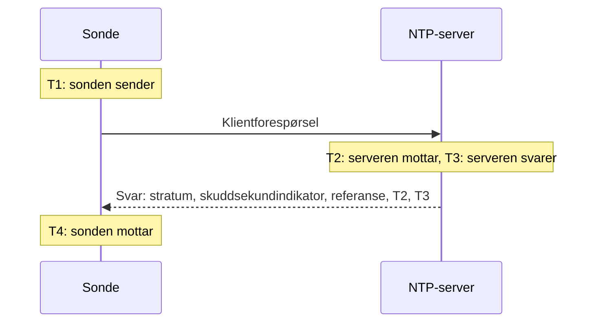

# NTP-overvåking

En NTP-monitor kontrollerer at en tidsserver svarer på UDP-port 123 og leverer pålitelig tid: at den er synkronisert, på et fornuftig stratum, og at klokken dens stemmer med sondens. Bruk den for tidsserverne du drifter selv, som en GPS-klokke i datasenteret eller de interne serverne maskinene dine synkroniserer mot, og for de offentlige serverne du er avhengig av.

:::cards
- [Opprett monitoren](#opprett-en-ntp-monitor): Seks trinn i dashbordet.
- [Hva kontrollen leser](#hva-kontrollen-leser): Stratum, klokkeavvik, skuddsekundindikator og resten av svaret.
- [Overvåkingskriterier](#overvåkingskriterier): Tilgjengelighet, synkronisering, stratum og avvik.
- [Feilsøking](#feilsøking): Når serveren kjører, men monitoren sier noe annet.
:::

## Slik fungerer det

Ved hver kontroll sender en sonde én SNTP-klientforespørsel (NTP versjon 4, klientmodus) fra en tilfeldig lokal port til serverens UDP-port og venter på svaret. Bare et ekte svar på den forespørselen teller: sonden legger 64 tilfeldige biter i forespørselens sendetidsstempel og ignorerer alle pakker som ikke sender dem tilbake, er kortere enn en NTP-pakke eller ikke er i servermodus. Et gammelt svar på en tidligere kontroll, eller et forfalsket svar, kan aldri få en nede server til å se levende ut.

Ut fra de fire tidsstemplene regner sonden ut **klokkeavviket**, ((T2 − T1) + (T3 − T4)) / 2: hvor langt serverens klokke er fra sondens. Et positivt avvik betyr at serveren går foran. Formelen antar at forespørselen og svaret tar like lang tid, så en vei som er mye tregere den ene veien, kan forskyve avviket med opptil halvparten av rundturen.

> [!NOTE]
> Avviket måles mot sondens egen klokke. OneUptime Clouds sonder holder klokkene sine synkronisert. På en [egendefinert sonde](/docs/probe/custom-probe) må vertens klokke også holdes synkronisert, med chrony eller systemd-timesyncd, ellers kan et avviksvarsel handle om sonden og ikke om serveren.

En server som svarer, blir ikke spurt igjen, heller ikke når den svarer uten pålitelig tid. Stillhet, en avvist port og et mislykket DNS-oppslag prøves på nytt med en ny forespørsel. Når serveren ikke svarer i det hele tatt, sporer sonden også ruten dit og legger ved det den fant som **Network Path at Time of Failure**. En sonde som har mistet sin egen nettverksforbindelse, rapporterer ikke noe resultat, så den kan ikke markere serveren din som frakoblet.

## Før du begynner

- **En rolle som kan opprette monitorer**: Project Owner, Project Admin, Project Member, Monitor Admin eller Monitor Member, eller en egendefinert rolle med tillatelsen Create Monitor.
- **En sonde som når UDP-port 123 på serveren.** Alle sonder kan kontrollere en offentlig tidsserver. For en server på et privat nettverk bruker du en [egendefinert sonde](/docs/probe/custom-probe) inne i det nettverket. En brannmur foran serveren må slippe gjennom UDP, ikke bare TCP, fra [IP-adressene til OneUptime Clouds sonder](/docs/configuration/ip-addresses) eller fra den egendefinerte sonden din.

## Opprett en NTP-monitor

:::steps
### Start en ny monitor

Gå til **Monitorer** og klikk på **Opprett monitor**. Under **Monitortype** skriver du `ntp` i søkefeltet og velger **NTP**. Den finnes også under **Flere monitortyper**, i gruppen Nettverk.

### Gi den et navn

Skriv inn et **Navn**, for eksempel `GPS-tidsserver`, og klikk på **Neste**.

### Skriv inn serveren

I **NTP-server** skriver du inn serverens vertsnavn eller IP-adresse, for eksempel `time.example.com` eller `192.168.1.10`. Forespørselen går til port 123. Åpne **Flere felt** og angi **Port** for å bruke en annen port.

### Test den

Klikk på **Test monitor**, velg en sonde under **Velg sonde** og klikk på **Kjør test**. **Resultat av overvåkingstest** viser om serveren svarte, om den er synkronisert, stratumet dens og hvor mye klokken dens avviker.

### Gå gjennom kriteriene

**Monitorkriterier** starter med [standardkriteriene](#standardkriterier): frakoblet når serveren ikke leverer pålitelig tid, online når den gjør det. Endre dem ved behov, og klikk på **Neste**.

### Velg sonder og opprett

Behold eller endre **Sonder** og **Overvåkingsintervall** (det starter på **Hvert 5. minutt**), og klikk på **Opprett monitor**. Siden til monitoren åpnes.
:::

## Konfigurasjonsalternativer

| Felt | Standard | Hva du skriver inn |
| --- | --- | --- |
| **NTP-server** | Ingen | Serveren, for eksempel `time.example.com`, `192.168.1.10` eller `2001:db8::123`. Skriv bare inn verten, uten `udp://`. En port skrevet etter verten, for eksempel `time.example.com:1123`, brukes i stedet for **Port**. |
| **Port** (under **Flere felt**) | `123` | UDP-porten serveren svarer på NTP på, fra `1` til `65535`. La den stå tom for `123`. |
| **Tidsavbrudd for forespørsel (sekunder)** (under **Flere felt**) | `5` | Hvor lenge ett forsøk venter på svaret, DNS-oppslaget medregnet. Maksimum er 60 sekunder. |
| **Nye forsøk ved feil** (under **Flere felt**) | Sondens standard, vanligvis `3` | Hvor mange ganger et forsøk uten svar prøves på nytt. Maksimum er 3. |

**Nye forsøk ved feil** teller nye forsøk _etter_ det første forsøket, så `0` kjører kontrollen én gang og `2` opptil tre ganger, med en pause på ett sekund mellom forsøkene. Står feltet tomt, brukes sondens standard: 3, med mindre sondens `PROBE_MONITOR_RETRY_LIMIT` sier noe annet.

## Hva kontrollen leser

Siden til monitoren viser den siste kontrollen fra hver sonde:

| Felt | Hva det betyr |
| --- | --- |
| **Synkronisert** | Om serveren svarte på stratum 1 til 15, uten alarmen i skuddsekundindikatoren og med ekte tidsstempler i svaret. |
| **Klokkeavvik** | Hvor langt serverens klokke er fra sondens, og i hvilken retning. En sunn server ligger innenfor noen få millisekunder. |
| **Stratum** | Hvor mange hopp serveren er fra en referanseklokke: 1 for en server med egen GPS- eller atomkilde, 2 for en som synkroniserer mot en stratum 1-server, og så videre. 16 betyr ikke synkronisert. |
| **Referanse** | Hva serveren synkroniserer mot: et kildenavn som `GPS`, `PPS` eller `NIST` på stratum 1, adressen til serveren over fra stratum 2 og oppover. |
| **Skuddsekundindikator** | 0 når ingen skuddsekund venter, 1 eller 2 når ett legges til eller trekkes fra ved slutten av dagen, 3 når serveren sier at klokken dens ikke er synkronisert. |
| **Rotspredning** | Serverens eget anslag over hvor langt tiden dens kan være fra den sanne tiden. Den vokser mens serveren ikke når kilden sin. ntpd slutter å stole på en server når halvparten av rotforsinkelsen pluss denne verdien går over 1,5 sekunder. |
| **Rotforsinkelse** | Rundturen fra serveren til referanseklokken dens. |
| **Svartid** | Fra sonden sender forespørselen til den mottar svaret, uten DNS-oppslaget. |
| **Servertid** | Serverens klokke da den sendte svaret. |

En server som nekter å oppgi tiden, sender i stedet et **kiss-o'-death**: et svar på stratum 0 med en kode på fire bokstaver. De vanligste kodene er `RATE` (serveren begrenser sondens frekvens), `DENY` og `RSTR` (tilgangsreglene dens avviser sonden) og `INIT` (den er ikke synkronisert ennå). Kontrollen viser koden og regner serveren som svarende, men ikke synkronisert.

## Overvåkingskriterier

Kriterier avgjør når serveren regnes som online, redusert eller frakoblet, og om det erklærer en hendelse eller oppretter et varsel. Hvert kriterium kontrollerer ett eller flere filtre:

| Filter | Betingelser | Hva det kontrollerer |
| --- | --- | --- |
| **NTP Is Online** | **Sann**, **Usann** | Om serveren besvarte sondens forespørsel med et NTP-svar. Et kiss-o'-death er et svar. |
| **NTP Is Synchronized** | **Sann**, **Usann** | Om serveren som svarte, leverer synkronisert tid. Når serveren ikke svarer, kontrolleres ikke dette filteret; bruk **NTP Is Online** til det. |
| **NTP Stratum** | **Greater Than**, **Greater Than Or Equal To**, **Less Than**, **Less Than Or Equal To**, **Equal To**, **Not Equal To** | Serverens stratum. Et kiss-o'-deaths 0 teller som 16, ikke synkronisert. |
| **NTP Clock Offset (in ms)** | **Greater Than**, **Less Than**, **Greater Than Or Equal To**, **Less Than Or Equal To** | Hvor langt serverens klokke er fra sondens, i begge retninger. |
| **NTP Response Time (in ms)** | **Greater Than**, **Less Than**, **Greater Than Or Equal To**, **Less Than Or Equal To** | Fra forespørselen til svaret. |
| **NTP Root Dispersion (in ms)** | **Greater Than**, **Less Than**, **Greater Than Or Equal To**, **Less Than Or Equal To** | Serverens eget anslag over sin største feil. |

Med to eller flere filtre avgjør **Samsvarsbetingelse** om **Alle** må samsvare, eller om **Hvilken som helst** av dem er nok. Et kriteriums **Handlinger** avgjør hva det gjør: endrer monitorens status, oppretter et varsel, erklærer en hendelse eller en kombinasjon av disse.

### Standardkriterier

En ny NTP-monitor starter med to kriterier:

- **Frakoblet** — serveren svarer ikke, er ikke synkronisert, eller klokken dens er `1000` ms eller mer fra sondens. Monitoren markeres som **Frakoblet**, og det opprettes en hendelse som heter "_monitornavn_ is not serving good time". Den løser seg selv når serveren igjen leverer pålitelig tid.
- **Online** — serveren svarer, er synkronisert, og klokken dens er innenfor `1000` ms fra sondens. Monitoren markeres som **I drift**.

Kriteriene kontrolleres ovenfra og ned, og det første som samsvarer, avgjør hva som skjer. En server som svarer med feil tid, behandles med vilje som nede: hver klient som følger den, ville også ta den tiden.

### Evaluering over en tidsperiode

**Evaluer disse kriteriene over en tidsperiode** er en avkrysningsboks under hvert NTP-filter. Slå den på for å vurdere et vindu med tidligere kontroller i stedet for den siste: velg en aggregering under **Evaluer** og et vindu, fra 2 til 60 minutter, under **For de siste (i minutter)**. Bare kontroller serveren svarte på, har et stratum, et avvik og en rotspredning, så et vindu med stillhet har ingen data for de filtrene, og **Hvis ingen data** avgjør hva som skjer.

### Eksempler på kriterier

| Mål | Filter | Betingelse | Verdi |
| --- | --- | --- | --- |
| Varsle når en GPS-server faller tilbake til en nettverkskilde | **NTP Stratum** | **Greater Than** | `1` |
| Varsle når klokken driver | **NTP Clock Offset (in ms)** | **Greater Than** | `100` |
| Varsle når serverens feilmargin vokser | **NTP Root Dispersion (in ms)** | **Greater Than** | `500` |
| Varsle når svarene blir trege | **NTP Response Time (in ms)** | **Greater Than** | `1000` |

## Feilsøking

:::details Serveren kjører, men monitoren sier at den ikke svarte
Forespørselen eller svaret gikk tapt underveis. En brannmur som tillater TCP men ikke UDP, en ntpd-regel `restrict` eller chrony-regel `allow` som utelater sondens adresse, eller en server som bare lytter på et internt grensesnitt, ser alle slik ut. **Network Path at Time of Failure** viser hvor langt ruten kom. Slipp sonden gjennom, eller kontroller serveren fra en [egendefinert sonde](/docs/probe/custom-probe) inne i nettverket.
:::

:::details Monitoren sier at serveren avviste forespørselen
Verten svarte at ingenting lytter på den UDP-porten (ICMP port unreachable): NTP-tjenesten er stoppet, eller den lytter på en annen port. Start tjenesten, eller sett **Port** til den den bruker.
:::

:::details Serveren svarer med et kiss-o'-death
`RATE` betyr at serveren begrenser sondens frekvens. Sonden spør én gang per kontroll, så et lengre **Overvåkingsintervall**, eller et unntak for sondens adresser i serverens begrensning, stopper det. `DENY` og `RSTR` betyr at serverens tilgangsregler avviser sonden. `INIT` og `STEP` betyr at serveren ikke er synkronisert ennå, noe som er normalt de første minuttene etter oppstart.
:::

:::details Alle NTP-monitorer på én sonde viser et lignende avvik
Det er sondens klokke som avviker, ikke servernes. Kontroller at sondens vert holder klokken sin synkronisert, eller kjør monitorene på en annen sonde.
:::

:::details Avviket hopper mellom kontrollene
Sonden er langt fra serveren, eller veien er tregere den ene veien enn den andre. Bruk en sonde nærmere serveren, eller vurder avviket over noen minutter med **Evaluer disse kriteriene over en tidsperiode** og **Gjennomsnitt**.
:::

## Neste trinn

:::cards
- [Ping-overvåking](/docs/monitor/ping-monitor): Kontroller at selve verten kan nås.
- [Port-overvåking](/docs/monitor/port-monitor): Kontroller TCP-tjenestene på samme vert.
- [Egendefinerte probes](/docs/probe/custom-probe): Kontroller tidsservere på ditt eget nettverk.
- [Hendelse- og varslingsmaler](/docs/monitor/incident-alert-templating): Sett stratum og avvik i tittelen på en hendelse.
:::
