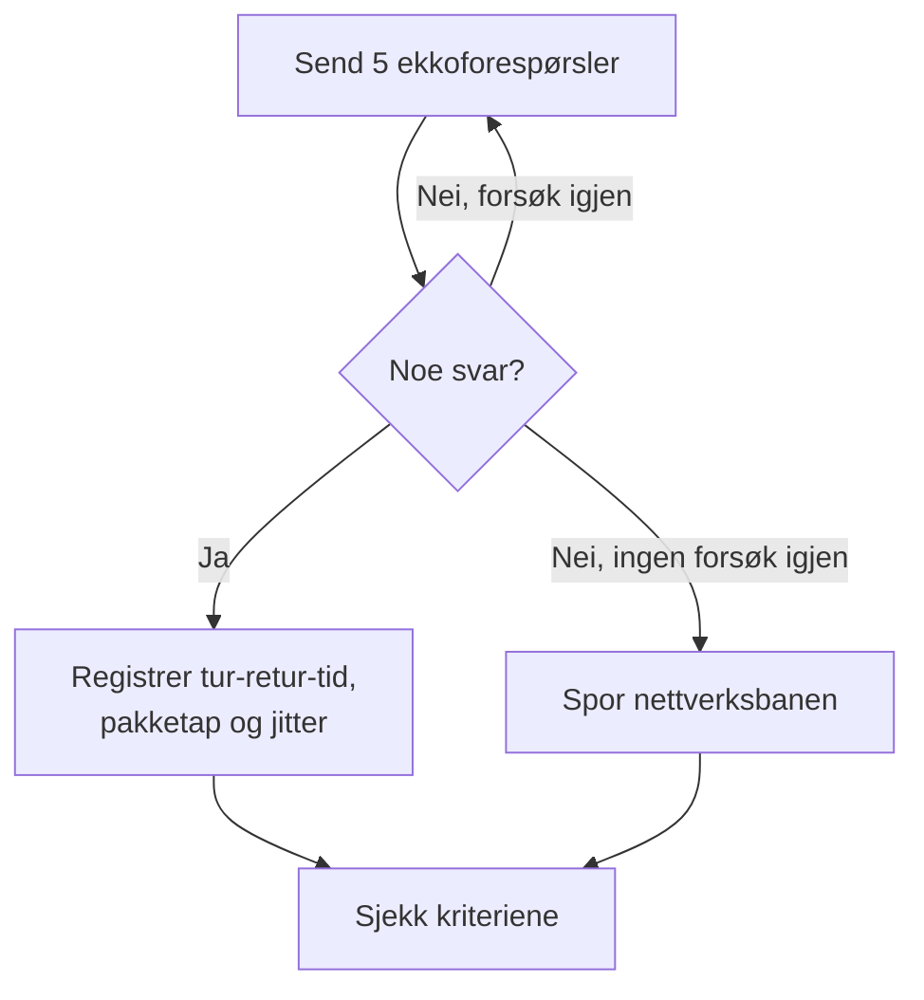

# Ping-overvåking

En ping-monitor sjekker at en vert svarer på ping (ICMP-ekkoforespørsler), og måler tur-retur-tiden, pakketapet og jitteren. Bruk den for servere, rutere, brannmurer og andre enheter du når via vertsnavn eller IP-adresse.

:::cards
- [Opprett monitoren](#opprett-en-ping-monitor): Seks trinn i dashbordet.
- [Konfigurasjonsalternativer](#konfigurasjonsalternativer): Verten, tidsavbruddet og nye forsøk.
- [Overvåkingskriterier](#overvåkingskriterier): Tilgjengelighet, forsinkelse, pakketap og jitter.
- [Feilsøking](#feilsøking): Når verten er oppe, men monitoren sier frakoblet.
:::

## Slik fungerer det

Ved hver sjekk sender en sonde fem ekkoforespørsler til verten. Kommer minst ett svar tilbake, er verten tilkoblet, og sonden registrerer gjennomsnittlig tur-retur-tid som svartid, sammen med pakketapet, jitteren og det raskeste og tregeste svaret. Kommer det ikke noe svar tilbake, prøver sonden igjen, opptil antallet nye forsøk du tillater. Deretter kjører OneUptime resultatet gjennom monitorens kriterier.

Når en sjekk feiler, sporer sonden også ruten til verten og slår opp navnet, og legger det den fant ved resultatet som **Network Path at Time of Failure**, så du kan se hvor ruten brøt sammen.

> [!NOTE]
> Noen vertsleverandører blokkerer ICMP på maskinene en sonde kjører på. En sonde som ikke kan sende ping i det hele tatt, sjekker i stedet TCP-port `80` på verten, så monitoren fortsatt sier om verten kan nås. Pakketap og jitter måles da ikke.

En sonde som har mistet sin egen nettverkstilkobling, rapporterer ikke noe resultat, så den kan ikke merke verten din som frakoblet.

## Før du starter

- **En rolle som kan opprette monitorer**: Project Owner, Project Admin, Project Member, Monitor Admin eller Monitor Member, eller en egendefinert rolle med tillatelsen Create Monitor.
- **En sonde som når verten**, med ICMP tillatt på veien. Prosjektets standardsonder velges for hver nye monitor. Står det en brannmur foran verten, tillater du ICMP-ekkoforespørsler fra [OneUptime Clouds sonde-IP-adresser](/docs/configuration/ip-addresses). En vert på et privat nettverk trenger en [egendefinert sonde](/docs/probe/custom-probe) i det nettverket.

## Opprett en ping-monitor

:::steps
### Start en ny monitor

Gå til **Monitorer**, og klikk på **Opprett monitor**. Velg **Ping** under **Monitortype**.

### Gi den et navn

Angi et **Navn**, som `Core router`, og klikk så på **Neste**.

### Angi verten

Angi under **Vertsnavn eller IP-adresse** vertsnavnet eller IPv4- eller IPv6-adressen som skal pinges, som `example.com` eller `192.168.1.1`. Angi bare verten, uten `http://` og uten port.

### Test den

Klikk på **Test monitor**, velg en sonde under **Velg sonde**, og klikk på **Kjør test**. **Resultat av overvåkingstest** viser tur-retur-tidene og pakketapet sonden så.

### Gå gjennom kriteriene

**Monitorkriterier** starter med [standardkriteriene](#standardkriterier): frakoblet når verten ikke svarer, tilkoblet når den gjør det. Endre dem ved behov, og klikk så på **Neste**.

### Velg sonder og opprett

Behold eller endre **Sonder** og **Overvåkingsintervall** (det starter på **Hvert 5. minutt**), og klikk så på **Opprett monitor**. Monitorens side åpner.
:::

## Konfigurasjonsalternativer

| Felt | Standard | Hva du angir |
| --- | --- | --- |
| **Vertsnavn eller IP-adresse** | Ingen | Verten som skal pinges, som `example.com`, `192.168.1.1` eller `2001:db8::1`. Et vertsnavn slås opp ved hver sjekk, så monitoren følger DNS-endringer. |
| **Tidsavbrudd for forespørsel (sekunder)** (under **Flere felt**) | `60` | Hvor lenge det ventes på svar ved hvert forsøk. Maksimum er 60 sekunder. |
| **Nye forsøk ved feil** (under **Flere felt**) | Sondens standard, som regel `3` | Hvor mange ganger et mislykket forsøk gjentas. Maksimum er 3. |

**Nye forsøk ved feil** teller nye forsøk _etter_ det første forsøket, så `0` kjører sjekken én gang og `2` opptil tre ganger. Står feltet tomt, brukes sondens standard: 3, med mindre sondens `PROBE_MONITOR_RETRY_LIMIT` sier noe annet. Hver feil prøves på nytt, tidsavbrudd medregnet, med ett sekunds pause mellom forsøkene. En vellykket sjekk der svarene tok lenger enn 10 sekunder, sjekkes også på nytt.

For å overvåke en fast IP-adresse og aldri et vertsnavn kan du heller bruke en [IP-monitor](/docs/monitor/ip-monitor). Den kjører den samme sjekken.

## Overvåkingskriterier

Kriterier avgjør når verten regnes som tilkoblet, redusert eller frakoblet, og om det erklærer en hendelse eller oppretter et varsel. Hvert kriterium sjekker ett eller flere filtre:

| Filter | Betingelser | Hva det sjekker |
| --- | --- | --- |
| **Is Online** | **Sann**, **Usann** | Om minst én ekkoforespørsel fikk svar. |
| **Svartid (i ms)** | **Greater Than**, **Less Than**, **Greater Than Or Equal To**, **Less Than Or Equal To** | Gjennomsnittlig tur-retur-tid for svarene. |
| **Packet Loss (in %)** | **Greater Than**, **Less Than**, **Greater Than Or Equal To**, **Less Than Or Equal To** | Andelen av de fem ekkoforespørslene som ikke fikk svar. |
| **Jitter (in ms)** | **Greater Than**, **Less Than**, **Greater Than Or Equal To**, **Less Than Or Equal To** | Standardavviket for tur-retur-tidene over pakkene i én sjekk. |
| **Is Request Timeout** | **Sann**, **Usann** | Om pingen fikk tidsavbrudd ved hvert forsøk. |

Med to eller flere filtre avgjør **Samsvarsbetingelse** om **Alle** må samsvare, eller om **Hvilken som helst** av dem holder. Et kriteriums **Handlinger** avgjør hva det gjør: endrer monitorstatusen, oppretter et varsel, erklærer en hendelse, eller flere av disse.

### Standardkriterier

En ny ping-monitor starter med to kriterier:

- **Frakoblet** — verten svarer ikke på noen av ekkoforespørslene, eller kan ikke nås i det hele tatt etter alle nye forsøk. Monitoren merkes som **Frakoblet**, og en hendelse kalt "_monitor name_ is offline" opprettes. Hendelsen løser seg selv når verten svarer igjen.
- **Oppe** — verten svarer. Monitoren merkes som **I drift**.

Kriterier sjekkes fra topp til bunn, og det første som samsvarer, avgjør hva som skjer. Når ingen samsvarer, viser monitoren standardstatusen sin: **I drift**, med mindre du velger en annen under **Flere felt** under kriteriene.

### Evaluering over en tidsperiode

**Evaluer disse kriteriene over en tidsperiode** er en avkrysningsboks under et filter, som tilbys for **Is Online**, **Svartid (i ms)**, **Packet Loss (in %)** og **Jitter (in ms)**. Slå den på for å vurdere et vindu av tidligere sjekker i stedet for bare den siste: velg en aggregering under **Evaluer** og et vindu fra 2 til 60 minutter under **For de siste (i minutter)**.

| Aggregering | Samsvarer når |
| --- | --- |
| **Gjennomsnitt**, **Sum**, **Maximum Value**, **Minimum Value** | Den verdien over vinduet oppfyller betingelsen. Bare numeriske filtre. |
| **All Values** | Hver sjekk i vinduet oppfyller betingelsen. |
| **Any Value** | Minst én sjekk i vinduet oppfyller betingelsen. |

**All Values** samsvarer først når vinduet faktisk er dekket av data. En monitor som nettopp er opprettet, eller en der sjekkene sluttet å bli registrert, har ikke nok historikk til å si noe om de siste N minuttene, så kriteriet venter i stedet for å samsvare på den ene målingen det har. **Any Value** er innstillingen for "si fra med en gang én enkelt sjekk overskrider grensen" og utløses fortsatt umiddelbart.

**Hvis ingen data** avgjør hva som skjer så lenge vinduet ikke kan underbygge kriteriet:

| Alternativ | Hva som skjer | Bruk det til |
| --- | --- | --- |
| **Ignore** (standard) | Kriteriet samsvarer ikke. | Vanlige terskelvarsler. |
| **Trigger** | De manglende dataene regnes som problemet. | Sjekker der stillhet i seg selv er en feil. |
| **Treat As Zero** | Vinduet sammenlignes som én enkelt null. | Tellere der ingen hendelser virkelig betyr null. |

### Eksempelkriterier

| Mål | Filter | Betingelse | Verdi |
| --- | --- | --- | --- |
| Frakoblet når verten ikke kan nås | **Is Online** | **Usann** | — |
| Varsle når forsinkelsen er høy | **Svartid (i ms)** | **Greater Than** | `200` |
| Merk verten som redusert på en forbindelse med tap | **Packet Loss (in %)** | **Greater Than** | `20` |
| Varsle ved en ustabil forbindelse | **Jitter (in ms)** | **Greater Than** | `30` |

For bare å varsle når forsinkelsen holder seg høy, slår du på **Evaluer disse kriteriene over en tidsperiode** for svartidsfilteret og velger **All Values** over **5** minutter.

## Feilsøking

:::details Verten er oppe, men monitoren sier frakoblet
Verten, eller en brannmur foran den, svarer ikke på ICMP-ekkoforespørsler fra sonden. Mange servere og skynettverk dropper ping som standard. Tillat ICMP-ekkoforespørsler fra sondene, eller overvåk heller en tjeneste på verten med en [port-monitor](/docs/monitor/port-monitor). **Network Path at Time of Failure** på den mislykkede sjekken viser hvor langt ruten kom.
:::

:::details Sjekken feiler med "This probe could not resolve" for verten
Sondens DNS-server kjenner ikke vertsnavnet. Sjekk navnet, eller angi heller IP-adressen. Et navn som bare slås opp inne på nettverket ditt, trenger en [egendefinert sonde](/docs/probe/custom-probe) der.
:::

:::details Pakketap og jitter er tomme
Sonden som kjørte sjekken, kan ikke sende ping, så den sjekket i stedet TCP-port `80`, som ikke måler noen av dem. Kjør monitoren på en sonde som får sende ICMP.
:::

## Neste steg

:::cards
- [IP-overvåking](/docs/monitor/ip-monitor): Overvåk en fast IPv4- eller IPv6-adresse.
- [Port-overvåking](/docs/monitor/port-monitor): Sjekk en tjeneste på verten, ikke bare verten.
- [Egendefinerte probes](/docs/probe/custom-probe): Ping verter på ditt eget nettverk.
- [Hendelser](/docs/incidents/index): Hva som skjer etter at monitoren har erklært en.
:::
