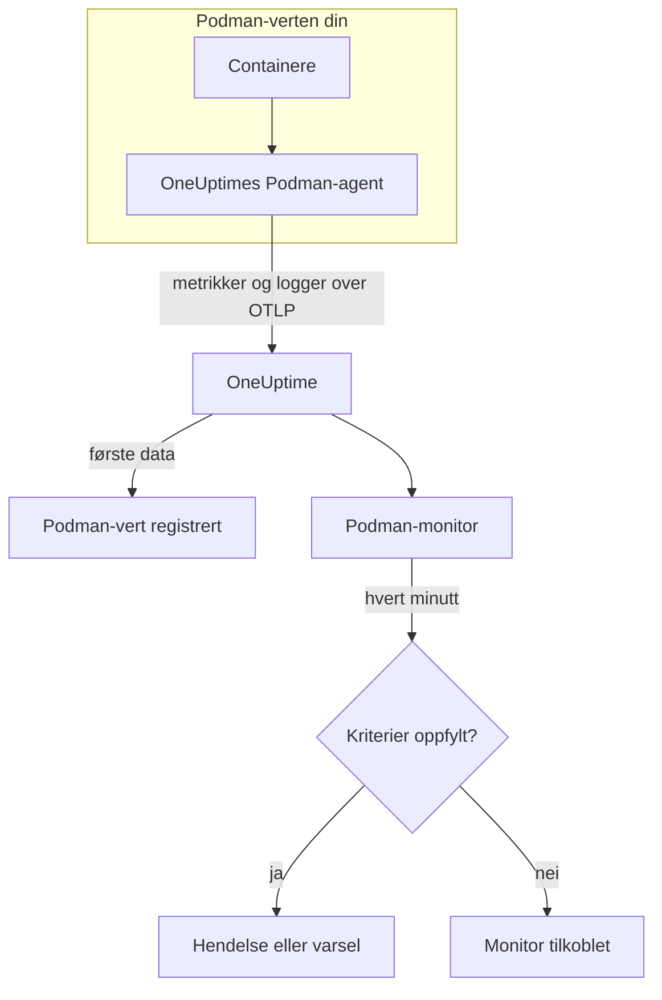

# Podman-overvåking

En Podman-monitor overvåker containerne på én Podman-vert og sier fra når en container går varm, går tom for minne eller stadig starter på nytt. Den leser metrikkene som OneUptimes Podman-agent sender fra verten, så ingenting undersøkes utenfra: installer agenten, og opprett deretter monitoren fra en mal eller din egen spørring.

:::cards
- [Opprett monitoren](#opprett-en-podman-monitor): Seks trinn i dashbordet.
- [Maler](#ferdige-varslingsmaler): Fem ferdige varsler, én hendelse per container.
- [Metrikker](#innsamlede-metrikker): Hva agenten samler inn, og hva hver metrikk betyr.
- [Logger](#innsamlede-logger): Containerlogger og loggdriveren de trenger.
:::

## Slik fungerer det

OneUptimes Podman-agent kjører som en container på verten. Hvert 30. sekund leser den containerstatistikk gjennom Podmans Docker-kompatible API-socket, følger containernes loggfiler og sender begge deler til OneUptime over OTLP. De første dataene fra en vert registrerer den i OneUptime.

En Podman-monitor er knyttet til én vert. Hvert minutt kjører den spørringen sin over vertens containermetrikker og sammenligner resultatet med kriteriene sine.



## Før du begynner

- **Installer Podman-agenten** på verten. [Veiledningen for Podman-agenten](/docs/telemetry/podman-host) dekker installasjon, oppgradering og kontroll. Agenten trenger Podmans API-socket på `/run/podman/podman.sock`.
- **Kontroller at verten er registrert.** Den vises under **Produkter → Infrastruktur → Podman → Alle verter**, oppkalt etter agentens `PODMAN_HOST_NAME`, så snart de første dataene kommer.
- **For containerlogger** må containerne kjøre med loggdriveren `k8s-file`. Se [Krav til loggdriveren](#krav-til-loggdriveren).

## Opprett en Podman-monitor

:::steps
### Start en ny monitor

Gå til **Monitorer** og klikk på **Opprett monitor**.

### Velg Podman Container

Klikk på **Flere monitortyper** under **Monitortype**, og velg **Podman Container** under **Infrastruktur**, eller skriv `podman` i søkefeltet. Skriv inn et **Navn** – det brukes i titler på hendelser og varsler – og klikk på **Neste**.

### Velg verten

Velg verten i **Podman Host** under **Podman Monitor Configuration**. Hver vert som har sendt data, står i listen.

### Velg hva som skal overvåkes

Velg en av de tre fanene:

- **Quick Setup** – klikk på en [mal](#ferdige-varslingsmaler). Den angir metrikken, aggregeringen, tidsintervallet og tersklene, og erstatter kriteriene nedenfor med sine egne. Du kan fortsatt endre **Tidsintervall**.
- **Custom Metric** – velg én metrikk i **Podman Metric**, og angi deretter **Aggregering** og **Tidsintervall**. **Containernavn** og **Container-bilde** snevrer den inn til bestemte containere.
- **Avansert** – bygg spørringer og formler selv under **Velg målinger**. Bruk **Group by** `resource.container.name` for å vurdere hver container for seg.

### Kontroller kriteriene

Åpne hvert kriterium under **Monitorkriterier** og kontroller **Metrikk**, **Aggregering**, **Betingelse** og **Threshold**. En mal fyller inn disse. Med **Custom Metric** eller **Avansert** starter monitoren med [standardkriteriene](#standardkriterier), som bare merker at en metrikk faller til null, så angi din egen terskel.

### Opprett monitoren

Klikk på **Opprett monitor**. OneUptime åpner monitorens side og evaluerer den hvert minutt. Hendelser og varsler den åpner, vises også på vertens sider **Hendelser** og **Varsler**.
:::

> [!TIP]
> For å sette opp flere maler samtidig åpner du verten fra **Produkter → Infrastruktur → Podman** og går til **Recommendations**. Velg malene du vil ha og hvem som skal varsles, så oppretter OneUptime én monitor per mal.

## Monitorinnstillinger

| Felt | Fane | Hva det gjør |
| --- | --- | --- |
| **Podman Host** | Alle | Påkrevd. Avgrenser hver spørring til vertens `resource.host.name`. OneUptime legger også til `resource.container.runtime = podman` i hver spørring. |
| **Podman Metric** | Custom Metric | Én metrikk fra agentens katalog, gruppert som CPU, minne, nettverk, blokk-I/O og container. |
| **Containernavn** | Custom Metric, Avansert | Valgfritt. Nøyaktig samsvar med `resource.container.name`, for eksempel `my-container`. |
| **Container-bilde** | Custom Metric, Avansert | Valgfritt. Nøyaktig samsvar med `resource.container.image.name`, for eksempel `nginx:latest`. |
| **Aggregering** | Custom Metric | Hvordan målinger kombineres: **Gjennomsnitt**, **Maksimum**, **Minimum**, **Sum** eller **Antall**. Starter på metrikkens vanlige aggregering. |
| **Tidsintervall** | Alle | Det glidende vinduet spørringen leser, fra **Past 1 Minute** til **Past 365 Days**. En ny monitor starter på **Past 1 Minute**; maler angir sitt eget. |
| **Velg målinger** | Avansert | Spørringsbyggeren: **Metrikk**, **Aggregate by**, **Filter by attributes**, **Group by**, pluss **Legg til metrikk** og **Legg til formel** for å kombinere spørringer. |

## Ferdige varslingsmaler

**Quick Setup** tilbyr fem maler. Hver bygger en komplett monitor: en spørring gruppert etter `resource.container.name`, et kriterium som utløses, og et som gjenoppretter. Hver container vurderes for seg og får sin egen hendelse og sitt eget varsel. Tersklene er utgangspunkter du kan redigere.

Et kriterium utløses bare når betingelsen gjelder i hvert minutt av vinduet, og det gjenoppretter 10 % forbi terskelen, slik at en verdi som svever ved grensen, ikke blafrer.

| Mal | Alvorlighetsgrad | Overvåker | Utløses når | Gjenoppretter når |
| --- | --- | --- | --- | --- |
| High Container CPU Usage | Warning | `container.cpu.utilization`, Avg per container, siste 5 minutter | Over 80 (% av én kjerne) | På eller under 72 |
| High Container Memory Usage | Warning | `container.memory.percent`, Avg per container, siste 5 minutter | Over 85 % | På eller under 76,5 % |
| High Container Restart Count | Kritisk | `container.restarts`, Max per container, siste 5 minutter | Over 5 omstarter totalt | 4,5 eller færre |
| High Container Process Count | Warning | `container.pids.count`, Max per container, siste 5 minutter | Over 500 | På eller under 450 |
| Container Restarted (Low Uptime) | Kritisk | `container.uptime`, Min per container, siste 1 minutt | Under 120 sekunder | På eller over 132 sekunder |

**Alvorlighetsgrad** er etiketten velgeren viser. Hendelsen og varselet en mal oppretter, starter på prosjektets mest alvorlige hendelses- og varslingsgrad; endre dem i kriteriene.

De to prosentmalene bruker **Gjennomsnitt**: metrikkene deres er allerede prosenter per container, så gjennomsnittet for et minutt er den vedvarende verdien. Antall omstarter og antall prosesser bruker **Maksimum**, der én måling over terskelen er signalet.

> [!NOTE]
> `container.cpu.utilization` er tallet `podman stats` skriver ut: 100 % er én hel CPU-kjerne, ikke containerens samlede CPU-tildeling. En container som har fått flere kjerner, ligger godt over 100 mens den er frisk, så hev terskelen for slike.

> [!NOTE]
> `container.restarts` er en løpende sum som Podman fører, ikke et antall omstarter i vinduet. **High Container Restart Count** forblir derfor åpen til containeren opprettes på nytt, noe som nullstiller tallet.

> [!CAUTION]
> `container.uptime` finnes bare for kjørende containere. En container som stopper og forblir stoppet, sender ingen data, så **Container Restarted (Low Uptime)** fanger omstarter og nye utrullinger, ikke en permanent nedstengning. En container som er ment å kjøre i mindre enn to minutter, forblir i varslingstilstand hele levetiden.

Det finnes ingen mal for CPU-struping. Strupemetrikkene agenten samler inn, bare vokser, og et varsel om «strupet i det hele tatt» ville utløses én gang og aldri opphøre. Begge samles fortsatt inn, så du kan vise dem i diagrammer.

## Innsamlede metrikker

Agenten bruker OpenTelemetry-mottakeren `docker_stats`, rettet mot Podmans Docker-kompatible socket, `/run/podman/podman.sock`, hvert 30. sekund. Hver containers metrikker bærer identiteten dens som ressursattributter: `resource.container.name`, `resource.container.image.name`, `resource.container.id`, `resource.container.runtime` (`podman`) og `resource.host.name`.

### CPU

| Metrikk | Beskrivelse |
| --- | --- |
| `container.cpu.utilization` | Containerens CPU-utnyttelse, der 100 % er én hel CPU-kjerne. |
| `container.cpu.usage.total` | Brukt CPU-tid siden containeren startet, i nanosekunder. En teller over hele levetiden. |
| `container.cpu.throttling_data.throttled_time` | Nanosekunder containeren har blitt strupet av CPU-grensen sin. En teller over hele levetiden. |
| `container.cpu.throttling_data.throttled_periods` | Struperioder siden containeren startet. En teller over hele levetiden. |

### Minne

| Metrikk | Beskrivelse |
| --- | --- |
| `container.memory.usage.total` | Minne i bruk, i byte. |
| `container.memory.usage.limit` | Minnegrense, i byte. |
| `container.memory.percent` | Minnebruk som prosentandel av containerens grense, eller av vertens minne når containeren ikke har noen grense. |

### Nettverk

| Metrikk | Beskrivelse |
| --- | --- |
| `container.network.io.usage.rx_bytes` | Mottatte byte. En teller over hele levetiden. |
| `container.network.io.usage.tx_bytes` | Sendte byte. En teller over hele levetiden. |

### Blokk-I/O

| Metrikk | Beskrivelse |
| --- | --- |
| `container.blockio.io_service_bytes_recursive.read` | Byte lest fra blokkenheter. |
| `container.blockio.io_service_bytes_recursive.write` | Byte skrevet til blokkenheter. |

### Container

| Metrikk | Beskrivelse |
| --- | --- |
| `container.uptime` | Sekunder siden containeren startet. Bare kjørende containere rapporterer den. |
| `container.restarts` | Antall ganger containeren har startet på nytt. En løpende sum. |
| `container.pids.count` | Oppgaver i containeren. Cgroup-ens pids-kontroller teller tråder så vel som prosesser. |

Listen **Podman Metric** tilbyr også `container.cpu.usage.percpu`, `container.memory.rss`, `container.memory.cache` og tellerne for nettverkspakker. Den medfølgende agentkonfigurasjonen slår dem ikke på, så kontroller vertens side **Målinger** før du bygger på dem. `container.cpu.throttling_data.throttled_periods` står ikke i listen; spør etter den fra **Avansert**.

## Overvåkingskriterier

Et kriterium sammenligner en av monitorens spørringer eller formler med en terskel. Kriteriene til en Podman-monitor har ingen **Filtertype**: hver regel kontrollerer metrikkverdien, med disse feltene.

| Felt | Hva det gjør |
| --- | --- |
| **Metrikk** | Spørringen eller formelen som kontrolleres, etter variabelnavnet. |
| **Aggregering** | Hvordan verdiene i vinduet blir til ett svar: **Gjennomsnitt**, **Sum**, **Maximum Value**, **Minimum Value**, **All Values** (hver verdi må samsvare) eller **Any Value** (én er nok). |
| **Betingelse** | **Greater Than**, **Less Than**, **Greater Than Or Equal To**, **Less Than Or Equal To** eller **Equal To** – eller en avviksbetingelse: **Anomalously High**, **Anomalously Low** eller **Anomalous**. |
| **Threshold** | Verdien det sammenlignes med. En liste over enheter står ved siden av når metrikken har en enhet. Vises ikke for avviksbetingelser. |
| **Følsomhet** | Bare avviksbetingelser. **Lav** (4σ), **Middels** (3σ, standard) eller **Høy** (2σ). |
| **Grunnlinjevindu** | Bare avviksbetingelser. 14 dager (standard), 28, 60 eller 90 dager med historikk. |
| **Hvis ingen data** | Under **Flere felt**. Hva som skjer når vinduet ikke har noen målinger: **Ignore** (standard), **Treat As Zero** eller **Trigger**. |

Avviksbetingelser sammenligner hver verdi med samme time i uken i grunnlinjen. De blir værende i en «Learning»-tilstand og gir ingenting før grunnlinjevinduet inneholder nok historikk.

Hvert kriterium sier også hva som skal skje når det samsvarer: endre monitorstatusen, opprette et varsel eller erklære en hendelse. Kriterier kontrolleres ovenfra og ned, og det første som samsvarer, avgjør.

### Standardkriterier

En monitor du ikke bygger fra en mal, starter med to kriterier:

| Rekkefølge | Kriterium | Samsvarer når | Deretter |
| --- | --- | --- | --- |
| 1 | Check if _monitor name_ is offline | En hvilken som helst verdi i den første spørringen er `0` | Markerer monitoren som **Frakoblet** og erklærer hendelsen «_monitor name_ is offline», som løser seg selv når monitoren kommer seg. |
| 2 | Check if _monitor name_ is online | En hvilken som helst verdi er over `0` | Markerer monitoren som **I drift**. |

> [!IMPORTANT]
> Stillhet samsvarer med ingen av kriteriene: en vert som slutter å sende data, etterlater monitoren slik den var. For å få beskjed når data stopper, setter du **Hvis ingen data** til **Trigger** på et kriterium. Tid der OneUptime selv ikke mottok data, er aldri manglende data: en kontroll der vinduet inneholder slik tid, venter i stedet, slik [Når OneUptime ikke mottar data](/docs/monitor/when-oneuptime-is-not-receiving) forklarer.

## Innsamlede logger

Agenten følger også hver containers fil `ctr.log` og sender hver linje som en OpenTelemetry-loggpost med:

| Felt | Verdi |
| --- | --- |
| `resource.host.name` | Verten, fra `PODMAN_HOST_NAME`. |
| `resource.container.id` | Den fullstendige container-ID-en. |
| `resource.container.runtime` | Alltid `podman`. |
| `attributes["log.iostream"]` | `stdout` eller `stderr`. |
| `severityText` / `severityNumber` | Lest fra et nivånøkkelord der et nivå står i linjen (`[ERROR]`, `app.INFO:`, `{"level":"warn"}`, `level=error`). En linje uten nivå faller tilbake på strømmen sin: `stderr` er `ERROR`, `stdout` er `INFO`. |
| `body` | Linjen containeren skrev. Linjer som starter med mellomrom eller en avsluttende parentes, som linjer i en stakksporing, føyes til linjen før. |
| `time` | Podmans tidsstempel for linjen. |

Logger vises på vertens side **Logger** og på hver containers side.

### Krav til loggdriveren

Agenten leser filene som Podmans loggdriver `k8s-file` skriver, i `/var/lib/containers/storage/overlay-containers/*/userdata/ctr.log`. Rootful Podman bruker `journald` som standard, som i stedet skriver til systemd-journalen, så det finnes ingen fil å lese:

| Driver | Hva agenten ser |
| --- | --- |
| `k8s-file` (eller `json-file`, som Podman behandler på samme måte) | Hver linje. |
| `journald` | Ingenting: loggene ligger i systemd-journalen. |
| `none` | Ingenting: loggene forkastes. |

Metrikker avhenger ikke av loggdriveren: en vert der containerne bruker `journald`, rapporterer fortsatt metrikker, bare siden **Logger** forblir tom.

Kontroller driveren til en container, og Podmans standard:

```bash
podman inspect <container> --format '{{.HostConfig.LogConfig.Type}}'
podman info --format '{{.Host.LogDriver}}'
```

Bytt til `k8s-file`. Podman fastsetter en containers loggdriver når containeren opprettes, så opprett hver container på nytt etter endringen – en omstart beholder den gamle driveren.

:::tabs
@tab podman run
Start containeren med driveren:

```bash
podman run --log-driver k8s-file ... <image>
```

For å bytte en eksisterende container fjerner du den og kjører den på nytt:

```bash
podman rm -f <container>
podman run --log-driver k8s-file ... <image>
```
@tab Podman Compose
Angi driveren på hver tjeneste:

```yaml title="docker-compose.yml"
services:
  my-app:
    image: my-app:latest
    logging:
      driver: "k8s-file"
      options:
        max-size: "100m"
```

Opprett deretter tjenesten på nytt:

```bash
podman compose up -d --force-recreate <service>
```
@tab containers.conf
Gjør `k8s-file` til standard for hver container som opprettes etterpå, i `/etc/containers/containers.conf` (rootful) eller `~/.config/containers/containers.conf` (rootless):

```toml title="containers.conf"
[containers]
log_driver = "k8s-file"
```

Fjern og opprett deretter hver container på nytt.
:::

## Feilsøking

:::details Verten står ikke i listen Podman Host
Verter registrerer seg selv fra agentens data. Kontroller at agentcontaineren kjører, at Podmans API-socket er aktivert, og at verten står under **Produkter → Infrastruktur → Podman → Alle verter**. [Veiledningen for Podman-agenten](/docs/telemetry/podman-host) har kontrollene du kan kjøre på verten.
:::

:::details Metrikker kommer, men siden Logger er tom
Containerne bruker nesten helt sikkert `journald`. Bytt dem du vil ha logger fra, til `k8s-file` (se [Krav til loggdriveren](#krav-til-loggdriveren)), og opprett dem på nytt.
:::

:::details Agenten logger «no files match the configured criteria»
Agenten ser etter `/var/lib/containers/storage/overlay-containers/*/userdata/ctr.log` og fant ingenting. Enten bruker ingen container på verten `k8s-file`, eller agentens montering av `/var/lib/containers/storage` mangler eller er tom, eller agenten og containerne kjører i ulike moduser – rootless containere har lagringen sin et sted rootful-banen ikke dekker, og omvendt.
:::

:::details Data kommer under feil vertsnavn
OneUptime identifiserer en vert etter `resource.host.name`, som agenten tar fra `PODMAN_HOST_NAME`. Endrer du `PODMAN_HOST_NAME` etter de første dataene, opprettes en ny vert i stedet for at den første får nytt navn, og en monitor forblir knyttet til navnet den ble opprettet med.
:::

:::details Et CPU-varsel utløses aldri
Grupper spørringen etter `resource.container.name`, slik malen **High Container CPU Usage** gjør, så hver container vurderes for seg. Et gjennomsnitt over alle containere på en travel vert trekkes ned av de inaktive. Husk at 100 % betyr én hel kjerne, så en container som får bruke flere kjerner, trenger en høyere terskel.
:::

:::details Varselet om antall omstarter opphører aldri
`container.restarts` er en løpende sum, så den faller ikke under terskelen av seg selv. Rett årsaken, og opprett deretter containeren på nytt for å nullstille tallet, eller hev terskelen.
:::

## Neste trinn

:::cards
- [Podman-agent](/docs/telemetry/podman-host): Installer, oppgrader og feilsøk agenten denne monitoren leser.
- [Docker-overvåking](/docs/monitor/docker-monitor): Den samme monitoren for Docker-verter.
- [Hendelser – Oversikt](/docs/incidents/index): Hva som skjer etter at et kriterium har erklært en hendelse.
- [Vaktplaner](/docs/on-call/schedules): Bestem hvem som varsles når en container går i stykker.
:::
