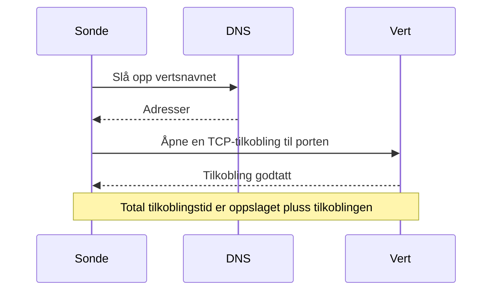

# Port-overvåking

En port-monitor sjekker at en vert godtar TCP-tilkoblinger på en port, og måler hvor lang tid tilkoblingen tar. Bruk den for tjenester som ikke snakker HTTP, eller der du ikke vil sjekke HTTP: databaser, e-postservere, SSH, meldingsmeglere og lignende.

:::cards
- [Opprett monitoren](#opprett-en-port-monitor): Seks trinn i dashbordet.
- [Tilkoblingstider](#tilkoblingstider): Hva DNS-, TCP- og totaltidene måler.
- [Overvåkingskriterier](#overvåkingskriterier): Tilgjengelighet og tilkoblingstider.
- [Feilsøking](#feilsøking): Når tjenesten kjører, men monitoren sier frakoblet.
:::

## Slik fungerer det

Ved hver sjekk slår en sonde opp vertsnavnet, hvis du har oppgitt et, og åpner en TCP-tilkobling til porten. Porten er tilkoblet så snart tilkoblingen godtas; sonden lukker den da uten å sende noe. En tilkobling som avvises eller får tidsavbrudd, prøves på nytt, opptil antallet nye forsøk du tillater. Deretter kjører OneUptime resultatet gjennom monitorens kriterier.

Sonden åpner bare TCP-tilkoblinger: en tjeneste som bare lytter på UDP, som en SNMP-agent, kan ikke sjekkes med en port-monitor.

Når en sjekk feiler, sporer sonden også ruten til verten og slår opp navnet, og legger det den fant ved resultatet som **Network Path at Time of Failure**, så du kan se hvor ruten brøt sammen. En sonde som har mistet sin egen nettverkstilkobling, rapporterer ikke noe resultat, så den kan ikke merke tjenesten din som frakoblet.

## Før du starter

- **En rolle som kan opprette monitorer**: Project Owner, Project Admin, Project Member, Monitor Admin eller Monitor Member, eller en egendefinert rolle med tillatelsen Create Monitor.
- **En sonde som når porten.** Prosjektets standardsonder velges for hver nye monitor. Står det en brannmur foran tjenesten, tillater du [OneUptime Clouds sonde-IP-adresser](/docs/configuration/ip-addresses) å koble til porten. En tjeneste på et privat nettverk, som en database, trenger en [egendefinert sonde](/docs/probe/custom-probe) i det nettverket.

## Opprett en port-monitor

:::steps
### Start en ny monitor

Gå til **Monitorer**, og klikk på **Opprett monitor**. Velg **Port** under **Monitortype**.

### Gi den et navn

Angi et **Navn**, som `Orders database`, og klikk så på **Neste**.

### Angi verten og porten

Angi under **Vertsnavn eller IP-adresse** verten porten ligger på, som `db.example.com` eller `10.0.0.12`. Angi portnummeret under **Port**, som `5432`.

### Test den

Klikk på **Test monitor**, velg en sonde under **Velg sonde**, og klikk på **Kjør test**. **Resultat av overvåkingstest** viser om tilkoblingen åpnet seg, og hvor lang tid hver del tok.

### Gå gjennom kriteriene

**Monitorkriterier** starter med [standardkriteriene](#standardkriterier): frakoblet når porten ikke godtar en tilkobling, tilkoblet når den gjør det. Endre dem ved behov, og klikk så på **Neste**.

### Velg sonder og opprett

Behold eller endre **Sonder** og **Overvåkingsintervall** (det starter på **Hvert 5. minutt**), og klikk så på **Opprett monitor**. Monitorens side åpner.
:::

## Konfigurasjonsalternativer

| Felt | Standard | Hva du angir |
| --- | --- | --- |
| **Vertsnavn eller IP-adresse** | Ingen | Verten, som `example.com`, `192.168.1.1` eller `2001:db8::1`. Angi bare verten, uten `http://`. |
| **Port** | Ingen | TCP-porten det kobles til, fra `1` til `65535`. |
| **Tidsavbrudd for forespørsel (sekunder)** (under **Flere felt**) | `60` | Hvor lenge ett forsøk kan ta, DNS-oppslaget og TCP-tilkoblingen sammen. Maksimum er 60 sekunder. |
| **Nye forsøk ved feil** (under **Flere felt**) | Sondens standard, som regel `3` | Hvor mange ganger et mislykket forsøk gjentas. Maksimum er 3. |

**Nye forsøk ved feil** teller nye forsøk _etter_ det første forsøket, så `0` kjører sjekken én gang og `2` opptil tre ganger. Står feltet tomt, brukes sondens standard: 3, med mindre sondens `PROBE_MONITOR_RETRY_LIMIT` sier noe annet. Hver feil prøves på nytt, tidsavbrudd medregnet, med ett sekunds pause mellom forsøkene. En vellykket tilkobling som tok lenger enn 10 sekunder, sjekkes også på nytt.

Vanlige porter:

| Port | Tjeneste |
| --- | --- |
| `22` | SSH |
| `25` | SMTP |
| `80` | HTTP |
| `443` | HTTPS |
| `3306` | MySQL |
| `5432` | PostgreSQL |
| `6379` | Redis |
| `27017` | MongoDB |

> [!NOTE]
> Mange vertsleverandører blokkerer utgående SMTP. På en sonde som ikke kan sende ping, og det er slik en sonde merker at den kjører hos en slik leverandør, regnes en sjekk av port `25` som får tidsavbrudd, som tilkoblet. For å sjekke port `25` på en e-postserver pålitelig kjører du monitoren på en [egendefinert sonde](/docs/probe/custom-probe) som får koble til den.

## Tilkoblingstider

For et vertsnavn måler sonden sjekken i to faser:

| Fase | Fra | Til |
| --- | --- | --- |
| **DNS-oppslag** | Starten av sjekken | Det første TCP-tilkoblingsforsøket |
| **TCP-tilkobling** | Det første TCP-tilkoblingsforsøket | At tilkoblingen godtas, inkludert tiden brukt på å bytte mellom IPv6- og IPv4-adresser |

**Total Connection Time (DNS + TCP)** går fra starten av sjekken til tilkoblingen godtas. Det er også port-monitorens svartid, så eksisterende kriterier, varsler og diagrammer som bruker svartiden, fortsetter å virke.

Når målet er en IP-adresse, er det ikke noe DNS-oppslag, så den fasen utelates. Sjekkresultater fra før fasetidene fantes, viser bare den totale tilkoblingstiden.

## Overvåkingskriterier

Kriterier avgjør når porten regnes som tilkoblet, redusert eller frakoblet, og om det erklærer en hendelse eller oppretter et varsel. Hvert kriterium sjekker ett eller flere filtre:

| Filter | Betingelser | Hva det sjekker |
| --- | --- | --- |
| **Is Online** | **Sann**, **Usann** | Om porten godtok en tilkobling. |
| **Total Connection Time (DNS + TCP) (in ms)** | **Greater Than**, **Less Than**, **Greater Than Or Equal To**, **Less Than Or Equal To** | Hele tilkoblingstiden, inkludert DNS-oppslaget for et vertsnavn. |
| **Port DNS Lookup Time (in ms)** | **Greater Than**, **Less Than**, **Greater Than Or Equal To**, **Less Than Or Equal To** | DNS-oppslaget før det første TCP-forsøket. Det har ingen verdi når målet er en IP-adresse. |
| **Port TCP Connect Time (in ms)** | **Greater Than**, **Less Than**, **Greater Than Or Equal To**, **Less Than Or Equal To** | Fra det første TCP-forsøket til tilkoblingen godtas, inkludert bytte mellom IPv6 og IPv4. |
| **Is Request Timeout** | **Sann**, **Usann** | Om DNS-oppslaget eller TCP-tilkoblingen gikk over tidsavbruddet ved hvert forsøk. |

Et kriterium for DNS-oppslagstid har ingenting å evaluere når målet er en IP-adresse. For kriterier som må virke med både vertsnavn og IP-adresser, bruker du totaltiden eller TCP-tilkoblingstiden.

Med to eller flere filtre avgjør **Samsvarsbetingelse** om **Alle** må samsvare, eller om **Hvilken som helst** av dem holder. Et kriteriums **Handlinger** avgjør hva det gjør: endrer monitorstatusen, oppretter et varsel, erklærer en hendelse, eller flere av disse.

### Standardkriterier

En ny port-monitor starter med to kriterier:

- **Frakoblet** — porten godtar ikke en tilkobling etter alle nye forsøk. Monitoren merkes som **Frakoblet**, og en hendelse kalt "_monitor name_ is offline" opprettes. Hendelsen løser seg selv når porten godtar tilkoblinger igjen.
- **Oppe** — porten godtar en tilkobling. Monitoren merkes som **I drift**.

Kriterier sjekkes fra topp til bunn, og det første som samsvarer, avgjør hva som skjer. Når ingen samsvarer, viser monitoren standardstatusen sin: **I drift**, med mindre du velger en annen under **Flere felt** under kriteriene.

### Evaluering over en tidsperiode

**Evaluer disse kriteriene over en tidsperiode** er en avkrysningsboks under et filter, som tilbys for **Is Online**, **Total Connection Time (DNS + TCP) (in ms)**, **Port DNS Lookup Time (in ms)** og **Port TCP Connect Time (in ms)**. Slå den på for å vurdere et vindu av tidligere sjekker i stedet for bare den siste: velg en aggregering under **Evaluer** og et vindu fra 2 til 60 minutter under **For de siste (i minutter)**.

| Aggregering | Samsvarer når |
| --- | --- |
| **Gjennomsnitt**, **Sum**, **Maximum Value**, **Minimum Value** | Den verdien over vinduet oppfyller betingelsen. Bare numeriske filtre. |
| **All Values** | Hver sjekk i vinduet oppfyller betingelsen. |
| **Any Value** | Minst én sjekk i vinduet oppfyller betingelsen. |

**All Values** samsvarer først når vinduet faktisk er dekket av data. En monitor som nettopp er opprettet, eller en der sjekkene sluttet å bli registrert, har ikke nok historikk til å si noe om de siste N minuttene, så kriteriet venter i stedet for å samsvare på den ene målingen det har. **Any Value** er innstillingen for "si fra med en gang én enkelt sjekk overskrider grensen" og utløses fortsatt umiddelbart.

**Hvis ingen data** avgjør hva som skjer så lenge vinduet ikke kan underbygge kriteriet:

| Alternativ | Hva som skjer | Bruk det til |
| --- | --- | --- |
| **Ignore** (standard) | Kriteriet samsvarer ikke. | Vanlige terskelvarsler. |
| **Trigger** | De manglende dataene regnes som problemet. | Sjekker der stillhet i seg selv er en feil. |
| **Treat As Zero** | Vinduet sammenlignes som én enkelt null. | Tellere der ingen hendelser virkelig betyr null. |

### Eksempelkriterier

| Mål | Filter | Betingelse | Verdi |
| --- | --- | --- | --- |
| Frakoblet når porten er lukket | **Is Online** | **Usann** | — |
| Varsle når tilkoblingen går tregt | **Total Connection Time (DNS + TCP) (in ms)** | **Greater Than** | `500` |
| Merk tjenesten som redusert når den kobler til tregt | **Total Connection Time (DNS + TCP) (in ms)** | **Greater Than** | `200` |
| Varsle når DNS er treg | **Port DNS Lookup Time (in ms)** | **Greater Than** | `100` |
| Varsle når TCP-håndtrykket er tregt | **Port TCP Connect Time (in ms)** | **Greater Than** | `250` |

## Feilsøking

:::details Tjenesten kjører, men monitoren sier frakoblet
Sonden kunne ikke åpne en tilkobling: en brannmur dropper den, tjenesten lytter bare på et privat grensesnitt, eller porten er feil. Hendelsens rotårsak og **Overvåkingslogger** på monitoren viser feilen, og **Network Path at Time of Failure** viser hvor langt ruten kom. Slipp sondene gjennom brannmuren, eller bruk en [egendefinert sonde](/docs/probe/custom-probe) inne i nettverket.
:::

:::details DNS-oppslagstiden er alltid tom
Målet er en IP-adresse, så det er ingenting å slå opp. Bruk heller **Total Connection Time (DNS + TCP) (in ms)** eller **Port TCP Connect Time (in ms)**.
:::

:::details Jeg må sjekke en UDP-tjeneste
Port-monitorer åpner bare TCP-tilkoblinger. For en DNS-server bruker du en [DNS-monitor](/docs/monitor/dns-monitor), og for en tidsserver på UDP-port 123 en [NTP-monitor](/docs/monitor/ntp-monitor). Begge sender ekte spørringer.
:::

## Neste steg

:::cards
- [Ping-overvåking](/docs/monitor/ping-monitor): Sjekk at selve verten kan nås.
- [SSL-sertifikat-overvåking](/docs/monitor/ssl-certificate-monitor): Sjekk sertifikatet på en TLS-port.
- [Databasehelse-overvåking](/docs/monitor/database-health-monitor): Gå videre enn en åpen port, og følg med på en databases helse.
- [Egendefinerte probes](/docs/probe/custom-probe): Sjekk porter på ditt eget nettverk.
:::
