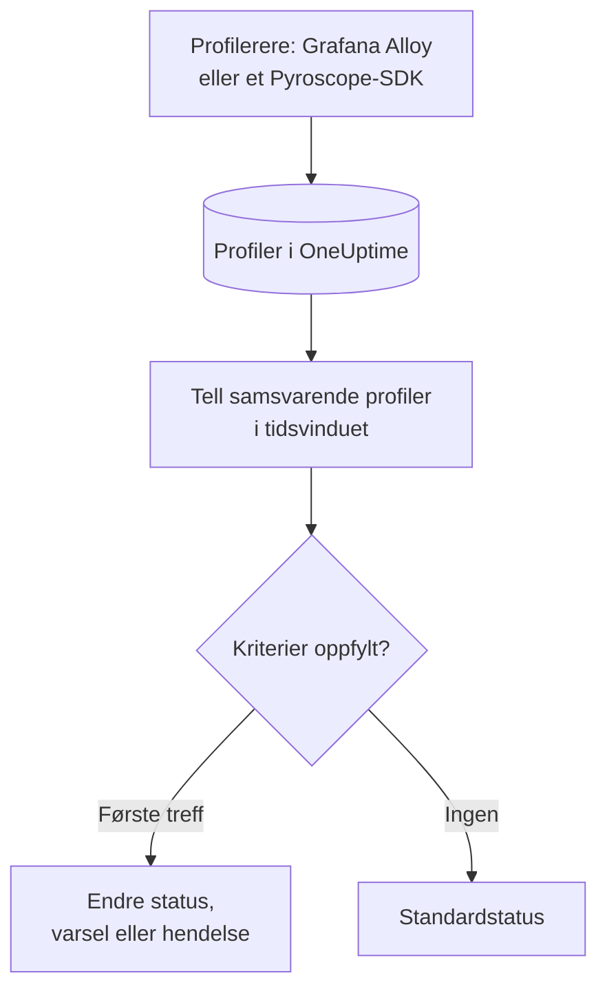

# Profil-overvåking

En profilmonitor teller innenfor et tidsvindu de kontinuerlige profilene tjenestene dine sender til OneUptime som samsvarer med filtrene dine (profiltype, tjeneste, attributter). Når antallet oppfyller kriteriene dine, endrer den monitorens status, oppretter et varsel eller erklærer en hendelse. Den brukes mest til å oppdage når profileringsdata slutter å komme fra en tjeneste.

> [!IMPORTANT]
> **Opprett monitor** i dashbordet tilbyr ikke Profiles: det finnes ennå ikke noe skjema for filtrene. Opprett en profilmonitor via [API-et](/docs/api-reference/api-reference) eller [Terraform](/docs/terraform/monitor-steps) som beskrevet nedenfor. Når den finnes, kan du se og redigere kriteriene på monitorens side **Kriterier** i dashbordet; filtrene kan bare endres via API-et eller Terraform.

:::cards
- [Opprett monitoren](#opprett-en-profilmonitor): Konfigurasjonen du sender via API-et eller Terraform.
- [Hva den spør etter](#hva-den-spør-etter): Profiltyper, tjenester, attributter og vinduet.
- [Kriterier](#kriterier): Vilkårene du kan bruke.
- [Gjennomgått eksempel](#gjennomgått-eksempel-profiler-slutter-å-komme): Få vite når en tjeneste slutter å sende profiler.
:::

## Slik fungerer det



Hvert minutt teller OneUptime profilene som samsvarer med monitorens filtre og startet innenfor tidsvinduet. Antallet sammenlignes med monitorens kriterier fra topp til bunn, og det første kriteriet som samsvarer, avgjør hva som skjer. Når ingen samsvarer, går monitoren tilbake til standardstatusen sin.

## Før du starter

- Tjenestene dine sender kontinuerlige profileringsdata til OneUptime via Grafana Alloy (eBPF) eller et Pyroscope-SDK. Se [Kontinuerlig profilering](/docs/telemetry/profiles).
- Du har enten en API-nøkkel som kan opprette monitorer, eller OneUptimes Terraform-provider satt opp.
- Du kjenner ID-en til hver telemetritjeneste som skal overvåkes, og profiltypene den sender, som `cpu`, `wall`, `alloc_objects`, `alloc_space` eller `goroutine`.

## Opprett en profilmonitor

:::steps
### Velg hva som skal telles

Skriv trinnets `profileMonitor`-konfigurasjon. Denne teller CPU-profiler fra én tjeneste over de siste fem minuttene:

```json
{
  "profileMonitor": {
    "telemetryServiceIds": [],
    "profileTypes": ["cpu"],
    "profileType": "",
    "attributes": {},
    "lastXSecondsOfProfiles": 300
  }
}
```

Legg tjenestens ID i `telemetryServiceIds`, eller la listen stå tom for å telle profiler fra alle tjenester. [Hva den spør etter](#hva-den-spør-etter) beskriver hvert felt.

### Opprett monitoren

Opprett via [API-et](/docs/api-reference/api-reference) eller [Terraform](/docs/terraform/monitor-steps) en monitor med monitortypen `Profiles` og et trinn som inneholder denne konfigurasjonen og minst ett kriterium. I Terraform sender du konfigurasjonen som trinnets attributt `profile_monitor`, skrevet med `jsonencode()`.

### Sjekk den i dashbordet

Åpne monitoren fra **Monitorer**. Den første evalueringen kjøres innen ett minutt, og statusen endres så snart et kriterium samsvarer.
:::

## Hva den spør etter

| Felt | Hva det samsvarer med | Standard |
| --- | --- | --- |
| `profileTypes` | Profiler av en av disse typene, sammenlignet nøyaktig, som `cpu`. | Tom: alle typer |
| `profileType` | Profiler der typen inneholder denne teksten, uten forskjell på store og små bokstaver. Når den er angitt, ignoreres `profileTypes`. | Tom |
| `telemetryServiceIds` | Profiler fra en av disse telemetritjenestene. | Tom: alle tjenester |
| `entityKeys` | Profiler fra en av disse vertene, podene, containerne og andre infrastrukturentitetene. | Tom: alle entiteter |
| `attributes` | Profiler der attributtene har disse verdiene. | Tom: ingen vilkår |
| `lastXSecondsOfProfiles` | Profiler som startet innenfor så mange sekunder før evalueringen. | Ingen: angi den alltid, ellers telles hver lagrede profil, og antallet faller aldri til 0 |

Alle filtrene du angir, må samsvare for at en profil skal telles.

## Slik evalueres den

- **Hvert minutt.** En profilmonitor sjekkes ikke av sonder, så den har ikke noe intervall å angi og ingen side **Sonder og intervall**.
- **Ett tall per evaluering.** Monitoren teller profilene som samsvarer med alle filtre og startet innenfor `lastXSecondsOfProfiles`. En profilerer laster opp med et fast intervall, så gi vinduet plass til flere opplastinger.
- **Ingen profiler er et antall på 0.** En tjeneste der profilereren slutter å laste opp, gir 0.
- **OneUptimes eget nedetid er ikke stillhet.** Så lenge tidsvinduet inneholder tid da OneUptime selv ikke mottok data (det startet på nytt, ble oppgradert eller tok igjen et etterslep), venter sjekken: statusen endres ikke, og ingen hendelse eller varsel åpnes eller løses. Se [Når OneUptime ikke mottar data](/docs/monitor/when-oneuptime-is-not-receiving).
- **Kriterier fra topp til bunn.** Det første kriteriet som samsvarer, avgjør, så legg det mest alvorlige øverst.

Hver statusendring registreres med årsaken på monitorens **Statustidslinje**.

## Kriterier

Kriteriene til en profilmonitor har ett filter, **Profile Count**: antallet profiler som samsvarte i vinduet. Sammenlign det med en verdi:

| Filtervilkår | Samsvarer når antallet profiler er… |
| --- | --- |
| **Greater Than** | over verdien |
| **Greater Than Or Equal To** | lik verdien eller høyere |
| **Less Than** | under verdien |
| **Less Than Or Equal To** | lik verdien eller lavere |
| **Equal To** | nøyaktig verdien |
| **Not Equal To** | alt annet enn verdien |

Antall profiler har ingen avviksvilkår: det finnes ingen grunnlinje å sammenligne dem med.

## Gjennomgått eksempel: profiler slutter å komme

Checkout-tjenesten kjører et Pyroscope-SDK som laster opp CPU-profiler. Du vil ha en hendelse når de uteblir i fem minutter:

- `profileTypes`: `["cpu"]`, `telemetryServiceIds`: checkout-tjenesten, `lastXSecondsOfProfiles`: `300`
- Kriterium 1: **Profile Count** **Equal To** `0`: sett monitoren som frakoblet og erklær en hendelse
- Kriterium 2: **Profile Count** **Greater Than** `0`: sett monitoren som tilkoblet

Mens SDK-et laster opp, teller hver evaluering noen profiler, og kriterium 2 holder monitoren tilkoblet. Når tjenesten rulles ut uten SDK-et, faller antallet til 0 fem minutter etter den siste opplastingen, kriterium 1 samsvarer, og hendelsen erklæres. Den første opplastingen etter rettingen bringer antallet over 0 igjen, og hendelsen løser seg selv hvis **Løs hendelse automatisk** er slått på for den.

## Feilsøking

:::details Monitoren teller 0, men profiler vises i OneUptime
Sammenlign filtrene med profilene du ser: `profileTypes` må samsvare nøyaktig med typen, og `telemetryServiceIds` må inneholde de riktige tjeneste-ID-ene. En kort `lastXSecondsOfProfiles` kan også falle mellom to opplastinger.
:::

:::details Profiles mangler i Opprett monitor
Det er forventet: dashbordet har ennå ikke noe skjema for filtrene til en profilmonitor. Opprett den via API-et eller Terraform som beskrevet i [Opprett en profilmonitor](#opprett-en-profilmonitor).
:::

## Neste steg

:::cards
- [Kontinuerlig profilering](/docs/telemetry/profiles): Send profiler fra Grafana Alloy eller et Pyroscope-SDK.
- [Monitortrinn](/docs/terraform/monitor-steps): Send trinnets konfigurasjon fra Terraform.
- [Trase-overvåking](/docs/monitor/traces-monitor): Bli varslet om mislykkede spans.
- [Metrikk-overvåking](/docs/monitor/metrics-monitor): Bli varslet om CPU, minne og andre metrikker.
:::
