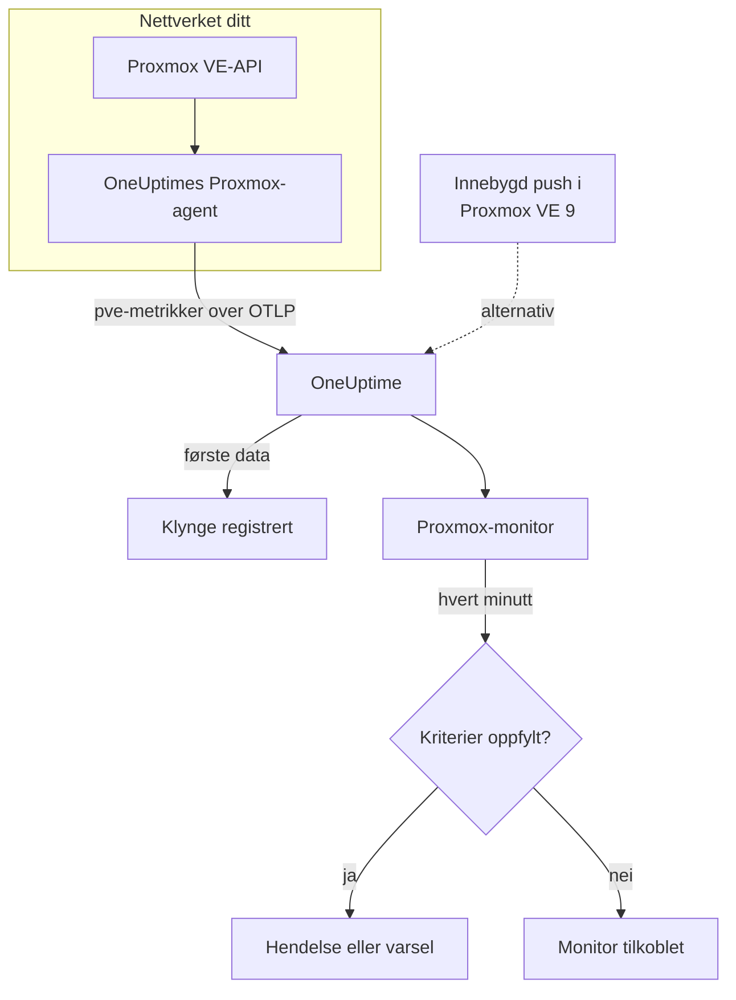

# Proxmox-overvåking

En Proxmox-monitor overvåker én Proxmox VE-klynge – nodene, VM-ene og LXC-containerne, lagringen, HA-tilstanden, dekningen av sikkerhetskopijobber og lagringsreplikeringen – og sier fra når en node blir frakoblet, en gjest stopper eller lagringen fylles opp. Den leser metrikkene `pve_*` som OneUptimes Proxmox-agent samler inn, så ingenting undersøkes utenfra.

:::cards
- [Opprett monitoren](#opprett-en-proxmox-monitor): Seks trinn i dashbordet.
- [Maler](#ferdige-varslingsmaler): Elleve ferdige varsler, én hendelse per node, gjest eller volum.
- [Ressursidentitet](#ressursidentitet): Slik treffer du én node, gjest eller ett lagringsvolum.
- [Metrikker](#innsamlede-metrikker): Hver serie `pve_*` monitoren kan varsle på.
:::

## Slik fungerer det

OneUptimes Proxmox-agent kjører på en maskin som kan nå Proxmox VE-API-et. Hvert 30. sekund henter den data fra prometheus-pve-exporter med klynge- og nodeinnsamlerne, merker hver serie med ressursen den beskriver, og sender metrikkene til OneUptime over OTLP, stemplet med klyngens navn, `proxmox.cluster.name`. De første dataene registrerer klyngen. Proxmox VE 9 og nyere kan i stedet pushe metrikker selv, uten å installere noe; se [det innebygde pushet](#det-innebygde-pushet-i-proxmox-ve).

En Proxmox-monitor er knyttet til én klynge. Hvert minutt kjører den spørringen sin over klyngens metrikker og sammenligner resultatet med kriteriene sine.

## Før du begynner

- **Installer Proxmox-agenten** et sted der den kan nå Proxmox VE-API-et, med et skrivebeskyttet API-token. [Veiledningen for Proxmox-agenten](/docs/telemetry/proxmox) dekker tokenet, installasjonen og det innebygde pushet.
- **Kontroller at klyngen er registrert.** Den vises under **Produkter → Infrastruktur → Proxmox → Alle klynger**, oppkalt etter agentens `PROXMOX_CLUSTER_NAME`, omtrent et minutt etter den første innsamlingen.

## Opprett en Proxmox-monitor

:::steps
### Start en ny monitor

Gå til **Monitorer** og klikk på **Opprett monitor**.

### Velg Proxmox

Klikk på **Flere monitortyper** under **Monitortype**, og velg **Proxmox** under **Infrastruktur**, eller skriv `proxmox` i søkefeltet. Skriv inn et **Navn** – det brukes i titler på hendelser og varsler – og klikk på **Neste**.

### Velg klyngen

Velg klyngen i **Proxmox Cluster** under **Proxmox Monitor Configuration**. Hver klynge som har sendt data, står i listen.

### Velg hva som skal overvåkes

Velg en av de tre fanene:

- **Quick Setup** – klikk på en [mal](#ferdige-varslingsmaler). Den angir metrikkene, filtrene, aggregeringen, tidsintervallet og tersklene, og erstatter kriteriene nedenfor med sine egne. Du kan fortsatt endre **Tidsintervall**.
- **Custom Metric** – velg én metrikk i **Proxmox Metric**, og angi deretter **Aggregering** og **Tidsintervall**. [Filtrene](#monitorinnstillinger) snevrer den inn til én type ressurs eller til én ressurs.
- **Avansert** – bygg spørringer og formler selv under **Velg målinger**, for eksempel en minneprosent fra `pve_memory_usage_bytes / pve_memory_size_bytes`. Bruk **Group by** `id` for å vurdere hver ressurs for seg.

### Kontroller kriteriene

Åpne hvert kriterium under **Monitorkriterier** og kontroller **Metrikk**, **Aggregering**, **Betingelse** og **Threshold**. En mal fyller inn disse. Med **Custom Metric** eller **Avansert** starter monitoren med [standardkriteriene](#standardkriterier), som bare merker at en metrikk faller til null, så angi din egen terskel.

### Opprett monitoren

Klikk på **Opprett monitor**. OneUptime åpner monitorens side og evaluerer den hvert minutt. Hendelser og varsler den åpner, vises også på klyngens sider **Hendelser** og **Varsler**.
:::

> [!TIP]
> For å sette opp flere maler samtidig åpner du klyngen fra **Produkter → Infrastruktur → Proxmox** og går til **Recommendations**. Velg malene du vil ha og hvem som skal varsles, så oppretter OneUptime én monitor per mal.

## Monitorinnstillinger

| Felt | Fane | Hva det gjør |
| --- | --- | --- |
| **Proxmox Cluster** | Alle | Påkrevd. Avgrenser hver spørring til `resource.proxmox.cluster.name`. |
| **Ressursomfang** | Custom Metric, Avansert | Valgfritt. **Node**, **Guest (VM / container)**, **Lagring** eller **Klynge** – et nøyaktig samsvar med `pve.scope`. |
| **PVE ID** | Custom Metric, Avansert | Valgfritt. Nøyaktig samsvar med `pve.id`: et nodenavn (`pve1`), en VMID (`100`) eller `<node>/<storage>` (`pve1/local`). Kombiner det med et omfang for å treffe én ressurs. |
| **Nodenavn** | Custom Metric, Avansert | Valgfritt. Bare en nodes egne serier (`pve.scope = node` og `pve.id`). Det kan ikke velge gjestene eller lagringen på den noden. |
| **Guest ID** | Custom Metric, Avansert | Valgfritt. Nøyaktig samsvar med den rå etiketten `id`, for eksempel `qemu/100` eller `lxc/101`. Når den er angitt, ignoreres de andre filtrene. |
| **Proxmox Metric** | Custom Metric | Én metrikk fra [katalogen](#innsamlede-metrikker). |
| **Aggregering** | Custom Metric | Hvordan målinger kombineres: **Gjennomsnitt**, **Maksimum**, **Minimum**, **Sum** eller **Antall**. Starter på metrikkens vanlige aggregering. |
| **Tidsintervall** | Alle | Det glidende vinduet spørringen leser, fra **Past 1 Minute** til **Past 365 Days**. En ny monitor starter på **Past 1 Minute**; maler angir sitt eget. |
| **Velg målinger** | Avansert | Spørringsbyggeren: **Metrikk**, **Aggregate by**, **Filter by attributes**, **Group by**, pluss **Legg til metrikk** og **Legg til formel** for å kombinere spørringer. |

## Ressursidentitet

Hver serie bærer en datapunktetikett `id` som navngir Proxmox-ressursen den tilhører:

| Verdi av `id` | Ressurs |
| --- | --- |
| `node/<name>` | En klyngenode, for eksempel `node/pve1`. |
| `qemu/<vmid>` | En virtuell QEMU-maskin, for eksempel `qemu/100`. |
| `lxc/<vmid>` | En LXC-container, for eksempel `lxc/101`. |
| `storage/<node>/<storage>` | Et lagringsvolum på en node, for eksempel `storage/pve1/local`. |

To unntak: replikeringsserier (`pve_replication_*`) bærer replikerings-**jobbens** id i `id` (for eksempel `100-0`), og den klyngeomfattende `pve_not_backed_up_total` har ingen `id` i det hele tatt.

Filtre samsvarer på likhet, ikke på et prefiks, så agenten deler også `id` i tre attributter du kan filtrere på. Malene bygger på dem:

| Attributt | Verdier | For `qemu/100` |
| --- | --- | --- |
| `pve.scope` | `node`, `guest`, `storage`, `cluster` (`qemu` og `lxc` er begge `guest`) | `guest` |
| `pve.type` | `node`, `qemu`, `lxc`, `storage` | `qemu` |
| `pve.id` | Alt etter den første `/` i `id` (`pve1`, `100`, `pve1/local`) | `100` |

Filtrer på `pve.scope` eller `pve.type` for én type ressurs, på `pve.id` eller `id` for én ressurs, og grupper etter `id` for å vurdere hver ressurs for seg.

## Ferdige varslingsmaler

**Quick Setup** tilbyr 11 maler. Hver bygger en komplett monitor – spørringer, attributtfiltre, en gruppering, et kriterium som utløses, og et som gjenoppretter. De fleste grupperer etter `id`, så hver node, gjest, hvert volum eller hver jobb får sin egen hendelse og sitt eget varsel. Tersklene er utgangspunkter du kan redigere.

Malene leser de siste 5 minuttene med mindre tabellen sier noe annet. Et kriterium utløses bare når betingelsen gjelder i hvert minutt av vinduet, og et terskelkriterium gjenoppretter 10 % forbi terskelen, slik at en verdi som svever ved grensen, ikke blafrer.

| Mal | Alvorlighetsgrad | Overvåker | Utløses når | Gjenoppretter når |
| --- | --- | --- | --- | --- |
| Node Offline | Kritisk | `pve_up` for `pve.scope = node`, Min per `id` | Under 1 | På 1 |
| Guest Down | Warning | `pve_up` og `pve_onboot_status` for `pve.scope = guest`, Min per `id` | `pve_up` er under 1 mens `pve_onboot_status` er 1 | `pve_up` er tilbake på 1, eller start ved oppstart er slått av |
| Cluster Quorum at Risk | Kritisk | `pve_up` ÷ `pve_node_info` × 100 for `pve.scope = node` (begge Sum): andelen noder som er tilkoblet | 50 % eller mindre | Over 55 % |
| High Node CPU Usage | Warning | `pve_cpu_usage_ratio` for `pve.scope = node`, Avg per `id` | Over 0,9 (90 % av nodens kjerner) | På eller under 0,81 |
| High Node Memory Usage | Warning | `pve_memory_usage_bytes` ÷ `pve_memory_size_bytes` × 100 for `pve.scope = node`, per `id` | Over 85 % | På eller under 76,5 % |
| High Guest CPU Usage | Warning | `pve_cpu_usage_ratio` for `pve.scope = guest`, Avg per `id`, siste 15 minutter | Over 0,95 (95 % av dens vCPU-er) i alle 15 minuttene | På eller under 0,855 |
| Storage Near Full | Warning | `pve_disk_usage_bytes` ÷ `pve_disk_size_bytes` × 100 for `pve.scope = storage`, per `id` | Over 85 % | På eller under 76,5 % |
| Container Root Disk Near Full | Warning | Det samme diskforholdet for `pve.type = lxc`, per `id` | Over 90 % | På eller under 81 % |
| HA Resource in Error State | Kritisk | `pve_ha_state` for `state = error`, Max per `id` | Over 0 | På 0 |
| Guest Not Backed Up | Warning | `pve_not_backed_up_total`, Max (én klyngeomfattende serie) | Over 0 | På 0 |
| Replication Failing | Kritisk | `pve_replication_failed_syncs`, Max per `id` (jobb-id-en) | Over 0 | På 0 |

**Alvorlighetsgrad** er etiketten velgeren viser. Hendelsen og varselet en mal oppretter, starter på prosjektets mest alvorlige hendelses- og varslingsgrad; endre dem i kriteriene.

- **Nedemalene bruker Minimum**, så én innsamling der ressursen var nede, utløser dem i stedet for å skjules av innsamlinger der den kjørte.
- **Guest Down** ser bare på gjester som er satt til å starte ved oppstart, så en gjest du har stoppet med vilje, varsler aldri noen.
- **Cluster Quorum at Risk** er en tilnærming: pve-exporter har ingen corosync-metrikk, så malen teller nodene som er tilkoblet.
- **High Guest CPU Usage** ligger høyere og reagerer tregere enn nodemalen: en gjest er ment å bruke vCPU-ene sine, så bare en som aldri går ned igjen, varsler noen.
- **Forholdsformler** tar **Sum** av begge sider. Begge kommer fra samme innsamling, så resultatet er en ekte prosent.
- **Container Root Disk Near Full** utelater QEMU-VM-er: diskbruken deres viser 0 uten QEMU-gjesteagenten.
- **Guest Not Backed Up** dekker bare medlemskap i sikkerhetskopijobber. pve-exporter sier ikke om sikkerhetskopier kjørte eller lyktes; grupper `pve_not_backed_up_info` etter `id` for å liste gjestene.
- **Foreldet replikering** (nå minus den siste synkroniseringen) kan det ikke varsles på, fordi kriterier ikke kan regne med klokken. Klyngens side **Oversikt** viser det; varsle i stedet med **Replication Failing**.

### Det innebygde pushet i Proxmox VE

Proxmox VE 9 og nyere kan pushe metrikker gjennom den innebygde OpenTelemetry-metrikkserveren, uten å installere noe – se [veiledningen for Proxmox-agenten](/docs/telemetry/proxmox). OneUptime gjør pushet om til de samme seriene `pve_*`, så katalogen og malene for CPU, minne og lagring virker med det.

**Node Offline** og **Cluster Quorum at Risk** virker også: hver node pusher bare sin egen status, så en node som slutter å rapportere, meldes nede (`pve_up` = 0) av nodene som fortsatt lever – se [Når en node slutter å rapportere](/docs/telemetry/proxmox#when-a-node-stops-reporting). **Guest Down**, **HA Resource in Error State**, **Guest Not Backed Up** og **Replication Failing** trenger data som bare agenten samler inn.

## Innsamlede metrikker

Agenten henter data fra prometheus-pve-exporter hvert 30. sekund med både klynge- og nodeinnsamlerne, noe som også dekker exporterens innsamlere `backup-info` og `replication` (begge på som standard).

### Tilgjengelighet

| Metrikk | Enhet | Beskrivelse |
| --- | --- | --- |
| `pve_up` | — | 1 når noden eller gjesten er oppe eller kjører, ellers 0. |
| `pve_uptime_seconds` | sekunder | Oppetid for noden eller gjesten. |
| `pve_version_info` | antall | Proxmox VE-utgivelsen, i etikettene. Alltid 1. |

### Node

| Metrikk | Enhet | Beskrivelse |
| --- | --- | --- |
| `pve_node_info` | antall | Nodemetadata, alltid 1. Summer den for å telle nodene som rapporterer. |
| `pve_cpu_usage_ratio` | forhold | CPU i bruk som et forhold på 0–1 av tilgjengelig CPU. |
| `pve_cpu_usage_limit` | kjerner | Tilgjengelig CPU, i kjerner. For en gjest dens vCPU-er. |
| `pve_memory_usage_bytes` | byte | Minne i bruk. |
| `pve_memory_size_bytes` | byte | Totalt minne. |

CPU- og minneseriene rapporteres også for hver gjest, på id-ene `qemu/*` og `lxc/*`.

### Gjest

| Metrikk | Enhet | Beskrivelse |
| --- | --- | --- |
| `pve_guest_info` | antall | Gjestemetadata (navn, node, type `qemu` eller `lxc`) i etiketter. Alltid 1. |
| `pve_network_receive_bytes` | byte | Byte mottatt av gjesten. En teller over hele levetiden. |
| `pve_network_transmit_bytes` | byte | Byte sendt av gjesten. En teller over hele levetiden. |
| `pve_disk_read_bytes` | byte | Byte lest fra disk av gjesten. En teller over hele levetiden. |
| `pve_disk_write_bytes` | byte | Byte skrevet til disk av gjesten. En teller over hele levetiden. |
| `pve_onboot_status` | antall | 1 når gjesten starter ved nodens oppstart. En stoppet gjest med denne innstillingen er som regel uplanlagt nedetid. |

### Lager

| Metrikk | Enhet | Beskrivelse |
| --- | --- | --- |
| `pve_disk_usage_bytes` | byte | Brukte byte på disken eller lagringen. For en QEMU-gjest viser den 0 med mindre QEMU-gjesteagenten er installert. |
| `pve_disk_size_bytes` | byte | Total størrelse på disken eller lagringen. |
| `pve_storage_info` | antall | Lagringsmetadata, alltid 1. Summer den for å telle lagringsvolumer. |

### HA

| Metrikk | Enhet | Beskrivelse |
| --- | --- | --- |
| `pve_ha_state` | — | Én serie per HA-tilstand (`started`, `stopped`, `error`, …) for hver HA-ressurs, 1 på gjeldende tilstand. Filtrer på etiketten `state` for å varsle på en tilstand. |

### Sikkerhetskopi

Fra exporterens innsamler `backup-info` på klyngenivå. De rapporterer bare dekning av sikkerhetskopi-**jobber**:

| Metrikk | Enhet | Beskrivelse |
| --- | --- | --- |
| `pve_not_backed_up_total` | antall | Gjester som ikke er med i noen sikkerhetskopijobb. Én klyngeomfattende serie uten `id`. |
| `pve_not_backed_up_info` | antall | Én serie per udekket gjest, alltid 1, merket med gjestens `id`. Den forsvinner så snart gjesten blir med i en sikkerhetskopijobb. |

### Replikering

Fra exporterens innsamler `replication` på nodenivå. Seriene finnes bare når klyngen har replikeringsjobber, og bærer jobb-id-en i `id`:

| Metrikk | Enhet | Beskrivelse |
| --- | --- | --- |
| `pve_replication_failed_syncs` | antall | Mislykkede synkroniseringsforsøk på rad. Over 0 betyr at replikaen er i ferd med å bli foreldet. |
| `pve_replication_duration_seconds` | sekunder | Hvor lang tid den siste synkroniseringen tok. |
| `pve_replication_last_sync_timestamp_seconds` | sekunder | Unix-tid for den siste **vellykkede** synkroniseringen. |
| `pve_replication_last_try_timestamp_seconds` | sekunder | Unix-tid for det siste **forsøket**. Nyere enn den siste synkroniseringen betyr at det siste forsøket mislyktes. |
| `pve_replication_next_sync_timestamp_seconds` | sekunder | Unix-tid for den neste planlagte synkroniseringen. |
| `pve_replication_info` | antall | Jobbmetadata – type, kilde, mål, gjest – i etiketter. Alltid 1. |

## Overvåkingskriterier

Et kriterium sammenligner en av monitorens spørringer eller formler med en terskel. Kriteriene til en Proxmox-monitor har ingen **Filtertype**: hver regel kontrollerer metrikkverdien, med disse feltene.

| Felt | Hva det gjør |
| --- | --- |
| **Metrikk** | Spørringen eller formelen som kontrolleres, etter variabelnavnet. |
| **Aggregering** | Hvordan verdiene i vinduet blir til ett svar: **Gjennomsnitt**, **Sum**, **Maximum Value**, **Minimum Value**, **All Values** (hver verdi må samsvare) eller **Any Value** (én er nok). |
| **Betingelse** | **Greater Than**, **Less Than**, **Greater Than Or Equal To**, **Less Than Or Equal To** eller **Equal To** – eller en avviksbetingelse: **Anomalously High**, **Anomalously Low** eller **Anomalous**. |
| **Threshold** | Verdien det sammenlignes med. En liste over enheter står ved siden av når metrikken har en enhet. Vises ikke for avviksbetingelser. |
| **Følsomhet** | Bare avviksbetingelser. **Lav** (4σ), **Middels** (3σ, standard) eller **Høy** (2σ). |
| **Grunnlinjevindu** | Bare avviksbetingelser. 14 dager (standard), 28, 60 eller 90 dager med historikk. |
| **Hvis ingen data** | Under **Flere felt**. Hva som skjer når vinduet ikke har noen målinger: **Ignore** (standard), **Treat As Zero** eller **Trigger**. |

Avviksbetingelser sammenligner hver verdi med samme time i uken i grunnlinjen. De blir værende i en «Learning»-tilstand og gir ingenting før grunnlinjevinduet inneholder nok historikk.

Hvert kriterium sier også hva som skal skje når det samsvarer: endre monitorstatusen, opprette et varsel eller erklære en hendelse. Kriterier kontrolleres ovenfra og ned, og det første som samsvarer, avgjør.

### Standardkriterier

En monitor du ikke bygger fra en mal, starter med to kriterier:

| Rekkefølge | Kriterium | Samsvarer når | Deretter |
| --- | --- | --- | --- |
| 1 | Check if _monitor name_ is offline | En hvilken som helst verdi i den første spørringen er `0` | Markerer monitoren som **Frakoblet** og erklærer hendelsen «_monitor name_ is offline», som løser seg selv når monitoren kommer seg. |
| 2 | Check if _monitor name_ is online | En hvilken som helst verdi er over `0` | Markerer monitoren som **I drift**. |

> [!IMPORTANT]
> Stillhet samsvarer med ingen av kriteriene: en klynge som slutter å sende data, etterlater monitoren slik den var. For å få beskjed når data stopper, setter du **Hvis ingen data** til **Trigger** på et kriterium. Tid der OneUptime selv ikke mottok data, er aldri manglende data: en kontroll der vinduet inneholder slik tid, venter i stedet, slik [Når OneUptime ikke mottar data](/docs/monitor/when-oneuptime-is-not-receiving) forklarer.

## Feilsøking

:::details Klyngen står ikke i listen Proxmox Cluster
Klynger registrerer seg selv fra agentens data. Kontroller at agenten kjører og sender data (se [veiledningen for Proxmox-agenten](/docs/telemetry/proxmox)), og at `PROXMOX_CLUSTER_NAME` er angitt.
:::

:::details Gjestemetrikker mangler
Gjesteserier kommer fra exporterens klyngeinnsamler, som den medfølgende konfigurasjonen slår på med innsamlingsparameteren `cluster=1`. Hvis du har endret innsamlerkonfigurasjonen, gjenoppretter du den.
:::

:::details High Node CPU Usage utløses aldri
Malen tar gjennomsnittet av `pve_cpu_usage_ratio` per `id`, så hver node kontrolleres for seg. Hvis du har bygget din egen spørring, grupperer du den etter `id`: et gjennomsnitt over alle noder trekkes ned av de inaktive.
:::

:::details Node Offline fortsetter å utløses for en node du har fjernet fra klyngen
Med det innebygde pushet i Proxmox VE ser en node som er tatt ut av klyngen, lik ut som en som har gått ned: den sluttet å rapportere, så nodene som fortsatt lever, fortsetter å melde den nede. Åpne nodens side og klikk på **Remove Node** – noden forsvinner, og varselet løses. Ellers forblir den frakoblet i opptil 7 dager. Agenten har ikke dette problemet: den spør klyngen, som ikke lenger viser noden.
:::

:::details Sikkerhetskopi- eller replikeringsmetrikker mangler
`pve_not_backed_up_*` kommer fra exporterens innsamler `backup-info` og `pve_replication_*` fra innsamleren `replication`. Begge er på som standard og dekkes av innsamlingsparameterne `cluster=1` og `node=1` i den medfølgende konfigurasjonen. Hvis du kjører din egen exporter, kontrollerer du at du ikke har slått dem av. `pve_replication_*` finnes bare når klyngen har jobber for lagringsreplikering.
:::

:::details Tellere som pve_network_receive_bytes bare vokser
Serier for nettverks- og disk-I/O er tellere over hele levetiden, og kriterier sammenligner rå verdier: det finnes ingen rateoperator, og **Convert to per-second rate** i spørringsbyggeren endrer bare diagrammet. Vis dem som en rate i et diagram, eller varsle på veksten med en formel, for eksempel en **Maksimum**-spørring minus en **Minimum**-spørring på samme teller.
:::

## Neste trinn

:::cards
- [Proxmox-agent](/docs/telemetry/proxmox): Installer agenten, eller sett opp det innebygde pushet.
- [Ceph-overvåking](/docs/monitor/ceph-monitor): Overvåk Ceph-lagringen bak en Proxmox-klynge.
- [VMware-overvåking](/docs/monitor/vmware-monitor): Samme type monitor for vSphere.
- [Hendelser – Oversikt](/docs/incidents/index): Hva som skjer etter at et kriterium har erklært en hendelse.
:::
