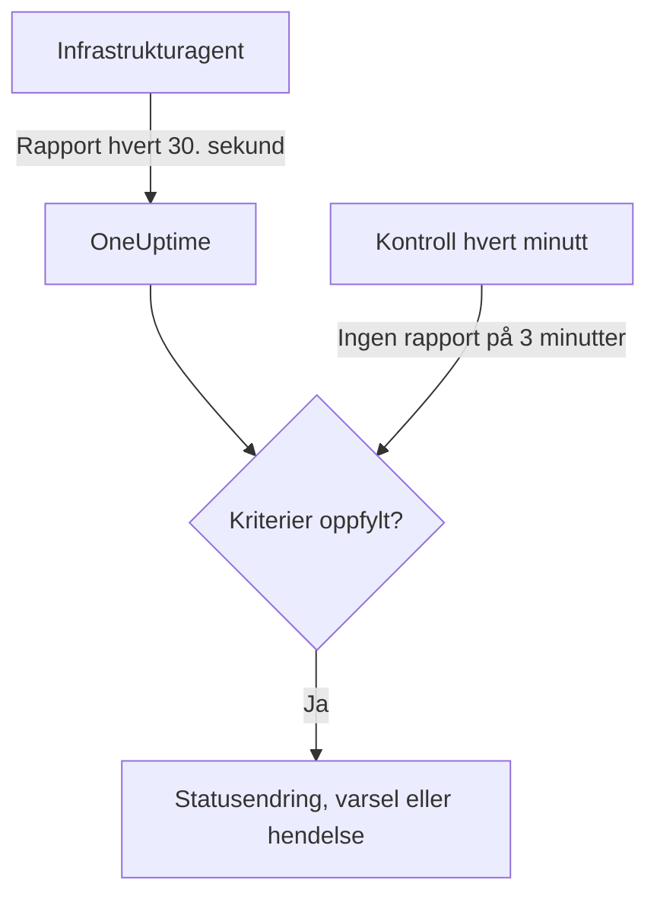

# Server- / VM-overvåking

En Server- / VM-monitor overvåker én maskin gjennom OneUptimes infrastrukturagent (`oneuptime-infrastructure-agent`), en liten tjeneste som hvert 30. sekund rapporterer CPU, minne, disker, belastning, nettverk og kjørende prosesser til OneUptime. Denne siden viser hvordan du kobler agenten til en Server- / VM-monitor, hva agenten rapporterer, og hvordan du skriver kriteriene som avgjør når serveren er tilkoblet eller frakoblet.

> [!IMPORTANT]
> **Opprett monitor** tilbyr ikke lenger **Server / VM**. Server- / VM-monitorer du allerede har, fortsetter å virke, og alt på denne siden gjelder for dem. For å overvåke en ny server oppretter du i stedet en [vertsmonitor](/docs/monitor/host-monitor): den varsler på vertsmetrikkene som [OpenTelemetry-collectoren på verten](/docs/telemetry/host-otel-collector) sender.

:::cards
- [Koble til agenten](#koble-til-agenten): Installer den, gi den monitorens hemmelige nøkkel og start den.
- [Hva agenten rapporterer](#hva-agenten-rapporterer): CPU, minne, disker, belastning, nettverk og prosesser.
- [Overvåkingskriterier](#overvåkingskriterier): Avgjør når serveren regnes som tilkoblet eller frakoblet.
- [Feilsøking](#feilsøking): Agenten rapporterer ikke, eller monitoren blir aldri frakoblet.
:::

## Slik fungerer det

Agenten kjører som en systemtjeneste. Hvert 30. sekund samler den en rapport og sender den til OneUptime-URL-en din, signert med monitorens hemmelige nøkkel. OneUptime lagrer tallene som monitorens metrikker og holder rapporten opp mot monitorens kriterier.

Stillhet kontrolleres for seg. Hvert minutt evaluerer OneUptime på nytt **Is Online**-kriteriene for hver Server- / VM-monitor som ikke har rapportert på 3 minutter eller mer, og en server som er stille lenger enn kriteriene tillater (3 minutter som standard), regnes som frakoblet. En monitor uten **Is Online**-kriterium blir aldri markert som frakoblet bare fordi agenten ble stille. Bare tid der OneUptime mottok data, teller med i den stillheten: tid der OneUptime selv startet på nytt, ble oppgradert eller tok igjen et etterslep, teller ikke, slik [Når OneUptime ikke mottar data](/docs/monitor/when-oneuptime-is-not-receiving) forklarer.



## Før du begynner

- En Server- / VM-monitor i prosjektet ditt.
- Tillatelse til å redigere monitorer. Den hemmelige nøkkelen, og oppsettkommandoene som inneholder den, vises bare for dem som kan redigere monitorer.
- Root-tilgang (Linux, macOS) eller administratortilgang (Windows) på serveren. Agenten installerer seg selv som en systemtjeneste.
- Utgående HTTPS fra serveren til OneUptime-URL-en din, direkte eller gjennom en HTTP-proxy.

## Koble til agenten

Kommandoene nedenfor bruker `https://oneuptime.com` og `YOUR_SECRET_KEY`. I monitorens egne oppsettkommandoer er OneUptime-URL-en din og monitorens hemmelige nøkkel allerede fylt inn, så kopier dem fra monitoren når du kan.

:::steps
### Åpne monitorens oppsettkommandoer

Gå til **Monitorer**, åpne Server- / VM-monitoren og velg **Dokumentasjon**. Kortene **Set up your Server Monitor (Linux/Mac)** og **Set up your Server Monitor (Windows)** inneholder kommandoene for denne monitoren. Inntil agenten rapporterer første gang, viser også monitorens **Oversikt** dem.

### Installer agenten

:::tabs
@tab Linux
```bash
curl -sSL https://oneuptime.com/docs/static/scripts/infrastructure-agent/install.sh | sudo bash
```
@tab macOS
```bash
curl -sSL https://oneuptime.com/docs/static/scripts/infrastructure-agent/install.sh | sudo bash
```
@tab Windows
1. Last ned agenten fra den [nyeste GitHub-utgivelsen](https://github.com/OneUptime/oneuptime/releases/latest): `oneuptime-infrastructure-agent_windows_amd64.zip` for x64, eller `oneuptime-infrastructure-agent_windows_arm64.zip` for ARM64.
2. Pakk ut zip-filen. Den inneholder `oneuptime-infrastructure-agent.exe`.
3. Åpne **Ledetekst** som administrator i mappen du pakket den ut til.
:::

Installasjonsskriptet laster ned den nyeste utgivelsen for operativsystemet og prosessoren din (x86-64 eller ARM64) og legger binærfilen `oneuptime-infrastructure-agent` i `$HOME/bin`. På en selvhostet installasjon leveres skriptet fra din egen OneUptime-URL.

### Koble den til monitoren

:::tabs
@tab Linux
```bash
sudo oneuptime-infrastructure-agent configure --secret-key=YOUR_SECRET_KEY --oneuptime-url=https://oneuptime.com
```
@tab macOS
```bash
sudo oneuptime-infrastructure-agent configure --secret-key=YOUR_SECRET_KEY --oneuptime-url=https://oneuptime.com
```
@tab Windows
```shell
oneuptime-infrastructure-agent configure --secret-key=YOUR_SECRET_KEY --oneuptime-url=https://oneuptime.com
```
:::

`configure` lagrer den hemmelige nøkkelen og URL-en i agentens konfigurasjonsfil og installerer agenten som en systemtjeneste. Begge flaggene er påkrevd. Erstatt `https://oneuptime.com` med din egen URL på en selvhostet installasjon.

Hvis serveren når internett gjennom en proxy, legger du til `--proxy-url`:

```bash
sudo oneuptime-infrastructure-agent configure --proxy-url=http://proxy.example.com:8080 --secret-key=YOUR_SECRET_KEY --oneuptime-url=https://oneuptime.com
```

### Start agenten

:::tabs
@tab Linux
```bash
sudo oneuptime-infrastructure-agent start
```
@tab macOS
```bash
sudo oneuptime-infrastructure-agent start
```
@tab Windows
```shell
oneuptime-infrastructure-agent start
```
:::

Når agenten starter, kontrollerer den den hemmelige nøkkelen hos OneUptime og sender den første rapporten med en gang.

### Kontroller at den rapporterer

Kjør `sudo oneuptime-infrastructure-agent status` (uten `sudo` på Windows): den skriver ut `Service is running`. I OneUptime slutter monitorens **Oversikt** å vise oppsettkommandoene så snart den første rapporten kommer, og fanen **Målinger** begynner å vise serveren i diagrammer.
:::

## Agentreferanse

### Kommandoer

| Kommando | Hva den gjør |
| --- | --- |
| `configure --secret-key=<key> --oneuptime-url=<url>` | Lagrer innstillingene og installerer agenten som en systemtjeneste. Legg til `--proxy-url=<url>` for å sende rapporter gjennom en proxy. |
| `start` | Starter tjenesten. Den nekter å starte før `configure` er kjørt. |
| `stop` | Stopper tjenesten. |
| `restart` | Starter tjenesten på nytt. |
| `status` | Skriver ut om tjenesten kjører eller er stoppet. |
| `logs` | Skriver ut de siste 100 linjene i agentens logg. `-n <lines>` skriver ut et annet antall linjer, og `-f` følger nye linjer. |
| `uninstall` | Fjerner tjenesten og sletter agentens konfigurasjonsfil. |
| `help` | Viser kommandoene. |

Kjør dem med `sudo` på Linux og macOS, og fra en **Ledetekst** med administratorrettigheter på Windows. For å endre den hemmelige nøkkelen, URL-en eller proxyen for en konfigurert agent kjører du `stop` og `uninstall`, og deretter `configure` og `start` på nytt.

### Filer

| Fil | Linux og macOS | Windows |
| --- | --- | --- |
| Konfigurasjon | `/etc/oneuptime-infrastructure-agent/config.json` | `%PROGRAMDATA%\oneuptime-infrastructure-agent\config.json` |
| Logg | `/var/log/oneuptime-infrastructure-agent/oneuptime-infrastructure-agent.log` | `%PROGRAMDATA%\oneuptime-infrastructure-agent\oneuptime-infrastructure-agent.log` |

Når agenten ikke kan skrive til disse mappene, bruker den i stedet `~/.oneuptime-infrastructure-agent/`. Miljøvariablene `ONEUPTIME_AGENT_CONFIG_PATH` og `ONEUPTIME_AGENT_LOG_PATH` angir hver av banene eksplisitt.

## Hva agenten rapporterer

Hver rapport inneholder serverens vertsnavn og:

| Område | Hva som rapporteres |
| --- | --- |
| CPU | Bruk i %, antall kjerner, bruk per kjerne og tid brukt i user, system, idle, I/O-venting, steal, nice, IRQ og soft-IRQ |
| Minne | Totalt, brukt, ledig og tilgjengelig minne, buffere og hurtigbuffer, bruk i %, og swap totalt, brukt, ledig og bruk i % |
| Disker | For hver montert disk: monteringsbane, enhet, filsystem, total, brukt og ledig plass, bruk i %, leste og skrevne byte og operasjoner, og I/O-tid |
| Belastning | Belastningsgjennomsnitt over 1, 5 og 15 minutter |
| Nettverk | For hvert grensesnitt: sendte og mottatte byte og pakker, feil og forkastede pakker inn og ut; pluss etablerte og lyttende tilkoblinger |
| Vert | Operativsystem, plattform og versjon, kjerneversjon og arkitektur, oppetid, oppstartstidspunkt, virtualisering og antall prosesser |
| Prosesser | Hver kjørende prosess: navn, PID, kommando, CPU i %, minne, status, tråder, bruker og starttidspunkt |

Verdier som operativsystemet ikke leverer, utelates. Monitorens fane **Målinger** viser diagrammer over tilgjengelighet, CPU, minne, diskbruk og disk-I/O, belastningsgjennomsnitt, swap, nettverkstrafikk og -feil, tilkoblinger, oppetid og antall prosesser.

## Overvåkingskriterier

Kriterier avgjør når monitoren er tilkoblet, redusert eller frakoblet, og når den åpner et varsel eller en hendelse. Hvert filter i et kriterium har en **Filtertype**, et **Filtervilkår** og for de fleste typer en verdi.

| Filtertype | Hva den kontrollerer | Filtervilkår |
| --- | --- | --- |
| Is Online | Om agenten har rapportert nylig (som standard de siste 3 minuttene) | Sann, Usann |
| CPU Usage (in %) | Samlet CPU-bruk | Greater Than, Less Than, Greater Than Or Equal To, Less Than Or Equal To |
| Memory Usage (in %) | Minne i bruk | Som for CPU |
| Disk Usage (in %) | Bruk av disken angitt i **Diskbane** | Som for CPU |
| Swap Usage (in %) | Swap i bruk | Som for CPU |
| CPU IO Wait (in %) | Andel av CPU-tiden brukt på å vente på I/O | Som for CPU |
| Load Average (1 minute) | Belastningsgjennomsnitt det siste minuttet | Som for CPU |
| Load Average (5 minute) | Belastningsgjennomsnitt de siste 5 minuttene | Som for CPU |
| Load Average (15 minute) | Belastningsgjennomsnitt de siste 15 minuttene | Som for CPU |
| Server Process Name | Om en prosess med dette navnet kjører (uten forskjell på store og små bokstaver) | Is Executing, Is Not Executing |
| Server Process Command | Om en prosess med nøyaktig denne kommandolinjen kjører (uten forskjell på store og små bokstaver) | Is Executing, Is Not Executing |
| Server Process PID | Om en prosess med denne PID-en kjører | Is Executing, Is Not Executing |

**Diskbane** tar et monteringspunkt eller en enhet, for eksempel `/`, `/mnt/data`, `C:\` eller `/dev/sda1`; tom er den `/`. Skriv inn `*` for å kontrollere hver disk agenten rapporterer: hver disk som krysser terskelen, får sitt eget varsel, slik at en ny disk som fylles opp, ikke skjules bak det åpne varselet for den første.

### Evaluer over en tidsperiode

**Evaluer disse kriteriene over en tidsperiode** er en egen avmerkingsboks i kriterieskjemaet og ikke et filtervilkår. Den finnes for **Is Online** og for hver numerisk filtertype. Slå den på for å sammenligne en aggregert verdi – valgt under **Evaluer** (Gjennomsnitt, Sum, Maximum Value, Minimum Value, All Values, Any Value) over vinduet som **For de siste (i minutter)** angir – i stedet for verdien fra den siste kontrollen. På et **Is Online**-filter er vinduet hvor lenge agenten kan være stille før serveren regnes som frakoblet.

**All Values** samsvarer først når vinduet faktisk er dekket av data. En monitor som nettopp er opprettet, eller en der kontrollene sluttet å bli registrert, har ikke nok historikk til å si noe om de siste N minuttene, så kriteriet venter i stedet for å samsvare på den ene målingen det har. **Any Value** er innstillingen for «si fra så snart én enkelt kontroll overskrider grensen», og den utløses fortsatt umiddelbart.

**Hvis ingen data** styrer hva som skjer mens vinduet ikke kan bære kriteriet:

| Hvis ingen data | Oppførsel | Bruk den til |
| --- | --- | --- |
| **Ignore** (standard) | Kriteriet samsvarer ikke. | Vanlige terskelvarsler. |
| **Trigger** | De manglende dataene behandles som problemet. | Heartbeat-lignende kontroller, der stillhet i seg selv er en feil. |
| **Treat As Zero** | Vinduet sammenlignes som én enkelt null. | Tellere, der «ingen hendelser» faktisk betyr null. |

> [!TIP]
> CPU og belastning har korte topper hele tiden. Evaluer dem over noen minutter med **Gjennomsnitt** eller **All Values** i stedet for å varsle på én enkelt rapport.

### Eksempler på kriterier

| Mål | Filtertype | Filtervilkår | Verdi |
| --- | --- | --- | --- |
| Marker serveren som frakoblet når agenten slutter å rapportere | Is Online | Usann | — |
| Varsle når CPU-bruken er over 90 % | CPU Usage (in %) | Greater Than | `90` |
| Varsle når rotdisken er mer enn 85 % full | Disk Usage (in %), **Diskbane** `/` | Greater Than | `85` |
| Varsle om enhver disk som er mer enn 85 % full, ett varsel per disk | Disk Usage (in %), **Diskbane** `*` | Greater Than | `85` |
| Varsle når minnebruken er over 80 % | Memory Usage (in %) | Greater Than | `80` |
| Varsle når nginx slutter å kjøre | Server Process Name | Is Not Executing | `nginx` |

## Feilsøking

:::details Agenten rapporterer ikke
- Kontroller at tjenesten kjører: `sudo oneuptime-infrastructure-agent status`.
- Les loggen: `sudo oneuptime-infrastructure-agent logs -n 50`. En linje `Metrics successfully pushed to OneUptime server` betyr at rapportene kommer frem.
- Agenten kontrollerer den hemmelige nøkkelen når den starter, og avslutter hvis OneUptime avviser den, med loggmeldingen `Secret key is invalid`. Sammenlign nøkkelen med den på monitorens side **Innstillinger**, under **Tilbakestill hemmelig nøkkel for serverovervåking**.
- Sørg for at serveren kan nå OneUptime-URL-en din over HTTPS, og at ingen brannmur blokkerer utgående tilkoblinger.
:::

:::details `sudo` sier at kommandoen ikke finnes
Installasjonsskriptet legger binærfilen i `$HOME/bin` for brukeren det kjørte som, og skriver ut mappen det brukte. Kjør agenten med full bane, for eksempel `sudo /root/bin/oneuptime-infrastructure-agent configure ...`. For i stedet å installere den i en mappe på systemets bane gir du skriptet `-b`:

```bash
curl -sSL https://oneuptime.com/docs/static/scripts/infrastructure-agent/install.sh | sudo bash -s -- -b /usr/local/bin
```
:::

:::details `start` sier at tjenestekonfigurasjonen ikke ble funnet
`configure` er ikke kjørt, eller `uninstall` har fjernet konfigurasjonen. Kjør `configure` med den hemmelige nøkkelen og URL-en, og deretter `start`.
:::

:::details Monitoren blir aldri frakoblet når serveren er nede
Bare et **Is Online**-kriterium markerer en stille server som frakoblet. Legg til et med **Filtervilkår** satt til **Usann**, og angi monitorstatusen det endrer til.
:::

:::details Rapportene kommer ikke gjennom proxyen
- Kontroller proxy-URL-en og porten du ga til `--proxy-url`.
- Sørg for at proxyen tillater tilkoblinger til OneUptime-URL-en din.
- For å endre proxyen kjører du `stop` og `uninstall`, deretter `configure` med den nye `--proxy-url`, og `start`.
:::

## Neste trinn

:::cards
- [Verts-overvåking](/docs/monitor/host-monitor): Monitoren for nye servere, bygget på OpenTelemetry-vertsmetrikker.
- [OpenTelemetry-collector på verten](/docs/telemetry/host-otel-collector): Send vertsmetrikker og logger fra Linux, macOS og Windows.
- [Hendelse- og varslingsmaler](/docs/monitor/incident-alert-templating): Sett CPU-, minne-, disk- og prosessdetaljer i hendelsestitler.
:::
