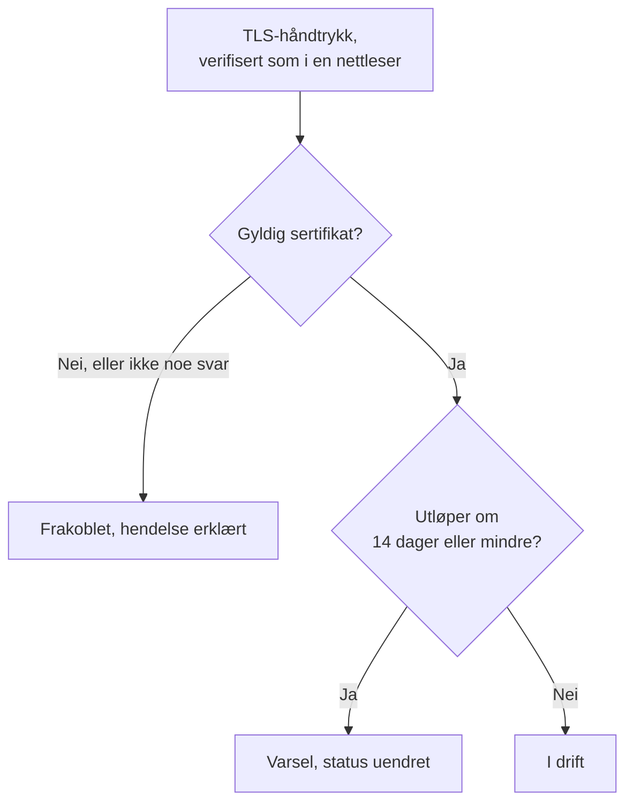

# SSL-sertifikat-overvåking

En SSL-sertifikatmonitor sjekker TLS-sertifikatene som nettstedene og tjenestene dine presenterer, slik en nettleser gjør, og varsler deg før de utløper. Den tar også monitoren frakoblet når et sertifikat ikke lenger er gyldig: utløpt, selvsignert, utstedt for et annet vertsnavn eller fra en utsteder som nettlesere ikke stoler på.

:::cards
- [Opprett monitoren](#opprett-en-ssl-sertifikatmonitor): Seks trinn i dashbordet.
- [Standardkriterier](#standardkriterier): Et utløpsvarsel 14 dager i forveien, uten oppsett.
- [Overvåkingskriterier](#overvåkingskriterier): Gyldighet, utløp og selvsignerte sertifikater.
- [Feilsøking](#feilsøking): Selvsignerte og interne sertifikater.
:::

## Slik fungerer det

Ved hver sjekk åpner en sonde en TLS-tilkobling til verten og porten i URL-en, port `443` med mindre URL-en angir en annen, og verifiserer sertifikatet slik en nettleser ville gjort: en utsteder det er tillit til, et vertsnavn som stemmer, og en gyldighetsperiode som omfatter i dag. Hvis sertifikatet ikke består verifiseringen, leser sonden det likevel, så utløpsdatoen, utstederen og fingeravtrykkene registreres uansett. En tilkobling som feiler, får tidsavbrudd eller presenterer et ugyldig sertifikat, prøves på nytt, opptil antallet nye forsøk du tillater. Deretter kjører OneUptime resultatet gjennom monitorens kriterier.

En sonde som har mistet sin egen nettverkstilkobling, rapporterer ikke noe resultat, så den kan ikke merke sertifikatet ditt som ugyldig.

## Før du starter

- **En rolle som kan opprette monitorer**: Project Owner, Project Admin, Project Member, Monitor Admin eller Monitor Member, eller en egendefinert rolle med tillatelsen Create Monitor.
- **En sonde som når verten og porten.** Prosjektets standardsonder velges for hver nye monitor. En tjeneste på et privat nettverk trenger en [egendefinert sonde](/docs/probe/custom-probe) i det nettverket.

## Opprett en SSL-sertifikatmonitor

:::steps
### Start en ny monitor

Gå til **Monitorer**, og klikk på **Opprett monitor**. Velg **SSL Certificate** under **Monitortype**.

### Gi den et navn

Angi et **Navn**, som `example.com certificate`, og klikk så på **Neste**.

### Angi URL-en

Angi nettstedet som skal få sertifikatet sitt sjekket, i **Nettsted-URL**, som `https://example.com`. For en tjeneste på en annen port tar du med porten: `https://example.com:8443`.

### Test den

Klikk på **Test monitor**, velg en sonde under **Velg sonde**, og klikk på **Kjør test**. **Resultat av overvåkingstest** viser sertifikatet sonden fikk, med utstederen og utløpsdatoen.

### Gå gjennom kriteriene

**Monitorkriterier** starter med [standardkriteriene](#standardkriterier): frakoblet når sertifikatet ikke er gyldig, et varsel når det utløper om 14 dager eller mindre. Endre dem ved behov, og klikk så på **Neste**.

### Velg sonder og opprett

Behold eller endre **Sonder** og **Overvåkingsintervall** (det starter på **Hvert 5. minutt**; SSL-sertifikatmonitorer tilbys 5 minutter eller lenger), og klikk så på **Opprett monitor**. Monitorens side åpnes.
:::

## Konfigurasjonsalternativer

| Felt | Standard | Hva du angir |
| --- | --- | --- |
| **Nettsted-URL** | Ingen | Nettstedet som skal få sertifikatet sitt sjekket, som `https://example.com` eller `https://example.com:8443`. Bare verten og porten brukes; stien ignoreres. |
| **Tidsavbrudd for forespørsel (sekunder)** (under **Flere felt**) | `60` | Hvor lenge det ventes på TLS-håndtrykket ved hvert forsøk. Maksimum er 60 sekunder. |
| **Nye forsøk ved feil** (under **Flere felt**) | Sondens standard, vanligvis `3` | Hvor mange ganger et mislykket forsøk gjentas. Maksimum er 3. |

**Nye forsøk ved feil** teller nye forsøk _etter_ det første forsøket, så `0` kjører sjekken én gang, og `2` kjører den opptil tre ganger. Står feltet tomt, brukes sondens standard: 3, med mindre sondens `PROBE_MONITOR_RETRY_LIMIT` sier noe annet. Tilkoblingsfeil, mislykkede sertifikatverifiseringer og tidsavbrudd prøves alle på nytt, med en pause på ett sekund mellom forsøkene.

## Overvåkingskriterier

Kriterier avgjør når sertifikatet regnes som i orden, redusert eller feil, og om det erklærer en hendelse eller oppretter et varsel. Hvert kriterium sjekker ett eller flere filtre:

| Filter | Betingelser | Hva det sjekker |
| --- | --- | --- |
| **Is Valid Certificate** | **Sann**, **Usann** | Sertifikatet består en nettlesers sjekker: en utsteder det er tillit til, et vertsnavn som stemmer, og en gyldighetsperiode som omfatter i dag. **Usann** når endepunktet ikke svarte. |
| **Is Not A Valid Certificate** | **Sann**, **Usann** | Det motsatte av **Is Valid Certificate**: **Sann** når sertifikatet ikke består de sjekkene eller ikke kunne sjekkes. |
| **Is Expired Certificate** | **Sann**, **Usann** | Sertifikatets utløpsdato er passert. |
| **Is Self Signed Certificate** | **Sann**, **Usann** | Sertifikatet, eller ett i kjeden, er selvsignert. |
| **Expires In Days** | **Greater Than**, **Less Than**, **Greater Than Or Equal To**, **Less Than Or Equal To** | Dager til sertifikatet utløper. |
| **Expires In Hours** | **Greater Than**, **Less Than**, **Greater Than Or Equal To**, **Less Than Or Equal To** | Timer til sertifikatet utløper. |

**Expires In Days** teller hele dager: et sertifikat som utløper om 14 dager og 20 timer, har 14 dager igjen. **Expires In Hours** teller hele timer på samme måte.

Med to eller flere filtre avgjør **Samsvarsbetingelse** om **Alle** må samsvare, eller om **Hvilken som helst** av dem holder. Et kriteriums **Handlinger** avgjør hva det gjør: endrer monitorstatusen, oppretter et varsel, erklærer en hendelse, eller flere av disse.

### Standardkriterier

En ny SSL-sertifikatmonitor starter med tre kriterier, så den varsler deg før et sertifikat utløper, helt uten oppsett:

1. **Sertifikatet er ikke gyldig** — sertifikatet er utløpt, selvsignert, utstedt for et annet vertsnavn eller av en utsteder det ikke er tillit til, eller kunne ikke sjekkes fordi endepunktet ikke svarte. Monitoren merkes som **Frakoblet**, og det opprettes en hendelse med navnet "_monitor name_ certificate is not valid". Rotårsaken forteller hvilket av disse tilfellene det var. Hendelsen løser seg selv når sertifikatet er gyldig igjen.
2. **Sertifikatet utløper snart** — sertifikatet er gyldig, men utløper om 14 dager eller mindre. Det opprettes et **varsel** med navnet "_monitor name_ certificate expires soon".
3. **Sertifikatet er gyldig** — monitoren merkes som **I drift**.

Varselet "utløper snart" er et varsel, ikke en hendelse: det vises ikke på statussidene dine, det tilkaller ingen med mindre du legger til en vaktretningslinje på det, og det endrer ikke monitorens status. Det bruker prosjektets andre varselalvorlighetsgrad, **Low** i et nytt prosjekt. Når det fornyede sertifikatet blir plukket opp, er monitoren tilbake på "Sertifikatet er gyldig", og varselet løser seg selv.

Kriterier sjekkes fra topp til bunn, og det første som samsvarer, avgjør hva som skjer. Derfor står "utløper snart" over "er gyldig": et sertifikat som er i ferd med å utløpe, er fortsatt gyldig, så det ville samsvare med begge.

For å bli varslet tidligere endrer du verdien til filteret **Expires In Days** i kriteriet "utløper snart", for eksempel til `30`. For å få noen tilkalt i stedet åpner du kriteriets **Handlinger**: slå på **Når filtre samsvarer, erklær en hendelse.**, eller behold varselet og legg til en vaktretningslinje på det under **Vaktretningslinjer**.

:::details Legg til varselet på en monitor som ble opprettet før det fantes
Monitorer som ble opprettet før OneUptime innførte dette varselet, har ikke noe kriterium "utløper snart". Slik legger du det til:

1. Åpne **Konfigurasjon → Kriterier** på monitoren, og klikk på **Rediger Overvåkingskriterier**.
2. Klikk på **Legg til kriterier**. Sett filteret til **Is Valid Certificate** / **Sann**, klikk på **Legg til filter**, og sett det andre til **Expires In Days** / **Less Than Or Equal To** / `14`. La **Samsvarsbetingelse** stå på **Alle** (den vises under filtrene så snart det er to).
3. Slå på **Når filtre samsvarer, opprett et varsel.** under **Handlinger**, og la **Når filtre samsvarer, endre overvåkerstatus.** være slått av, så det oppretter et varsel og ikke endrer monitorens status.
4. Dra det nye kriteriet over kriteriet som merker monitoren som tilkoblet, og lagre så.
:::

### Eksempelkriterier

| Mål | Filter | Betingelse | Verdi |
| --- | --- | --- | --- |
| Varsle en måned i forveien | **Expires In Days** | **Less Than Or Equal To** | `30` |
| Tilkall noen den siste dagen | **Expires In Hours** | **Less Than** | `24` |
| Frakoblet først når sertifikatet er utløpt | **Is Expired Certificate** | **Sann** | — |
| Marker et selvsignert sertifikat | **Is Self Signed Certificate** | **Sann** | — |

Et kriterium om utløp må stå over kriteriet som merker sertifikatet som gyldig: et sertifikat som snart utløper, er fortsatt gyldig, og det første kriteriet som samsvarer, vinner.

## Beste praksis

1. **Gi deg selv tid til å fornye** — Standardvarselet kommer 14 dager før utløp, noe som passer for sertifikater som fornyer seg selv. Hvis fornyelsen tar lenger tid hos deg (et sertifikat du kjøper, eller en endringsprosess), øker du det til 30 dager.
2. **Overvåk hvert endepunkt** — Hvis du har flere domener eller underdomener, oppretter du en monitor for hvert av dem. Hvert av dem kan ha sitt eget sertifikat.
3. **Ta med andre porter** — Tjenester som leverer TLS på en annen port enn `443`, som `8443`, har også sertifikater. Angi porten i URL-en.
4. **Sjekk etter fornyelse** — Når du har fornyet et sertifikat, sjekker du monitorens neste resultat: utløpsdatoen den viser, skal være den nye.

## Feilsøking

:::details Sertifikatet er i orden i nettleseren min, men monitoren sier at det ikke er gyldig
Hendelsens rotårsak forteller hvorfor. En vanlig årsak er en server som sender sertifikatet sitt uten mellomsertifikatene: nettlesere fyller ofte inn hullet selv, sonden gjør det ikke. Konfigurer serveren til å sende hele kjeden. En annen er en URL der vertsnavnet ikke står på sertifikatet.
:::

:::details Jeg overvåker en intern tjeneste med et selvsignert sertifikat
Et selvsignert sertifikat er aldri gyldig, så standardkriteriene holder monitoren frakoblet. **Is Self Signed Certificate**, **Is Expired Certificate** og **Expires In Days** fungerer fortsatt for det, så bygg kriteriene på dem. På **Konfigurasjon → Kriterier**:

1. Klikk på **Legg til filter** i kriteriet "ikke gyldig", sett det nye filteret til **Is Self Signed Certificate** / **Usann**, og sett **Samsvarsbetingelse** til **Alle**. Kriteriet tar fortsatt monitoren frakoblet når endepunktet ikke svarer, eller sertifikatet er feil på en annen måte.
2. Legg til et kriterium med **Is Expired Certificate** / **Sann** som merker monitoren som **Frakoblet** og erklærer en hendelse, og dra det helt øverst.
3. Erstatt **Is Valid Certificate** / **Sann** med **Is Expired Certificate** / **Usann** i kriteriet "utløper snart", så varselet også dekker det selvsignerte sertifikatet.

Så lenge sertifikatet er gjeldende, samsvarer ingen kriterier, og monitoren viser standardstatusen sin, **I drift**.
:::

:::details Monitoren er frakoblet med "could not be checked because the endpoint is not reachable"
Sonden kunne ikke åpne en TLS-tilkobling til verten og porten. Sjekk porten i URL-en, og at en brannmur slipper sondene gjennom. En vert på et privat nettverk trenger en [egendefinert sonde](/docs/probe/custom-probe).
:::

## Neste steg

:::cards
- [Nettsted-overvåking](/docs/monitor/website-monitor): Sjekk at selve nettstedet svarer.
- [Domene-overvåking](/docs/monitor/domain-monitor): Bli varslet før domenets registrering utløper.
- [Eskaleringsregler](/docs/on-call/escalation-rules): Bestem hvem som blir tilkalt av varslene og hendelsene.
- [Hendelser – Oversikt](/docs/incidents/index): Hva som skjer etter at monitoren har erklært en.
:::
