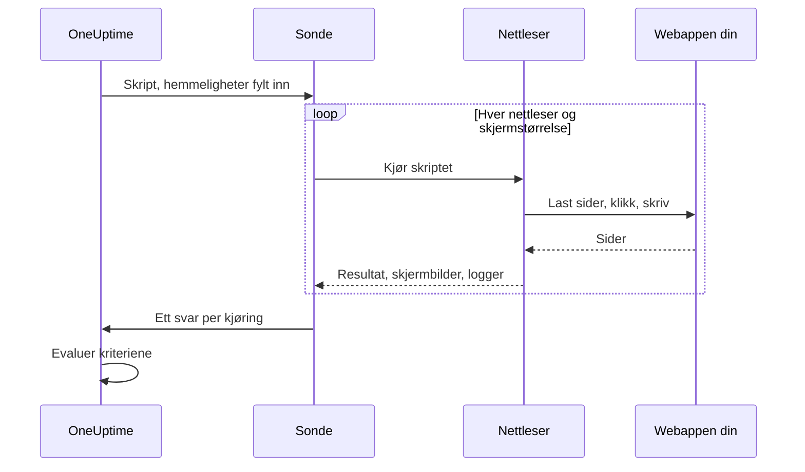

# Syntetisk overvåking

En syntetisk monitor styrer webappen din i en ekte nettleser, etter en tidsplan, med et Playwright-skript du skriver selv: den åpner sider, fyller ut skjemaer og klikker seg gjennom en brukerreise, og den mislykkes når reisen gjør det. Bruk den til å fange feil som en oppetidskontroll ikke ser — en pålogging som ikke lenger virker, en betalingsknapp som ikke gjør noe, et dashbord som aldri blir ferdig med å laste.

:::cards
- [Opprett monitoren](#opprett-en-syntetisk-monitor): Skriv et skript, og velg nettlesere og skjermstørrelser.
- [Skriv skriptet](#skriv-skriptet): En kjørbar påloggingsreise å starte fra.
- [Skjermbilder](#skjermbilder): Se hvordan siden så ut da en kjøring mislyktes.
- [Hva skriptet kan bruke](#moduler-som-er-tilgjengelige-i-skriptet): Playwright, HTTP, kryptografi og metrikker.
:::

## Slik fungerer det

Ved hver kontroll kjører en sonde skriptet ditt én gang for hver nettleser og skjermstørrelse du har valgt, den ene etter den andre. Hver kjøring starter en fersk nettleser uten informasjonskapsler eller lagring fra tidligere kjøringer; skriptet styrer siden sin, tar skjermbilder og returnerer et resultat eller kaster en feil. Sonden rapporterer hver kjøring, og OneUptime evaluerer kriteriene dine mot dem.



| Skjermtype | Viewport |
| --- | --- |
| Mobile | 360 × 640 |
| Tablet | 1024 × 768 |
| Desktop | 1920 × 1080 |

Nettleserne er Chromium og Firefox.

## Før du begynner

- En **sonde** som når webappen din. Bruk en [egendefinert sonde](/docs/probe/custom-probe) for en app inne i nettverket ditt. Sondens Docker-bilde inneholder Chromium og Firefox; en sonde som kjører utenfor Docker, må ha dem installert.
- Alle passord og tokener reisen trenger, lagret som [overvåkingshemmeligheter](/docs/monitor/monitor-secrets).

## Opprett en syntetisk monitor

:::steps
### Start en ny monitor

Gå til **Monitorer**, og klikk på **Opprett monitor**. Under **Monitortype** klikker du på **Flere monitortyper** og velger **Synthetic Monitor** under **Synthetic Monitoring**, eller skriver `playwright` i søkefeltet. Skriv inn et **Navn**, og klikk deretter på **Neste**.

### Legg til skriptet

Skriv skriptet ditt i redigeringsprogrammet **Playwright Code**. Start fra [eksempelet nedenfor](#skriv-skriptet).

### Velg nettlesere og skjermstørrelser

Kryss av for nettleserne under **Nettlesertype** og størrelsene under **Skjermtype**. Skriptet kjører én gang for hver kombinasjon, så to nettlesere og tre størrelser gir seks kjøringer per kontroll. Under **Flere felt** prøver **Antall nye forsøk ved feil** en mislykket kjøring på nytt opptil 5 ganger.

### Test det

Klikk på **Test monitor** for å kjøre skriptet én gang fra en sonde, og sjekk resultatet, loggene og skjermbildene for hver kjøring.

### Gå gjennom kriteriene

Monitoren starter med to kriterier: den er frakoblet og erklærer en hendelse når en kjøring mislykkes, og online når ingen gjør det. Endre dem, eller legg til dine egne — se [Kriterier](#kriterier) — og klikk deretter på **Neste**.

### Velg sonder, og opprett

Velg **Sonder** og et **Overvåkingsintervall** — syntetiske monitorer tilbys hvert 5. minutt eller sjeldnere — og klikk deretter på **Opprett monitor**.
:::

## Skriv skriptet

Skriptet er kroppen til en `async`-funksjon. `page` er en Playwright-kompatibel side som allerede er åpen; styr den, returner et resultat med `return`, og bruk `throw` (eller la et Playwright-kall få tidsavbrudd) for å få kjøringen til å mislykkes. Dette eksempelet logger på og sjekker at dashbordet lastes:

```javascript title="Synthetic monitor script"
await page.goto("https://app.example.com/login");
screenshots["login-page"] = await page.screenshot();

await page.fill("#email", "monitoring@example.com");
await page.fill("#password", "{{monitorSecrets.AppPassword}}");
await page.click("button[type=submit]");

// Fails the run if the dashboard does not appear within 10 seconds.
await page.waitForSelector(".dashboard", { timeout: 10000 });
screenshots["dashboard"] = await page.screenshot();

console.log(`Signed in on ${browserType}, ${screenSizeType}`);

return {
  data: { title: await page.title() },
};
```

| For å | Gjør dette | Hva OneUptime registrerer |
| --- | --- | --- |
| Rapportere et resultat | `return { data: ... }` | Kjøringens **Resultat**. Bare `data` beholdes. |
| Få kjøringen til å mislykkes | `throw new Error("...")`, eller la en ventetid løpe ut | Kjøringens **Skriptfeil**. |
| Ta vare på bevis | `screenshots["name"] = await page.screenshot()` | Et skjermbilde som beholdes selv når kjøringen mislykkes. |
| Legge igjen et spor | `console.log(...)` | Kjøringens loggmeldinger. |

For å se kjøringene åpner du monitorens **Oversikt**: kortet **Monitor-sammendrag** har én blokk per nettleser og skjermstørrelse, og **Vis flere detaljer** viser skjermbildene fra hver kjøring.

### Bruk av Playwright

Vi bruker Playwright til å simulere brukerinteraksjoner. Verdien `page` er en sikker, Playwright-kompatibel fasade for siden som er opprettet for denne kjøringen. Vanlige metoder på `Page`, `Locator`, `Frame`, `ElementHandle`, `JSHandle`, `Request`, `Response`, tastatur, mus og nettleserkontekst er tilgjengelige. Det omfatter navigering, locators, klikk, skjemainndata, evaluering på siden, popup-vinduer, flere sider, inspeksjon av svar og skjermbilder. Du kan nå nettleserkonteksten til kjøringen via `page.context()`, for eksempel for å åpne en ny side eller håndtere et popup-vindu.

Syntetiske skript kjører ikke i Node.js-prosessen til sonden. Verdier krysser kjøretidsgrensen som kopierte data eller ugjennomsiktige kapabiliteter som er bundet til kjøringen, så noen Playwright-API-er virker annerledes eller ikke i det hele tatt:

| Ikke tilgjengelig | Bruk i stedet |
| --- | --- |
| Metoder for å starte eller koble til nettlesere, CDP-økter, ruting av forespørsler, eksponerte bindinger, private felt i Playwright og alle alternativer som leser eller skriver en sti i vertens filsystem. `page.context().browser()` er derfor ikke tilgjengelig. | Siden og nettleserkonteksten du får. |
| Hendelseslyttere (`page.on(...)`, `page.once(...)`) — kall til dem mislykkes med en tydelig feil. | `page.waitForEvent(...)` for dialoger og popup-vinduer, eller ventetider på svar og forespørsler med strenger eller regulære uttrykk som matchere. |
| Funksjonspredikater for ventemetoder for hendelser, forespørsler, svar og URL-er. | Strenger eller regulære uttrykk som matchere, locators eller eksplisitt polling. |
| De synkrone frame-tilgangene (`page.frames()`, `page.mainFrame()`, `page.frame(...)`). | `page.frameLocator(...)` for iframes. |
| `page.request.*` | Den globale `axios` for HTTP-forespørsler. |
| Skjermbilder av hele siden og PDF-utdata. | Skjermbilder av visningsområdet, som beholder håndteringen av feilbevis beskrevet nedenfor. |

`page.waitForNavigation(...)`, `page.setDefaultTimeout(...)` og `page.setDefaultNavigationTimeout(...)` støttes. `page.waitForEvent(...)` venter på `dialog`, `domcontentloaded`, `load`, `popup`, `request`, `requestfailed`, `requestfinished` og `response`. Evalueringsfunksjoner som gis til metoder som `page.evaluate()`, kjøres i den overvåkede nettlesersiden, aldri i sondeprosessen. Hver kjøring kan bruke opptil åtte sider.

Nettlesertillatelser er begrenset til geolokasjon og varsler. Utklippstavle, kamera, mikrofon, MIDI, lokale skrifter og andre tillatelser for vertens enheter er ikke tilgjengelige for overvåkingsskript.

### Hva skriptet returnerer

Data som returneres fra skriptet, serialiseres til JSON før de lagres: i vanlige objekter og matriser blir `NaN` og `Infinity` til `null`, egenskaper med `undefined` og funksjoner forkastes, og `Date`-objekter blir ISO-strenger — på samme måte som `JSON.stringify` håndterer dem. Forekomster av klasser og andre objekter som ikke er vanlige, forkastes helt. En `BigInt` blir en streng. Et resultat som er sirkulært, nestet mer enn 30 nivåer dypt eller større enn 5 MB, får i stedet kjøringen til å mislykkes.

### Varsling på de returnerte dataene

Det skriptet returnerer som `data`, er monitorens **Result Value**, som et kriterium kan sammenligne. Når `data` er et objekt eller en matrise, fyller du inn **Feltsti (valgfritt)** på Result Value-filteret for å sammenligne ett felt — for eksempel `status`, `timings.loadTime` eller `errors[0].message`. Filteret sjekkes mot dataene fra hver nettleser og skjermstørrelse monitoren kjører på, og samsvarer når én av dem gjør det. Se [Varsling på de returnerte dataene](/docs/monitor/custom-code-monitor#varsling-på-de-returnerte-dataene) for hvordan stier og vilkår fungerer.

## Skjermbilder

Et forhåndsdeklarert objekt `screenshots` er tilgjengelig i skriptets kontekst. Tilordne skjermbilder til det når som helst i skriptet — disse skjermbildene tas vare på **selv om skriptet kaster en feil** (også ved mislykkede påstander, tidsavbrudd eller uventede feil), slik at du kan se nøyaktig hvordan siden så ut da kjøringen mislyktes. Skjermbildene vises i OneUptime-dashbordet for akkurat den kjøringen av monitoren.

```javascript
// Capture screenshots via the `screenshots` side-channel — they are preserved on both success and failure.

await page.goto("https://app.example.com/login");
screenshots["login-page"] = await page.screenshot();

await page.fill("#email", "user@example.com");
await page.fill("#password", "wrong");
await page.click("button[type=submit]");

// If the next assertion throws, the `login-page` screenshot above is still captured.
await page.waitForSelector(".dashboard", { timeout: 5000 });

screenshots["dashboard"] = await page.screenshot();

return {
  data: "Login succeeded",
};
```

En kjøring beholder opptil 20 skjermbilder, hvert på opptil 10 MB og 50 MB til sammen. Et skjermbilde kan også vises i hendelsen eller varselet som en mislykket kjøring åpner — på siden og i e-postene om den — ved å plassere det i monitorens beskrivelse for hendelser eller varsler. Se [Vis et skjermbilde](/docs/monitor/incident-alert-templating#syntetiske-monitorer).

:::details Returnere skjermbilder (eldre metode)
For bakoverkompatibilitet kan du også returnere skjermbilder fra skriptet som en del av returverdien. Skjermbilder som returneres slik, tas **bare** vare på når skriptet fullføres normalt — de går tapt hvis skriptet kaster en feil. Foretrekk sidekanalmønsteret ovenfor når du vil ha bevis på feil.

```javascript
// Legacy pattern — screenshots only captured on successful return.
const screenshots = {};
screenshots["screenshot-name"] = await page.screenshot();

return {
  data: "Hello World",
  screenshots: screenshots,
};
```
:::

## Bruk av overvåkingshemmeligheter

Henvis til en hemmelighet som `{{monitorSecrets.NAME}}` hvor som helst i skriptet. OneUptime erstatter henvisningen med verdien til hemmeligheten, som ren tekst, før skriptet når sonden. Sett derfor en hemmelighet i anførselstegn for å bruke den som en streng, og la den stå uten anførselstegn for å bruke den som et tall eller en boolsk verdi:

```javascript
// Used as a string: wrap it in quotes.
const password = "{{monitorSecrets.AppPassword}}";

// Used as a number or a boolean: leave it bare.
const retryLimit = {{monitorSecrets.RetryLimit}};
const verbose = {{monitorSecrets.Verbose}};
```

Se [Overvåkingshemmeligheter](/docs/monitor/monitor-secrets) for å opprette en hemmelighet og velge hvilke monitorer som kan bruke den.

## Egendefinerte metrikker

Du kan samle inn egendefinerte metrikker fra skriptet ditt med funksjonen `oneuptime.captureMetric()`. Disse metrikkene lagres i OneUptime og kan vises i grafer på dashbord med Metric Explorer.

```javascript
oneuptime.captureMetric(name, value, attributes);
```

| Parameter | Type | Beskrivelse |
| --- | --- | --- |
| `name` | string, påkrevd | Navnet på metrikken (f.eks. `"dashboard.load.time"`). Det lagres automatisk med prefikset `custom.monitor.`. |
| `value` | number, påkrevd | Den numeriske verdien til metrikken. |
| `attributes` | object, valgfritt | Nøkkel-verdi-par med ekstra kontekst. |

### Eksempel

```javascript
await page.goto("https://app.example.com");

const startTime = Date.now();
await page.waitForSelector("#dashboard-loaded");
const loadTime = Date.now() - startTime;

// Capture page load time, tagged with this run's browser and screen size
oneuptime.captureMetric("dashboard.load.time", loadTime, {
  page: "dashboard",
  browser: browserType,
  screen: screenSizeType,
});

screenshots["dashboard"] = await page.screenshot();

return {
  data: { loadTime },
};
```

Når de er samlet inn, vises disse metrikkene i Metric Explorer under navn som `custom.monitor.dashboard.load.time`, og på monitorens side **Målinger** under **Egendefinerte metrikker**. OneUptime legger til monitoren og sonden på hvert datapunkt; for å filtrere etter nettleser eller skjermstørrelse gir du dem med som attributter, slik eksempelet gjør.

En kjøring kan samle inn høyst 100 metrikker, bare med numeriske verdier, og OneUptime beholder høyst 100 per kontroll på tvers av alle kjøringene. Som for en monitor med egendefinert kode er noen attributtnavn [reservert](/docs/monitor/custom-code-monitor#reserverte-attributtnøkler) og forkastes hvis et skript setter dem.

## Kriterier

| Filtertype | Hva den sjekker |
| --- | --- |
| **Feil** | Feilen en kjøring kastet, hvis noen. |
| **Result Value** | `data` som en kjøring returnerte. |
| **Kjøretid (i ms)** | Hvor lang tid en kjøring tok. |
| **Nettlesertype** | Nettleseren en kjøring brukte: **Equal To** eller **Not Equal To**. |
| **Screen Size** | Skjermstørrelsen en kjøring brukte: **Equal To** eller **Not Equal To**. |

Hvert filter sjekkes mot hver kjøring og samsvarer når én kjøring samsvarer med det. Filtrene sjekkes hver for seg, ikke kjøring for kjøring: **Feil** Is Not Empty sammen med **Nettlesertype** Equal To `Firefox` samsvarer når en kjøring mislyktes og en av kjøringene brukte Firefox — ikke bare når Firefox-kjøringen mislyktes. For å følge med på én nettleser for seg gir du den en egen monitor.

I hendelses- og varslingsmaler ligger hver kjøring i `{{syntheticResponses}}`: se [Hendelse- og varslingsmaler](/docs/monitor/incident-alert-templating#syntetiske-monitorer).

## Moduler som er tilgjengelige i skriptet

| Navn | Hva det er |
| --- | --- |
| `page` | En sikker Playwright-kompatibel fasade for å samhandle med nettleseren. Du kan nå nettleserkonteksten til kjøringen via `page.context()` for å opprette sider eller håndtere popup-vinduer, men start/tilkobling av nettlesere, CDP, ruting, bindinger, private felt og alternativer med stier på verten er ikke tilgjengelige. |
| `screenshots` | Et forhåndsdeklarert objekt som du tilordner skjermbilder til (f.eks. `screenshots['login-page'] = await page.screenshot()`). Skjermbilder som tilordnes her, tas vare på selv om skriptet senere kaster en feil. |
| `browserType` | Nettleseren denne kjøringen bruker: `Chromium` eller `Firefox`. |
| `screenSizeType` | Skjermstørrelsen denne kjøringen bruker: `Mobile`, `Tablet` eller `Desktop`. |
| `axios` | En promise-basert HTTP-klient som støtter Axios som funksjon pluss `request`, `get`, `head`, `options`, `post`, `put`, `patch`, `delete` og `create`. En forespørselstekst kan være opptil 1 MB og et svar opptil 5 MB; den følger opptil 5 omdirigeringer og får tidsavbrudd etter høyst 30 sekunder. Egendefinerte transporter, adaptere, sokler, agenter og overstyring av proxy er ikke tilgjengelige. |
| `crypto` | En implementering i en nettleser-worker av SHA-256-hasher, HMAC-SHA-256, `randomBytes`, `randomInt` og `randomUUID`. |
| `console` | `console.log`, `info`, `warn` og `error`. Meldingene beholdes sammen med hver kjøring. |
| `oneuptime.captureMetric` | Samler inn en egendefinert metrikk. Se [Egendefinerte metrikker](#egendefinerte-metrikker). |
| `http` | En bufret kompatibilitetsfasade bare for klienter, som støtter `request`, `get` og `Agent`. |
| `https` | HTTPS-motstykket til fasaden `http` som bare er for klienter. |
| `Buffer`, `setTimeout`, `setInterval` | Og `clear`-funksjonene deres. |

Skriptet kjører i en nettleser-worker, ikke i Node.js, og kan ikke åpne egne nettverkstilkoblinger: `fetch`, `XMLHttpRequest` og `WebSocket` er blokkert. Bruk `axios` til HTTP-forespørsler.

## Grenser

| Grense | Standard | Sondeinnstilling |
| --- | --- | --- |
| Tidsavbrudd for skriptet | 60 sekunder. Workers som får tidsavbrudd, og alle nettleserens underprosesser avsluttes. | `PROBE_SYNTHETIC_MONITOR_SCRIPT_TIMEOUT_IN_MS` |
| Minne for hele prosesstreet til en kjøring | 1,5 GiB | `PROBE_SYNTHETIC_MONITOR_MAX_PROCESS_TREE_RSS_BYTES` |
| Skrivbar nettleserlagring | 256 MiB | `PROBE_SYNTHETIC_MONITOR_MAX_DISK_BYTES` |
| Samtidige kjøringer på én sonde | 4 | `PROBE_SYNTHETIC_MONITOR_MAX_CONCURRENCY` |
| Sider per kjøring | 8 | — |

Overskrides grensen for minne eller lagring, avsluttes den kjøringen, og den midlertidige profilen fjernes. Sondeinnstillingene gjelder for selvhostede sonder; Helm-chartet setter de samme verdiene per sonde (for eksempel `syntheticMonitorScriptTimeoutInMs`).

Nettleserne følger med i sondens Docker-bilde, så en selvhostet sonde får nyere nettlesere når du oppdaterer bildet.

## Feilsøking

:::details En kjøring mislykkes, men jeg ser ikke hvorfor
Tilordne skjermbilder til objektet `screenshots` før hvert risikabelt trinn. De beholdes selv når kjøringen mislykkes, og viser hvordan siden så ut på det tidspunktet.
:::

:::details `page.on(...)` kaster en feil
Hendelseslyttere kan ikke krysse isolasjonsgrensen. Bruk `page.waitForEvent(...)` for dialoger og popup-vinduer, eller en ventetid på et svar eller en forespørsel med en streng eller et regulært uttrykk som matcher.
:::

:::details Kjøringen får tidsavbrudd
Vent på bestemte elementer med `page.waitForSelector(...)` og en `timeout` som er kortere enn skriptets egen grense, slik at kjøringen mislykkes på det trinnet som er tregt, med en tydelig feil.
:::

:::details En selvhostet sonde sier at nettleserens kjørbare fil ikke ble funnet
Sonden kjører utenfor Docker-bildet sitt, uten Chromium eller Firefox installert. Kjør sondens bilde, eller installer nettleserne på den maskinen.
:::

## Neste trinn

:::cards
- [Egendefinert kode-overvåking](/docs/monitor/custom-code-monitor): Sjekk API-er med et skript, uten nettleser.
- [Vis et skjermbilde](/docs/monitor/incident-alert-templating#syntetiske-monitorer): Sett skjermbildet fra den mislykkede kjøringen inn i hendelsen.
- [Overvåkingshemmeligheter](/docs/monitor/monitor-secrets): Hold påloggingsinformasjon utenfor skriptet ditt.
:::
