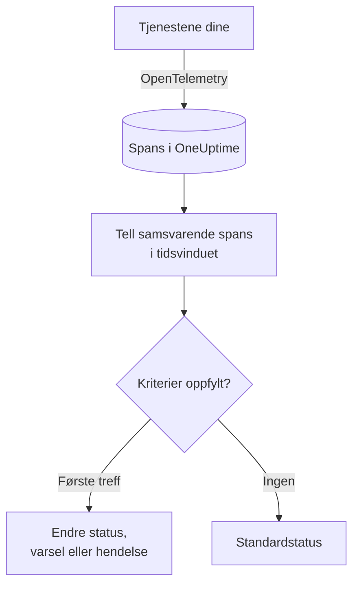

# Trase-overvåking

En trasemonitor teller innenfor et tidsvindu spans tjenestene dine sender til OneUptime som samsvarer med filtrene dine (span-navn, status, tjeneste, attributter). Når antallet oppfyller kriteriene dine, endrer den monitorens status, oppretter et varsel eller erklærer en hendelse. Bruk den til å bli varslet om mislykkede forespørsler til et endepunkt, en økning i feil-spans eller en tjeneste som har sluttet å sende traser.

:::cards
- [Opprett monitoren](#opprett-en-trasemonitor): Velg hvilke spans som telles, og når du skal varsles.
- [Span-statuskoder](#span-statuskoder): Hva OK, ERROR og UNSET betyr, og hva du bør filtrere på.
- [Slik evalueres den](#slik-evalueres-den): Tidsvinduet, tellingen og syklusen på ett minutt.
- [Kriterier](#kriterier): Terskler, avviksdeteksjon og standardverdiene.
:::

## Slik fungerer det

Hvert minutt teller OneUptime spans som samsvarer med monitorens filtre og startet innenfor tidsvinduet. Antallet sammenlignes med monitorens kriterier fra topp til bunn, og det første kriteriet som samsvarer, avgjør hva som skjer. Når ingen samsvarer, går monitoren tilbake til standardstatusen sin.

## Før du starter

- Tjenestene dine sender traser til OneUptime via OpenTelemetry. Se [OpenTelemetry](/docs/telemetry/open-telemetry).
- Slå opp det nøyaktige navnet på spannet du vil overvåke, i trase-utforskeren: span-navn bestemmes av instrumenteringen din, for eksempel `POST /api/checkout` eller `GET`.

## Opprett en trasemonitor

:::steps
### Start en ny monitor

Gå til **Monitorer**, og klikk på **Opprett monitor**.

### Velg Traces

Under **Monitortype** klikker du på **Flere monitortyper** og velger **Spor** under **Telemetri**, eller du skriver `traces` i søkefeltet. Skriv inn et **Navn**, og klikk deretter på **Neste**.

### Velg spans som skal telles

I **Trace-monitorkonfigurasjon** angir du **Span-navn**, **Overvåk spor i (tid)** og **Filtrer etter span-status**. Et filter du lar stå tomt, samsvarer med alle spans. **Forhåndsvisning av spans** under filtrene viser spans de samsvarer med akkurat nå.

### Snevre dem inn (valgfritt)

Åpne **Flere felt** for å filtrere etter telemetritjeneste, infrastrukturentitet eller attributt.

### Angi kriteriene

Kortet **Monitorkriterier** starter med to kriterier: frakoblet, med en hendelse, når ingen spans samsvarer; tilkoblet når minst ett gjør det. Endre dem til det du vil varsles om (se [Kriterier](#kriterier)).

### Opprett monitoren

Klikk på **Opprett monitor**. Monitoren åpnes på siden **Oversikt**, og den første evalueringen kjøres innen ett minutt.
:::

> [!TIP]
> For å få beskjed når en AI-funksjon svarer dårlig (mislykkede, avviste, avkortede, tomme, flaggede eller trege svar), velger du i stedet **AI / LLM** under **Telemetri**. Den monitoren leser AI-kallene i trasene dine for deg, uten span-filtre du må skrive. Se [AI- / LLM-observerbarhet](/docs/telemetry/ai-llm-observability#få-beskjed-når-ai-en-svarer-dårlig).

## Hva den spør etter

| Felt | Hva det samsvarer med | Standard |
| --- | --- | --- |
| **Span-navn** | Spans der navnet inneholder denne teksten, uten forskjell på store og små bokstaver. | Tom: alle spans |
| **Overvåk spor i (tid)** | Spans som startet de siste 5 sekundene opp til de siste 24 timene. | **Siste 1 minutt** |
| **Filtrer etter span-status** | Spans med en av de valgte statusene: **Ikke angitt**, **OK** eller **Feil**. | Tom: alle statuser |
| **Filtrer etter telemetritjeneste** (under **Flere felt**) | Spans fra en av de valgte tjenestene. | Tom: alle tjenester |
| **Filter by Infrastructure Entity** (under **Flere felt**) | Spans fra en av de valgte vertene, podene, containerne og andre entitetene. | Tom: alle entiteter |
| **Filtrer etter attributter** (under **Flere felt**) | Spans der attributtene oppfyller alle vilkår. Hvert vilkår har sin egen operator, som «er lik» eller «inneholder». | Tom: ingen vilkår |

Alle filtrene du angir, må samsvare for at et span skal telles.

### Span-statuskoder

- **OK** – Operasjonen ble eksplisitt merket som vellykket av applikasjonskode eller en sporings-pipeline
- **ERROR** – Operasjonen støtte på en feil
- **UNSET** – Ingen feilstatus ble angitt. Dette er standardstatusen i OpenTelemetry

UNSET betyr ikke at data mangler. OpenTelemetry-instrumentering setter ERROR når en operasjon feiler, og lar vellykkede spans stå som UNSET, så på en sunn tjeneste er de fleste spans UNSET. OneUptime viser dem i grønt som «Unset (no error)». Å registrere et unntak endrer ikke statusen til et span, så et UNSET-span kan fortsatt ha unntak; de vises sammen med spannet. Filtrer på ERROR for å varsle ved feil. Velg både OK og UNSET for å telle alle spans som ikke feilet.

Hvis du vil at vellykkede forespørsler skal vises som OK, legger du til en sporings-pipeline under **Spor > Innstillinger > Pipelines** med filtervilkåret **Status = Ikke angitt** og en **Status-omkartlegger** som tilordner `http.response.status_code`-verdier, for eksempel `200`, til OK.

## Slik evalueres den

- **Hvert minutt.** En trasemonitor sjekkes ikke av sonder, så den har ikke noe intervall å angi og ingen side **Sonder og intervall**.
- **Ett tall per evaluering.** Monitoren teller spans som samsvarer med alle filtre og startet innenfor **Overvåk spor i (tid)** før evalueringen. Med **Siste 5 minutter** ser hver evaluering fem minutter tilbake, så vinduene for evalueringer som følger etter hverandre, overlapper.
- **Ingen spans er et antall på 0.** En tjeneste som slutter å sende traser, gir 0, og det er det standardkriteriet for frakoblet ser etter.
- **OneUptimes eget nedetid er ikke stillhet.** Så lenge tidsvinduet inneholder tid da OneUptime selv ikke mottok data (det startet på nytt, ble oppgradert eller tok igjen et etterslep), venter sjekken: statusen endres ikke, og ingen hendelse eller varsel åpnes eller løses. Se [Når OneUptime ikke mottar data](/docs/monitor/when-oneuptime-is-not-receiving).
- **Kriterier fra topp til bunn.** Det første kriteriet som samsvarer, avgjør, så legg det mest alvorlige øverst.

Hver statusendring registreres med årsaken på monitorens **Statustidslinje**.

## Kriterier

Kriteriene til en trasemonitor har én **Filtertype**: **Span Count**, antallet spans som samsvarte i vinduet. Velg et **Filtervilkår** og, for et tersklevilkår, en **Verdi**.

| Filtervilkår | Samsvarer når antallet spans er… |
| --- | --- |
| **Greater Than** | over verdien |
| **Greater Than Or Equal To** | lik verdien eller høyere |
| **Less Than** | under verdien |
| **Less Than Or Equal To** | lik verdien eller lavere |
| **Equal To** | nøyaktig verdien |
| **Anomalously High** | over det forventede området for denne timen i uken |
| **Anomalously Low** | under det området |
| **Anomalous** | utenfor det området, i hvilken som helst retning |

Avviksvilkårene har ingen **Verdi**. Velg en **Følsomhet** (Low, Medium, som er standard, eller High) og et **Grunnlinjevindu** på 14 (standard), 28, 60 eller 90 dager. OneUptime gjør antallet om til en rate per minutt og sammenligner den med samme time i uken over det vinduet. Grunnlinjen dekker bare monitorens tjenester og span-statuser: filtrene på span-navn og attributter inngår ikke. Inntil den timen i uken har nok historikk, lærer kriteriet fortsatt og utløses ikke.

En ny trasemonitor starter med disse kriteriene:

| Kriterium | Filter | Virkning |
| --- | --- | --- |
| Check if … is offline | **Span Count** **Equal To** `0` | Setter monitoren som frakoblet og erklærer en hendelse som løses automatisk |
| Check if … is online | **Span Count** **Greater Than** `0` | Setter monitoren som tilkoblet |

## Gjennomgått eksempel: mislykkede checkout-forespørsler

På fem minutter registrerer checkout-tjenesten 1 200 spans med navnet `POST /api/checkout`: 1 150 UNSET, 20 OK og 30 ERROR. Den samme monitoren teller svært ulike tall avhengig av **Filtrer etter span-status**:

| Filtrer etter span-status | Span Count | Hva det måler |
| --- | --- | --- |
| **Feil** | 30 | Forespørsler som mislyktes |
| **OK** | 20 | Bare forespørslene koden din merket som vellykkede |
| **Ikke angitt** og **OK** | 1 170 | Alle forespørsler som ikke mislyktes |
| Tom | 1 200 | Alle forespørsler |

For å bli tilkalt når mer enn 10 checkout-forespørsler mislykkes på fem minutter:

- **Span-navn**: `POST /api/checkout`
- **Overvåk spor i (tid)**: **Siste 5 minutter**
- **Filtrer etter span-status**: **Feil**
- Kriterium 1: **Span Count** **Greater Than** `10`: sett monitoren som frakoblet og erklær en hendelse
- Kriterium 2: **Span Count** **Less Than Or Equal To** `10`: sett monitoren som tilkoblet

Med 30 mislykkede forespørsler samsvarer kriterium 1, og hendelsen erklæres. Når det har gått fem minutter med 10 eller færre feil, samsvarer kriterium 2, monitoren er tilkoblet igjen, og hendelsen løser seg selv.

## Feilsøking

:::details Monitoren teller ingen spans for endepunktet mitt
**Span-navn** sammenlignes med spannets navn, og instrumentering navngir ofte server-spans etter ruten (`POST /api/checkout`) eller bare etter metoden (`GET`). Finn det nøyaktige navnet i trase-utforskeren. Åpne deretter monitorens side **Kriterier** (under **Konfigurasjon**), og klikk på **Edit Monitoring Criteria**: **Forhåndsvisning av spans** viser hva filtrene samsvarer med akkurat nå.
:::

:::details Vellykkede forespørsler telles ikke når jeg filtrerer på OK
De fleste instrumenteringer lar vellykkede spans stå som UNSET, ikke OK (se [Span-statuskoder](#span-statuskoder)). Velg både **Ikke angitt** og **OK**, eller legg til sporings-pipelinen som er beskrevet der.
:::

:::details Et span har et unntak, men telles ikke som feil
Å registrere et unntak endrer ikke statusen til et span. Filtrer på **Feil**, eller bruk en [unntaksmonitor](/docs/monitor/exceptions-monitor) for å bli varslet om selve unntakene.
:::

:::details Et avvikskriterium utløses aldri
Det lærer fortsatt: timen i uken det sammenligner med, har ikke nok historikk ennå innenfor **Grunnlinjevindu**.
:::

## Neste steg

:::cards
- [Unntak-overvåking](/docs/monitor/exceptions-monitor): Bli varslet om unntakene tjenestene dine registrerer.
- [Logg-overvåking](/docs/monitor/logs-monitor): Bli varslet om loggmengde og -innhold.
- [Søkesyntaks](/docs/telemetry/search-syntax): Finn span-navn og -statuser i trase-utforskeren.
- [Hendelse- og varslingsmaler](/docs/monitor/incident-alert-templating): Skriv nyttige titler og beskrivelser for varsler.
:::
