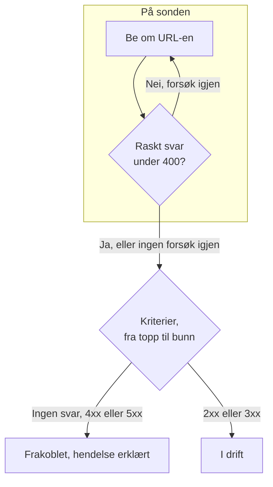

# Nettsted-overvåking

En nettstedsmonitor sjekker at en nettside svarer. Ved hver sjekk ber en sonde om sidens URL, og monitoren går frakoblet og erklærer en hendelse når siden ikke svarer eller svarer med en feil. For å kalle et endepunkt med en metode, hoder eller en brødtekst bruker du heller en [API-monitor](/docs/monitor/api-monitor).

:::cards
- [Opprett monitoren](#opprett-en-nettstedsmonitor): Seks trinn i dashbordet.
- [Konfigurasjonsalternativer](#konfigurasjonsalternativer): URL-plassholdere, omdirigeringer, sertifikater, tidsavbrudd og nye forsøk.
- [Overvåkingskriterier](#overvåkingskriterier): Hva som fra start regnes som oppe eller nede.
- [Feilsøking](#feilsøking): Når monitoren og nettleseren din er uenige.
:::

## Slik fungerer det

Ved hver sjekk ber en sonde om URL-en, følger omdirigeringer og registrerer det som kom tilbake: statuskoden, svartiden, hodene og, når et kriterium trenger den, brødteksten. En forespørsel som feiler, får tidsavbrudd, svarer med status `4xx` eller `5xx` eller tar lenger enn 10 sekunder, prøves på nytt, opptil antallet nye forsøk du tillater. Deretter kjører OneUptime resultatet gjennom monitorens kriterier.



Når ingen av monitorens kriterier leser svarets brødtekst (et filter **Svartekst** eller **JavaScript Expression**), sender sonden en forespørsel `HEAD` i stedet for en `GET`, og gjentar den som `GET` hvis serveren avviser `HEAD`. Tilgangsloggene på serveren din kan vise begge.

En sonde som har mistet sin egen nettverkstilkobling, rapporterer ikke noe resultat, så den kan ikke merke nettstedet ditt som frakoblet.

## Før du starter

- **En rolle som kan opprette monitorer**: Project Owner, Project Admin, Project Member, Monitor Admin eller Monitor Member, eller en egendefinert rolle med tillatelsen Create Monitor.
- **En sonde som når nettstedet.** Prosjektets standardsonder velges for hver nye monitor. Står det en brannmur foran nettstedet, tillater du [OneUptime Clouds sonde-IP-adresser](/docs/configuration/ip-addresses). Et nettsted på et privat nettverk trenger en [egendefinert sonde](/docs/probe/custom-probe) i det nettverket, som får nå private adresser: se [Tilgang til privat nettverk](/docs/self-hosted/private-network-access).

## Opprett en nettstedsmonitor

:::steps
### Start en ny monitor

Gå til **Monitorer**, og klikk på **Opprett monitor**. Velg **Nettsted** under **Monitortype**.

### Gi den et navn

Angi et **Navn**, som `Marketing site`, og klikk så på **Neste**.

### Angi URL-en

Angi sidens fullstendige adresse under **Nettsted-URL**, inkludert `https://`, som `https://example.com`. For å endre omdirigeringer, sertifikater, tidsavbruddet eller nye forsøk åpner du **Flere felt** under (se [Konfigurasjonsalternativer](#konfigurasjonsalternativer)).

### Test den

Klikk på **Test monitor**, velg en sonde under **Velg sonde**, og klikk på **Kjør test**. **Resultat av overvåkingstest** viser hva sonden fikk tilbake.

### Gå gjennom kriteriene

**Monitorkriterier** starter med [standardkriteriene](#standardkriterier): frakoblet når nettstedet ikke svarer eller svarer med en feil, tilkoblet ved enhver status `2xx` eller `3xx`. Endre dem ved behov, og klikk så på **Neste**.

### Velg sonder og opprett

Behold eller endre **Sonder** og **Overvåkingsintervall** (det starter på **Hvert 5. minutt**), og klikk så på **Opprett monitor**. Monitorens side åpner.
:::

## Konfigurasjonsalternativer

### Nettsted-URL

Siden som skal sjekkes, som fullstendig URL med skjema: `https://example.com`, `https://example.com/pricing` eller `http://example.com:8080/health`. Du kan sette en [overvåkingshemmelighet](/docs/monitor/monitor-secrets) inn i URL-en som `{{monitorSecrets.NAME}}`, for eksempel et token i spørrestrengen.

### Dynamiske URL-plassholdere

Når et CDN eller en hurtigbuffer-proxy står foran nettstedet, kan en sonde få svar fra hurtigbufferen i stedet for fra serveren din. For å komme forbi hurtigbufferen legger du til en plassholder i URL-en; sonden erstatter den med en ny verdi ved hver sjekk.

| Plassholder | Erstattes med | Eksempelverdi |
| --- | --- | --- |
| `{{timestamp}}` | Gjeldende Unix-tid i sekunder | `1719500000` |
| `{{random}}` | En tilfeldig, unik streng på 32 heksadesimale tegn | `3f2b8c1d9e7a4b6c8d0e1f2a3b4c5d6e` |

En URL med en plassholder:

```text
https://example.com/health?cb={{timestamp}}
```

Hva sonden ber om ved to sjekker med fem minutters mellomrom:

```text
https://example.com/health?cb=1719500000
https://example.com/health?cb=1719500300
```

Bruk `{{random}}` på samme måte: `https://example.com/health?nocache={{random}}`.

### Flere felt

Disse innstillingene er brettet sammen under **Flere felt**, under URL-en. Den sammenbrettede overskriften nevner dem og viser hvilke du har endret.

| Felt | Standard | Hva det gjør |
| --- | --- | --- |
| **Ikke følg omdirigeringer** | Av | Vurder det første svaret i stedet for å følge omdirigeringer. Se [nedenfor](#ikke-følg-omdirigeringer). |
| **Tillat selvsignerte sertifikater** | Av | Hopp over valideringen av TLS-sertifikatet for monitorens eget vertsnavn. |
| **Bruk klientsertifikat (mTLS)** | Av | Presenter et klientsertifikat og en privat nøkkel. Se [Klientsertifikat (mTLS)](#klientsertifikat-mtls). |
| **Tidsavbrudd for forespørsel (sekunder)** | `60` | Hvor lenge det ventes på hvert forsøk. Maksimum er 60 sekunder. |
| **Nye forsøk ved feil** | Sondens standard, som regel `3` | Hvor mange ganger et mislykket forsøk gjentas. Maksimum er 3. Se [Nye forsøk og tidsavbrudd](#nye-forsøk-og-tidsavbrudd). |

#### Ikke følg omdirigeringer

Som standard følger sonden omdirigeringer (`301`, `302`, `303`, `307` og `308`), opptil 10 av dem, og vurderer siden den havner på. Slå på **Ikke følg omdirigeringer** for i stedet å vurdere selve omdirigeringssvaret, for eksempel for å sjekke at `http://` omdirigerer til `https://`. [Standardkriteriene](#standardkriterier) regner et omdirigeringssvar som tilkoblet.

**Tillat selvsignerte sertifikater** følger omdirigeringer som blir på monitorens eget vertsnavn. En omdirigering til et annet vertsnavn verifiseres som vanlig.

#### Klientsertifikat (mTLS)

Krever nettstedet gjensidig TLS, slår du på **Bruk klientsertifikat (mTLS)** og fyller ut:

| Felt | Hva du angir |
| --- | --- |
| **Klientsertifikat (PEM)** | Det PEM-kodede klientsertifikatet som presenteres. |
| **Klientens private nøkkel (PEM)** | Den tilhørende PEM-kodede private nøkkelen. |
| **Passordfrase for klientens private nøkkel** | Valgfritt. Passordfrasen, bare hvis den private nøkkelen er kryptert. |

Det tilsvarer curls flagg `--cert` og `--key`:

```bash
curl --cert client.crt --key client.key https://example.com/health
```

For å holde nøkkelen utenfor monitorens innstillinger lagrer du sertifikatet og nøkkelen som [overvåkingshemmeligheter](/docs/monitor/monitor-secrets) og angir `{{monitorSecrets.NAME}}` i disse feltene. Hemmeligheter fylles inn på serveren, og verdiene deres vises aldri i dashbordet.

Klientsertifikatet presenteres bare så lenge forespørselen blir på opprinnelsen til monitorens URL (samme skjema, vert og port). Etter en omdirigering til en annen opprinnelse fortsetter sonden uten det.

#### Nye forsøk og tidsavbrudd

**Nye forsøk ved feil** teller nye forsøk _etter_ det første forsøket, så `0` kjører sjekken én gang og `2` opptil tre ganger. Står feltet tomt, brukes sondens standard: 3, med mindre sondens `PROBE_MONITOR_RETRY_LIMIT` sier noe annet. Sonden venter ett sekund mellom forsøkene, og hvert forsøk får hele **Tidsavbrudd for forespørsel (sekunder)**.

Disse feilene prøves på nytt: tilkoblingsfeil, tidsavbrudd, svar `4xx` og `5xx`, og svar som er tregere enn 10 sekunder. Disse gjør ikke det, fordi et nytt forsøk ikke kan endre dem: en ugyldig eller blokkert URL, mer enn 10 omdirigeringer og et svar større enn 512 KiB.

## Overvåkingskriterier

Kriterier avgjør når nettstedet regnes som tilkoblet, redusert eller frakoblet, og om det erklærer en hendelse eller oppretter et varsel. Hvert kriterium sjekker ett eller flere filtre:

| Filter | Betingelser | Hva det sjekker |
| --- | --- | --- |
| **Is Online** | **Sann**, **Usann** | Om nettstedet svarte i det hele tatt, uansett statuskode. |
| **Statuskode for svar** | **Equal To**, **Not Equal To**, **Greater Than**, **Less Than**, **Greater Than Or Equal To**, **Less Than Or Equal To** | HTTP-statuskoden. |
| **Svartid (i ms)** | **Greater Than**, **Less Than**, **Greater Than Or Equal To**, **Less Than Or Equal To** | Hvor lang tid forespørselen tok, omdirigeringer medregnet. |
| **Svartekst** | **Inneholder**, **Not Contains** | Tekst i svarets brødtekst. Det skilles mellom store og små bokstaver. |
| **Response Header** | **Inneholder**, **Not Contains** | Om svaret har et hode med dette navnet. Angi navnet med små bokstaver, som `x-cache`. |
| **Response Header Value** | **Inneholder**, **Not Contains** | Om et hode har nøyaktig denne verdien, sammenlignet med små bokstaver, som `no-store`. |
| **JavaScript Expression** | **Evaluates To True** | Et uttrykk over svaret. Se [JavaScript-uttrykk](/docs/monitor/javascript-expression). |
| **Is Request Timeout** | **Sann**, **Usann** | Om forespørselen fikk tidsavbrudd ved hvert forsøk. |

**Legg til kriterier** legger til et kriterium som allerede har navn etter filteret sitt, for eksempel _Response Time (in ms) is above 3000_. Navnet endres med filtrene til du skriver inn ditt eget. En beskrivelse er valgfri: for å legge til en åpner du kriteriets **Innstillinger**.

Med to eller flere filtre avgjør **Samsvarsbetingelse** om **Alle** må samsvare, eller om **Hvilken som helst** av dem holder. Et kriteriums **Handlinger** avgjør hva det gjør: endrer monitorstatusen, oppretter et varsel, erklærer en hendelse, eller flere av disse.

### Standardkriterier

En ny nettstedsmonitor starter med to kriterier, så den fungerer uten at du endrer noe:

- **Frakoblet** — nettstedet svarer ikke, eller svarer med en statuskode på `400` eller høyere (eller under `200`). Monitoren merkes som **Frakoblet**, og en hendelse opprettes. Hendelsen løser seg selv når nettstedet er tilbake.
- **Oppe** — nettstedet svarer med en hvilken som helst statuskode `2xx` eller `3xx`, som `200`, `204` eller `301`. Monitoren merkes som **I drift**.

I listen over kriterier har de navn etter monitoren: _Check if (name) is offline_ og _Check if (name) is online_.

En side som svarer `204 No Content`, eller en omdirigering du følger med **Ikke følg omdirigeringer** slått på, regnes altså som oppe. Hvis bare én statuskode betyr frisk for deg, endrer du begge kriteriene på monitorens side **Konfigurasjon → Kriterier**: for eksempel **Statuskode for svar** / **Equal To** / `200` i det tilkoblede kriteriet og **Not Equal To** / `200` i det frakoblede, i stedet for de to statuskodefiltrene hvert av dem har.

Kriterier sjekkes fra topp til bunn, og det første som samsvarer, avgjør hva som skjer.

Når ingen samsvarer, faller monitoren tilbake til standardstatusen sin: **I drift**, med mindre du velger en annen under **Flere felt** under kriteriene. Den sammenbrettede overskriften på **Flere felt** viser hvilken status det er.

Monitorer som ble opprettet før OneUptime endret disse standardene, beholder kriteriene de ble opprettet med, og regner bare `200` som tilkoblet. Monitorer som opprettes via API-et eller Terraform, bruker kriteriene du sender.

### Evaluering over en tidsperiode

**Evaluer disse kriteriene over en tidsperiode** er en avkrysningsboks under et filter, som tilbys for **Is Online**, **Statuskode for svar** og **Svartid (i ms)**. Slå den på for å vurdere et vindu av tidligere sjekker i stedet for bare den siste: velg en aggregering under **Evaluer** og et vindu fra 2 til 60 minutter under **For de siste (i minutter)**.

| Aggregering | Samsvarer når |
| --- | --- |
| **Gjennomsnitt**, **Sum**, **Maximum Value**, **Minimum Value** | Den verdien over vinduet oppfyller betingelsen. Bare numeriske filtre. |
| **All Values** | Hver sjekk i vinduet oppfyller betingelsen. |
| **Any Value** | Minst én sjekk i vinduet oppfyller betingelsen. |

**All Values** samsvarer først når vinduet faktisk er dekket av data. En monitor som nettopp er opprettet, eller en der sjekkene sluttet å bli registrert, har ikke nok historikk til å si noe om de siste N minuttene, så kriteriet venter i stedet for å samsvare på den ene målingen det har. **Any Value** er innstillingen for "si fra med en gang én enkelt sjekk overskrider grensen" og utløses fortsatt umiddelbart.

**Hvis ingen data** avgjør hva som skjer så lenge vinduet ikke kan underbygge kriteriet:

| Alternativ | Hva som skjer | Bruk det til |
| --- | --- | --- |
| **Ignore** (standard) | Kriteriet samsvarer ikke. | Vanlige terskelvarsler. |
| **Trigger** | De manglende dataene regnes som problemet. | Sjekker der stillhet i seg selv er en feil. |
| **Treat As Zero** | Vinduet sammenlignes som én enkelt null. | Tellere der ingen hendelser virkelig betyr null. |

### Eksempelkriterier

| Mål | Filter | Betingelse | Verdi |
| --- | --- | --- | --- |
| Merk nettstedet som redusert når det er tregt | **Svartid (i ms)** | **Greater Than** | `3000` |
| Fang en feilside som leveres med `200` | **Svartekst** | **Not Contains** | `Welcome` |
| Sjekk at et CDN-hode finnes | **Response Header** | **Inneholder** | `x-cache` |
| Godta bare `200` som frisk | **Statuskode for svar** | **Equal To** | `200` |

## Feilsøking

:::details Monitoren er frakoblet, men nettstedet lastes i nettleseren min
Sonden fikk et annet svar enn nettleseren din. Hendelsens rotårsak og **Overvåkingslogger** på monitoren viser hva sonden så. Vanlige årsaker:

- En brannmur eller et botfilter blokkerer sondene. Tillat [OneUptime Clouds sonde-IP-adresser](/docs/configuration/ip-addresses).
- Nettstedet kan bare nås på nettverket ditt. Bruk en [egendefinert sonde](/docs/probe/custom-probe) inne i det.
- Sertifikatet er selvsignert eller fra en privat sertifikatutsteder. Slå på **Tillat selvsignerte sertifikater**, eller overvåk sertifikatet for seg med en [SSL-sertifikatmonitor](/docs/monitor/ssl-certificate-monitor).
:::

:::details Sjekken feiler med "Remote response exceeded the allowed size."
Sonden leser høyst 512 KiB av et svar, og denne siden er større. Pek monitoren mot en mindre side, som et helseendepunkt, eller fjern filtrene **Svartekst** og **JavaScript Expression**, så sonden bare trenger hodene.
:::

:::details Sjekken feiler med "Monitor target exceeded 10 redirects."
URL-en omdirigerer mer enn 10 ganger, som regel i en løkke. Åpne URL-en med `curl -IL` for å se kjeden, og pek monitoren mot siden kjeden skal ende på.
:::

:::details Sjekken feiler med en melding om en privat nettverksadresse
URL-en slås opp til en privat adresse, og sonden som kjørte sjekken, får ikke nå private adresser. På en selvhostet sonde slår du det på med `PROBE_ALLOW_PRIVATE_NETWORK_MONITORS`: se [Tilgang til privat nettverk](/docs/self-hosted/private-network-access).
:::

## Neste steg

:::cards
- [API-overvåking](/docs/monitor/api-monitor): Kall et endepunkt med en metode, hoder og en brødtekst.
- [SSL-sertifikat-overvåking](/docs/monitor/ssl-certificate-monitor): Få beskjed før nettstedets sertifikat utløper.
- [Overvåkingshemmeligheter](/docs/monitor/monitor-secrets): Hold tokener og nøkler utenfor monitorinnstillingene.
- [Hendelser](/docs/incidents/index): Hva som skjer etter at monitoren har erklært en.
:::
