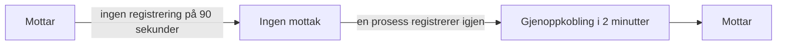

# Når OneUptime ikke mottar data

Mens OneUptime starter på nytt, blir oppgradert eller arbeider seg gjennom en kø, kan ingenting av det agentene, collectorene, sondene og heartbeat-avsenderne dine sender, nå monitorene dine. OneUptime registrerer når det skjer, og holder aldri den tiden mot en server, en vert eller noen annen ressurs: tiden ble ikke overvåket, så den er ikke nedetid.

## Slik fungerer det

Hver OneUptime-prosess som tar imot data, registrerer hvert 30. sekund at den mottar, så lenge den når databasene den lagrer data i. OneUptime utelater tre slags tid:

- Ingen mottak: ingen prosess har registrert noe på mer enn 90 sekunder. OneUptime var stoppet, startet på nytt, ble oppgradert eller nådde ikke en av databasene sine.
- Gjenoppkobling: de første 2 minuttene etter at OneUptime mottar igjen, mens agenter kobler til på nytt og sender det de har holdt tilbake.
- Innhenting: så lenge køen med data som venter på behandling er mer enn ett minutt bak, tiden siden de eldste dataene som fortsatt venter i den.



En omstart som tar under 90 sekunder, er ikke et hull: collectorer sender på nytt det de ikke fikk levert.

## Hva som endres i den tiden

| Hvor | Hva OneUptime gjør |
| --- | --- |
| Server- / VM-monitorer | **Is Online** teller bare minuttene OneUptime mottok: som standard er en server offline etter 3 minutter med stillhet som OneUptime kunne ha hørt. |
| Monitorer for innkommende forespørsler og innkommende e-post | **Recieved In Minutes** og **Not Recieved In Minutes** teller bare minuttene OneUptime mottok. Når et slikt kriterium er oppfylt, sier årsaken hvor mange av minuttene som ble utelatt. |
| Verts-, Kubernetes-, Docker-, metrikk-, logg- og trace-monitorer og de andre monitorene som leser telemetri | En sjekk der vinduet inneholder tid uten mottak, venter til den tiden har forlatt vinduet, og aldri lenger enn 15 minutter etter at den sluttet. Inntil da endres ingenting: ingen statusendring, og ingen hendelse eller varsel åpnes eller løses. Så lenge køen er bak, leser en sjekk fram til der køen er i stedet for fram til nå. |
| Verter, klynger og resten av inventaret | En ressurs blir først **Frakoblet** når stillhetsterskelen, 15 minutter for de fleste, har gått mens OneUptime mottok. |
| Sonder og AI-agenter | Blir **Frakoblet** etter 3 minutter med stillhet mens OneUptime mottok. |
| **Tilgjengelighet**-diagrammer for verter, Docker- og Podman-verter og Kubernetes-klynger | Tiden skraveres som **Ikke overvåket**, og linjen brytes der i stedet for å falle til nede. Uptime-merket utelater den tiden; et intervall med data teller fortsatt som oppe. |
| Uptime på statussider og SLO-er | Begge beregnes fra monitorstatuser: uten falsk statusendring ingen falsk nedetid. |

> [!NOTE]
> Å utelate tid er ikke å fylle den inn. En ressurs vises aldri som oppe for tid da OneUptime ikke kunne høre den: den tiden blir rett og slett ikke vurdert. Så snart OneUptime mottar igjen, vurderes en ressurs som virkelig er nede, fra da av ut fra det den sender eller ikke sender.

## Selvhostede installasjoner

### Ved oppstart

Mens en OneUptime-prosess starter, svarer den på alle forespørsler unntatt statussjekkene sine med `503 Service Unavailable` og `Retry-After: 5`, og en nettleser får en side som laster seg selv inn på nytt. OpenTelemetry-collectorer og -SDK-er sender en slik forespørsel på nytt i stedet for å forkaste dataene. `/status/ready` feiler til prosessen er klar, så Kubernetes sender den ingen trafikk før det.

### Worker-replikaer

En prosess registrerer bare at OneUptime mottar når innkommende trafikk kan nå den. Hvis du kjører replikaer som bare behandler køer, uten ingress foran, setter du `RECEIVES_INGRESS_TRAFFIC` til `false` på dem. Ellers fortsetter de å registrere mens alle replikaer som tar imot trafikk er nede, og det bruddet teller igjen mot ressursene dine. Helm-chartet setter det allerede på worker-podene sine, og en enkelt OneUptime-container trenger ingenting.

```yaml title="Worker-container"
env:
  - name: RECEIVES_INGRESS_TRAFFIC
    value: "false"
```

### Hva som registreres

OneUptime begynner å føre denne registreringen når du oppgraderer til en versjon som har den; tid før det vurderes som alltid. Så lenge ingen prosess registrerer at den mottar, behandles tiden siden den siste registreringen som et hull i høyst én time; deretter teller stillhet igjen, slik at en registrering som ikke lenger skrives, ikke lenge kan skjule et brudd hos ressursene dine. Registreringer lagres i 400 dager, og når OneUptime ikke kan lese dem, vurderer den stillhet som om den hadde mottatt hele tiden.

## Neste trinn

:::cards
- [Verts-overvåking](/docs/monitor/host-monitor): Varsle på en verts metrikker.
- [Server- / VM-overvåking](/docs/monitor/server-monitor): Få vite når en servers agent slutter å rapportere.
- [Innkommende forespørsel-overvåking](/docs/monitor/incoming-request-monitor): Gjør et heartbeat om til en dødmannsknapp.
- [Oppgradering](/docs/installation/upgrading): Oppgrader en selvhostet installasjon.
:::
