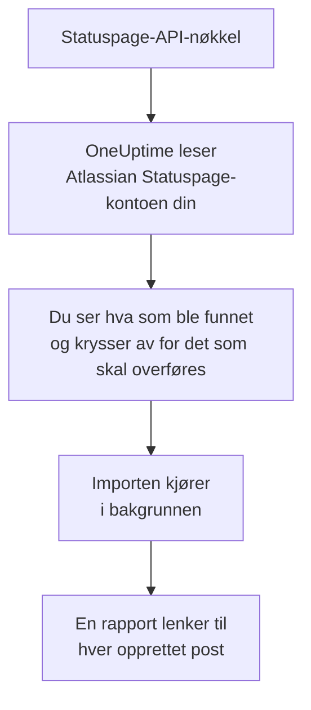

# Bytt fra Atlassian Statuspage

**Importer fra et annet verktøy** henter Atlassian Statuspage-sidene dine over til OneUptime på noen minutter. Med en Statuspage-API-nøkkel leser OneUptime sidene dine, komponentene og gruppene deres og e-postabonnentene deres, viser deg hva det fant, og oppretter det du krysser av for. Ingenting endres i Statuspage.

:::cards
- [Importer kontoen din](#importer-atlassian-statuspage-kontoen-din): Opprett en nøkkel, les kontoen din og kryss av for det som skal overføres.
- [Hva som overføres](#hva-som-overføres): Hva hver Statuspage-side, -komponent og -abonnent blir i OneUptime.
- [Fullfør byttet](#fullfør-byttet): Hva du gjør når importen er ferdig.
:::

## Slik fungerer det

- **Nøkkelen brukes én gang.** Den lagres kryptert mens OneUptime leser kontoen din, og slettes så snart lesingen er ferdig, enten den lyktes eller ikke. Den vises aldri igjen og skrives aldri til en logg.
- **OneUptime bare leser.** Det kaller bare Atlassian Statuspages eget API: `api.statuspage.io`. Det sender én forespørsel i sekundet, det meste Statuspage tillater en nøkkel. Når Atlassian Statuspage ber det senke tempoet, venter det og prøver igjen.
- **Ingenting opprettes før du starter importen.** Forhåndsvisningen viser for hvert element om det er nytt, allerede finnes i OneUptime (og brukes som det er), ble overført av en tidligere import, eller hvorfor det ikke kan overføres.
- **Å kjøre den på nytt oppretter aldri noe to ganger.** OneUptime husker hva hver import overførte, etter Atlassian Statuspage-ID-en. Kjør den på nytt etter at du har lagt til sider eller komponenter i Atlassian Statuspage, så opprettes bare de nye.

## Før du begynner

- **Et OneUptime-prosjekt og retten til å opprette det du overfører.** Prosjekteiere og prosjektadministratorer kan overføre alt. Andre roller kan også kjøre en import og overføre de typene poster de kan opprette. Resten vises som ikke overført, med årsaken.
- **En Statuspage-API-nøkkel.** Bare en kontoeier kan opprette en. Importen skriver aldri til Statuspage, og den leser hver side nøkkelen kan se.
- **Plass til sidene dine, i OneUptime Cloud.** Abonnementet ditt har plass til et visst antall statussider og abonnenter. Det som ikke får plass, vises som ikke overført. Komponentene blir manuelle monitorer, som er gratis.

## Importer Atlassian Statuspage-kontoen din

:::steps
### Opprett en API-nøkkel i Statuspage
Velg avataren din nederst til venstre i Statuspage og deretter **API info**. Velg **Create key**, kall den `OneUptime import`, og kopier den.

### Åpne importsiden
Gå til **Prosjektinnstillinger** > **Importer fra et annet verktøy** i OneUptime, og velg **Atlassian Statuspage**.

### Koble til Atlassian Statuspage
Lim inn nøkkelen i **Atlassian Statuspage-API-nøkkel**, og velg **Les Atlassian Statuspage-kontoen min**. En stor konto tar noen minutter, og du kan forlate siden mens den leses.

### Kryss av for det som skal overføres
Forhåndsvisningen viser hva som ble funnet, med én del per type. Alt som ville blitt opprettet, er avkrysset fra start, unntatt abonnenter. Under hvert element forteller OneUptime hva som ikke overføres akkurat som det var. Når en avkrysset statusside viser en monitor du ikke har krysset av for, sier det fra, og **Kryss av for dem også** krysser den av. For å overføre abonnenter krysser du dem av og bekrefter under dem at de har sagt ja til å få oppdateringene dine, og at du kan flytte dem. Ingen får e-post.

### Start importen
Velg **Start import**. Importen kjører i bakgrunnen: Du kan forlate siden, og rapporten venter på deg der.
:::

Rapporten teller hva som ble opprettet og ikke overført, og viser hvert element med en lenke til posten det ble til, feil først. Tidligere importer står under **Tidligere importer** på samme side.

## Hva som overføres

| I Atlassian Statuspage | I OneUptime | Hvordan |
| --- | --- | --- |
| Components | Manuelle monitorer | Hver komponent blir en manuell monitor som statussiden viser. Ingenting kontrollerer den: Du setter statusen i OneUptime, slik du gjorde i Statuspage. En komponentgruppe blir en gruppe på siden. |
| Pages | Statussider | Hver side overføres med navn og beskrivelse, komponentene i gruppene sine og oppetid og historikk for komponentene den fremhever. En side bare noen personer kan se, overføres som privat. |
| Email subscribers | Statussideabonnenter | Bekreftede e-postabonnenter overføres når du bekrefter at du kan flytte dem, og følger de samme komponentene. Ingen får e-post, og hver oppdatering de får fra OneUptime, har en lenke for å melde seg av. |

Komponenter overføres som i drift. Forhåndsvisningen nevner hver komponent som ikke er i drift i Statuspage akkurat nå, så du kan sette statusen etter importen.

## Hva som ikke overføres

- **Hendelser, planlagt vedlikehold og historikken deres.** En hendelse i OneUptime er en levende post som varsler personer, så tidligere hendelser blir i Statuspage.
- **Abonnenter via SMS, webhook, Slack eller Microsoft Teams.** Forhåndsvisningen teller dem. Bare e-postabonnenter overføres.
- **Hendelsesmaler og systemmetrikker.** Legg til det du fortsatt trenger, i OneUptime.
- **En statussides eget domene og merkevare.** Legg i OneUptime til domenet under **Egendefinerte domener** og logoen under **Merkevare**.

## Grenser

Én import oppretter høyst 2 000 poster: høyst 1 000 monitorer og 50 statussider. Abonnenter teller ikke med i det: Én import overfører høyst 5 000 abonnenter. Alt over en grense vises som ikke overført. Kjør importen på nytt for å overføre resten.

I OneUptime Cloud vises statussider og abonnenter som abonnementet ditt ikke har plass til, som ikke overført, med det de trenger.

En forhåndsvisning lagres i én dag. Bare personen som leste kontoen, kan krysse av og starte importen. Prosjekteiere og prosjektadministratorer ser fremdriften og rapporten for hver import.

## Fullfør byttet

:::steps
### Sjekk statussidene dine
Åpne hver side under **Statussider** og sammenlign den med den i Statuspage. Hver komponent er en manuell monitor: Endre statusen i OneUptime når noe endrer seg.

### Pek adressen til statussiden din mot OneUptime
Åpne siden under **Statussider**, legg til domenet ditt under **Egendefinerte domener**, og endre deretter DNS-oppføringen. Da kommer besøkende og abonnenter til den nye siden.

### Slå av siden din i Atlassian Statuspage
Når domenet ditt peker mot OneUptime, lukker du siden i Statuspage, så abonnentene ikke får beskjed to ganger.
:::

## Feilsøking

:::details Atlassian Statuspage godtok ikke API-nøkkelen
Sjekk at du kopierte hele nøkkelen, og at en kontoeier opprettet den under **API info**. En nøkkel hører til én Statuspage-organisasjon og leser bare sidene dens. Velg deretter **Prøv igjen**.
:::

:::details Abonnentene kan ikke overføres
Kryss av i boksen under dem som bekrefter at de har sagt ja til oppdateringene dine, og at du kan flytte dem: **Start import** venter på den. Abonnenter som aldri bekreftet abonnementet sitt i Statuspage, blir der.
:::

:::details Noen elementer kan ikke krysses av
Ved hvert står det hvorfor: et navn prosjektet allerede har, noe en tidligere import har overført, eller en post du ikke har tillatelse til å opprette, eller som abonnementet ditt ikke inkluderer.
:::

## Neste trinn

:::cards
- [Statussider – Oversikt](/docs/status-pages/index): Hva en statusside viser, og hvem som kan se den.
- [Abonnenter og kunngjøringer](/docs/status-pages/subscribers): Hvordan abonnenter får vite om hendelser.
- [Manuell overvåking](/docs/monitor/manual-monitor): En monitor du selv setter statusen på.
:::
