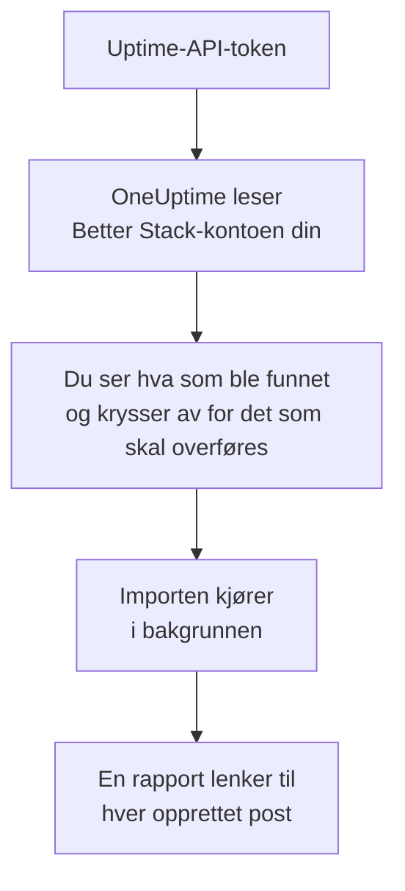

# Bytt fra Better Stack

**Importer fra et annet verktøy** henter Better Stack Uptime-monitorene, -heartbeatene og -statussidene dine over til OneUptime på noen minutter. Med et Uptime-API-token fra Better Stack leser OneUptime monitorene, heartbeatene, statussidene og e-postabonnentene deres, viser deg hva det fant, og oppretter det du krysser av for. Ingenting endres i Better Stack.

:::cards
- [Importer kontoen din](#importer-better-stack-kontoen-din): Opprett et token, les kontoen din og kryss av for det som skal overføres.
- [Hva som overføres](#hva-som-overføres): Hva hver Better Stack-monitor, -heartbeat og -statusside blir i OneUptime.
- [Fullfør byttet](#fullfør-byttet): Hva du gjør når importen er ferdig.
:::

## Slik fungerer det

- **Nøkkelen brukes én gang.** Den lagres kryptert mens OneUptime leser kontoen din, og slettes så snart lesingen er ferdig, enten den lyktes eller ikke. Den vises aldri igjen og skrives aldri til en logg.
- **OneUptime bare leser.** Det kaller bare Better Stacks eget API: `incidents.betterstack.com`. Når Better Stack ber det senke tempoet, venter det og prøver igjen.
- **Ingenting opprettes før du starter importen.** Forhåndsvisningen viser for hvert element om det er nytt, allerede finnes i OneUptime (og brukes som det er), ble overført av en tidligere import, eller hvorfor det ikke kan overføres.
- **Å kjøre den på nytt oppretter aldri noe to ganger.** OneUptime husker hva hver import overførte, etter Better Stack-ID-en. Kjør den på nytt etter at du har lagt til monitorer eller heartbeats i Better Stack, så opprettes bare de nye.

## Før du begynner

- **Et OneUptime-prosjekt og retten til å opprette det du overfører.** Prosjekteiere og prosjektadministratorer kan overføre alt. Andre roller kan også kjøre en import og overføre de typene poster de kan opprette. Resten vises som ikke overført, med årsaken.
- **Et Uptime-API-token fra Better Stack.** Bruk et teambasert Uptime-token: Det leser monitorene, heartbeatene og statussidene til det teamet. Importen skriver aldri til Better Stack.
- **En betalingsmåte, i OneUptime Cloud.** Monitorer som utfører kontroller, faktureres etter bruk, også på Free-abonnementet, så legg til en under **Prosjektinnstillinger** > **Fakturering** før du importerer. Uten en vises de monitorene som ikke overført.

## Importer Better Stack-kontoen din

:::steps
### Opprett et API-token i Better Stack
Gå til **API tokens** > **Team-based tokens** i Better Stack, og velg teamet ditt. Opprett et token med navnet `OneUptime import` under **Uptime API tokens**, og kopier det.

### Åpne importsiden
Gå til **Prosjektinnstillinger** > **Importer fra et annet verktøy** i OneUptime, og velg **Better Stack**.

### Koble til Better Stack
Lim inn tokenet i **Better Stack-API-nøkkel**, og velg **Les Better Stack-kontoen min**. En stor konto tar noen minutter, og du kan forlate siden mens den leses.

### Kryss av for det som skal overføres
Forhåndsvisningen viser hva som ble funnet, med én del per type. Alt som ville blitt opprettet, er avkrysset fra start, unntatt monitorer på pause, som overføres på pause hvis du krysser dem av, og abonnenter. Under hvert element forteller OneUptime hva som ikke overføres akkurat som det var. Når en avkrysset statusside viser en monitor du ikke har krysset av for, sier det fra, og **Kryss av for dem også** krysser den av. For å overføre abonnenter krysser du dem av og bekrefter under dem at de har sagt ja til å få oppdateringene dine, og at du kan flytte dem. Ingen får e-post.

### Start importen
Velg **Start import**. Importen kjører i bakgrunnen: Du kan forlate siden, og rapporten venter på deg der.
:::

Rapporten teller hva som ble opprettet og ikke overført, og viser hvert element med en lenke til posten det ble til, feil først. Tidligere importer står under **Tidligere importer** på samme side.

## Hva som overføres

| I Better Stack | I OneUptime | Hvordan |
| --- | --- | --- |
| Monitors and heartbeats | Monitorer | Hver monitor blir en monitor av samme type, med samme adresse, intervall og tidsavbrudd. Hver heartbeat blir en monitor for innkommende forespørsler. |
| Status pages | Statussider | Hver side overføres med seksjonene som grupper og monitorene og heartbeatene den viser. Et element du følger for hånd, blir en manuell monitor. En side med passord eller en IP-tillatelsesliste overføres som privat. |
| Email subscribers | Statussideabonnenter | Bekreftede e-postabonnenter overføres når du bekrefter at du kan flytte dem, og følger de samme ressursene. Ingen får e-post, og hver oppdatering de får fra OneUptime, har en lenke for å melde seg av. |

- **Status-, expected status code-, keyword- og keyword absence-monitorer** blir nettstedmonitorer, eller API-monitorer når de sender en annen metode, headere eller en JSON-body. En statusmonitor er oppe ved ethvert 2xx-svar, og en expected status code-monitor ved kodene den nevner.
- **Ping- og TCP-monitorer** blir ping- og portmonitorer. **SMTP-, POP- og IMAP-monitorer** blir portmonitorer på porten sin: OneUptime kontrollerer at porten svarer, ikke e-postsamtalen.
- **DNS-monitorer** blir DNS-monitorer for navnet de slår opp, hos den samme serveren.
- **Heartbeats** blir monitorer for innkommende forespørsler, som går ned når ingen forespørsel har kommet i løpet av perioden og fristen. Hver får en ny adresse i OneUptime.
- **SSL-utløpsvarsler.** En monitor som varsler før sertifikatet utløper, får også en SSL-sertifikatmonitor, oppkalt etter den, som varsler like mange dager i forveien.

Hver monitor kontrolleres fra prosjektets sonder, akkurat som en du oppretter selv. Et intervall OneUptime ikke tilbyr, blir det nærmeste det tilbyr, og et tidsavbrudd på over ett minutt blir ett minutt. Forhåndsvisningen sier fra når et av dem endres.

## Hva som ikke overføres

- **Oppetidshistorikk, svartider og hendelser.** OneUptime begynner å kontrollere når importen er ferdig.
- **Varslingskontakter og integrasjoner.** Velg i OneUptime hvem som får beskjed, som beskrevet i [Fullfør byttet](#fullfør-byttet).
- **Passord, og headere som kan inneholde en hemmelighet.** En monitor som logger inn, eller som sender en `Authorization`-, informasjonskapsel- eller token-header, overføres uten den: Legg den til med en [monitorhemmelighet](/docs/monitor/monitor-secrets).
- **UDP- og Playwright-monitorer.** OneUptime har ingen monitor som gjør det samme, og forhåndsvisningen nevner hver av dem.
- **Abonnenter som aldri bekreftet abonnementet sitt.** De blir i Better Stack.
- **Det en statusside viser i tillegg til monitorer, heartbeats og elementer som følges for hånd.** Forhåndsvisningen nevner hvert av dem.
- **En statussides eget domene og merkevare.** Legg i OneUptime til domenet under **Egendefinerte domener** og logoen under **Merkevare**.

## Grenser

Én import oppretter høyst 2 000 poster: høyst 1 000 monitorer og 50 statussider. Abonnenter teller ikke med i det: Én import overfører høyst 5 000 abonnenter. Alt over en grense vises som ikke overført. Kjør importen på nytt for å overføre resten.

I OneUptime Cloud trenger monitorer som utfører kontroller, en betalingsmåte, og det abonnementet ditt ikke har plass til, vises som ikke overført, med det det trenger.

En forhåndsvisning lagres i én dag. Bare personen som leste kontoen, kan krysse av og starte importen. Prosjekteiere og prosjektadministratorer ser fremdriften og rapporten for hver import.

## Fullfør byttet

:::steps
### Sjekk monitorene dine
Åpne hver av dem under **Monitorer** og sjekk de første resultatene. En heartbeat-monitor har en ny adresse: Pek jobben som kaller den, dit.

### Velg hvem som får beskjed
Legg til eiere på monitorene dine, eller en vaktretningslinje under **Vakttjeneste** > **Vaktretningslinjer** på hendelsene de åpner, slik at de riktige personene får vite det når noe går ned.

### Pek adressen til statussiden din mot OneUptime
Åpne siden under **Statussider**, legg til domenet ditt under **Egendefinerte domener**, og endre deretter DNS-oppføringen. Da kommer besøkende og abonnenter til den nye siden.

### Slå av kontrollene i Better Stack
Når OneUptime kontrollerer de samme tingene, setter du dem på pause i Better Stack, så ingen får beskjed to ganger.
:::

## Feilsøking

:::details Better Stack godtok ikke API-nøkkelen
Sjekk at du kopierte hele tokenet, og at det er teamets token fra **Uptime API tokens**, ikke et Telemetry-token. Velg deretter **Prøv igjen**.
:::

:::details En monitor vises som ikke overført
Det står hvorfor: en type monitor OneUptime ikke har, en adresse OneUptime ikke kan lese, eller et prosjekt uten plass eller betalingsmåte til den. En monitor OneUptime allerede kjører, med samme navn, type og adresse, brukes som den er.
:::

:::details Noen elementer kan ikke krysses av
Ved hvert står det hvorfor: et navn prosjektet allerede har, noe en tidligere import har overført, eller en post du ikke har tillatelse til å opprette, eller som abonnementet ditt ikke inkluderer.
:::

## Neste trinn

:::cards
- [Innkommende forespørsel-overvåking](/docs/monitor/incoming-request-monitor): Hvordan en heartbeat fungerer i OneUptime.
- [Statussider – Oversikt](/docs/status-pages/index): Hva en statusside viser, og hvem som kan se den.
- [Bytt fra UptimeRobot](/docs/moving-to-oneuptime/uptimerobot): Hent kontrollene dine over fra UptimeRobot.
:::
