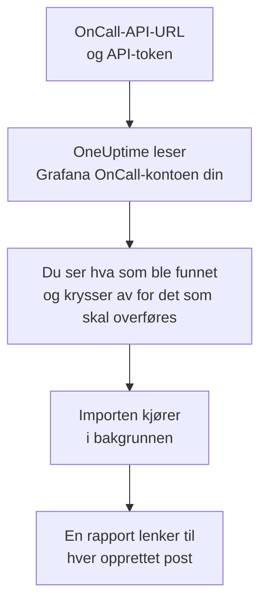

# Bytt fra Grafana OnCall

Grafana Labs arkiverte åpen kildekode-utgaven av Grafana OnCall i mars 2026, og i Grafana Cloud lever den videre som en del av Grafana Cloud IRM. Uansett hvor din kjører, henter **Importer fra et annet verktøy** vaktoppsettet ditt over til OneUptime på noen minutter. Med OnCall-API-URL-en din og et API-token leser OneUptime brukerne, teamene, vaktplanene og eskaleringskjedene dine, viser deg hva det fant, og oppretter det du krysser av for. Ingenting endres i Grafana OnCall.

:::cards
- [Importer kontoen din](#importer-grafana-oncall-kontoen-din): Opprett et token, les kontoen din og kryss av for det som skal overføres.
- [Hva som overføres](#hva-som-overføres): Hva hver Grafana OnCall-post blir i OneUptime.
- [Fullfør byttet](#fullfør-byttet): Hva du gjør når importen er ferdig.
:::

## Slik fungerer det

- **Tokenet brukes én gang.** Det lagres kryptert sammen med API-URL-en mens OneUptime leser kontoen din, og slettes så snart lesingen er ferdig, enten den lyktes eller ikke. Det vises aldri igjen og skrives aldri til en logg.
- **OneUptime bare leser, og bare fra adressen du oppgir.** Det kaller bare OnCall-API-URL-en du limer inn, høyst én gang i sekundet, og holder seg dermed innenfor Grafana OnCalls grense på 300 forespørsler per token på fem minutter. Når Grafana OnCall ber det senke tempoet, venter det og prøver igjen.
- **Adressen kontrolleres før hver forespørsel.** OneUptime kaller aldri maskinen det kjører på eller en metadatatjeneste i skyen, og følger aldri en omdirigering. I OneUptime Cloud må adressen dessuten være offentlig og begynne med `https://`. Et selvhostet OneUptime kan også lese et Grafana OnCall på ditt eget nettverk, med mindre administratoren har slått det av, som beskrevet i [Private Network Access](/docs/self-hosted/private-network-access).
- **Ingenting opprettes før du starter importen.** Forhåndsvisningen viser for hvert element om det er nytt, allerede finnes i OneUptime (og brukes som det er), ble overført av en tidligere import, eller hvorfor det ikke kan overføres.
- **Å kjøre den på nytt oppretter aldri noe to ganger.** OneUptime husker hva hver import overførte, etter Grafana OnCall-ID-en. Kjør den på nytt etter at du har lagt til personer eller vaktplaner i Grafana OnCall, så opprettes bare de nye.

## Før du begynner

- **Et OneUptime-prosjekt og retten til å opprette det du overfører.** Prosjekteiere og prosjektadministratorer kan overføre alt. Andre roller kan også kjøre en import og overføre de typene poster de kan opprette. Resten vises som ikke overført, med årsaken.
- **Et API-token fra Grafana OnCall.** Bruk et OnCall-API-token, ikke et token fra en Grafana-tjenestekonto. Importen skriver aldri til Grafana OnCall. Slett tokenet når importen er ferdig.
- **OnCall-API-URL-en din.** Innstillingene i OnCall viser den ved siden av API-tokenene. I Grafana Cloud ser den ut som `https://oncall-prod-us-central-0.grafana.net/oncall`. På din egen installasjon er det adressen til OnCall-motoren din.

## Importer Grafana OnCall-kontoen din

:::steps
### Opprett et API-token i Grafana OnCall
Åpne **OnCall** > **Settings** i Grafana. I Grafana Cloud åpner du **IRM** > **Settings** > **Admin & API**. Kopier OnCall-API-URL-en som vises der. Opprett et token med navnet `OneUptime import` under **API tokens**, og kopier det.

### Åpne importsiden
Gå til **Prosjektinnstillinger** > **Importer fra et annet verktøy** i OneUptime og velg **Grafana OnCall**.

### Koble til Grafana OnCall
Lim inn adressen i **Grafana OnCall-API-URL** og tokenet i **Grafana OnCall-API-nøkkel**, og velg **Les Grafana OnCall-kontoen min**. En stor konto tar noen minutter, og du kan forlate siden mens den leses.

### Kryss av for det som skal overføres
Forhåndsvisningen viser hva som ble funnet, med én del per type. Alt som ville blitt opprettet, er avkrysset fra start, unntatt personer som ikke er i noe team, noen vaktplan eller eskaleringskjede. Under hvert element forteller OneUptime hva som ikke overføres akkurat som det var. Når et avkrysset element bruker noe du ikke har krysset av for, sier det fra, og **Kryss av for dem også** krysser det av.

### Start importen
Hvis personer skal inviteres, velger du under **Inviter nye personer til** teamet de blir med i. Velg deretter **Start import**. Importen kjører i bakgrunnen: Du kan forlate siden, og rapporten venter på deg der.
:::

Rapporten teller hva som ble opprettet, invitert og ikke overført, og viser hvert element med en lenke til posten det ble til, feil først. Tidligere importer står under **Tidligere importer** på samme side.

## Hva som overføres

| I Grafana OnCall | I OneUptime | Hvordan |
| --- | --- | --- |
| Brukere | Prosjektmedlemmer | Kobles på e-postadresse. Alle som ikke er i prosjektet ennå, inviteres til teamet du velger. |
| Team | Team | Opprettes med medlemmene sine. Et team som prosjektet allerede har navnet på, brukes som det er, og medlemmene røres ikke. |
| Vaktplaner | Vaktplaner | Hver rotasjon blir et lag med de samme personene, samme start, samme overlevering og de samme vakttimene, i vaktplanens tidssone, eid av vaktplanens team. En rotasjon på et høyere lag går fortsatt foran lagene under. |
| Eskaleringskjeder | Vaktretningslinjer | Trinnene som varsler personer, et team eller den som har vakt i en vaktplan, blir eskaleringsregler, og et ventetrinn blir ventetiden før neste regel. Et trinn som gjentar kjeden, blir retningslinjens gjentakelser. |

Rotasjoner på samme lag som har vakt samtidig, og en rotasjon som setter flere personer på vakt på én gang, blir hver sin OneUptime-vaktplan, fordi en OneUptime-vaktplan har én person på vakt om gangen. Hver vaktretningslinje som varslet vaktplanen, varsler alle.

## Hva som ikke overføres

- **Varselgrupper og historikken deres.** OneUptime starter med oppsettet ditt, ikke med tidligere varsler.
- **Integrasjoner, ruter og utgående webhooks.** Pek i stedet monitorene og varselkildene dine mot OneUptime, som beskrevet i [Fullfør byttet](#fullfør-byttet).
- **Overstyringer, enkeltstående vakter og rotasjoner som allerede er avsluttet.** Legg til overstyringene du fortsatt trenger, i OneUptime etter importen.
- **Vakter fra en kalenderlenke.** En vaktplan der vaktene kommer fra en iCal-lenke, overføres uten lag, så legg dem til i OneUptime.
- **Hver persons varslingsregler.** Hver person velger hvordan de varsles, i sine egne **Brukerinnstillinger** når de har godtatt invitasjonen.
- **Trinn som OneUptime ikke har en eksakt motsvarighet til.** Et trinn som varsler en Slack-brukergruppe eller -kanal, kaller en webhook, erklærer en hendelse eller løser varselet, utelates. Et trinn som varsler personer én om gangen, varsler alle samtidig, et trinn som bare fortsetter på bestemte tider eller ved et bestemt antall varsler, fortsetter alltid, og forhåndsvisningen sier hva som endres.

## Grenser

Én import oppretter høyst 2 000 poster: høyst 500 personer, 200 team, 200 vaktplaner og 200 vaktretningslinjer. Alt over en grense vises som ikke overført. Kjør importen på nytt for å overføre resten.

I OneUptime Cloud vises poster som abonnementet ditt ikke inkluderer, som ikke overført, med abonnementet de trenger.

En forhåndsvisning lagres i én dag. Bare personen som leste kontoen, kan krysse av og starte importen. Prosjekteiere og prosjektadministratorer ser fremdriften og rapporten for hver import.

## Fullfør byttet

:::steps
### Sjekk vaktplanene
Åpne hver vaktplan under **Vakttjeneste** > **Vaktplaner** og sjekk hvem som har vakt nå, og hvem som er neste.

### Sørg for at alle kan varsles
Inviterte personer godtar invitasjonen og legger deretter til et telefonnummer, en e-postadresse eller mobilappen de kan varsles på. **Vakttjeneste** > **Beredskap** viser hvem som ikke kan nås ennå.

### Send varslene dine til OneUptime
Pek monitorene dine og verktøyene som utløser varsler, mot OneUptime, og varsle deg selv én gang for å teste det.

### Slå av varsling i Grafana OnCall
Når OneUptime varsler de riktige personene, slår du av varslene i Grafana OnCall, så ingen varsles to ganger.
:::

## Feilsøking

:::details Grafana OnCall godtok ikke API-nøkkelen
Sjekk at du kopierte hele tokenet, at det er et OnCall-API-token og ikke et token fra en Grafana-tjenestekonto, og at API-URL-en er den som vises ved siden av det. Velg deretter **Prøv igjen**.
:::

:::details OneUptime kalte ikke API-URL-en
Lim inn OnCall-API-URL-en nøyaktig slik innstillingene i OnCall viser den. I OneUptime Cloud må den begynne med `https://` og kunne nås fra internett. Et selvhostet OneUptime kan også nå en adresse på ditt eget nettverk, med mindre administratoren har slått det av, men aldri en adresse på maskinen OneUptime kjører på.
:::

:::details En type post mangler i forhåndsvisningen
Tokenet kunne ikke lese den, og forhåndsvisningen sier det øverst. Et token leser det personen som opprettet det, har lov til å se, så opprett det som administrator i Grafana OnCall og les kontoen på nytt.
:::

:::details Noen elementer kan ikke krysses av
Ved hvert står det hvorfor: et navn prosjektet allerede har, noe en tidligere import har overført, eller en post du ikke har tillatelse til å opprette, eller som abonnementet ditt ikke inkluderer.
:::

## Neste trinn

:::cards
- [Vaktplaner](/docs/on-call/schedules): Lag, begrensninger og overleveringer.
- [Eskaleringsregler](/docs/on-call/escalation-rules): Hvordan vaktretningslinjer varsler personer.
- [Bytt fra PagerDuty](/docs/moving-to-oneuptime/pagerduty): Hent et team over fra PagerDuty.
:::
