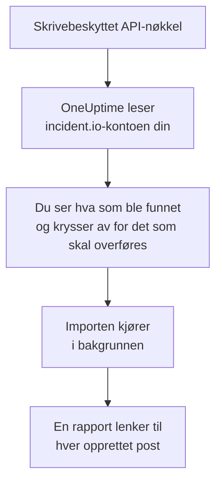

# Bytt fra incident.io

**Importer fra et annet verktøy** henter incident.io-oppsettet ditt inn i OneUptime på noen minutter. Med en skrivebeskyttet incident.io-API-nøkkel leser OneUptime brukerne, teamene, vaktplanene, eskaleringsbanene, tjenestene og hendelsesinnstillingene dine, viser deg hva det fant, og oppretter det du krysser av for. Ingenting endres i incident.io.

:::cards
- [Importer kontoen din](#importer-incidentio-kontoen-din): Opprett en nøkkel, les kontoen din og kryss av for det som skal overføres.
- [Hva som overføres](#hva-som-overføres): Hva hver incident.io-post blir i OneUptime.
- [Fullfør byttet](#fullfør-byttet): Hva du gjør når importen er ferdig.
:::

## Slik fungerer det

- **Nøkkelen brukes én gang.** Den lagres kryptert mens OneUptime leser kontoen din, og slettes så snart lesingen er ferdig, enten den lyktes eller ikke. Den vises aldri igjen og skrives aldri til en logg.
- **OneUptime bare leser.** Det kaller bare incident.ios eget API, `api.incident.io`. Når incident.io ber det senke tempoet, venter det og prøver igjen.
- **Ingenting opprettes før du starter importen.** Forhåndsvisningen viser for hvert element om det er nytt, allerede finnes i OneUptime (og brukes som det er), ble overført av en tidligere import, eller hvorfor det ikke kan overføres.
- **Å kjøre den på nytt oppretter aldri noe to ganger.** OneUptime husker hva hver import overførte, etter incident.io-ID-en. Kjør den på nytt etter at du har lagt til personer eller vaktplaner i incident.io, så opprettes bare de nye.

## Før du begynner

- **Et OneUptime-prosjekt og retten til å opprette det du overfører.** Prosjekteiere og prosjektadministratorer kan overføre alt. Andre roller kan også kjøre en import og overføre de typene poster de kan opprette. Resten vises som ikke overført, med årsaken.
- **En incident.io-API-nøkkel som bare kan se data.** Importen skriver aldri til incident.io, så nøkkelen trenger ingen tillatelse til å opprette, redigere eller administrere noe.

## Importer incident.io-kontoen din

:::steps
### Opprett en API-nøkkel i incident.io
Gå til **Settings** > **API keys** i incident.io og velg **Add new**. Kall den `OneUptime import`, gi den bare tillatelser til å se data, ingen til å opprette, redigere eller administrere, og kopier nøkkelen.

### Åpne importsiden
Gå til **Prosjektinnstillinger** > **Importer fra et annet verktøy** i OneUptime og velg **incident.io**.

### Koble til incident.io
Lim inn nøkkelen i **incident.io-API-nøkkel** og velg **Les incident.io-kontoen min**. En stor konto tar noen minutter, og du kan forlate siden mens den leses.

### Kryss av for det som skal overføres
Forhåndsvisningen viser hva som ble funnet, med én del per type. Alt som ville blitt opprettet, er avkrysset fra start, unntatt personer som ikke er i noe team, noen vaktplan eller eskaleringsbane. Under hvert element forteller OneUptime hva som ikke overføres akkurat som det var. Når et avkrysset element bruker noe du ikke har krysset av for, sier det fra, og **Kryss av for dem også** krysser det av.

### Start importen
Hvis personer skal inviteres, velger du under **Inviter nye personer til** teamet de blir med i. Velg deretter **Start import**. Importen kjører i bakgrunnen: Du kan forlate siden, og rapporten venter på deg der.
:::

Rapporten teller hva som ble opprettet, invitert og ikke overført, og viser hvert element med en lenke til posten det ble til, feil først. Tidligere importer står under **Tidligere importer** på samme side.

## Hva som overføres

| I incident.io | I OneUptime | Hvordan |
| --- | --- | --- |
| Brukere | Prosjektmedlemmer | Kobles på e-postadresse. Alle som ikke er i prosjektet ennå, inviteres til teamet du velger. Deaktiverte brukere overføres ikke. |
| Team | Team | Opprettes med medlemmene sine. Et team som prosjektet allerede har navnet på, brukes som det er, og medlemmene røres ikke. |
| Vaktplaner | Vaktplaner | Hver rotasjon blir et lag med de samme personene, samme start, samme vaktlengde og samme arbeidstid, i vaktplanens tidssone. Versjonen av rotasjonen som gjelder nå, er den som overføres. |
| Eskaleringsbaner | Vaktretningslinjer | Hvert nivå blir en eskaleringsregel som varsler de samme vaktplanene, brukerne og teamene etter samme ventetid. En gjentakelse blir retningslinjens gjentakelser, og fra en forgrening overføres den første banen. |
| Katalogtjenester | Tjenester | Oppføringene i katalogtypene dine i tjenestekategorien, opprettet i tjenestekatalogen. Arkiverte oppføringer utelates. |
| Alvorlighetsgrader | Hendelsesalvorligheter | Opprettes i incident.ios rekkefølge, den mest alvorlige først. En alvorlighetsgrad som prosjektet allerede har navnet på, brukes som den er. |
| Statuser | Hendelsestilstander | En triagestatus tilsvarer tilstanden OneUptime starter hendelser i, og en lukket status tilstanden der hendelser er løst. Aktive og pausede statuser opprettes mellom Bekreftet og Løst. |
| Hendelsesroller | Hendelsesroller | Den ledende rollen tilsvarer OneUptimes hendelsesleder, og de andre rollene opprettes. OneUptime registrerer hvem som meldte hver hendelse, så rapportørrollen trengs ikke. |
| Egendefinerte felt | Egendefinerte hendelsesfelt | Felt med ett valg blir nedtrekkslister, felt med flere valg nedtrekkslister med flervalg, tekst- og lenkefelt tekst og numeriske felt tall, med alternativene sine. |

En rotasjon med flere personer på vakt samtidig blir én OneUptime-vaktplan per person på vakt, fordi en OneUptime-vaktplan har én person på vakt om gangen. Hver vaktretningslinje som varslet vaktplanen, varsler alle.

## Hva som ikke overføres

- **Hendelser, varsler og historikken deres.** OneUptime starter med oppsettet ditt, ikke med tidligere hendelser.
- **Workflows, statussider, alert routes og integrasjoner.** Pek i stedet monitorene og varselkildene dine mot OneUptime, som beskrevet i [Fullfør byttet](#fullfør-byttet).
- **Egendefinerte felt der alternativene kommer fra katalogen,** og statuser som OneUptime ikke har en tilstand for: declined, merged, canceled og learning.
- **Overstyringer av vaktplaner, og endringer i en rotasjon som er planlagt til senere.** Forhåndsvisningen nevner hver planlagte endring, så du kan gjøre den i OneUptime når den skal skje.
- **Eskaleringstrinn som OneUptime ikke har en eksakt motsvarighet til.** Et trinn som poster i en Slack- eller Microsoft Teams-kanal, utelates, fordi arbeidsområdets varslingsregler gjør det i OneUptime, og det samme gjelder et trinn som gir videre til en annen eskaleringsbane. Et trinn som varsler den som har vakt neste gang, overføres som det nærmeste OneUptime har, og forhåndsvisningen sier hva som endres.

## Grenser

Én import oppretter høyst 2 000 poster: høyst 500 personer, 200 team, 200 vaktplaner, 200 vaktretningslinjer, 500 tjenester, 100 egendefinerte hendelsesfelt og 25 av hver av hendelsesalvorligheter, hendelsestilstander og hendelsesroller. Alt over en grense vises som ikke overført. Kjør importen på nytt for å overføre resten.

I OneUptime Cloud vises poster som abonnementet ditt ikke inkluderer, som ikke overført, med abonnementet de trenger.

En forhåndsvisning lagres i én dag. Bare personen som leste kontoen, kan krysse av og starte importen. Prosjekteiere og prosjektadministratorer ser fremdriften og rapporten for hver import.

## Fullfør byttet

:::steps
### Sjekk vaktplanene
Åpne hver vaktplan under **Vakttjeneste** > **Vaktplaner** og sjekk hvem som har vakt nå, og hvem som er neste.

### Sørg for at alle kan varsles
Inviterte personer godtar invitasjonen og legger deretter til et telefonnummer, en e-postadresse eller mobilappen de kan varsles på. **Vakttjeneste** > **Beredskap** viser hvem som ikke kan nås ennå.

### Send varslene dine til OneUptime
Pek monitorene dine og verktøyene som utløser varsler, mot OneUptime, og varsle deg selv én gang for å teste det.

### Slå av varsling i incident.io
Når OneUptime varsler de riktige personene, slår du av varslene i incident.io, så ingen varsles to ganger.
:::

## Feilsøking

:::details incident.io godtok ikke API-nøkkelen
Sjekk at du kopierte hele nøkkelen, og at den ikke er slettet under **Settings** > **API keys**. Velg deretter **Prøv igjen**.
:::

:::details En type post mangler i forhåndsvisningen
Nøkkelen kunne ikke lese den, og forhåndsvisningen sier det øverst. Gi nøkkelen tillatelse til å se den typen data, og les kontoen på nytt.
:::

:::details Noen elementer kan ikke krysses av
Ved hvert står det hvorfor: en deaktivert bruker, et navn prosjektet allerede har, noe en tidligere import har overført, eller en post du ikke har tillatelse til å opprette, eller som abonnementet ditt ikke inkluderer.
:::

## Neste trinn

:::cards
- [Vaktplaner](/docs/on-call/schedules): Lag, begrensninger og overleveringer.
- [Hendelsestilstander og alvorlighetsgrader](/docs/incidents/states-and-severities): Tilstandene og alvorlighetsgradene hendelser går gjennom.
- [Bytt fra Opsgenie](/docs/moving-to-oneuptime/opsgenie): Hent et team over fra Opsgenie.
:::
