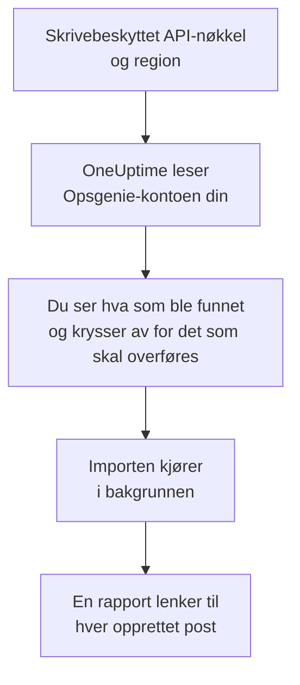

# Bytt fra Opsgenie

Atlassian legger ned Opsgenie: Opsgenie har ikke blitt solgt siden juni 2025, og støtten avsluttes i april 2027. OneUptime er et nytt hjem for vaktteamet ditt, og **Importer fra et annet verktøy** henter det over på noen minutter. Med en skrivebeskyttet Opsgenie-API-nøkkel leser OneUptime brukerne, teamene, vaktplanene, eskaleringene og tjenestene dine, viser deg hva det fant, og oppretter det du krysser av for. Ingenting endres i Opsgenie.

:::cards
- [Importer kontoen din](#importer-opsgenie-kontoen-din): Opprett en nøkkel, les kontoen din og kryss av for det som skal overføres.
- [Hva som overføres](#hva-som-overføres): Hva hver Opsgenie-post blir i OneUptime.
- [Fullfør byttet](#fullfør-byttet): Hva du gjør når importen er ferdig.
:::

## Slik fungerer det

- **Nøkkelen brukes én gang.** Den lagres kryptert mens OneUptime leser kontoen din, og slettes så snart lesingen er ferdig, enten den lyktes eller ikke. Den vises aldri igjen og skrives aldri til en logg.
- **OneUptime bare leser.** Det kaller bare Opsgenies eget API: `api.opsgenie.com`, eller `api.eu.opsgenie.com` for en konto i Europa. Når Opsgenie ber det senke tempoet, venter det og prøver igjen.
- **Ingenting opprettes før du starter importen.** Forhåndsvisningen viser for hvert element om det er nytt, allerede finnes i OneUptime (og brukes som det er), ble overført av en tidligere import, eller hvorfor det ikke kan overføres.
- **Å kjøre den på nytt oppretter aldri noe to ganger.** OneUptime husker hva hver import overførte, etter Opsgenie-ID-en. Kjør den på nytt etter at du har lagt til personer eller vaktplaner i Opsgenie, så opprettes bare de nye.

## Før du begynner

- **Et OneUptime-prosjekt og retten til å opprette det du overfører.** Prosjekteiere og prosjektadministratorer kan overføre alt. Andre roller kan også kjøre en import og overføre de typene poster de kan opprette. Resten vises som ikke overført, med årsaken.
- **En Opsgenie-API-nøkkel med tilgangene Read og Configuration access.** Configuration access er det som lar en nøkkel lese brukere, team, vaktplaner og eskaleringer. Importen skriver aldri til Opsgenie.
- **Opsgenie-regionen din.** Hvis du logger inn på `app.eu.opsgenie.com`, ligger kontoen din i Europa. Ellers ligger den i USA.

## Importer Opsgenie-kontoen din

:::steps
### Opprett en API-nøkkel i Opsgenie
Gå til **Settings** > **API key management** i Opsgenie og velg **Add new API key**. Kall den `OneUptime import`, gi den bare **Read** og **Configuration access**, og kopier nøkkelen.

### Åpne importsiden
Gå til **Prosjektinnstillinger** > **Importer fra et annet verktøy** i OneUptime og velg **Opsgenie**.

### Koble til Opsgenie
Under **Hvor er Opsgenie-kontoen din?** velger du **USA** eller **Europa**. Lim inn nøkkelen i **Opsgenie-API-nøkkel** og velg **Les Opsgenie-kontoen min**. En stor konto tar noen minutter, og du kan forlate siden mens den leses.

### Kryss av for det som skal overføres
Forhåndsvisningen viser hva som ble funnet, med én del per type. Alt som ville blitt opprettet, er avkrysset fra start, unntatt vaktplaner som er slått av i Opsgenie, og personer som ikke er i noe team, noen vaktplan eller eskalering. Under hvert element forteller OneUptime hva som ikke overføres akkurat som det var. Når et avkrysset element bruker noe du ikke har krysset av for, sier det fra, og **Kryss av for dem også** krysser det av.

### Start importen
Hvis personer skal inviteres, velger du under **Inviter nye personer til** teamet de blir med i. Velg deretter **Start import**. Importen kjører i bakgrunnen: Du kan forlate siden, og rapporten venter på deg der.
:::

Rapporten teller hva som ble opprettet, invitert og ikke overført, og viser hvert element med en lenke til posten det ble til, feil først. Tidligere importer står under **Tidligere importer** på samme side.

## Hva som overføres

| I Opsgenie | I OneUptime | Hvordan |
| --- | --- | --- |
| Brukere | Prosjektmedlemmer | Kobles på e-postadresse. Alle som ikke er i prosjektet ennå, inviteres til teamet du velger. Blokkerte brukere overføres ikke. |
| Team | Team | Opprettes med medlemmene sine. Et team som prosjektet allerede har navnet på, brukes som det er, og medlemmene røres ikke. |
| Vaktplaner | Vaktplaner | Hver rotasjon blir et lag med de samme personene, samme start, samme vaktlengde og samme tidsbegrensning, i vaktplanens tidssone, eid av vaktplanens team. |
| Eskaleringer | Vaktretningslinjer | Hver regel blir en eskaleringsregel som varsler den samme vaktplanen, brukeren eller det samme teamet. Regler med samme forsinkelse varsler sammen, og ventetiden før neste eskaleringsregel er forskjellen mellom forsinkelsene. Eskaleringens gjentakelser blir retningslinjens gjentakelser. |
| Tjenester | Tjenester | Opprettes i tjenestekatalogen, eid av teamet sitt. |

En vaktplan der rotasjonene setter to personer på vakt samtidig, blir én OneUptime-vaktplan per rotasjon, fordi en OneUptime-vaktplan har én person på vakt om gangen. Hver vaktretningslinje som varslet vaktplanen, varsler alle.

## Hva som ikke overføres

- **Varsler, hendelser og historikken deres.** OneUptime starter med oppsettet ditt, ikke med tidligere varsler.
- **Integrasjoner, heartbeats, varslingsretningslinjer og rutingregler.** Pek i stedet monitorene og varselkildene dine mot OneUptime, som beskrevet i [Fullfør byttet](#fullfør-byttet).
- **Overstyringer av vaktplaner, og rotasjoner som allerede er avsluttet.** Legg til overstyringene du fortsatt trenger, i OneUptime etter importen.
- **Hver persons varslingsregler.** Hver person velger hvordan de varsles, i sine egne **Brukerinnstillinger** når de har godtatt invitasjonen.
- **Trinn som OneUptime ikke har en eksakt motsvarighet til.** En regel som varsler den som har vakt neste gang, eller et teams administratorer, overføres som det nærmeste OneUptime har, og forhåndsvisningen sier hva som endres.

## Grenser

Én import oppretter høyst 2 000 poster: høyst 500 personer, 200 team, 200 vaktplaner, 200 vaktretningslinjer og 500 tjenester. Alt over en grense vises som ikke overført. Kjør importen på nytt for å overføre resten.

I OneUptime Cloud vises poster som abonnementet ditt ikke inkluderer, som ikke overført, med abonnementet de trenger.

En forhåndsvisning lagres i én dag. Bare personen som leste kontoen, kan krysse av og starte importen. Prosjekteiere og prosjektadministratorer ser fremdriften og rapporten for hver import.

## Fullfør byttet

:::steps
### Sjekk vaktplanene
Åpne hver vaktplan under **Vakttjeneste** > **Vaktplaner** og sjekk hvem som har vakt nå, og hvem som er neste.

### Sørg for at alle kan varsles
Inviterte personer godtar invitasjonen og legger deretter til et telefonnummer, en e-postadresse eller mobilappen de kan varsles på. **Vakttjeneste** > **Beredskap** viser hvem som ikke kan nås ennå.

### Send varslene dine til OneUptime
Pek monitorene dine og verktøyene som utløser varsler, mot OneUptime, og varsle deg selv én gang for å teste det.

### Slå av varsling i Opsgenie
Når OneUptime varsler de riktige personene, slår du av varslene i Opsgenie, så ingen varsles to ganger.
:::

## Feilsøking

:::details Opsgenie godtok ikke API-nøkkelen
Sjekk at du kopierte hele nøkkelen, at det er en nøkkel fra **API key management** og ikke en integrasjons nøkkel, at den har **Read** og **Configuration access**, og at du valgte regionen kontoen din ligger i. Velg deretter **Prøv igjen**.
:::

:::details En type post mangler i forhåndsvisningen
Nøkkelen kunne ikke lese den, og forhåndsvisningen sier det øverst. Gi nøkkelen **Configuration access** og les kontoen på nytt.
:::

:::details Noen elementer kan ikke krysses av
Ved hvert står det hvorfor: en blokkert bruker, et navn prosjektet allerede har, noe en tidligere import har overført, eller en post du ikke har tillatelse til å opprette, eller som abonnementet ditt ikke inkluderer.
:::

## Neste trinn

:::cards
- [Vaktplaner](/docs/on-call/schedules): Lag, begrensninger og overleveringer.
- [Eskaleringsregler](/docs/on-call/escalation-rules): Hvordan vaktretningslinjer varsler personer.
- [Bytt fra incident.io](/docs/moving-to-oneuptime/incident-io): Hent et team over fra incident.io.
:::
