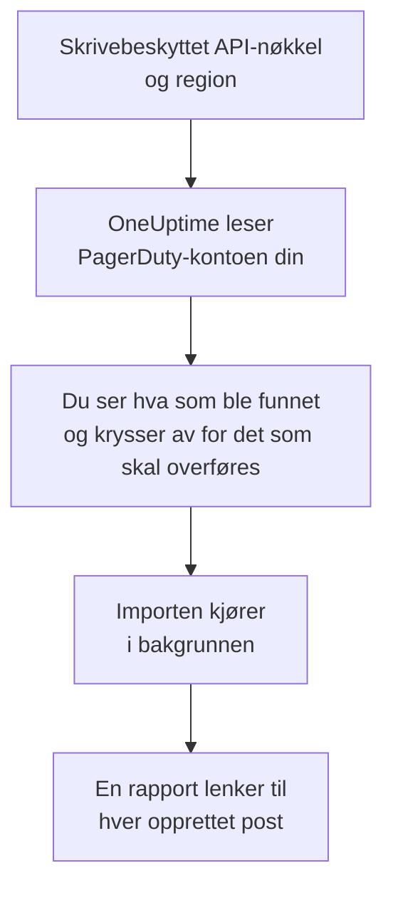

# Bytt fra PagerDuty

**Importer fra et annet verktøy** henter PagerDuty-oppsettet ditt over til OneUptime på noen minutter. Med en skrivebeskyttet PagerDuty-API-nøkkel leser OneUptime brukerne, teamene, vaktplanene, eskaleringsretningslinjene og tjenestene dine, viser deg hva det fant, og oppretter det du krysser av for. Ingenting endres i PagerDuty.

:::cards
- [Importer kontoen din](#importer-pagerduty-kontoen-din): Opprett en nøkkel, les kontoen din og kryss av for det som skal overføres.
- [Hva som overføres](#hva-som-overføres): Hva hver PagerDuty-post blir i OneUptime.
- [Fullfør byttet](#fullfør-byttet): Hva du gjør når importen er ferdig.
:::

## Slik fungerer det

- **Nøkkelen brukes én gang.** Den lagres kryptert mens OneUptime leser kontoen din, og slettes så snart lesingen er ferdig, enten den lyktes eller ikke. Den vises aldri igjen og skrives aldri til en logg.
- **OneUptime bare leser.** Det kaller bare PagerDutys eget REST-API: `api.pagerduty.com`, eller `api.eu.pagerduty.com` for en konto i Europa. Når PagerDuty ber det senke tempoet, venter det og prøver igjen.
- **Ingenting opprettes før du starter importen.** Forhåndsvisningen viser for hvert element om det er nytt, allerede finnes i OneUptime (og brukes som det er), ble overført av en tidligere import, eller hvorfor det ikke kan overføres.
- **Å kjøre den på nytt oppretter aldri noe to ganger.** OneUptime husker hva hver import overførte, etter PagerDuty-ID-en. Kjør den på nytt etter at du har lagt til personer eller vaktplaner i PagerDuty, så opprettes bare de nye.

## Før du begynner

- **Et OneUptime-prosjekt og retten til å opprette det du overfører.** Prosjekteiere og prosjektadministratorer kan overføre alt. Andre roller kan også kjøre en import og overføre de typene poster de kan opprette. Resten vises som ikke overført, med årsaken.
- **En skrivebeskyttet REST-API-nøkkel fra PagerDuty.** Administratorer og kontoeiere i PagerDuty kan opprette en. Importen skriver aldri til PagerDuty, så nøkkelen trenger bare lesetilgang.
- **PagerDuty-regionen din.** Hvis du logger inn på en adresse som slutter på `eu.pagerduty.com`, ligger kontoen din i Europa. Ellers ligger den i USA.

## Importer PagerDuty-kontoen din

:::steps
### Opprett en API-nøkkel i PagerDuty
Gå til **Integrations** > **Developer Tools** > **API Access Keys** i PagerDuty og velg **Create New API Key**. Beskriv den som `OneUptime import`, kryss av for **Read-only API Key**, velg **Create Key**, og kopier nøkkelen.

### Åpne importsiden
Gå til **Prosjektinnstillinger** > **Importer fra et annet verktøy** i OneUptime og velg **PagerDuty**.

### Koble til PagerDuty
Under **Hvor er PagerDuty-kontoen din?** velger du **USA** eller **Europa**. Lim inn nøkkelen i **PagerDuty-API-nøkkel** og velg **Les PagerDuty-kontoen min**. En stor konto tar noen minutter, og du kan forlate siden mens den leses.

### Kryss av for det som skal overføres
Forhåndsvisningen viser hva som ble funnet, med én del per type. Alt som ville blitt opprettet, er avkrysset fra start, unntatt tjenester som er slått av i PagerDuty, og personer som ikke er i noe team, noen vaktplan eller eskaleringsretningslinje. Under hvert element forteller OneUptime hva som ikke overføres akkurat som det var. Når et avkrysset element bruker noe du ikke har krysset av for, sier det fra, og **Kryss av for dem også** krysser det av.

### Start importen
Hvis personer skal inviteres, velger du under **Inviter nye personer til** teamet de blir med i. Velg deretter **Start import**. Importen kjører i bakgrunnen: Du kan forlate siden, og rapporten venter på deg der.
:::

Rapporten teller hva som ble opprettet, invitert og ikke overført, og viser hvert element med en lenke til posten det ble til, feil først. Tidligere importer står under **Tidligere importer** på samme side.

## Hva som overføres

| I PagerDuty | I OneUptime | Hvordan |
| --- | --- | --- |
| Brukere | Prosjektmedlemmer | Kobles på e-postadresse. Alle som ikke er i prosjektet ennå, inviteres til teamet du velger. |
| Team | Team | Opprettes med medlemmene sine. Et team som prosjektet allerede har navnet på, brukes som det er, og medlemmene røres ikke. |
| Vaktplaner | Vaktplaner | Hvert lag blir et lag med de samme personene, samme start, samme vaktlengde og de samme begrensningene, i vaktplanens tidssone, eid av vaktplanens team. Lagene beholder rekkefølgen, så et høyere lag går fortsatt foran lagene under. |
| Eskaleringsretningslinjer | Vaktretningslinjer | Hver eskaleringsregel blir en eskaleringsregel som varsler de samme vaktplanene og brukerne og eskalerer etter den samme forsinkelsen. Retningslinjens gjentakelser blir vaktretningslinjens gjentakelser. |
| Tjenester | Tjenester | Opprettes i tjenestekatalogen, eid av teamet sitt. En tjeneste som er slått av i PagerDuty, er ikke avkrysset fra start. |

En PagerDuty-vaktplan forblir én OneUptime-vaktplan: Lagene går foran hverandre slik de gjør i PagerDuty. Et lag der vaktene ikke varer et helt antall timer, overføres med vakter avrundet til timen, og forhåndsvisningen sier det.

## Hva som ikke overføres

- **Hendelser, varsler og historikken deres.** OneUptime starter med oppsettet ditt, ikke med tidligere hendelser.
- **Integrasjoner, Event Orchestrations, Incident Workflows og statussider.** Pek i stedet monitorene og varselkildene dine mot OneUptime, som beskrevet i [Fullfør byttet](#fullfør-byttet).
- **Overstyringer av vaktplaner, og lag som allerede er avsluttet.** Legg til overstyringene du fortsatt trenger, i OneUptime etter importen.
- **Vaktbaserte vaktplaner.** Importen leser PagerDutys vaktplaner med lag, ikke de nyere vaktbaserte vaktplanene (shift-based schedules). Hvis kontoen din har noen, sier forhåndsvisningen det øverst, og en eskaleringsregel som varsler en av dem, overføres uten den. Opprett dem i OneUptime.
- **Hver persons varslingsregler.** Hver person velger hvordan de varsles, i sine egne **Brukerinnstillinger** når de har godtatt invitasjonen.
- **Regler som OneUptime ikke har en eksakt motsvarighet til.** En eskaleringsregel som fordeler personene sine på omgang (round robin), varsler alle samtidig i OneUptime, og forhåndsvisningen sier hva som endres.

## Grenser

Én import oppretter høyst 2 000 poster: høyst 500 personer, 200 team, 200 vaktplaner, 200 vaktretningslinjer og 500 tjenester. Alt over en grense vises som ikke overført. Kjør importen på nytt for å overføre resten.

I OneUptime Cloud vises poster som abonnementet ditt ikke inkluderer, som ikke overført, med abonnementet de trenger.

En forhåndsvisning lagres i én dag. Bare personen som leste kontoen, kan krysse av og starte importen. Prosjekteiere og prosjektadministratorer ser fremdriften og rapporten for hver import.

## Fullfør byttet

:::steps
### Sjekk vaktplanene
Åpne hver vaktplan under **Vakttjeneste** > **Vaktplaner** og sjekk hvem som har vakt nå, og hvem som er neste.

### Sørg for at alle kan varsles
Inviterte personer godtar invitasjonen og legger deretter til et telefonnummer, en e-postadresse eller mobilappen de kan varsles på. **Vakttjeneste** > **Beredskap** viser hvem som ikke kan nås ennå.

### Send varslene dine til OneUptime
Pek monitorene dine og verktøyene som utløser varsler, mot OneUptime, og varsle deg selv én gang for å teste det.

### Slå av varsling i PagerDuty
Når OneUptime varsler de riktige personene, slår du av varslene i PagerDuty, så ingen varsles to ganger.
:::

## Feilsøking

:::details PagerDuty godtok ikke API-nøkkelen
Sjekk at du kopierte hele nøkkelen, at det er en REST-API-nøkkel fra **API Access Keys** og ikke en integrasjonsnøkkel, og at du valgte regionen kontoen din ligger i. Velg deretter **Prøv igjen**.
:::

:::details En type post mangler i forhåndsvisningen
Nøkkelen kunne ikke lese den, og forhåndsvisningen sier det øverst. Noen typer finnes bare i PagerDuty-abonnementer som inkluderer dem, for eksempel team. Les kontoen på nytt med en nøkkel som kan lese dem.
:::

:::details Noen elementer kan ikke krysses av
Ved hvert står det hvorfor: et navn prosjektet allerede har, noe en tidligere import har overført, eller en post du ikke har tillatelse til å opprette, eller som abonnementet ditt ikke inkluderer.
:::

## Neste trinn

:::cards
- [Vaktplaner](/docs/on-call/schedules): Lag, begrensninger og overleveringer.
- [Eskaleringsregler](/docs/on-call/escalation-rules): Hvordan vaktretningslinjer varsler personer.
- [Bytt fra Opsgenie](/docs/moving-to-oneuptime/opsgenie): Hent et team over fra Opsgenie.
:::
