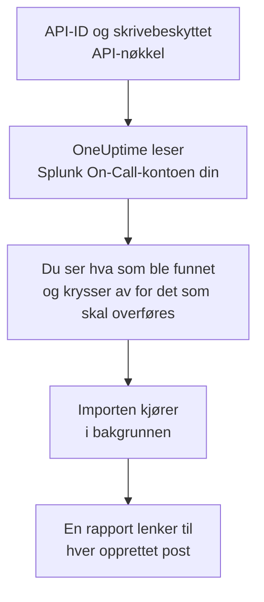

# Bytt fra Splunk On-Call

**Importer fra et annet verktøy** henter Splunk On-Call-oppsettet ditt (tidligere VictorOps) over til OneUptime på noen minutter. Med API-ID-en din og en skrivebeskyttet API-nøkkel leser OneUptime brukerne, teamene, rotasjonene og eskaleringsretningslinjene dine, viser deg hva det fant, og oppretter det du krysser av for. Ingenting endres i Splunk On-Call.

:::cards
- [Importer kontoen din](#importer-splunk-on-call-kontoen-din): Opprett en nøkkel, les kontoen din og kryss av for det som skal overføres.
- [Hva som overføres](#hva-som-overføres): Hva hver Splunk On-Call-post blir i OneUptime.
- [Fullfør byttet](#fullfør-byttet): Hva du gjør når importen er ferdig.
:::

## Slik fungerer det

- **Nøkkelen brukes én gang.** Den lagres kryptert sammen med API-ID-en mens OneUptime leser kontoen din, og slettes så snart lesingen er ferdig, enten den lyktes eller ikke. Den vises aldri igjen og skrives aldri til en logg.
- **OneUptime bare leser.** Det kaller bare Splunk On-Calls eget API, `api.victorops.com`. Splunk On-Call svarer på hver type forespørsel høyst to ganger i sekundet, så OneUptime holder det tempoet, og når Splunk On-Call ber det senke tempoet, venter det og prøver igjen.
- **Ingenting opprettes før du starter importen.** Forhåndsvisningen viser for hvert element om det er nytt, allerede finnes i OneUptime (og brukes som det er), ble overført av en tidligere import, eller hvorfor det ikke kan overføres.
- **Å kjøre den på nytt oppretter aldri noe to ganger.** OneUptime husker hva hver import overførte, etter Splunk On-Call-ID-en. Kjør den på nytt etter at du har lagt til personer eller rotasjoner i Splunk On-Call, så opprettes bare de nye.

## Før du begynner

- **Et OneUptime-prosjekt og retten til å opprette det du overfører.** Prosjekteiere og prosjektadministratorer kan overføre alt. Andre roller kan også kjøre en import og overføre de typene poster de kan opprette. Resten vises som ikke overført, med årsaken.
- **Splunk On-Call-API-ID-en din og en skrivebeskyttet API-nøkkel.** Begge finnes under **Integrations** > **API** i Splunk On-Call. Importen skriver aldri til Splunk On-Call, så en skrivebeskyttet nøkkel er nok.

## Importer Splunk On-Call-kontoen din

:::steps
### Opprett en API-nøkkel i Splunk On-Call
Gå til **Integrations** > **API** i Splunk On-Call. API-ID-en din vises over API-nøklene dine. Opprett en ny API-nøkkel med navnet `OneUptime import`, kryss av for **Read-only**, og kopier API-ID-en og nøkkelen.

### Åpne importsiden
Gå til **Prosjektinnstillinger** > **Importer fra et annet verktøy** i OneUptime og velg **Splunk On-Call**.

### Koble til Splunk On-Call
Lim inn API-ID-en i **Splunk On-Call-API-ID** og nøkkelen i **Splunk On-Call-API-nøkkel**, og velg **Les Splunk On-Call-kontoen min**. En stor konto tar noen minutter, og du kan forlate siden mens den leses.

### Kryss av for det som skal overføres
Forhåndsvisningen viser hva som ble funnet, med én del per type. Alt som ville blitt opprettet, er avkrysset fra start, unntatt personer som ikke er i noe team, noen rotasjon eller eskaleringsretningslinje. Under hvert element forteller OneUptime hva som ikke overføres akkurat som det var. Når et avkrysset element bruker noe du ikke har krysset av for, sier det fra, og **Kryss av for dem også** krysser det av.

### Start importen
Hvis personer skal inviteres, velger du under **Inviter nye personer til** teamet de blir med i. Velg deretter **Start import**. Importen kjører i bakgrunnen: Du kan forlate siden, og rapporten venter på deg der.
:::

Rapporten teller hva som ble opprettet, invitert og ikke overført, og viser hvert element med en lenke til posten det ble til, feil først. Tidligere importer står under **Tidligere importer** på samme side.

## Hva som overføres

| I Splunk On-Call | I OneUptime | Hvordan |
| --- | --- | --- |
| Brukere | Prosjektmedlemmer | Kobles på e-postadresse. Alle som ikke er i prosjektet ennå, inviteres til teamet du velger. |
| Team | Team | Opprettes med medlemmene sine. Et team som prosjektet allerede har navnet på, brukes som det er, og medlemmene røres ikke. |
| Rotasjoner | Vaktplaner | Hver rotasjon blir en vaktplan eid av teamet sitt, og hver av vaktene i den et lag med de samme personene, samme start, samme overlevering og de samme vaktdagene og -timene. Den som har vakt i Splunk On-Call nå, har også vakt i OneUptime. |
| Eskaleringsretningslinjer | Vaktretningslinjer | Eid av retningslinjens team. Hvert trinn blir en eskaleringsregel som varsler de samme rotasjonene og brukerne. Et trinns tidsavbrudd blir ventetiden før det, og trinn uten tidsavbrudd imellom varsler sammen. |

Vakter i én rotasjon som har vakt samtidig, blir hver sin OneUptime-vaktplan, fordi en OneUptime-vaktplan har én person på vakt om gangen. Hver vaktretningslinje som varslet rotasjonen, varsler alle. Vaktplanen beholder tidssonen til rotasjonens første vakt, og en vakt i en annen tidssone får timene sine regnet om til den.

## Hva som ikke overføres

- **Hendelser, varsler og historikken deres.** OneUptime starter med oppsettet ditt, ikke med tidligere hendelser.
- **Integrasjoner, routing keys og alert rules.** Pek i stedet monitorene og varselkildene dine mot OneUptime, som beskrevet i [Fullfør byttet](#fullfør-byttet).
- **Planlagte overstyringer.** Legg til overstyringene du fortsatt trenger, i OneUptime etter importen.
- **Hver persons varslingsretningslinje.** Hver person velger hvordan de varsles, i sine egne **Brukerinnstillinger** når de har godtatt invitasjonen.
- **Trinn som OneUptime ikke har en eksakt motsvarighet til.** Et trinn som kaller en webhook eller sender videre til en annen eskaleringsretningslinje, utelates, og det samme gjør et trinn som sender e-post til en adresse som ingen av personene som overføres, har. Et trinn som varsler den som har vakt neste gang eller hadde vakt før, varsler den som har vakt nå, og forhåndsvisningen sier hva som endres.

## Grenser

Én import oppretter høyst 2 000 poster: høyst 500 personer, 200 team, 200 vaktplaner og 200 vaktretningslinjer. Alt over en grense vises som ikke overført. Kjør importen på nytt for å overføre resten.

I OneUptime Cloud vises poster som abonnementet ditt ikke inkluderer, som ikke overført, med abonnementet de trenger.

En forhåndsvisning lagres i én dag. Bare personen som leste kontoen, kan krysse av og starte importen. Prosjekteiere og prosjektadministratorer ser fremdriften og rapporten for hver import.

## Fullfør byttet

:::steps
### Sjekk vaktplanene
Åpne hver vaktplan under **Vakttjeneste** > **Vaktplaner** og sjekk hvem som har vakt nå, og hvem som er neste.

### Sørg for at alle kan varsles
Inviterte personer godtar invitasjonen og legger deretter til et telefonnummer, en e-postadresse eller mobilappen de kan varsles på. **Vakttjeneste** > **Beredskap** viser hvem som ikke kan nås ennå.

### Send varslene dine til OneUptime
Pek monitorene dine og verktøyene som utløser varsler, mot OneUptime, og varsle deg selv én gang for å teste det.

### Slå av varsling i Splunk On-Call
Når OneUptime varsler de riktige personene, slår du av varslene i Splunk On-Call, så ingen varsles to ganger.
:::

## Feilsøking

:::details Splunk On-Call godtok ikke API-ID-en og API-nøkkelen
Sjekk at du kopierte API-ID-en og hele nøkkelen fra **Integrations** > **API**, og at nøkkelen ikke er slettet der. Velg deretter **Prøv igjen**.
:::

:::details En type post mangler i forhåndsvisningen
Nøkkelen kunne ikke lese den, og forhåndsvisningen sier det øverst. Sjekk nøkkelen under **Integrations** > **API** og les kontoen på nytt.
:::

:::details Noen elementer kan ikke krysses av
Ved hvert står det hvorfor: et navn prosjektet allerede har, noe en tidligere import har overført, eller en post du ikke har tillatelse til å opprette, eller som abonnementet ditt ikke inkluderer.
:::

## Neste trinn

:::cards
- [Vaktplaner](/docs/on-call/schedules): Lag, begrensninger og overleveringer.
- [Eskaleringsregler](/docs/on-call/escalation-rules): Hvordan vaktretningslinjer varsler personer.
- [Bytt fra PagerDuty](/docs/moving-to-oneuptime/pagerduty): Hent et team over fra PagerDuty.
:::
