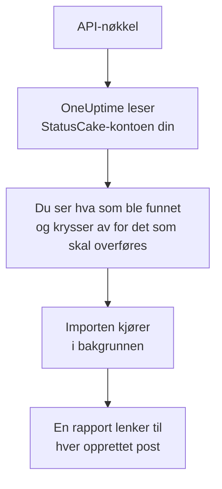

# Bytt fra StatusCake

**Importer fra et annet verktøy** henter StatusCake-kontrollene dine over til OneUptime på noen minutter. Med en StatusCake-API-nøkkel leser OneUptime oppetids-, SSL- og heartbeat-kontrollene dine, viser deg hva det fant, og oppretter det du krysser av for. Ingenting endres i StatusCake.

:::cards
- [Importer kontoen din](#importer-statuscake-kontoen-din): Opprett en nøkkel, les kontoen din og kryss av for det som skal overføres.
- [Hva som overføres](#hva-som-overføres): Hvilken OneUptime-monitor hver StatusCake-kontroll blir.
- [Fullfør byttet](#fullfør-byttet): Hva du gjør når importen er ferdig.
:::

## Slik fungerer det

- **Nøkkelen brukes én gang.** Den lagres kryptert mens OneUptime leser kontoen din, og slettes så snart lesingen er ferdig, enten den lyktes eller ikke. Den vises aldri igjen og skrives aldri til en logg.
- **OneUptime bare leser.** Det kaller bare StatusCakes eget API: `api.statuscake.com`. Det sender én forespørsel i sekundet, innenfor de 60 i minuttet StatusCake tillater en Free-konto. Når StatusCake ber det senke tempoet, venter det og prøver igjen.
- **Ingenting opprettes før du starter importen.** Forhåndsvisningen viser for hvert element om det er nytt, allerede finnes i OneUptime (og brukes som det er), ble overført av en tidligere import, eller hvorfor det ikke kan overføres.
- **Å kjøre den på nytt oppretter aldri noe to ganger.** OneUptime husker hva hver import overførte, etter StatusCake-ID-en. Kjør den på nytt etter at du har lagt til kontroller i StatusCake, så opprettes bare de nye.

## Før du begynner

- **Et OneUptime-prosjekt og retten til å opprette det du overfører.** Prosjekteiere og prosjektadministratorer kan overføre alt. Andre roller kan også kjøre en import og overføre de typene poster de kan opprette. Resten vises som ikke overført, med årsaken.
- **En StatusCake-API-nøkkel.** Importen skriver aldri til StatusCake.
- **En betalingsmåte, i OneUptime Cloud.** Monitorer som utfører kontroller, faktureres etter bruk, også på Free-abonnementet, så legg til en under **Prosjektinnstillinger** > **Fakturering** før du importerer. Uten en vises de monitorene som ikke overført.

## Importer StatusCake-kontoen din

:::steps
### Opprett en API-nøkkel i StatusCake
Åpne kontopanelet ditt i StatusCake, og gå til **API Keys**. Opprett en nøkkel med navnet `OneUptime import`, og kopier den.

### Åpne importsiden
Gå til **Prosjektinnstillinger** > **Importer fra et annet verktøy** i OneUptime, og velg **StatusCake**.

### Koble til StatusCake
Lim inn nøkkelen i **StatusCake-API-nøkkel**, og velg **Les StatusCake-kontoen min**. En stor konto tar noen minutter, og du kan forlate siden mens den leses.

### Kryss av for det som skal overføres
Forhåndsvisningen viser hva som ble funnet, med én del per type. Alt som ville blitt opprettet, er avkrysset fra start, unntatt kontroller som er satt på pause i StatusCake. De overføres på pause hvis du krysser dem av. Under hvert element forteller OneUptime hva som ikke overføres akkurat som det var.

### Start importen
Velg **Start import**. Importen kjører i bakgrunnen: Du kan forlate siden, og rapporten venter på deg der.
:::

Rapporten teller hva som ble opprettet og ikke overført, og viser hvert element med en lenke til posten det ble til, feil først. Tidligere importer står under **Tidligere importer** på samme side.

## Hva som overføres

| I StatusCake | I OneUptime | Hvordan |
| --- | --- | --- |
| Uptime, SSL and heartbeat checks | Monitorer | Hver kontroll blir en monitor av samme type, med samme adresse, intervall, tidsavbrudd og teksten en side skal, eller ikke skal, inneholde. |

- **HTTP- og HEAD-kontroller** blir nettstedmonitorer, eller API-monitorer når de sender data eller headere. StatusCake oppgir statuskodene som utløser et varsel: Enhver annen kode regnes som oppe også i OneUptime.
- **Ping- og TCP-kontroller** blir ping- og portmonitorer. **SMTP- og SSH-kontroller** blir portmonitorer på porten sin: OneUptime kontrollerer at porten svarer, ikke samtalen på den.
- **DNS-kontroller** blir DNS-monitorer som spør den samme serveren.
- **SSL-kontroller** blir SSL-sertifikatmonitorer som varsler like tidlig som det første varselet. En oppetidskontroll med SSL-varsler får også en.
- **Heartbeat-kontroller** blir monitorer for innkommende forespørsler, som går ned når ingen forespørsel har kommet i løpet av perioden. Hver får en ny adresse i OneUptime.

Hver monitor kontrolleres fra prosjektets sonder, akkurat som en du oppretter selv. Et intervall OneUptime ikke tilbyr, blir det nærmeste det tilbyr, og et tidsavbrudd på over ett minutt blir ett minutt. Forhåndsvisningen sier fra når et av dem endres.

## Hva som ikke overføres

- **Oppetidshistorikk, svartider og hendelser.** OneUptime begynner å kontrollere når importen er ferdig.
- **Varslingskontakter og integrasjoner.** Velg i OneUptime hvem som får beskjed, som beskrevet i [Fullfør byttet](#fullfør-byttet).
- **Passord, og headere som kan inneholde en hemmelighet.** En monitor som logger inn, eller som sender en `Authorization`-, informasjonskapsel- eller token-header, overføres uten den: Legg den til med en [monitorhemmelighet](/docs/monitor/monitor-secrets).
- **Adressene en DNS-kontroll forventer.** Legg dem til som kriterier i OneUptime.
- **Sidehastighets-, domene- og serverkontroller.** OneUptime har sin egen [domenemonitor](/docs/monitor/domain-monitor) og serverovervåking som du setter opp i stedet.
- **Vedlikeholdsvinduer.** Forhåndsvisningen teller dem: Planlegg dem som planlagt vedlikehold i OneUptime.

## Grenser

Én import oppretter høyst 2 000 poster og høyst 1 000 monitorer. Alt over en grense vises som ikke overført. Kjør importen på nytt for å overføre resten.

I OneUptime Cloud trenger monitorer som utfører kontroller, en betalingsmåte, og det abonnementet ditt ikke har plass til, vises som ikke overført, med det det trenger.

En forhåndsvisning lagres i én dag. Bare personen som leste kontoen, kan krysse av og starte importen. Prosjekteiere og prosjektadministratorer ser fremdriften og rapporten for hver import.

## Fullfør byttet

:::steps
### Sjekk monitorene dine
Åpne hver av dem under **Monitorer** og sjekk de første resultatene. En heartbeat-monitor har en ny adresse: Pek jobben som kaller den, dit.

### Velg hvem som får beskjed
Legg til eiere på monitorene dine, eller en vaktretningslinje under **Vakttjeneste** > **Vaktretningslinjer** på hendelsene de åpner, slik at de riktige personene får vite det når noe går ned.

### Slå av kontrollene i StatusCake
Når OneUptime kontrollerer de samme tingene, setter du dem på pause i StatusCake, så ingen får beskjed to ganger.
:::

## Feilsøking

:::details StatusCake godtok ikke API-nøkkelen
Sjekk at du kopierte hele nøkkelen fra **API Keys**, og at den ikke er slettet. Velg deretter **Prøv igjen**.
:::

:::details En monitor vises som ikke overført
Det står hvorfor: en type monitor OneUptime ikke har, en adresse OneUptime ikke kan lese, eller et prosjekt uten plass eller betalingsmåte til den. En monitor OneUptime allerede kjører, med samme navn, type og adresse, brukes som den er.
:::

:::details Noen elementer kan ikke krysses av
Ved hvert står det hvorfor: et navn prosjektet allerede har, noe en tidligere import har overført, eller en post du ikke har tillatelse til å opprette, eller som abonnementet ditt ikke inkluderer.
:::

## Neste trinn

:::cards
- [Nettsted-overvåking](/docs/monitor/website-monitor): Hva en nettstedmonitor kontrollerer, og hvordan.
- [SSL-sertifikat-overvåking](/docs/monitor/ssl-certificate-monitor): Hvordan OneUptime varsler før et sertifikat utløper.
- [Bytt fra Uptime Kuma](/docs/moving-to-oneuptime/uptime-kuma): Hent kontrollene dine over fra Uptime Kuma.
:::
