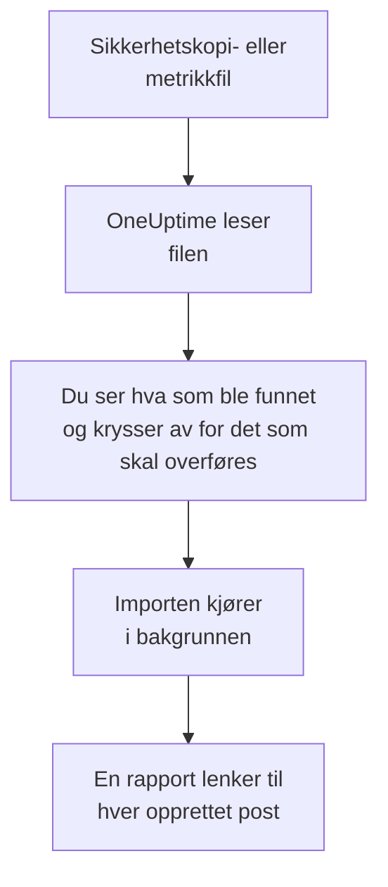

# Bytt fra Uptime Kuma

Uptime Kuma kjører på dine egne maskiner, så **Importer fra et annet verktøy** leser det fra en fil i stedet for med en nøkkel: sikkerhetskopien Uptime Kuma 1 eksporterer, eller metrikksiden alle versjoner tilbyr. OneUptime leser monitorene dine fra den, viser deg hva det fant, og oppretter det du krysser av for. Ingenting endres i Uptime Kuma.

:::cards
- [Importer monitorene dine](#importer-uptime-kuma-monitorene-dine): Lagre filen, les den og kryss av for det som skal overføres.
- [Hva som overføres](#hva-som-overføres): Hva hver Uptime Kuma-monitor blir i OneUptime.
- [Fullfør byttet](#fullfør-byttet): Hva du gjør når importen er ferdig.
:::

## Slik fungerer det

- **Filen leses én gang.** OneUptime leser den mens den lastes opp, for å finne monitorene dine, og lagrer den aldri. Passord, tokener og push-nøkler i den kopieres aldri.
- **OneUptime kobler seg aldri til Uptime Kuma.** Alt kommer fra filen. En fil som verken er en sikkerhetskopi eller en metrikkside fra Uptime Kuma, avvises med årsaken.
- **Ingenting opprettes før du starter importen.** Forhåndsvisningen viser for hvert element om det er nytt, allerede finnes i OneUptime (og brukes som det er), ble overført av en tidligere import, eller hvorfor det ikke kan overføres.
- **Å kjøre den på nytt oppretter aldri noe to ganger.** OneUptime husker hva hver import overførte, etter Uptime Kuma-ID-en. Les en nyere fil etter at du har lagt til monitorer, så opprettes bare de nye.

## Før du begynner

- **Et OneUptime-prosjekt og retten til å opprette det du overfører.** Prosjekteiere og prosjektadministratorer kan overføre alt. Andre roller kan også kjøre en import og overføre de typene poster de kan opprette. Resten vises som ikke overført, med årsaken.
- **En fil fra Uptime Kuma.** I Uptime Kuma 1 inneholder JSON-sikkerhetskopien hver monitor med innstillingene sine. Uptime Kuma 2 har ingen sikkerhetskopi, så lagre metrikksiden i stedet: Den oppgir navn, type og adresse for hver monitor, men ikke hvor ofte den kontrolleres eller hva den ser etter.
- **En betalingsmåte, i OneUptime Cloud.** Monitorer som utfører kontroller, faktureres etter bruk, også på Free-abonnementet, så legg til en under **Prosjektinnstillinger** > **Fakturering** før du importerer. Uten en vises de monitorene som ikke overført.

## Importer Uptime Kuma-monitorene dine

:::steps
### Lagre filen i Uptime Kuma
Gå til **Settings** > **Backup** i Uptime Kuma 1, og velg **Export**. Legg til en nøkkel under **Settings** > **API Keys** i Uptime Kuma 2, åpne `/metrics` på Uptime Kuma, logg inn uten brukernavn med nøkkelen som passord, og lagre siden som en tekstfil.

### Åpne importsiden
Gå til **Prosjektinnstillinger** > **Importer fra et annet verktøy** i OneUptime, og velg **Uptime Kuma**.

### Les filen
Velg **Velg fil** under **Sikkerhetskopi- eller metrikkfil fra Uptime Kuma**, velg filen du lagret, og velg **Les filen**. OneUptime leser den med en gang og viser hva det fant.

### Kryss av for det som skal overføres
Forhåndsvisningen viser hva som ble funnet, med én del per type. Alt som ville blitt opprettet, er avkrysset fra start, unntatt monitorer som er satt på pause i Uptime Kuma. De overføres på pause hvis du krysser dem av. Under hvert element forteller OneUptime hva som ikke overføres akkurat som det var.

### Start importen
Velg **Start import**. Importen kjører i bakgrunnen: Du kan forlate siden, og rapporten venter på deg der.
:::

Rapporten teller hva som ble opprettet og ikke overført, og viser hvert element med en lenke til posten det ble til, feil først. Tidligere importer står under **Tidligere importer** på samme side.

## Hva som overføres

| I Uptime Kuma | I OneUptime | Hvordan |
| --- | --- | --- |
| Monitors | Monitorer | Fra en sikkerhetskopi blir hver monitor en monitor av samme type, med samme adresse, intervall, tidsavbrudd og statuskodene som regnes som oppe. Fra metrikksiden overføres hver av dem med en kontroll hvert femte minutt: Sjekk hver av dem etter importen. |

- **HTTP(S)- og nøkkelordmonitorer** blir nettstedmonitorer, eller API-monitorer når de sender en annen metode, headere eller en JSON-body, med nøkkelordet der det skal være.
- **JSON-spørringsmonitorer** blir API-monitorer, uten spørringen: Legg den til som kriterium i OneUptime.
- **Ping-, port- og DNS-monitorer** blir ping-, port- og DNS-monitorer.
- **Push-monitorer** blir monitorer for innkommende forespørsler, som går ned når ingen forespørsel har kommet i løpet av intervallet og nye forsøk. Hver får en ny adresse i OneUptime.
- **Manuelle monitorer** forblir manuelle monitorer. **Grupper** er mapper, så monitorene deres overføres hver for seg.
- **Sertifikatutløp.** En monitor som varsler før sertifikatet utløper, får også en SSL-sertifikatmonitor, oppkalt etter den.

Hver monitor kontrolleres fra prosjektets sonder, akkurat som en du oppretter selv. Et intervall OneUptime ikke tilbyr, blir det nærmeste det tilbyr, og et tidsavbrudd på over ett minutt blir ett minutt. Forhåndsvisningen sier fra når et av dem endres.

## Hva som ikke overføres

- **Oppetidshistorikk, svartider og hendelser.** OneUptime begynner å kontrollere når importen er ferdig.
- **Varsler.** Velg i OneUptime hvem som får beskjed, som beskrevet i [Fullfør byttet](#fullfør-byttet).
- **Passord, og headere som kan inneholde en hemmelighet.** En monitor som logger inn, eller som sender en `Authorization`-, informasjonskapsel- eller token-header, overføres uten den: Legg den til med en [monitorhemmelighet](/docs/monitor/monitor-secrets).
- **Omvendte monitorer**, som regnes som oppe når kontrollen feiler. OneUptime har ingen monitor som gjør det.
- **Docker-, database-, spillserver-, MQTT- og andre monitorer som OneUptime ikke har noe tilsvarende for.** Forhåndsvisningen nevner hver av dem.
- **Statussider og vedlikehold.** Opprett statussidene du trenger, i OneUptime, og vis de importerte monitorene på dem.

## Grenser

Én import oppretter høyst 2 000 poster og høyst 1 000 monitorer. En fil kan være på høyst 10 MB. Alt over en grense vises som ikke overført. Kjør importen på nytt for å overføre resten.

I OneUptime Cloud trenger monitorer som utfører kontroller, en betalingsmåte, og det abonnementet ditt ikke har plass til, vises som ikke overført, med det det trenger.

En forhåndsvisning lagres i én dag. Bare personen som leste filen, kan krysse av og starte importen. Prosjekteiere og prosjektadministratorer ser fremdriften og rapporten for hver import.

## Fullfør byttet

:::steps
### Sjekk monitorene dine
Åpne hver av dem under **Monitorer** og sjekk de første resultatene. En heartbeat-monitor har en ny adresse: Pek jobben som kaller den, dit.

### Velg hvem som får beskjed
Legg til eiere på monitorene dine, eller en vaktretningslinje under **Vakttjeneste** > **Vaktretningslinjer** på hendelsene de åpner, slik at de riktige personene får vite det når noe går ned.

### Slå av kontrollene i Uptime Kuma
Når OneUptime kontrollerer de samme tingene, setter du dem på pause i Uptime Kuma, så ingen får beskjed to ganger.
:::

## Feilsøking

:::details Filen ble avvist
OneUptime sier hvorfor: en fil på over 10 MB, en som ikke er gyldig JSON, eller en som verken er en sikkerhetskopi eller metrikksiden fra Uptime Kuma. Eksporter sikkerhetskopien på nytt, eller lagre `/metrics` på nytt som ren tekst, og velg den igjen.
:::

:::details En monitor vises som ikke overført
Det står hvorfor: en type monitor OneUptime ikke har, en adresse OneUptime ikke kan lese, eller et prosjekt uten plass eller betalingsmåte til den. En monitor OneUptime allerede kjører, med samme navn, type og adresse, brukes som den er.
:::

:::details Noen elementer kan ikke krysses av
Ved hvert står det hvorfor: et navn prosjektet allerede har, noe en tidligere import har overført, eller en post du ikke har tillatelse til å opprette, eller som abonnementet ditt ikke inkluderer.
:::

## Neste trinn

:::cards
- [Nettsted-overvåking](/docs/monitor/website-monitor): Hva en nettstedmonitor kontrollerer, og hvordan.
- [Innkommende forespørsel-overvåking](/docs/monitor/incoming-request-monitor): Hvordan en heartbeat fungerer i OneUptime.
- [Bytt fra UptimeRobot](/docs/moving-to-oneuptime/uptimerobot): Hent kontrollene dine over fra UptimeRobot.
:::
