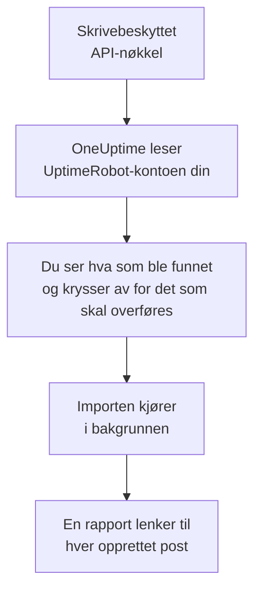

# Bytt fra UptimeRobot

**Importer fra et annet verktøy** henter UptimeRobot-monitorene og -statussidene dine over til OneUptime på noen minutter. Med en skrivebeskyttet UptimeRobot-API-nøkkel leser OneUptime monitorene og de offentlige statussidene dine, viser deg hva det fant, og oppretter det du krysser av for. Ingenting endres i UptimeRobot.

:::cards
- [Importer kontoen din](#importer-uptimerobot-kontoen-din): Opprett en nøkkel, les kontoen din og kryss av for det som skal overføres.
- [Hva som overføres](#hva-som-overføres): Hva hver UptimeRobot-monitor og -statusside blir i OneUptime.
- [Fullfør byttet](#fullfør-byttet): Hva du gjør når importen er ferdig.
:::

## Slik fungerer det

- **Nøkkelen brukes én gang.** Den lagres kryptert mens OneUptime leser kontoen din, og slettes så snart lesingen er ferdig, enten den lyktes eller ikke. Den vises aldri igjen og skrives aldri til en logg.
- **OneUptime bare leser.** Det kaller bare UptimeRobots eget API: `api.uptimerobot.com`. Det sender én forespørsel hvert sjette sekund, innenfor de ti i minuttet UptimeRobot tillater en Free-konto, så en stor konto tar noen minutter. Når UptimeRobot ber det senke tempoet, venter det og prøver igjen.
- **Ingenting opprettes før du starter importen.** Forhåndsvisningen viser for hvert element om det er nytt, allerede finnes i OneUptime (og brukes som det er), ble overført av en tidligere import, eller hvorfor det ikke kan overføres.
- **Å kjøre den på nytt oppretter aldri noe to ganger.** OneUptime husker hva hver import overførte, etter UptimeRobot-ID-en. Kjør den på nytt etter at du har lagt til monitorer i UptimeRobot, så opprettes bare de nye.

## Før du begynner

- **Et OneUptime-prosjekt og retten til å opprette det du overfører.** Prosjekteiere og prosjektadministratorer kan overføre alt. Andre roller kan også kjøre en import og overføre de typene poster de kan opprette. Resten vises som ikke overført, med årsaken.
- **En UptimeRobot-API-nøkkel.** Read-only API key holder: Importen skriver aldri til UptimeRobot. Main API key fungerer også, men en nøkkel for én monitor leser bare den monitoren.
- **En betalingsmåte, i OneUptime Cloud.** Monitorer som utfører kontroller, faktureres etter bruk, også på Free-abonnementet, så legg til en under **Prosjektinnstillinger** > **Fakturering** før du importerer. Uten en vises de monitorene som ikke overført.

## Importer UptimeRobot-kontoen din

:::steps
### Opprett en API-nøkkel i UptimeRobot
Gå til **Integrations & API** > **API** i UptimeRobot. Opprett en **Read-only API key**, eller kopier den du har.

### Åpne importsiden
Gå til **Prosjektinnstillinger** > **Importer fra et annet verktøy** i OneUptime, og velg **UptimeRobot**.

### Koble til UptimeRobot
Lim inn nøkkelen i **UptimeRobot-API-nøkkel**, og velg **Les UptimeRobot-kontoen min**. En stor konto tar noen minutter, og du kan forlate siden mens den leses.

### Kryss av for det som skal overføres
Forhåndsvisningen viser hva som ble funnet, med én del per type. Alt som ville blitt opprettet, er avkrysset fra start, unntatt monitorer som er satt på pause i UptimeRobot. De overføres på pause hvis du krysser dem av. Under hvert element forteller OneUptime hva som ikke overføres akkurat som det var. Når en avkrysset statusside viser en monitor du ikke har krysset av for, sier det fra, og **Kryss av for dem også** krysser den av.

### Start importen
Velg **Start import**. Importen kjører i bakgrunnen: Du kan forlate siden, og rapporten venter på deg der.
:::

Rapporten teller hva som ble opprettet og ikke overført, og viser hvert element med en lenke til posten det ble til, feil først. Tidligere importer står under **Tidligere importer** på samme side.

## Hva som overføres

| I UptimeRobot | I OneUptime | Hvordan |
| --- | --- | --- |
| Monitors | Monitorer | Hver monitor blir en monitor av samme type, med samme adresse, intervall og tidsavbrudd, og de samme statuskodene som regnes som oppe. |
| Public status pages | Statussider | Hver side viser de samme monitorene: dem den nevner, dem med taggene dens eller alle, med oppetid og historikkstolper slik den viste dem. En side med passord overføres som privat. |

- **HTTP(S)- og nøkkelordmonitorer** blir nettstedmonitorer, eller API-monitorer når de sender en annen metode, headere eller en JSON-body. En nøkkelordmonitor går ned når nøkkelordet dukker opp eller mangler, som i UptimeRobot, og samsvarer det nøyaktig, inkludert store bokstaver.
- **Ping- og portmonitorer** blir ping- og portmonitorer.
- **Heartbeat-monitorer** blir monitorer for innkommende forespørsler, som går ned når ingen forespørsel har kommet i løpet av intervallet og fristen. Hver får en ny adresse i OneUptime.
- **DNS- og API-monitorer** blir DNS- og API-monitorer.
- **SSL-utløpspåminnelser.** En monitor som varsler før sertifikatet utløper, får også en SSL-sertifikatmonitor, oppkalt etter den, som varsler like mange dager i forveien.

Hver monitor kontrolleres fra prosjektets sonder, akkurat som en du oppretter selv. Et intervall OneUptime ikke tilbyr, blir det nærmeste det tilbyr, og et tidsavbrudd på over ett minutt blir ett minutt. Forhåndsvisningen sier fra når et av dem endres.

## Hva som ikke overføres

- **Oppetidshistorikk, svartider og hendelser.** OneUptime begynner å kontrollere når importen er ferdig.
- **Varslingskontakter og integrasjoner.** Velg i OneUptime hvem som får beskjed, som beskrevet i [Fullfør byttet](#fullfør-byttet).
- **Passord, og headere som kan inneholde en hemmelighet.** En monitor som logger inn, eller som sender en `Authorization`-, informasjonskapsel- eller token-header, overføres uten den: Legg den til med en [monitorhemmelighet](/docs/monitor/monitor-secrets).
- **UDP-, visual comparison- og dependency-monitorer.** OneUptime har ingen monitor som gjør det samme, og forhåndsvisningen nevner hver av dem.
- **Portmonitorer som varsler mens porten er åpen.** De fungerer motsatt av portmonitorene i OneUptime.
- **Svarene en DNS-monitor forventer, og påstandene i en API-monitor.** Legg dem til som kriterier i OneUptime.
- **Vedlikeholdsvinduer.** Forhåndsvisningen teller dem: Planlegg dem som planlagt vedlikehold i OneUptime.
- **En statussides eget domene og merkevare.** Legg i OneUptime til domenet under **Egendefinerte domener** og logoen under **Merkevare**.

## Grenser

Én import oppretter høyst 2 000 poster: høyst 1 000 monitorer og 50 statussider. Alt over en grense vises som ikke overført. Kjør importen på nytt for å overføre resten.

I OneUptime Cloud trenger monitorer som utfører kontroller, en betalingsmåte, og det abonnementet ditt ikke har plass til, vises som ikke overført, med det det trenger.

En forhåndsvisning lagres i én dag. Bare personen som leste kontoen, kan krysse av og starte importen. Prosjekteiere og prosjektadministratorer ser fremdriften og rapporten for hver import.

## Fullfør byttet

:::steps
### Sjekk monitorene dine
Åpne hver av dem under **Monitorer** og sjekk de første resultatene. En heartbeat-monitor har en ny adresse: Pek jobben som kaller den, dit.

### Velg hvem som får beskjed
Legg til eiere på monitorene dine, eller en vaktretningslinje under **Vakttjeneste** > **Vaktretningslinjer** på hendelsene de åpner, slik at de riktige personene får vite det når noe går ned.

### Pek adressen til statussiden din mot OneUptime
Åpne siden under **Statussider**, legg til domenet ditt under **Egendefinerte domener**, og endre deretter DNS-oppføringen. Da kommer besøkende og abonnenter til den nye siden.

### Slå av kontrollene i UptimeRobot
Når OneUptime kontrollerer de samme tingene, setter du dem på pause i UptimeRobot, så ingen får beskjed to ganger.
:::

## Feilsøking

:::details UptimeRobot godtok ikke API-nøkkelen
Sjekk at du kopierte hele nøkkelen, og at det er kontoens Read-only eller Main API key fra **Integrations & API**, ikke en nøkkel for én monitor. Velg deretter **Prøv igjen**.
:::

:::details En monitor vises som ikke overført
Det står hvorfor: en type monitor OneUptime ikke har, en adresse OneUptime ikke kan lese, eller et prosjekt uten plass eller betalingsmåte til den. En monitor OneUptime allerede kjører, med samme navn, type og adresse, brukes som den er.
:::

:::details Noen elementer kan ikke krysses av
Ved hvert står det hvorfor: et navn prosjektet allerede har, noe en tidligere import har overført, eller en post du ikke har tillatelse til å opprette, eller som abonnementet ditt ikke inkluderer.
:::

## Neste trinn

:::cards
- [Nettsted-overvåking](/docs/monitor/website-monitor): Hva en nettstedmonitor kontrollerer, og hvordan.
- [Innkommende forespørsel-overvåking](/docs/monitor/incoming-request-monitor): Hvordan en heartbeat fungerer i OneUptime.
- [Bytt fra Pingdom](/docs/moving-to-oneuptime/pingdom): Hent kontrollene dine over fra Pingdom.
:::
