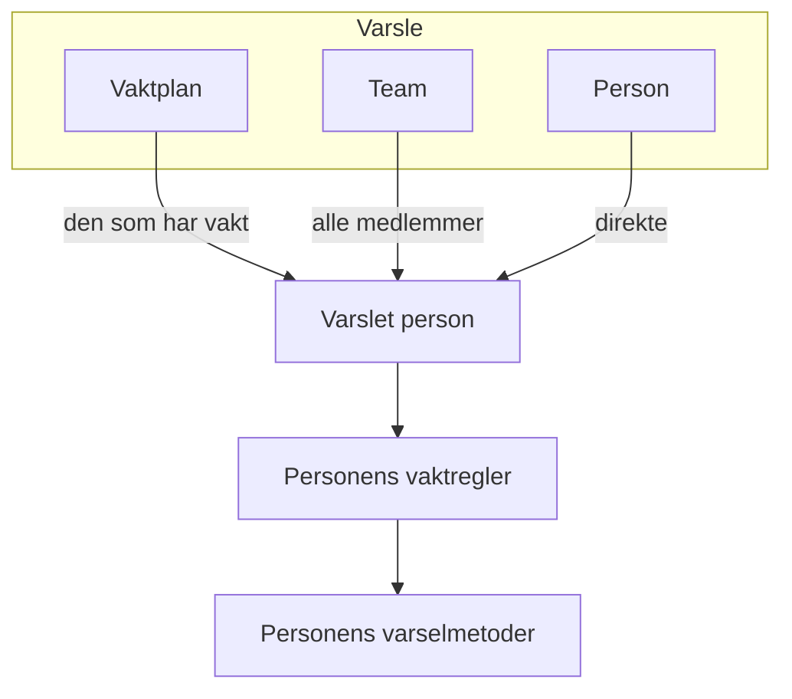

# Eskaleringsregler

En vaktretningslinje varsler folk i nivåer. Hver eskaleringsregel er ett nivå: hvem som varsles, og hvor lenge det ventes på at noen bekrefter før neste nivå varsles. Reglene i en retningslinje står i rekkefølge på siden **Eskaleringsregler**.

```mermaid title="En vaktretningslinje varsler nivå for nivå til noen bekrefter"
flowchart TB
    trigger["Hendelse eller varsel"] --> level1["Level 1 varsler"]
    level1 --> ack1{"Bekreftet<br/>i tide?"}
    ack1 -->|"Ja"| stop["Varslingen stopper"]
    ack1 -->|"Nei"| level2["Level 2 varsler"]
    level2 --> ack2{"Bekreftet<br/>i tide?"}
    ack2 -->|"Ja"| stop
    ack2 -->|"Nei, siste nivå"| repeat{"Gjenta retningslinjen?"}
    repeat -->|"Ja"| level1
    repeat -->|"Nei"| done["Retningslinjen stopper"]
```

:::cards
- [Hvem som varsles først](#hvem-som-varsles-først): Opprett en retningslinje med det første nivået.
- [Legg til en eskaleringsregel](#legg-til-en-eskaleringsregel): Legg til neste nivå, steg for steg.
- [Slik varsler nivåene folk](#slik-varsler-nivåene-folk): Tidsbruk, gjentakelser og hvordan hver person nås.
- [API og Terraform](#opprett-regler-med-api-et-eller-terraform): Opprett retningslinjer og regler som kode.
:::

## Hvem som varsles først

Når du oppretter en vaktretningslinje på siden **Vaktretningslinjer**, spør skjemaet om **Navn** og **Hvem varsles først?**. Spørsmålet bruker samme velger som **Varsle**: vaktplaner, team og personer, så mange du trenger. De du velger, blir den første eskaleringsregelen i retningslinjen, **Level 1**, som venter **30 minutter** på en bekreftelse før neste nivå varsles.

:::steps
1. Gå til **Vakttjeneste** > **Vaktretningslinjer**, og klikk på **Opprett Vaktpolicy**.
2. Skriv inn et **Navn**.
3. Klikk på **Legg til mottaker** under **Hvem varsles først?**, og velg vaktplanene, teamene og personene som skal varsles først.
4. Klikk på **Opprett Vaktpolicy**. Den nye retningslinjen åpnes deretter på siden **Eskaleringsregler**, der du kan legge til flere nivåer.
:::

**Hvem varsles først?** er valgfritt. Lar du det stå tomt, starter retningslinjen uten eskaleringsregler: den varsler ingen før du legger til en, og oversikten sier det. Beskrivelsen og etikettene ligger under **Flere felt**. Spørsmålet stilles bare til dem som kan legge til eskaleringsregler.

## Legg til en eskaleringsregel

:::steps
### Åpne eskaleringsreglene i retningslinjen

Åpne vaktretningslinjen, velg **Eskaleringsregler** i sidemenyen, og klikk på **Legg til eskaleringsregel**. Dialogen er én kort side.

### Velg hvem som skal varsles

Klikk på **Legg til mottaker** under **Varsle**, søk, og velg så mange vaktplaner, team og personer som dette nivået skal varsle. Legg til minst én.

| Mottaker | Hvem som varsles når nivået kjører |
| --- | --- |
| En **vaktplan** | Den som har vakt i den når nivået kjører, ikke en fast person. |
| Et **team** | Alle medlemmene i teamet. |
| En **person** | Den personen, direkte. |

### Angi hvor lenge det ventes

**Eskaler etter (i minutter)** er hvor lenge det ventes på en bekreftelse før neste nivå varsles. Den starter på **30 minutter**; endre den til det som passer for nivået.

### Gi regelen et navn, hvis du vil

Alt annet ligger under **Flere felt**, slått sammen til du åpner det:

- **Navn**: valgfritt. En regel du ikke gir navn, får navn etter nivået sitt: den første regelen i en retningslinje er **Level 1**, den andre **Level 2** og så videre. Navnefeltet viser navnet regelen får.
- **Beskrivelse**: valgfrie notater, for eksempel hvem dette nivået varsler og hvorfor.

Sammenslått nevner overskriften til **Flere felt** de to og viser dem regelen har: en beskrivelse eller et navn du har valgt selv.

### Opprett regelen

Klikk på **Create Rule**. Regelen legges til under de andre, som neste nivå i retningslinjen.
:::

## Slik varsler nivåene folk

Når en hendelse eller et varsel når retningslinjen, varsler **Level 1** mottakerne sine med en gang. Bekrefter ingen innen ventetiden, varsles **Level 2**, og så videre nedover listen. Når ventetiden for det siste nivået har gått uten bekreftelse, starter retningslinjen på nytt fra **Level 1** hvis **Gjentakelsesretningslinje** (under reglene) sier at den skal gjentas, så mange ganger som den tillater, og ellers stopper den. Å bekrefte eller løse hendelsen eller varselet stopper varslingen på et hvilket som helst nivå.

En hendelse, et varsel eller en episode som opprettes allerede bekreftet eller løst — registrert i etterkant — kjører ingen av retningslinjene sine: ingen varsles, og feeden sier det og nevner dem ved navn. Se [Erklært allerede bekreftet eller løst](/docs/incidents/declaring-incidents#erklært-allerede-bekreftet-eller-løst).

For å gjenta en retningslinje klikker du på **Rediger** på kortet **Gjentakelsesretningslinje**, slår på **Repeat if no one acknowledges** og angir **Number of times to repeat**.

### Eskaleringsoversikten

Oversikten øverst på siden **Eskaleringsregler** viser hele stigen: når hvert nivå varsles, hvem det varsler, og hva som skjer etter det siste. Et nivå der ikke alle mottakerne kan varsles, sier det på kortet sitt; klikk på etiketten for å se hvem og hvorfor.

### Slik nås hver person

Hver person et nivå varsler, nås slik personens egne vaktregler sier: **Brukerinnstillinger** > **Vaktregler**, med en fane for hendelser, hendelsesepisoder, varsler og varselepisoder, og et kort per alvorlighetsgrad som viser hvilken varselmetode som prøves og etter hvor lang tid. En prosjektadministrator kan se og endre reglene til et medlem under **Brukere** > medlemmet > **Vaktregler**.



En brukeroverstyring som gjelder for en person, sender varslene til den som dekker for personen i stedet.

Hver melding er en som leverandøren tar imot, så et varsel går alltid ut. Så mye bærer hver kanal:

| Kanal | Den lengste meldingen den bærer |
| --- | --- |
| SMS | 1 600 tegn |
| Telefonanrop | Det som får plass i Twilios anropsskript på 4 000 tegn |
| Pushvarsel | 4 KB, der tittel, tekst og data tar opptil 3 KB |
| WhatsApp | 1 024 tegn |
| Telegram | 4 096 tegn |

En lengre melding, med en lang tittel eller en lang beskrivelse som en mal har satt inn, kortes ned og slutter med en merknad om at hele teksten står i OneUptime: "… (truncated — see OneUptime for the full text)". Ordlyden i en WhatsApp-melding er en fast mal, så der kortes de lengste verdiene ned i stedet, hver med "…" til slutt. Lenkene i en melding kortes aldri ned.

### Når et varsel ikke sendes

Et varsel som ikke sendes, sier hvorfor i personens **Vaktlogger** (Brukerinnstillinger): raden viser **Feil**, og statusmeldingen gir årsaken. Det blir ikke lenger stående på **Sending**. Meldingen sier ett av dette:

- prosjektets saldo kunne ikke betale for det, og hvem som kan fylle på saldoen;
- kanalen er slått av i prosjektet, og hvem som kan slå den på.

Eierne av prosjektet får én e-post om det, til saldoen er fylt på eller kanalen er slått på igjen.

På OneUptime Cloud betales hver SMS, hvert anrop og hver WhatsApp- og Telegram-melding fra prosjektets saldo på **Prosjektinnstillinger > Varsler > Varselinnstillinger**: den nøyaktige kostnaden trekkes fra saldoen når leverandøren tar imot meldingen, uansett hvor mange meldinger som går ut samtidig.

- Med **Automatisk påfylling** slått på der, legger meldingen som finner saldoen under terskelen, først til beløpet automatisk påfylling er satt til, og belaster prosjektets kort; meldinger som finner saldoen lav i samme øyeblikk, belaster kortet én gang.
- Hvis belastningen mislykkes (det finnes ingen betalingsmetode, eller kortet ble avvist), prøver automatisk påfylling kortet igjen en time senere, og **Varselinnstillinger** sier det øverst til da. Å fylle på saldoen manuelt, eller å lagre automatisk påfylling på nytt, prøver med en gang.
- Varslene fortsetter å gå ut på saldoen som er igjen, mens automatisk påfylling ikke får belastet kortet.

> [!IMPORTANT]
> SMS, telefonanrop, WhatsApp og Telegram er slått av i et nytt prosjekt: på OneUptime Cloud betales hver melding fra prosjektets saldo, og en selvdriftet installasjon trenger først en Twilio-konto eller en Telegram-bot som er satt opp. Så lenge en kanal er slått av, kan ingen i prosjektet legge til en metode på den. Bare en prosjekteier, en **Billing Admin** eller noen med tillatelsen **Manage Billing** kan slå en på, i kortet **Varslingskanaler** på **Prosjektinnstillinger > Varsler > Varselinnstillinger** — en prosjektadministrator kan ikke. Alle andre får vite nøyaktig hvem som kan, overalt der en kanal er slått av: over sin egen liste med metoder på den, på oppsettsjekklisten sin og i meldingen de får når noe trenger den.

## Rediger, endre rekkefølge på og slett regler

Kortet til hver regel har **Edit rule**, og en **⋯**-meny med de andre handlingene:

- **Edit rule** åpner den samme dialogen på én side, fylt ut med regelen slik den er: mottakerne, ventetiden, og navnet og beskrivelsen under **Flere felt**. Legg til eller fjern mottakere, og klikk på **Lagre endringer**. Tømmer du navnet, får regelen navnet til nivået sitt igjen.
- **Move up** og **Move down** i **⋯**-menyen til en regel endrer nivået. En regel som har navn etter nivået sitt, beholder et navn som passer til plassen: når **Level 3** flyttes opp forbi **Level 2**, bytter de to navn. Et navn du har valgt selv, for eksempel **Ledere**, forblir det samme uansett hvor regelen flyttes.
- **Delete rule** spør først og sier hvem nivået varsler. Sletter du et nivå, flyttes nivåene under det opp, og regler som har navn etter nivået sitt, får nye navn som passer.

## Opprett regler med API-et eller Terraform

Eskaleringsregler er ressursen `/api/on-call-duty-policy-escalation-rule`; personene, teamene og vaktplanene en regel varsler, er ressursene `/api/on-call-duty-policy-escalation-rule-user`, `-team` og `-schedule`.

- En regel som opprettes uten `name`, får navn etter nivået sitt, som i dashbordet: **Level 3** for en regel som blir det tredje nivået i retningslinjen. Terraforms ressurs for eskaleringsregler krever fortsatt et navn.
- `escalateAfterInMinutes` har ingen standardverdi utenfor dashbordet. En regel som opprettes uten den, venter ikke: neste nivå varsles så snart dette har kjørt. Angi den eksplisitt — 30 er det dashbordet foreslår.
- En regel som opprettes med `onCallSchedules`, `teams` eller `users` (lister med ID-er) i `miscDataProps`, får de mottakerne; det er slik dashbordets velger **Varsle** sender dem. En regel som opprettes uten dem, varsler ingen før du legger til mottakere gjennom ressursene ovenfor.
- Regler som har navn etter nivået sitt, får nye navn når du flytter eller sletter regler i dashbordet. Å endre `order` gjennom API-et eller Terraform endrer bare rekkefølgen.
- Å opprette en vaktretningslinje på `/api/on-call-duty-policy` med `onCallSchedules`, `teams` eller `users` (lister med ID-er) i `miscDataProps` gir den den første eskaleringsregelen, slik dashbordet gjør: **Level 1**, som varsler dem, med en `escalateAfterInMinutes` på 30. Hver ID må høre til prosjektet, og den som kaller, må ha lov til å opprette eskaleringsregler, ellers blir ikke retningslinjen opprettet. En retningslinje som opprettes uten dem, har ingen regler, som før; Terraforms ressurs for retningslinjer sender dem ikke.

```bash
curl -X POST https://oneuptime.com/api/on-call-duty-policy \
  -H "apikey: $ONEUPTIME_API_KEY" \
  -H "Content-Type: application/json" \
  -d '{
    "data": {
      "projectId": "<project-id>",
      "name": "Production on-call"
    },
    "miscDataProps": {
      "onCallSchedules": ["<schedule-id>"],
      "users": ["<user-id>"]
    }
  }'
```

## Neste steg

:::cards
- [Vaktplaner](/docs/on-call/schedules): Bygg rotasjonene et nivå varsler.
- [Tidslinje for vaktplaner](/docs/on-call/schedule-timeline): Se hvem som har vakt på tvers av alle vaktplaner, og finn hull i dekningen.
- [Policy for innkommende anrop](/docs/on-call/incoming-call-policy): La innringere nå vakthavende ingeniør på telefon.
:::
