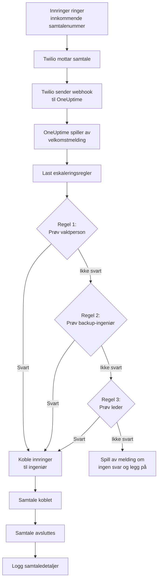
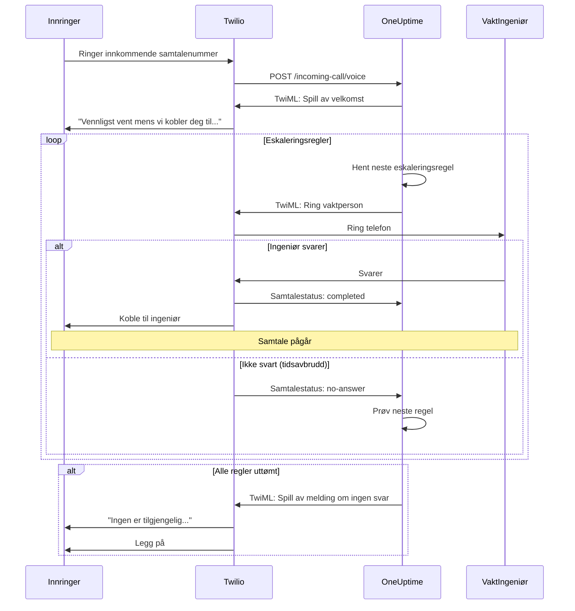
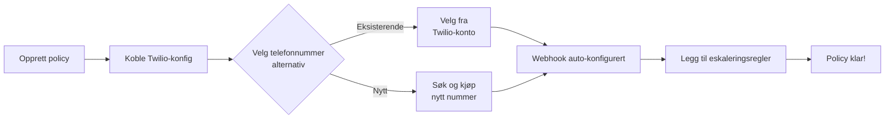
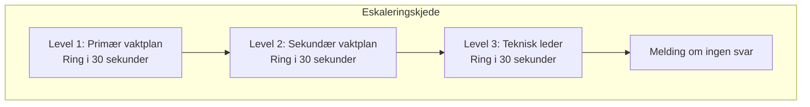
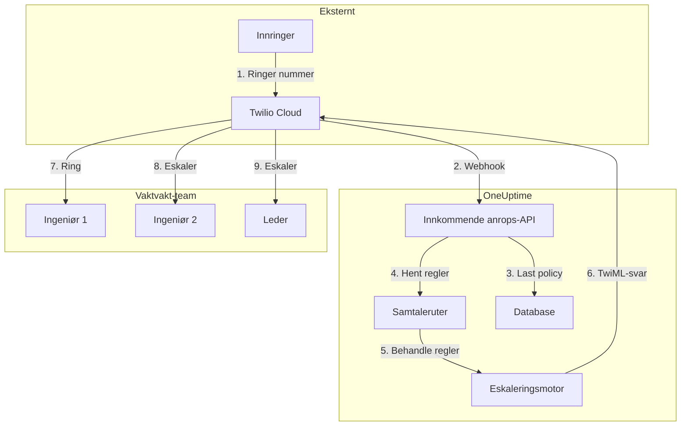

# Innkommende samtalepolicy (Twilio-integrasjon)

Innkommende samtalepolicyer lar eksterne innringere nå vakthavende ingeniører ved å ringe et dedikert telefonnummer. Når noen ringer, ruter OneUptime samtalen gjennom de konfigurerte eskaleringssreglene til en ingeniør svarer.

## Slik fungerer det

## Samtalerutingsflyt

## Forutsetninger

- En Twilio-konto – Opprett en på [https://www.twilio.com](https://www.twilio.com)
- Din Twilio Account SID og Auth Token
- Tilgang til din selvhostede OneUptime-instans

## Oversikt

Funksjonen for innkommende samtalepolicy fungerer ved å:

1. Motta innkommende samtaler på et Twilio-telefonnummer
2. Spille av en tilpassbar velkomstmelding
3. Rute samtalen gjennom eskaleringsregler (vaktplaner eller personer)
4. Koble innringeren til den første tilgjengelige vakthavende ingeniøren
5. Eskalere til neste regel hvis ingen svarer

Siden du selvhoster OneUptime, må du konfigurere din egen Twilio-konto. Dette gir deg full kontroll over telefonnummerne dine og faktureringen.

## Trinn 1: Opprett en Twilio-konto

1. Gå til [https://www.twilio.com](https://www.twilio.com) og registrer deg for en konto
2. Fullfør verifiseringsprosessen
3. Noter ned **Account SID** og **Auth Token** fra Twilio Console-dashbordet

## Trinn 2: Konfigurer anrop/SMS-konfigurasjon i OneUptime

1. Logg inn på OneUptime-dashbordet ditt
2. Gå til **Prosjektinnstillinger** > **Varsler** > **Varselinnstillinger**
3. Klikk **Create Custom Call/SMS Config**
4. Fyll inn følgende felt:
   - **Navn**: Et vennlig navn (f.eks. "Production Twilio Config")
   - **Beskrivelse**: Valgfri beskrivelse
   - **Twilio Account SID**: Din Twilio Account SID (starter med `AC`)
   - **Twilio Auth Token**: Din Twilio Auth Token
   - **Twilio primært telefonnummer**: Et telefonnummer fra din Twilio-konto for utgående anrop
5. Klikk **Lagre**

## Trinn 3: Opprett en innkommende samtalepolicy

1. Gå til **Vakttjeneste** > **Retningslinjer for innkommende anrop**
2. Klikk **Create Incoming Call Policy**
3. Fyll inn følgende felt:
   - **Navn**: Et vennlig navn (f.eks. "Support Hotline")
   - **Beskrivelse**: Valgfri beskrivelse
4. Klikk **Lagre**

## Trinn 4: Koble Twilio-konfigurasjon til policy

1. Åpne den nylig opprettede innkommende samtalepolicyen
2. I kortet **Phone Number Routing**, finn **Trinn 2: Link Twilio Configuration**
3. Klikk **Select Twilio Config** og velg konfigurasjonen du opprettet i trinn 2
4. Lagre valget

## Trinn 5: Konfigurer et telefonnummer

Du har to alternativer for å sette opp et telefonnummer:

### Alternativ A: Bruk et eksisterende Twilio-telefonnummer

Hvis du allerede har telefonnumre i Twilio-kontoen din:

1. I kortet **Telefonnummer**, klikk **Use Existing Number**
2. OneUptime vil hente alle telefonnumre fra Twilio-kontoen din
3. Velg telefonnummeret du ønsker å bruke
4. Klikk **Use This** for å tilordne det til policyen

> **Merk**: Hvis telefonnummeret allerede har en webhook konfigurert, vil den bli oppdatert til å peke til OneUptime.

### Alternativ B: Kjøp et nytt telefonnummer

For å kjøpe et nytt telefonnummer direkte fra OneUptime:

1. I kortet **Telefonnummer**, klikk **Buy New Number**
2. Velg et **Land** fra rullegardinmenyen
3. Skriv eventuelt inn et **retningsnummer** (f.eks. 47 for Norge)
4. Skriv eventuelt inn sifre nummeret skal **inneholde** (f.eks. 555)
5. Klikk **Søk** for å finne tilgjengelige numre
6. Velg et telefonnummer fra resultatene
7. Klikk **Purchase** for å kjøpe nummeret

Telefonnummeret vil bli kjøpt fra Twilio-kontoen din og webhook vil bli **automatisk konfigurert** – ingen manuell oppsett kreves!

## Trinn 6: Konfigurer eskaleringsregler

Eskaleringsregler bestemmer hvem som ringes når noen ringer policyens nummer, fra toppen av listen og nedover:

1. Åpne den innkommende samtalepolicyen din
2. Gå til fanen **Eskaleringsregler**
3. Klikk **Legg til eskaleringsregel**
4. Fyll ut regelen. Det er ett trinn:
   - **Hvem som skal ringes**: en vaktplan eller én person. En vaktplan ringer den som har vakt i den når samtalen kommer inn. Personene er medlemmene i prosjektet ditt.
   - **Ringetid (i sekunder)**: hvor lenge telefonen deres ringer før samtalen går videre til neste regel. Den starter på 30 sekunder, og Twilio godtar 5 til 600.
   - **Navn** og **Beskrivelse** er valgfrie og ligger under **Avansert**. En regel uten navn vises etter plassen sin i listen: **Level 1**, **Level 2**.
5. Lagre den, og legg til en regel for hver vaktplan eller person som skal prøves deretter

Reglene ringes fra toppen av listen og nedover, og en ny regel legges til nederst. Dra en regel i håndtaket øverst til venstre for å endre rekkefølgen; med tastaturet setter du fokus på håndtaket, trykker mellomrom, flytter regelen med piltastene og trykker mellomrom igjen.

> **Pass på talepost**: hold **Ringetid** kortere enn tiden personens telefon bruker før den sender et ubesvart anrop til talepost. Hvis taleposten svarer først, kobles den som ringer til den, og samtalen går ikke videre til neste regel. Twilio legger selv til noen sekunder på hver ringing.

### Eksempel på eskaleringsregel

| Nivå    | Hvem som skal ringes      | Ringetid    |
| ------- | ------------------------- | ----------- |
| Level 1 | Primær vaktplan           | 30 sekunder |
| Level 2 | Sekundær vaktplan         | 30 sekunder |
| Level 3 | Teknisk leder (en person) | 30 sekunder |

## Trinn 7: Konfigurer talemeldinger (valgfritt)

Tilpass meldingene innringere hører:

1. Åpne innkommende samtalepolicyen
2. Gå til **Innstillinger**
3. Konfigurer:
   - **Hilsemelding**: Spilles av når samtalen besvares
   - **Melding ved ingen svar**: Spilles av når alle eskaleringsregler feiler
   - **Melding ved ingen tilgjengelige**: Spilles av når ingen er på vakt

## Konfigurasjonsalternativer

### Policyinnstillinger

| Innstilling                     | Beskrivelse                                     | Standard                                                                   |
| ------------------------------- | ----------------------------------------------- | -------------------------------------------------------------------------- |
| Greeting Message                | TTS-melding spilt av når samtalen besvares      | "Vent mens vi kobler deg til vakt-ingeniøren."                             |
| No Answer Message               | Melding når alle eskaleringsregler feiler       | "Ingen er tilgjengelig. Prøv igjen senere."                                |
| No One Available Message        | Melding når ingen er på vakt                    | "Beklager, men ingen vakthavende ingeniør er for øyeblikket tilgjengelig." |
| Repeat Policy If No One Answers | Start på nytt fra første regel hvis alle feiler | Deaktivert                                                                 |
| Repeat Policy Times             | Maksimalt antall gjentaksforsøk                 | 1                                                                          |

### Innstillinger for eskaleringsregel

| Innstilling           | Beskrivelse                                                                                                                                         |
| --------------------- | --------------------------------------------------------------------------------------------------------------------------------------------------- |
| Hvem som skal ringes  | En vaktplan, som ringer den som har vakt i den, eller én person. Hver regel ringer én av dem                                                       |
| Ringetid (i sekunder) | Hvor lenge telefonen ringer før samtalen går videre til neste regel (standard: 30; fra 5 til 600)                                                  |
| Navn og Beskrivelse   | Valgfrie, under Avansert. En regel uten navn vises som Level 1, Level 2 og så videre etter plassen sin i listen                                   |
| Rekkefølge            | Regelens plass i listen: reglene ringes fra toppen og nedover. Endres ved å dra reglene; via API-et havner en ny regel uten rekkefølge nederst |

Via API-et angir en regel `onCallDutyPolicyScheduleId` eller `userId` (én av dem, aldri begge) og `escalateAfterSeconds`: ringetiden, 30 når den utelates.

## Vise samtalelogger

For å se historikk over innkommende samtaler:

1. Gå til **Vakttjeneste** > **Retningslinjer for innkommende anrop**
2. Klikk på policyen din
3. Gå til fanen **Anropslogger**

Loggene viser:

- Innringerens telefonnummer
- Samtalestatus (Completed, No Answer, Failed, osv.)
- Hvem som svarte samtalen
- Samtalevarighet
- Tidsstempel

## Konfigurasjon av brukertelefotnummer

For at brukere skal motta innkommende samtaler, må de ha et verifisert telefonnummer:

1. Brukere går til **Brukerinnstillinger** > **Varselmetoder**
2. Legg til et telefonnummer under **Incoming Call Numbers**
3. Verifiser telefonnummeret via SMS-kode

Bare brukere med verifiserte telefonnumre kan ringes opp gjennom eskaleringsregler.

## Frigjøre et telefonnummer

Hvis du ikke lenger trenger et telefonnummer:

1. Åpne innkommende samtalepolicyen
2. I kortet **Telefonnummer**, klikk **Frigi nummer**
3. Bekreft frigjøringen

> **Advarsel**: Frigjorte numre returneres til Twilio og er kanskje ikke tilgjengelige for ny kjøp.

## Feilsøking

### Samtaler mottas ikke

- Verifiser at Twilio-konfigurasjonen er korrekt koblet til policyen
- Sjekk at OneUptime-instansen er tilgjengelig fra internett
- Verifiser at Twilio Account SID og Auth Token er korrekte
- Sjekk Twilio Console for feillogger

### Samtaler kobles ikke til ingeniører

- Verifiser at brukere har verifiserte telefonnumre i varselsinnstillingene sine
- Sjekk at eskaleringsregler er korrekt konfigurert
- Sørg for at vaktplaner har brukere tildelt for gjeldende tid
- Verifiser at policyen er aktivert
- Hvis samtaler havner i en ingeniørs talepost, sett regelens **Ringetid** lavere enn tiden telefonen bruker før den går til talepost

### Lydkvalitetsproblemer

- Sørg for at serveren har stabil internettilkobling
- Sjekk Twilios statusside for eventuelle pågående problemer
- Verifiser at telefonnumre er i korrekt format (E.164-format: +4712345678)

## Sikkerhetshensyn

- Hold Twilio Auth Token sikker og eksponer den aldri offentlig
- Bruk HTTPS for OneUptime-instansen din
- OneUptime validerer webhook-signaturer for å sikre at forespørsler kommer fra Twilio
- Vurder å begrense hvilke telefonnumre som kan ringe innkommende samtalepolicyer

## Arkitekturoversikt

## Støtte

For problemer med innkommende samtalepolicy-funksjonen, vennligst:

1. Sjekk Twilio Console for feillogger
2. Se gjennom OneUptime-serverloggene
3. Kontakt støtte på [hello@oneuptime.com](mailto:hello@oneuptime.com)
