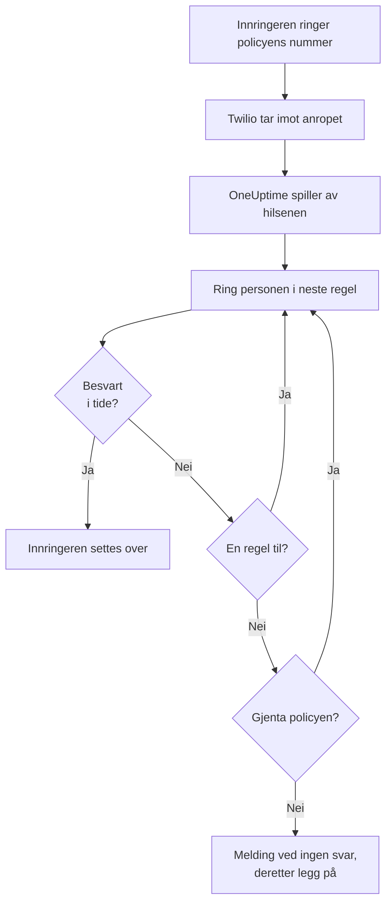
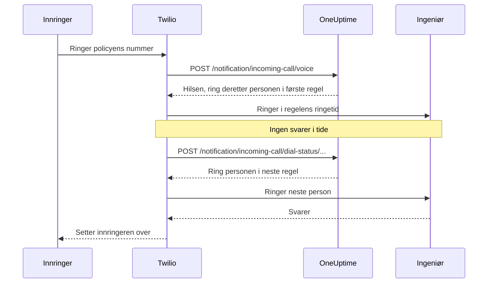

# Policy for innkommende anrop

En policy for innkommende anrop gir teamet ditt et telefonnummer som når den som har vakt. Når noen ringer det, ringer OneUptime til personene i policyens eskaleringsregler, én etter én, til noen svarer, og setter innringeren over. Numrene og anropene går gjennom din egen Twilio-konto.

:::cards
- [Sett opp en policy](#sett-opp-en-policy): Fra Twilio-kontoen din til et testanrop, i sju steg.
- [Slik rutes et anrop](#slik-rutes-et-anrop): Hvem som ringes, hvor lenge, og hva innringeren hører.
- [Tapte anrop](#tapte-anrop): Hvem som får beskjed, og hvordan du reagerer på dem i en arbeidsflyt.
- [Feilsøking](#feilsøking): Anrop som aldri kommer frem, eller aldri når en ingeniør.
:::

## Før du begynner

| Du trenger | Hvorfor |
| --- | --- |
| En Twilio-konto, med Account SID og Auth Token | Policyens numre og anrop går gjennom den, og Twilio fakturerer dem til den. |
| Planen **Growth** på OneUptime Cloud | Et prosjekt trenger den for å få sin egen Twilio-konfigurasjon. |
| En OneUptime-server som Twilio kan nå, hvis du drifter den selv | Twilio sender hvert anrop til `https://<your host>/notification/incoming-call/voice`. |
| **SMS** slått på i prosjektet | Nummeret til hver ingeniør verifiseres med en kode som sendes på SMS. |
| Et verifisert nummer for hver ingeniør | En regel ringer bare personer som har lagt til og verifisert et nummer for innkommende anrop i prosjektet. |

## Sett opp en policy

:::steps
### Legg til Twilio-kontoen din

Gå til **Prosjektinnstillinger** > **Varsler** > **Varselinnstillinger**. Klikk på **Create Twilio Config** i kortet **Twilio-konfigurasjon**, og fyll ut skjemaet:

- **Navn** og **Beskrivelse**: hva kontoen brukes til, for eksempel "Supportlinje".
- **Twilio Account SID**: fra Twilio Console. Den starter med `AC`.
- **Twilio Auth Token**: fra Twilio Console.
- **Twilio primært telefonnummer**: et nummer på den kontoen, for SMS-ene og anropene den sender.
- **Twilio sekundære telefonnumre**: valgfritt. Numre som sender i stedet for det primære til mottakere i sitt eget land.
- **Angi som prosjektstandard**: på for prosjektets første Twilio-konfigurasjon, så SMS-er og anrop til prosjektets medlemmer også går gjennom denne kontoen. Slå det av hvis kontoen bare er for innkommende anrop.

### Opprett policyen

Gå til **Vakttjeneste** > **Retningslinjer for innkommende anrop**, og klikk på **Opprett Retningslinjer for innkommende anrop**. Gi den et **Navn**, for eksempel "Supportlinje", og eventuelt en **Beskrivelse** og **Etiketter**. Åpne den deretter fra listen.

### Velg Twilio-kontoen

**Oversikt** for policyen viser et kort **Oppsett** med tre nummererte steg. Klikk på **Velg** i det første, velg kontoen under **Twilio-konfigurasjon** og klikk på **Lagre**.

### Legg til et telefonnummer

Klikk på **Add Phone Number** i det andre steget. Velg **Use Existing Phone Number** for å ta med et nummer Twilio-kontoen din allerede har, eller **Reserve New Phone Number** for å få et nytt. OneUptime peker nummeret mot seg selv, så det er ingenting å sette opp i Twilio. Se [Telefonnumre](#telefonnumre).

### Legg til eskaleringsregler

Klikk på **Administrer regler** i det tredje steget. Legg til en regel for hver vaktplan eller person som skal ringes, i den rekkefølgen de skal ringes. Se [Eskaleringsregler](#eskaleringsregler).

### Verifiser nummeret til hver ingeniør

Alle som en regel kan ringe, legger til og verifiserer sitt eget nummer for innkommende anrop. Se [Ingeniørenes telefonnumre](#ingeniørenes-telefonnumre).

### Ring nummeret

Når alle tre stegene er fullført, blir kortet til **Phone Numbers & Twilio Configuration**. Ring nummeret fra en hvilken som helst telefon, og åpne deretter policyens **Anropslogger** for å se hvem som ble ringt.
:::

## Slik rutes et anrop

1. Twilio sender anropet til OneUptime, som leser opp policyens **Hilsemelding**.
2. OneUptime ringer personen den første eskaleringsregelen nevner: den personen, eller den som har vakt i regelens vaktplan i det øyeblikket, brukeroverstyringer medregnet. Telefonen deres viser policyens nummer som innringer.
3. Svarer de innen regelens **Ringetid**, settes innringeren over, og anropsloggen registrerer hvem som svarte.
4. Hvis ikke, hører innringeren "Connecting you to the next available engineer.", og personen i neste regel ringes.
5. Etter den siste regelen starter policyen på nytt fra den første regelen hvis **Gjenta retningslinje hvis ingen svarer** er på, så mange ganger som **Antall gjentakelser av retningslinje** sier. Ellers hører innringeren **Melding ved ingen svar**, og anropet avsluttes.

En regel hoppes over, uten at noen ringes, når ingen kan ringes for den akkurat nå: vaktplanen har ingen på vakt, personen har ikke noe verifisert nummer for innkommende anrop i dette prosjektet, eller personen er ikke lenger medlem av prosjektet. Når ingen regel har noen å ringe, hører innringeren **Melding ved ingen tilgjengelige**. En deaktivert policy besvarer hvert anrop med "Sorry, this service is currently disabled." og legger på.

OneUptime sjekker Twilios signatur på hver forespørsel med Auth Token fra Twilio-konfigurasjonen, og avviser en forespørsel den ikke kan verifisere.

> [!TIP]
> Lagre policyens nummer som en kontakt på telefonen, for eksempel "Supportlinje", så du kjenner igjen et viderekoblet anrop når det ringer.

## Eskaleringsregler

Eskaleringsregler bestemmer hvem som ringes når noen ringer policyens nummer, ovenfra og ned i listen. Åpne policyen, velg **Eskaleringsregler** i sidemenyen og klikk på **Legg til eskaleringsregel**. En regel er ett kort steg:

- **Hvem som skal ringes**: en vaktplan eller én person. En vaktplan ringer den som har vakt i den når anropet kommer inn. Personer er medlemmene av prosjektet ditt.
- **Ringetid (i sekunder)**: hvor lenge telefonen deres ringer før anropet går videre til neste regel. Den starter på 20 sekunder, og Twilio godtar 5 til 600.
- **Navn** og **Beskrivelse** er valgfrie, under **Flere felt**. En regel uten navn står i listen etter plassen sin: **Level 1**, **Level 2**.

Reglene ringes ovenfra og ned i listen, og en ny regel legges til nederst. For å endre rekkefølgen drar du en regel etter håndtaket øverst til venstre. Med tastaturet setter du fokus på håndtaket, trykker på mellomromstasten, flytter det med piltastene og trykker på mellomromstasten igjen.

> [!WARNING]
> **Pass på talepostkassen**: hold **Ringetid** kortere enn tiden personens telefon bruker på å sende et ubesvart anrop til talepostkassen. Svarer talepostkassen først, kobles innringeren til den, og anropet går ikke videre til neste regel. Twilio legger til noen egne sekunder på hver ringing. Derfor starter en ny regel på 20 sekunder. Regler som ble lagt til da standarden var 30 sekunder, beholder sine 30: ender anropene deres i talepostkassen, senker du **Ringetid** på de reglene.

For eksempel tre regler som prøver to rotasjoner og deretter en leder:

| Nivå | Hvem som skal ringes | Ringetid |
| --- | --- | --- |
| Level 1 | Primær vaktplan | 20 sekunder |
| Level 2 | Sekundær vaktplan | 20 sekunder |
| Level 3 | Teknisk leder (én person) | 20 sekunder |

## Telefonnumre

En policy kan ha flere numre, og alle ringer de samme reglene. Hvert nummer hører til én policy. Legg dem til med **Add Phone Number** på policyens **Oversikt**:

:::tabs
@tab Bruk et nummer du har
1. Klikk på **Add Phone Number** og deretter på **Use Existing Phone Number**. OneUptime viser numrene på policyens Twilio-konto.
2. Klikk på **Velg** ved siden av nummeret og deretter på **Tildel nummer**.

Et nummer som allerede sender anropene sine et annet sted, sier "Currently has a webhook configured". Å tildele det sender anropene til OneUptime i stedet.
@tab Reserver et nytt nummer
1. Klikk på **Add Phone Number**, deretter på **Reserve New Phone Number** og **Søk etter numre**.
2. Velg et **Land**. Fyll eventuelt ut **Retningsnummer (valgfritt)**, for eksempel 415, eller **Inneholder (valgfritt)** med sifre nummeret skal inneholde. Klikk på **Søk**: opptil 10 lokale numre vises.
3. Klikk på **Reserver** ved siden av et nummer, og bekreft med **Reserver**. Twilio belaster nummeret på Twilio-kontoen din.
:::

OneUptime setter nummerets voice-webhook til `https://<your host>/notification/incoming-call/voice`, bygget fra `HOST` og `HTTP_PROTOCOL` på en selvdriftet installasjon. For å flytte en policy til en annen Twilio-konto frigir du først numrene: kontoen kan bare endres mens policyen ikke har noen.

For å frigi et nummer klikker du på **Frigi** ved siden av det og bekrefter med **Frigi nummer**.

> [!CAUTION]
> Å frigi et nummer gir det tilbake til Twilio, også et nummer du tok med via **Use Existing Phone Number**, og du får det kanskje ikke igjen. Å slette en policy, eller Twilio-konfigurasjonen den bruker, frigir også numrene.

## Ingeniørenes telefonnumre

En regel ringer en person på nummeret personen har verifisert for innkommende anrop i dette prosjektet, og hopper over alle som ikke har et. Hver person legger til sitt eget:

:::steps
1. Åpne **Brukerinnstillinger** > **Retningslinjer for innkommende anrop** > **Innkommende telefonnumre**. **Retningslinjer for innkommende anrop** er en del av sidemenyen som starter sammenslått.
2. Klikk på **Legg til Telefonnummer for innkommende anropsruting** i kortet **Telefonnumre for innkommende anropsruting**, og skriv inn nummeret med landskode, for eksempel `+15551234567`.
3. Skriv inn den 6-sifrede koden OneUptime sender til nummeret på SMS under **Verifiseringskode**, og klikk på **Verifiser**. **Send a new code** sender en ny.
:::

Hver person kan ha ett verifisert nummer per prosjekt. For å endre det sletter du først det gamle nummeret. Disse numrene er atskilt fra telefonnumrene under **Varselmetoder**, som vaktvarsler bruker.

Numre for innkommende anrop verifiseres på SMS, så **SMS** må først være slått på for prosjektet. En prosjekteier, en **Billing Admin** eller noen med **Manage Billing** slår det på i kortet **Varslingskanaler** på **Prosjektinnstillinger > Varsler > Varselinnstillinger**.

## Talemeldinger og innstillinger for policyen

Åpne policyen og velg **Innstillinger** under **Avansert** i sidemenyen. **Edit Messages** på kortet **Talemeldinger** endrer hva innringere hører; **Edit Policy Settings** på kortet **Innstillinger for retningslinje** endrer resten.

| Innstilling | Hva den gjør | For en ny policy |
| --- | --- | --- |
| **Hilsemelding** | Leses opp når anropet besvares, før den første personen ringes. | "Please wait while we connect you to the on-call engineer." |
| **Melding ved ingen svar** | Leses opp når alle regler er prøvd og ingen svarte. | "No one is available. Please try again later." |
| **Melding ved ingen tilgjengelige** | Leses opp når ingen regel har noen å ringe. | "We are sorry, but no on-call engineer is currently available. Please try again later or contact support." |
| **Aktivert** | En deaktivert policy avviser alle anrop. | På |
| **Gjenta retningslinje hvis ingen svarer** | Starter på nytt fra den første regelen etter den siste. | Av |
| **Antall gjentakelser av retningslinje** | Hvor mange ganger det startes på nytt. | 1 |

Twilio leser meldingene opp med en tekst-til-tale-stemme, så skriv dem slik du vil at de skal høres ut.

## Anropslogger

Hvert anrop står på policyens side **Anropslogger**, under **Logger** i sidemenyen: **Oppringer**, **Number Called**, **Status**, hvem som svarte (**Besvart av**), **Varighet**, og når det startet (**Startet den**). Klikk på **View Timeline** ved et anrop for å se **Anropstidslinje**: hver person som ble ringt, på hvilket nummer, og hvordan hvert forsøk endte.

| Status | Hva som skjedde |
| --- | --- |
| **Initiated**, **Ringing**, **Escalated** | Anropet pågår fortsatt: det kom inn, en telefon ringer, eller det gikk videre til en senere regel. |
| **Fullført** | Noen svarte, og innringeren ble satt over. |
| **Ingen svar** | Alle eskaleringsregler ble prøvd, og ingen svarte. Innringeren hørte **Melding ved ingen svar**. |
| **Caller Hung Up** | Innringeren la på mens telefonen til en ingeniør ringte. |
| **Mislyktes** | Ingen kunne ringes: ingen eskaleringsregel hadde en bruker på vakt med et verifisert nummer for innkommende anrop (innringeren hørte **Melding ved ingen tilgjengelige**), eller policyen er deaktivert. |

## Tapte anrop

Et anrop er tapt når det avsluttes uten å nå noen: statusen er **Ingen svar**, **Caller Hung Up** eller **Mislyktes**.

### Hvem som får beskjed

Når et anrop er tapt, gir OneUptime beskjed til policyens eiere: brukerne og medlemmene av teamene som er lagt til på policyens side **Eiere**. Har policyen ingen eiere, får prosjektets eiere beskjed i stedet.

Varselet sier hvem som ringte, hvilket nummer de ringte, hvorfor ingen svarte, og hvem som ble ringt og hvordan hvert forsøk endte. Det lenker til anropet i anropsloggen.

Eiere får e-post som standard. Hver person kan velge andre kanaler (SMS, anrop, push og mer) eller slå det av i **Brukerinnstillinger** > **Varselinnstillinger**, under **Vakt** > **Retningslinjer for innkommende anrop** > **Tapt anrop**.

### Reager på tapte anrop i en arbeidsflyt

Logger for innkommende anrop er tilgjengelige som utløsere i arbeidsflyter:

- **On Create Incoming Call Log** kjører når et anrop kommer inn.
- **On Update Incoming Call Log** kjører etter hvert som anropet skrider frem. Oppdateringen som setter **Ended At**, er slutten på anropet.

For å reagere bare på tapte anrop, for eksempel for å legge dem ut i Slack eller Microsoft Teams eller åpne en sak:

:::steps
1. Legg til utløseren **On Update Incoming Call Log**. Sett **Listen on** til **Ended At**, og velg feltene du vil bruke, for eksempel **Status**, **Caller Phone Number** og **Routing Phone Number**.
2. Legg til et steg **If / Else**. Sjekk utløserens **Status**, med sammenligningen **is not equal to** og `Completed`.
3. Koble stegene dine til porten **Yes**.
:::

En arbeidsflyt kan lese anropslogger med **Find One** og **Find Many**, men kan ikke opprette eller endre dem.

## Hvem som kan legge til og frigi telefonnumre

Telefonnumrene til en policy følger de samme rollene som selve policyen:

- **Slå opp numre** - søke i Twilio etter et nummer å reservere, eller vise numrene Twilio-kontoen din allerede har - krever tillatelse til å lese policyer for innkommende anrop og til å lese konfigurasjoner for anrop og SMS, fordi det leser Twilio-kontoen din gjennom en av dem. **Project Owner**, **Project Admin**, **Project Member**, **Viewer**, **Settings Admin**, **Settings Member** og **Settings Viewer** har begge. I en egendefinert rolle er det **Read Incoming Call Policy** og **Read Call and SMS**.
- **Reservere et nummer, bruke et eksisterende og frigi et** krever tillatelse til å redigere policyer for innkommende anrop: **Project Owner**, **Project Admin**, **Project Member**, **Settings Admin** og **Settings Member**, eller **Edit Incoming Call Policy** i en egendefinert rolle. De endrer numrene til en policy du kan redigere: med en rolle som er begrenset til bestemte etiketter, policyene som har de etikettene.

En blokkering fra et team uten etiketter på en av disse tillatelsene tar den bort. For alle andre blir **Add Phone Number** og **Frigi** stående på siden, låst, og verktøytipset deres sier hva som kreves. API-et avviser forespørselen deres med en setning som sier hva som kreves: "Looking up phone numbers needs permission to read incoming call policies and call and SMS settings." eller "Adding or releasing a phone number needs permission to edit incoming call policies." Å reservere et nummer belastes din egen Twilio-konto, ikke OneUptime-saldoen din, så det krever ingen faktureringstillatelse.

## Opprett policyer med API-et eller Terraform

| Ressurs | API-rute |
| --- | --- |
| Policyer for innkommende anrop | `/api/incoming-call-policy` |
| Eskaleringsreglene deres | `/api/incoming-call-policy-escalation-rule` |
| Telefonnumrene deres, bare lesing | `/api/incoming-call-policy-phone-number` |
| Anropslogger, bare lesing | `/api/incoming-call-log` |

En regel som opprettes gjennom API-et uten `escalateAfterSeconds`, ringer i 20 sekunder, og det samme gjør en regel Terraform oppretter uten `escalate_after_seconds`.

### Innstillinger for en eskaleringsregel

| Innstilling | API-felt | Hva det inneholder |
| --- | --- | --- |
| Hvem som skal ringes | `onCallDutyPolicyScheduleId` eller `userId` | Ett av dem, aldri begge: vaktplanen der den som har vakt, ringes, eller personen. |
| Ringetid (i sekunder) | `escalateAfterSeconds` | Hvor lenge telefonen ringer før anropet går videre (standard: 20; fra 5 til 600). |
| Navn og Beskrivelse | `name`, `description` | Valgfrie. En regel uten navn står som Level 1, Level 2 og så videre, etter plassen sin i listen. |
| Rekkefølge | `order` | Hvor regelen står i listen: reglene ringes ovenfra og ned. En ny regel uten rekkefølge havner nederst. |

## Feilsøking

:::details Anrop når ikke frem til OneUptime
- Åpne nummeret i Twilio Console: **A call comes in** må være webhooken `https://<your host>/notification/incoming-call/voice`, med HTTP POST. OneUptime setter den når nummeret legges til, fra `HOST` og `HTTP_PROTOCOL`. Har de endret seg siden, retter du webhooken i Twilio.
- En selvdriftet OneUptime må kunne nås fra internett over https. Nummerets anropslogg i Twilio Console, og Twilios **Debugger**, viser hva OneUptime svarte.
- Et svar `403` betyr at signaturen på forespørselen ikke stemte. Sørg for at Twilio-konfigurasjonen har kontoens gjeldende **Twilio Auth Token**, og at en proxy foran OneUptime sender videre verten og skjemaet Twilio kalte (`X-Forwarded-Host` og `X-Forwarded-Proto`).
:::

:::details Anropet besvares, men ingen ringes
Anropsloggen sier **Mislyktes**. Sjekk at policyen er **Aktivert**, at vaktplanen i hver regel har noen på vakt akkurat nå, og at personene reglene ringer, har et verifisert nummer under **Brukerinnstillinger** > **Retningslinjer for innkommende anrop** > **Innkommende telefonnumre**, i dette prosjektet. Regler ringer bare medlemmer av prosjektet.
:::

:::details Anrop havner i talepostkassen
Havner anrop i talepostkassen til en ingeniør, setter du regelens **Ringetid** under tiden telefonen deres bruker på å gå til talepostkassen. En talepostkasse som svarer, teller som et svar, og anropet stopper der.
:::

:::details Et nytt nummer kan ikke reserveres
Twilio krever i mange land en godkjent regulatory bundle før det selger lokale numre, og noen numre krever positiv Twilio-saldo. Sett det opp i Twilio Console, eller skaff nummeret der og legg det til med **Use Existing Phone Number**.
:::

:::details Policyens Twilio-konto kan ikke endres
Kontoen kan bare endres mens policyen ikke har telefonnumre: siden sier "Remove all phone numbers to change". Å frigi numrene gir dem tilbake til Twilio, så planlegg flyttingen først.
:::

:::details Koden til en ingeniørs nummer kommer ikke frem
SMS må være slått på for prosjektet. På OneUptime Cloud betaler et prosjekt uten sin egen standard-Twilio-konfigurasjon for SMS-ene fra saldoen sin, som må være over 1 USD. Koder kan bruke et minutt på å komme frem; klikk på **Send a new code** for å sende en ny, og **Prosjektinnstillinger** > **Varsler** > **Varsellogger** viser hva som skjedde med den.
:::

## Neste steg

:::cards
- [Eskaleringsregler](/docs/on-call/escalation-rules): Hvordan en vaktretningslinje varsler folk, nivå for nivå.
- [Vaktplaner](/docs/on-call/schedules): Bygg rotasjonene reglene dine ringer.
- [Arbeidsflyter](/docs/workflows/index): Reager på tapte anrop: legg dem ut i en kanal eller åpne en sak.
- [Twilio-integrasjon for SMS og tale](/docs/self-hosted/twilio-integration): Sett opp Twilio for en selvdriftet installasjon.
:::
