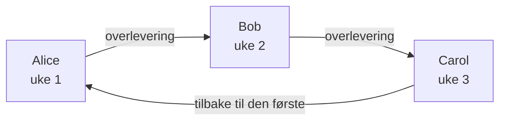
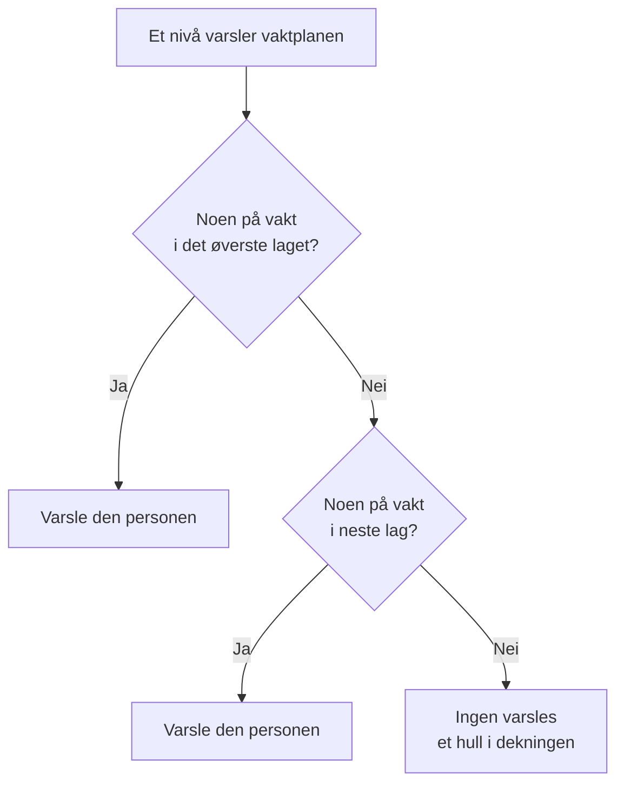

# Vaktplaner

En vaktplan bestemmer hvem som har vakt til enhver tid. Folk bytter på i den: hver har vakt en stund, og så tar den neste over. Legg til en vaktplan i eskaleringsreglene til en vaktretningslinje, så varsler retningslinjen den som har vakt i den når det nivået kjører.

> [!NOTE]
> På OneUptime Cloud hører vaktplaner til planen **Growth** og høyere. En vaktplan som et prosjekt fortsatt har, fortsetter å varsle personene i den, gjennom eskaleringsreglene som nevner den, etter at en prøveperiode for Growth er over eller planen nedgraderes. Under **Growth** viser siden **Vaktplaner** derfor merknaden om planen med vaktplanene som fortsatt er satt opp under, der du kan slette dem. Å opprette eller endre en vaktplan krever **Growth**.

:::cards
- [Hvem som bytter på](#hvem-som-bytter-på): Opprett en vaktplan med den første rotasjonen.
- [Lag](#lag): Stable rotasjoner, begrens vakttimene og legg til reservedekning.
- [API og Terraform](#opprett-vaktplaner-med-api-et-eller-terraform): Opprett vaktplaner og rotasjonene deres som kode.
:::

## Hvem som bytter på

Når du oppretter en vaktplan på siden **Vaktplaner**, spør skjemaet om **Navn** og **Hvem bytter på å ha vakt?**. Personene du velger, blir det første laget i vaktplanen, **Layer 1**, med vakt døgnet rundt.

:::steps
1. Gå til **Vakttjeneste** > **Vaktplaner**, og klikk på **Opprett vaktplan**.
2. Skriv inn et **Navn**.
3. Klikk på **Legg til bruker** under **Hvem bytter på å ha vakt?**, og velg personene i den rekkefølgen de bytter på.
4. Åpne eventuelt **Flere felt** for å endre hvor lenge hver vakt varer, tidssonen, beskrivelsen eller etikettene.
5. Klikk på **Opprett vaktplan**. Den nye vaktplanen åpnes deretter på siden **Lag**, der du kan endre rotasjonen eller legge til flere lag.
:::

Personene bytter på én om gangen, og den første har vakt så snart vaktplanen er opprettet:



**Hvem bytter på å ha vakt?** er valgfritt. Lar du det stå tomt, starter vaktplanen uten lag: den setter ingen på vakt før du legger til et lag på siden **Lag**. Spørsmålet stilles bare til dem som kan legge til lag.

Alt annet ligger under **Flere felt**, slått sammen til du åpner det:

| Felt | Hva det gjør |
| --- | --- |
| **Hver vakt varer** | **1 dag**, **1 uke**, **2 uker** eller **1 måned**, og **1 uke** hvis du ikke endrer det. Det spørres om så snart noen bytter på. Hver person har vakt så lenge, og så tar den neste over, på det tidspunktet på dagen da vaktplanen ble opprettet. |
| **Tidssone** | Tidssonen overleveringstider og vakttimer holdes i. Den starter på din. |
| **Beskrivelse** | Notater om vaktplanen. |
| **Etiketter** | Etiketter for å finne og gruppere vaktplanen. |

Så lenge noen bytter på og ingenting under **Flere felt** er endret, sier den sammenslåtte overskriften hva som vil skje: hver person har vakt i en uke, og så tar den neste over.

## Lag

Rotasjonen i en vaktplan består av lag, på siden **Lag**. Lagene leses ovenfra og ned: det øverste laget med noen på vakt er det som varsler, så legg hovedrotasjonen øverst og reservedekningen under.



**Legg til lag** legger til et lag som starter slik det første gjør: på vakt fra nå, hver person i en uke, døgnet rundt. Utvid et lag for å legge til personer i det, og for å endre når det starter, hvor ofte det overleverer, når det overleverer første gang og timene det har vakt:

| Felt | Hva det angir |
| --- | --- |
| **Layer name** | Hva laget dekker, for eksempel "Primær på hverdager". |
| **Rotation starts at** | Datoen og klokkeslettet lagets rotasjon begynner. |
| **Rotate every** | Hvor ofte vakten går videre til neste person i laget. |
| **First hand-off time** | Den første overleveringen til neste person, ved eller etter starten. Senere overleveringer følger hvert rotasjonsintervall. |
| **Restrictions** | Timene laget har vakt: **Ingen begrensninger**, **Bestemte tidspunkter på dagen** eller **Bestemte tidspunkter i uken**, i vaktplanens tidssone. Utenfor dem tar lavere lag over. |

For å endre hvilket lag som kommer først, bruker du **Move layer up (higher priority)** eller **Move layer down (lower priority)** i menyen til et lag.

Hver person beholder én farge overalt, så du kan følge personen med et blikk: i hvert lag, i den endelige vaktplanen og overstyringene i den, og på **Tidslinje for vaktplaner**.

## Opprett vaktplaner med API-et eller Terraform

Vaktplaner er ressursen `/api/on-call-duty-policy-schedule`; lagene deres og personene i dem er ressursene `/api/on-call-duty-schedule-layer` og `/api/on-call-duty-schedule-layer-user`.

- Å opprette en vaktplan med `firstLayerUsers` (en liste med bruker-ID-er, i den rekkefølgen de bytter på) i `miscDataProps` gir den det første laget, slik dashbordet gjør: **Layer 1**, på vakt fra nå, døgnet rundt. `firstLayerRotation` sier hvor lenge hver vakt varer, som en rotasjon som `{"_type": "Recurring", "value": {"intervalType": "Week", "intervalCount": 1}}`; uten den en uke. Hver bruker må være medlem av prosjektet, og den som kaller, må ha lov til å opprette lag, ellers blir ikke vaktplanen opprettet.
- En vaktplan som opprettes uten dem, har ingen lag, som før; Terraforms ressurs for vaktplaner sender dem ikke.
- Et lag som opprettes uten `rotation`, overleverer daglig, slik det alltid har gjort.

```bash
curl -X POST https://oneuptime.com/api/on-call-duty-policy-schedule \
  -H "apikey: $ONEUPTIME_API_KEY" \
  -H "Content-Type: application/json" \
  -d '{
    "data": {
      "projectId": "<project-id>",
      "name": "Primary on-call",
      "timezone": "Europe/Berlin"
    },
    "miscDataProps": {
      "firstLayerUsers": ["<user-id-1>", "<user-id-2>", "<user-id-3>"],
      "firstLayerRotation": {"_type": "Recurring", "value": {"intervalType": "Week", "intervalCount": 1}}
    }
  }'
```

## Neste steg

:::cards
- [Eskaleringsregler](/docs/on-call/escalation-rules): La et nivå i en vaktretningslinje varsle denne vaktplanen.
- [Tidslinje for vaktplaner](/docs/on-call/schedule-timeline): Se alle vaktplanene side om side, med hull i dekningen.
- [Kalenderfeeder](/docs/on-call/calendar-feeds): Få vakter inn i Google Kalender, Outlook eller Apple Kalender.
:::
