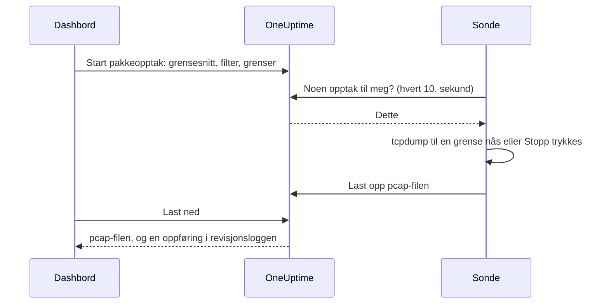

# Pakkeopptak

Ta opp trafikken en av sondene dine ser, rett fra dashbordet, og åpne filen i Wireshark. Sonden står allerede i nettverket du feilsøker i: ingen VPN å åpne og ingen jump host å logge inn på.

Opptak er slått av på hver sonde til den som drifter sonden slår dem på, og de kjører bare på prosjektets egne sonder.

:::cards
- [Slik fungerer det](#slik-fungerer-det): Fra Start pakkeopptak til en fil i Wireshark.
- [Slå på pakkeopptak](#slå-på-pakkeopptak): Hva den som drifter sonden stiller inn, for Docker, Docker Compose og Kubernetes.
- [Start et opptak](#start-et-opptak): Velg et grensesnitt, avgrens til det du trenger, og last ned filen.
- [Referanse](#referanse): Grenser, filtre, tillatelser, revisjonsloggen og hvor lenge filer beholdes.
- [Feilsøking](#feilsøking): Hva meldingen fra et mislykket opptak betyr.
:::

## Slik fungerer det



1. **Start.** Noen som har lov til å starte opptak, velger sondens grensesnitt, et filter og grensene, og klikker **Start opptak**. OneUptime kontrollerer filteret og grensene mot det sonden tillater før opptaket lagres.
2. **Henting.** Sonden spør OneUptime om arbeid hvert tiende sekund, slik den spør etter monitorer. Den tar opptaket og starter `tcpdump`.
3. **Opptak.** Opptaket stopper ved den første av grensene sine: varigheten, pakkegrensen eller filstørrelsen. **Stopp** avslutter det tidlig og beholder det som allerede er tatt opp.
4. **Opplasting.** Sonden laster opp pcap-filen. OneUptime lagrer den som en privat fil i prosjektet.
5. **Nedlasting.** Opptaket viser **Fullført** med en **Last ned**-knapp. Filen åpnes i Wireshark, tcpdump eller et hvilket som helst annet verktøy som leser pcap-filer.

## Før du begynner

- **En av prosjektets egne sonder.** Globale sonder bærer andre prosjekters trafikk, så de tar aldri opp. Se [Egendefinerte probes](/docs/probe/custom-probe) for å installere en egen sonde.
- **En sonde fra denne utgivelsen eller nyere.** Eldre sonder rapporterer ikke hva de kan ta opp på.
- **De riktige tillatelsene.** Å starte og stoppe et opptak krever **Start Packet Capture**, og å laste ned en fil krever **Download Packet Capture**. Prosjekteiere og -administratorer har begge. Se [Tillatelser](#tillatelser).
- **En speilet port, for trafikk som ikke når sonden.** En sonde ser bare trafikken på sin egen verts grensesnitt. For å ta opp trafikk mellom andre enheter speiler du switchporten deres (SPAN) til et ledig grensesnitt på sondens vert.

## Slå på pakkeopptak

Den som drifter sonden, slår på opptak der sonden kjører: dashbordet kan ikke det, med vilje. Sonden trenger tre ting:

| Innstilling | Hvorfor |
| --- | --- |
| `PROBE_PACKET_CAPTURE_ENABLED=true` | Slår på opptak. Enhver annen verdi, eller ingen, lar dem være av. |
| Vertsnettverk | Lar sonden se vertens egne grensesnitt, og en speilet port. Uten det ser sonden bare containerens nettverk. |
| Capabilityen `NET_RAW` | Lar tcpdump ta opp. Docker gir den som standard. Kubernetes' Pod Security-standard «restricted» fjerner den, så legg den til. |

:::tabs
@tab Docker
```bash
docker run --name oneuptime-probe --network host \
  --cap-add NET_RAW \
  -e PROBE_KEY=<probe-key> \
  -e PROBE_ID=<probe-id> \
  -e ONEUPTIME_URL=https://oneuptime.com \
  -e PROBE_PACKET_CAPTURE_ENABLED=true \
  -d oneuptime/probe:release
```
@tab Docker Compose
```yaml
services:
  oneuptime-probe:
    image: oneuptime/probe:release
    container_name: oneuptime-probe
    network_mode: host
    cap_add:
      - NET_RAW
    environment:
      - PROBE_KEY=<probe-key>
      - PROBE_ID=<probe-id>
      - ONEUPTIME_URL=https://oneuptime.com
      - PROBE_PACKET_CAPTURE_ENABLED=true
    restart: always
```
@tab Kubernetes
```yaml
apiVersion: apps/v1
kind: Deployment
metadata:
  name: oneuptime-probe
spec:
  selector:
    matchLabels:
      app: oneuptime-probe
  template:
    metadata:
      labels:
        app: oneuptime-probe
    spec:
      hostNetwork: true
      dnsPolicy: ClusterFirstWithHostNet
      containers:
        - name: oneuptime-probe
          image: oneuptime/probe:release
          securityContext:
            capabilities:
              add: ["NET_RAW"]
          env:
            - name: PROBE_KEY
              value: "<probe-key>"
            - name: PROBE_ID
              value: "<probe-id>"
            - name: ONEUPTIME_URL
              value: "https://oneuptime.com"
            - name: PROBE_PACKET_CAPTURE_ENABLED
              value: "true"
```
:::

Når sonden starter, skriver den i loggen sin `Packet capture is on: captures of up to 30 minutes and 25 MB can be started on this probe from the dashboard.` Innen ett minutt tilbyr sondens side i dashbordet **Start pakkeopptak**.

For å sette et lavere tak på denne sonden enn det alle sonder holder seg til, legger du til en av disse:

| Variabel | Standard | Hva den gjør |
| --- | --- | --- |
| `PROBE_PACKET_CAPTURE_MAX_DURATION_IN_SECONDS` | `1800` | Det lengste opptaket denne sonden kjører, fra 5 til 1800 sekunder. |
| `PROBE_PACKET_CAPTURE_MAX_FILE_SIZE_IN_MB` | `25` | Den største opptaksfilen denne sonden lager, fra 1 til 25 MB. |

> [!NOTE]
> Sondene som følger med en selvhostet OneUptime-installasjon, via Docker Compose eller Helm-chartet, er globale sonder, så de tar aldri opp. Kjør en egendefinert sonde i nettverket du vil ta opp i.

## Start et opptak

:::steps
### Åpne sonden eller enheten

Åpne **Monitorer → Innstillinger → Sonder** og klikk på sonden din: kortet **Pakkeopptak** viser opptakene dens. Eller åpne en nettverksenhet og gå til siden **Traffic**: opptak der kjører på enhetens egen sonde og starter filtrert på enhetens adresse.

### Klikk Start pakkeopptak

Skjemaet sier hva et opptak inneholder før du starter et: passord, tokener og personopplysninger som går over linjen, havner i filen.

### Velg grensesnittet

**Alle grensesnitt (any)** tar opp på alle sondens grensesnitt. Velg grensesnittet en switch speiler trafikk til når du tar opp speilet trafikk.

### Velg hvilke pakker

Fyll ut **Vert eller nettverk**, **Port** og **Protokoll** for å avgrense opptaket, eller la dem stå tomme for å beholde alle pakker. Skjemaet viser filteret de danner, for eksempel `host 10.0.0.5 and tcp port 443`. Klikk **Skriv et BPF-filter i stedet** for å skrive ditt eget.

### Sjekk grensene

**Flere felt** inneholder **Varighet**, **Pakkegrense** og **Grense for filstørrelse (MB)**. Sammendraget sier når opptaket stopper: `Stopper etter 1 minutt, 100 000 pakker eller 10 MB, det som kommer først.`

### Klikk Start opptak

Opptaket viser **Venter** til sonden henter det, deretter **Kjører**, med hvor langt det har kommet. Klikk **Stopp** for å avslutte det tidlig.
:::

Når opptaket viser **Fullført**, klikker du **Last ned** og åpner `.pcap`-filen i Wireshark. Et opptak på **Alle grensesnitt (any)** er en Linux cooked capture, som Wireshark leser som alle andre.

## Referanse

### Grenser

| Grense | Standard | Område |
| --- | --- | --- |
| Varighet | 1 minutt | 5 sekunder til 30 minutter |
| Pakkegrense | 100 000 | 1 til 1 000 000 |
| Grense for filstørrelse | 10 MB | 1 til 25 MB |

- Et opptak stopper ved den første grensen det når. En fil som når størrelsesgrensen sin, kuttes etter den siste hele pakken, så den alltid kan åpnes.
- En sonde kjører høyst 2 opptak om gangen.
- Et opptak som sonden ikke henter innen 5 minutter, mislykkes, og sier det.
- Sonden holder hvert opptak til disse grensene igjen, og til sine egne, lavere grenser.

### Filtre

Skjemaets felt danner et [BPF-filter](https://www.tcpdump.org/manpages/pcap-filter.7.html), opptaksfilterspråket til tcpdump og Wireshark:

| Vert eller nettverk | Port | Protokoll | Filter |
| --- | --- | --- | --- |
| `10.0.0.5` | | Hvilken som helst protokoll | `host 10.0.0.5` |
| `10.0.0.0/24` | `443` | TCP | `net 10.0.0.0/24 and tcp port 443` |
| | `5060` | UDP | `udp port 5060` |
| | `8000-8080` | Hvilken som helst protokoll | `portrange 8000-8080` |
| `10.0.0.5` | | ICMP | `host 10.0.0.5 and (icmp or icmp6)` |

Et filter du skriver selv, er én linje på høyst 500 tegn, laget av bokstaver, tall, mellomrom og `. : / ( ) [ ] ! & | < > = + - * % ^ _`. OneUptime kontrollerer det før det lagres, og tcpdump kompilerer det på sonden. Sonden gir det til tcpdump som ett argument, aldri gjennom et skall.

### Tillatelser

| Tillatelse | Lar en person | Hvem har den som standard |
| --- | --- | --- |
| **Start Packet Capture** | Starte opptak, og stoppe dem | Project Owner, Project Admin |
| **Download Packet Capture** | Laste ned opptaksfiler | Project Owner, Project Admin |
| **Delete Packet Capture** | Slette opptak og filene deres | Project Owner, Project Admin |
| **Read Packet Capture** | Se opptak: når de kjørte, på hvilken sonde og med hvilket filter | Project Owner, Project Admin, Project Member, Viewer |

For å gi et team **Start Packet Capture** eller **Download Packet Capture** åpner du det under **Innstillinger → Team** og legger til tillatelsen på siden **Tillatelser**. Se [Tillatelser](/docs/permissions/index).

### Revisjonslogg og personvern

- Å starte et opptak registreres i revisjonsloggen som en **Create** av **Packet Capture**, og å slette et som en **Delete**. Hver nedlasting registreres som en **Download**, med hvem som lastet ned hvilket opptak.
- Filen er en privat fil i prosjektet. Bare knappen **Last ned**, med **Download Packet Capture**, gir den ut.
- Opptak og filene deres slettes 7 dager etter at de starter. Å slette et opptak sletter filen med en gang.

## Feilsøking

:::details «Pakkeopptak er slått av på denne sonden»
Sonden kjører uten `PROBE_PACKET_CAPTURE_ENABLED=true`. Start den på nytt med innstillingene i [Slå på pakkeopptak](#slå-på-pakkeopptak).
:::

:::details "The probe is not allowed to capture packets on eth0"
tcpdump kunne ikke åpne grensesnittet. Gi sondens container capabilityen `NET_RAW`: `--cap-add NET_RAW` med Docker, `cap_add` med Docker Compose, `securityContext.capabilities.add` med Kubernetes.
:::

:::details "The interface does not exist on the probe"
Grensesnittet har forsvunnet siden sonden sist rapporterte det, eller sonden kjører uten vertsnettverk og ser bare containerens grensesnitt. Kjør den med vertsnettverk, og velg grensesnittet på nytt.
:::

:::details "tcpdump could not use the filter"
tcpdump kunne ikke kompilere filteret. Meldingen har tcpdumps egne ord, for eksempel `syntax error`. Sjekk filteret mot [pcap-filter-manualen](https://www.tcpdump.org/manpages/pcap-filter.7.html).
:::

:::details "The probe did not pick up this capture within 5 minutes"
Sonden er frakoblet, eller pakkeopptak ble slått av på den etter at opptaket ble startet. Sjekk sondens **Tilkoblingsstatus**, og loggen dens.
:::

:::details «Ingen pakker samsvarte med filteret.»
Opptaket kjørte, og ingenting på grensesnittet samsvarte med filteret. Sjekk at trafikken går over dette grensesnittet: trafikk mellom andre enheter når bare sonden gjennom en speilet port.
:::

:::details "This probe is already running 2 packet captures"
En sonde kjører 2 opptak om gangen. Vent til ett er ferdig, eller stopp ett, og start ditt på nytt.
:::

## Neste steg

:::cards
- [Egendefinerte probes](/docs/probe/custom-probe): Installer en sonde i nettverket du vil ta opp i.
- [Nettverksenhets-overvåking](/docs/monitor/network-device-monitor): Overvåk enhetene du tar opp trafikken til.
- [Tillatelser](/docs/permissions/index): Gi et team tillatelsene for pakkeopptak.
:::
