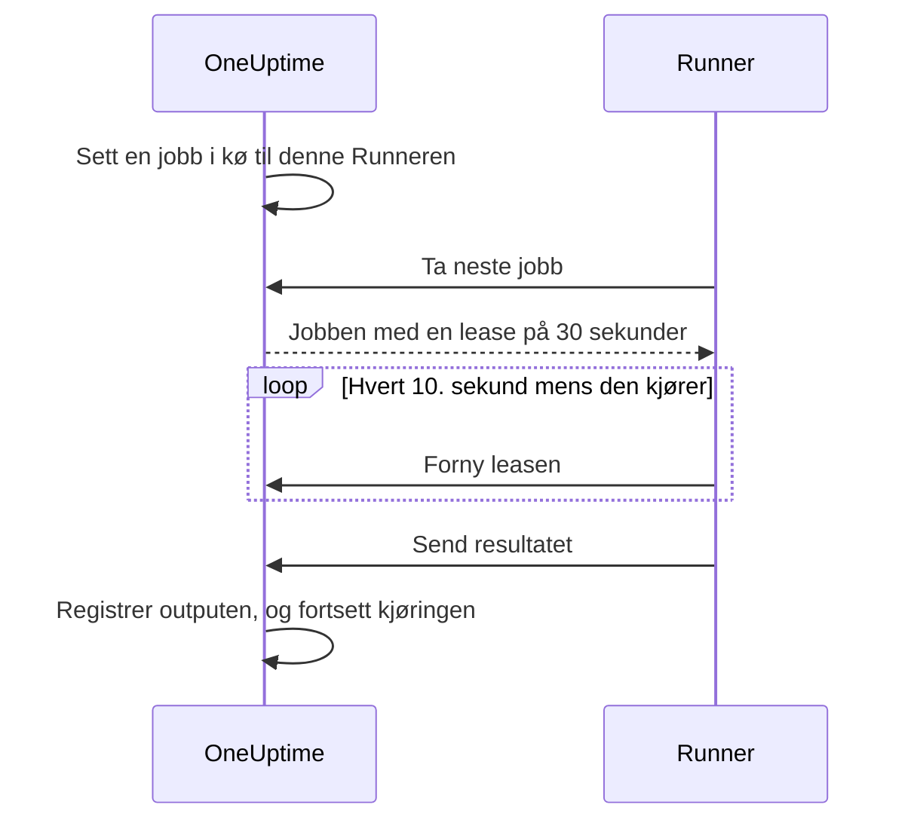

# Runbook-agenter

En **runbook-agent**, som heter **Runner** i dashbordet, er en liten selvhostet prosess som kjører JavaScript-, Bash-, SSH- og Kubernetes-trinnene i runbookene dine **i din egen infrastruktur**. OneUptime Worker kjører aldri skriptene dine: den setter dem i kø, og Runneren som forfatteren av trinnet valgte, tar hver jobb, kjører den og sender resultatet tilbake. Denne siden er for dem som installerer og drifter Runnere.

:::cards
- [Installer en Runner](#installer-en-runner): Fra dashbordet til en tilkoblet container i fem trinn.
- [Pek et trinn mot en Runner](#pek-et-trinn-mot-en-runner): Bind et trinn til Runneren som skal kjøre det.
- [Tidsavbrudd](#tidsavbrudd): Claim- og kjøringstidsavbrudd, og hvordan de virker sammen.
- [Miljøvariabler](#miljøvariabler): Hva containeren leser ved oppstart.
:::

## Slik fungerer det

```mermaid title="Hva som krysser nettverket mellom en Runner og OneUptime"
flowchart TB
    subgraph yours["Din infrastruktur"]
        direction LR
        runner["Runner-container"]
        targets["Verter, klynger, interne tjenester"]
    end
    subgraph cloud["OneUptime"]
        direction LR
        worker["Workeren setter trinnet i kø"]
        ingest["Runner-API"]
    end
    worker --> ingest
    runner -->|"Utgående HTTPS, Runner-ID og nøkkel"| ingest
    ingest -->|"Tatt jobb med hemmelighetene eller påloggingsinformasjonen"| runner
    runner -->|"Skript, SSH eller Kubernetes-API"| targets
```

1. Du oppretter en Runner i OneUptime. OneUptime genererer en ID og en hemmelig nøkkel for den.
2. Du kjører Runner-containeren på en vert i infrastrukturen din med den ID-en, den nøkkelen og OneUptime-URL-en din.
3. Runneren ber OneUptime om arbeid hvert 5. sekund og melder hvert 60. sekund at den er i live.
4. Når du skriver et JavaScript-, Bash-, SSH- eller Kubernetes-trinn, velger du Runneren fra en nedtrekksliste. Trinnet bindes til den Runneren.
5. Når trinnet kjører, setter Workeren en jobb i kø med `targetAgentId` satt til den Runneren. Bare den Runneren kan ta den.
6. Runneren kjører jobben lokalt — `bash -c <script>` for Bash, en `isolated-vm`-sandkasse for JavaScript, en SSH-forbindelse eller et kall til klyngens API-server med påloggingsinformasjonen til trinnet —, registrerer resultatet og sender det tilbake. Workeren gjenopptar runbooket med resultatet.

Runneren trenger bare **utgående HTTPS** til OneUptime-instansen din. Den godtar ingen innkommende forbindelser.

En Runner har bare ID-en og nøkkelen sin. Alt annet mottar den med jobben den tar: et skript der [runbook-hemmelighetene](/docs/runbooks/credentials#hemmeligheter-for-skript) som er tildelt den, er fylt inn, eller [påloggingsinformasjonen](/docs/runbooks/credentials) som et SSH- eller Kubernetes-trinn peker på. Derfor kan alle som har nøkkelen til en Runner, opptre som den Runneren: behandle nøkkelen som påloggingsinformasjonen som er tildelt den.

## Hvorfor skript kjører på en Runner

Å kjøre skript på OneUptime Worker hadde to problemer:

- **Tillitsgrense.** Alle som kunne skrive et runbook, kunne kjøre kode på Workeren med tilgang til alt Workeren kunne nå.
- **Rekkevidde.** De fleste nyttige trinn virker på _din_ infrastruktur ("start denne tjenesten på nytt", "slå opp en post i den interne databasen vår"), ikke på OneUptimes.

Med Runnere kjører de trinnene på en vert du kontrollerer, og du bestemmer hva den verten har lov til. HTTP-forespørsels- og AI-trinn kjører fortsatt på Workeren, fordi de ikke trenger noe fra nettverket ditt.

## Før du begynner

- **En vert med Docker** i infrastrukturen din som kan nå OneUptime-URL-en din over HTTPS og systemene trinnene dine virker på.
- **En rolle som oppretter Runnere.** Project Owner, Project Admin, Project Member og Runbook Admin kan opprette en. Bare en Project Owner, Project Admin eller Runbook Admin kan se nøkkelen til en Runner, som oppsettskommandoen inneholder.

## Installer en Runner

### 1. Opprett agentposten

Gå til **Runbooks → Runbook-agenter**, og opprett en ny agent. Klikk **Opprett Runner**, og fyll ut de to trinnene:

| Felt | Trinn | Merknader |
| --- | --- | --- |
| **Navn** | **Runner** | Et lesbart navn, typisk hvor den kjører og hva den kan nå, for eksempel `prod-eu-west-1`. Det er dette du velger når du skriver et trinn. |
| **Beskrivelse** | **Runner** | Valgfritt. En setning om hva denne verten kan nå. |
| **Etiketter** | **Runner** (under **Flere felt**) | Valgfritt. |
| **Kjører runbooks** | **Funksjoner** | Slått på som standard. Lar denne Runneren ta runbook-trinn. |
| **Kjører AI-koderettelser** | **Funksjoner** | Slått av som standard. Lar den åpne pull requests med AI-koderettelser; se [Fix Tasks](/docs/ai/ai-agent). |
| **Kjører AI-utbedringskommandoer** | **Funksjoner** | Slått av som standard. Lar automatisk AI-utbedring kjøre policykontrollerte kommandoer på den. Å slå den på for en Runner som har SSH-påloggingsinformasjon, krever tillatelse til å lese runbook-påloggingsinformasjon; se [Runnere som kjører kommandoene til OneUptime AI](/docs/runbooks/credentials#runnere-som-kjører-kommandoene-til-oneuptime-ai). |

En Runner henter en endring i funksjonene sine ved neste heartbeat; den trenger ikke å startes på nytt.

### 2. Kopier installasjonskommandoen

Klikk **Vis oppsettsinstruksjoner** i raden til Runneren. Dialogen **Oppsett av runbook-agent** viser en `docker run`-kommando som allerede inneholder ID-en og nøkkelen til denne Runneren. Den samme kommandoen står på Runnerens egen side under **Oppsettsinstruksjoner**.

Bare en Project Owner, Project Admin eller Runbook Admin kan lese nøkkelen. Alle andre ser "Du har ikke tillatelse til å se nøkkelen til denne runbook-agenten" i stedet for kommandoen.

### 3. Kjør den på en vert i infrastrukturen din

Kjør kommandoen på en vert i miljøet ditt som kan:

- nå OneUptime-instansen din over HTTPS, og
- gjøre det trinnene dine trenger, for eksempel nå andre verter via SSH, kalle API-serveren til en klynge eller snakke med en database.

```bash
docker run --name oneuptime-runner --restart unless-stopped \
  -e ONEUPTIME_RUNNER_ID=<runner-id> \
  -e ONEUPTIME_RUNNER_KEY=<runner-key> \
  -e ONEUPTIME_URL=https://oneuptime.yourdomain.com \
  -d oneuptime/runner:release
```

### 4. Kontroller at agenten er tilkoblet

Gå tilbake til **Runbooks → Runbook-agenter**. Innen et minutt etter at containeren har startet, skal Runnerens **Status** vise **Tilkoblet** med en fersk **Sist sett**. På Runnerens egen side viser kortet **Status for runbook-agent** dens **Versjon av runbook-agent** og **Vert**. Hvis den fortsetter å vise **Aldri tilkoblet** eller **Frakoblet**, se [Feilsøking](#feilsøking).

### 5. Hold agenten oppdatert

Når en agent kjører en eldre versjon enn OneUptime-en din, vises et varseltegn ved siden av **Versjon av runbook-agent** på siden dens. Velg det for å se hvordan du oppgraderer: hent det nye imaget, fjern containeren, og kjør deretter installasjonskommandoen fra trinn 2 på nytt. En agent som chartet til Kubernetes-agenten installerte, oppgraderes i stedet med chartet.

```bash
docker pull oneuptime/runner:release
docker rm -f oneuptime-runner
```

## Pek et trinn mot en Runner

:::steps
### Legg til et trinn som kjører på en Runner

Legg til et JavaScript-, Bash-, SSH- eller Kubernetes-trinn i runbookets **Trinn**.

### Velg Runneren

Nedtrekkslisten **Runner** i trinnet viser alle Runnere i prosjektet og om de er tilkoblet. Hvis prosjektet ikke har noen ennå, sier trinnet det og viser deg til **Runbooks › Runners**.

### Lagre trinnene

Klikk **Save Steps**. Når en kjøring når trinnet, setter Workeren en jobb i kø til ID-en til den Runneren, og bare den Runneren kan ta den.
:::

Bash kjøres med `bash -c`. JavaScript kjører i en `isolated-vm`-sandkasse på Runneren uten tilgang til filsystemet eller prosesser; det kan kalle offentlige HTTP-API-er med `axios`, men ikke adresser på et privat nettverk. SSH- og Kubernetes-trinn bruker [påloggingsinformasjonen](/docs/runbooks/credentials) trinnet peker på, og den må være tildelt den samme Runneren.

Trenger du mer enn én Runner? Opprett dem, og pek hvert trinn mot den riktige. For redundans kjører du en ekstra Runner og fordeler trinnene mellom dem, eller du har et reserve-runbook der trinnene peker mot den andre Runneren.

## Driftsmerknader

### Tidsavbrudd

To tidsavbrudd gjelder for hvert trinn som kjører på en Runner:

| Tidsavbrudd | Standard | Hva det styrer |
| --- | --- | --- |
| **Claim timeout** | 2 minutter | Hvor lenge Workeren venter på at den valgte Runneren tar jobben. Hvis Runneren ikke tar den i tide, feiler trinnet på grunn av tidsavbrudd, og runbooket fortsetter (eller stopper, avhengig av **Fortsett ved feil**). |
| **Execution timeout** | 30 sekunder | Hvor lenge Runneren lar trinnet kjøre før den stopper det. Bash får `SIGKILL`; sandkassen til JavaScript rives ned. |

Begge kan settes per trinn. Åpne **Runbooks › runbooket ditt › Trinn**, fold ut trinnet, og angi **Execution timeout** og **Claim timeout** (i sekunder) i innstillingene. La et felt stå tomt for å bruke standarden. Hver godtar 1 sekund til 1 time; verdier utenfor det intervallet begrenses når trinnet kjører.

Workerens samlede ventevindu er `claim timeout + execution timeout + a few seconds`. Velg verdier som passer trinnet.

To ting å huske når du senker claim timeout:

- Runneren ber om arbeid i en polling-syklus (`ONEUPTIME_RUNNER_POLL_INTERVAL_MS`, 5 sekunder som standard). En claim timeout kortere enn én syklus kan utløpe før en helt frisk Runner i det hele tatt har sett jobben, og trinnet feiler da med samme melding som en frakoblet Runner gir.
- En Runner kjører én jobb om gangen som standard (`ONEUPTIME_RUNNER_CONCURRENCY`). Mens et langt trinn opptar den, venter andre trinn som peker mot samme Runner, ut sine egne claim timeouts. Hvis du øker en execution timeout til minutter, øker du claim timeout tilsvarende på trinnene som deler den Runneren, eller gir dem en annen Runner.

### Lease og heartbeat



Når en Runner tar en jobb, får den en kort lease (30 sekunder som standard). Mens trinnet kjører, fornyer Runneren leasen hvert 10. sekund. Hvis Runneren dør eller mister nettverket midt i et skript, utløper leasen, og Workeren markerer jobben som `TimedOut` i stedet for å vente for alltid.

Bash-underprosesser avbrytes **ikke** automatisk når leasen utløper (en JavaScript-sandkasse får også lov til å bli ferdig hvis den noen gang blir det), men Workeren slutter å vente på dem, og Runneren kan ikke sende inn et resultat etter at en annen har tatt over jobben. Utform skript slik at de trygt kan kjøres på nytt hvis det er viktig for deg at de kjører nøyaktig én gang.

### Hvis OneUptime Worker starter på nytt midt i et trinn

En runbook-kjøring kjører på én Worker fra start til slutt, så en utrulling eller et krasj kan avbryte den mens et trinn pågår. Hva som skjer deretter, avhenger av om kjøringen blir tatt opp igjen:

- **Den gjenopptas.** Workeren som tar den opp, finner jobben trinnet ditt allerede har opprettet, og **kobler seg på den igjen**. Den venter på den jobben i stedet for å sende Runneren din en ekstra kopi av skriptet. Hvis Runneren allerede var ferdig, brukes det registrerte resultatet uendret. Et trinn sendes høyst én gang per kjøring til en Runner.
- **Den gjenopptas ikke.** Hvis kjøringen aldri blir tatt opp igjen, markerer en opprydding den som `Failed` når den har passert claim- og kjøringsvinduet for det nåværende trinnet, med en melding som nevner trinnet. En kjøring blir aldri hengende i `Running`.

Det eneste dette ikke kan fortelle deg, er hvor langt et skript kom før Workeren forsvant. Et trinn som var midt i kjøringen, rapporteres som mislykket med en merknad om at det kanskje har kjørt delvis: kontroller målsystemet før du kjører runbooket på nytt.

### Ingen agent tilkoblet

Hvis den valgte Runneren er frakoblet når trinnet kjører, venter jobben som `Pending` til claim timeout er gått, og så feiler trinnet med "No runbook agent picked up this step before the wait window expired." Siden **Runbook-agenter** er stedet der du kontrollerer dekningen før du kjører et runbook på ordentlig.

### Grense for output

stdout og stderr til sammen er begrenset til **50 KB** per trinn. Lengre output kuttes med en markør. Trenger du en fullstendig logg, skriver du den fra skriptet til logglageret eller objektlageret ditt og viser URL-en med `echo`.

### Avbrytelse

Å avbryte en runbook-kjøring, fra kjøringssiden eller API-et, markerer straks alle jobbene dens i `Pending`, `Claimed` og `Running` som `Cancelled`. En Runner som allerede er midt i et skript, gjør arbeidet ferdig, men serveren godtar ikke resultatet, og ingen senere trinn i runbooket sendes ut.

### Samtidighet

Hver Runner kjører én jobb om gangen som standard. Vil du tillate flere, setter du `ONEUPTIME_RUNNER_CONCURRENCY` på containeren, men husk at Runneren deler verten med alt annet som kjører der.

## Miljøvariabler

Runneren leser disse ved oppstart:

| Variabel | Påkrevd | Standard | Merknader |
| --- | --- | --- | --- |
| `ONEUPTIME_URL` | ja | — | Basis-URL-en til OneUptime-instansen din, for eksempel `https://oneuptime.yourdomain.com`. |
| `ONEUPTIME_RUNNER_ID` | ja | — | Runnerens ID fra oppsettskommandoen. |
| `ONEUPTIME_RUNNER_KEY` | ja | — | Runnerens hemmelige nøkkel fra oppsettskommandoen. |
| `ONEUPTIME_RUNNER_POLL_INTERVAL_MS` | nei | `5000` | Hvor ofte Runneren ber om nye jobber. En verdi under `1000` faller tilbake til standarden. |
| `ONEUPTIME_RUNNER_HEARTBEAT_INTERVAL_MS` | nei | `60000` | Hvor ofte Runneren melder at den er i live. En verdi under `5000` faller tilbake til standarden. |
| `ONEUPTIME_RUNNER_JOB_HEARTBEAT_INTERVAL_MS` | nei | `10000` | Hvor ofte Runneren fornyer leasen på en jobb som kjører. En verdi under `1000` faller tilbake til standarden. |
| `ONEUPTIME_RUNNER_CONCURRENCY` | nei | `1` | Maksimalt antall samtidige jobber på denne Runneren. |
| `ONEUPTIME_RUNNER_ENABLE_RUNBOOKS` | nei | — | Sett til `false` for å få denne Runneren til å slutte å ta runbook-trinn, uansett hva dashbordet sier. Den kan bare slå funksjonen av. |
| `ONEUPTIME_RUNNER_ENABLE_CODE_FIXES` | nei | — | Sett til `false` for å få denne Runneren til å slutte å ta AI-koderettelser, uansett hva dashbordet sier. |
| `ONEUPTIME_RUNNER_ENABLE_AI_COMMANDS` | nei | — | Sett til `false` for å få denne Runneren til å slutte å kjøre AI-utbedringskommandoer, uansett hva dashbordet sier. |

## Bytt en agentnøkkel

Hvis en nøkkel lekker, tilbakestiller du den. Den gamle nøkkelen slutter å virke med en gang.

:::steps
### Tilbakestill nøkkelen

Åpne Runneren fra **Runbooks → Runbook-agenter**, klikk **Tilbakestill runbook-agentnøkkel**, og bekreft. Runneren slutter å koble til til den har den nye nøkkelen.

### Kjør containeren med den nye nøkkelen

Kopier den nye kommandoen fra Runnerens **Oppsettsinstruksjoner**, fjern den gamle containeren, og kjør den nye kommandoen på samme vert:

```bash
docker rm -f oneuptime-runner
```

### Kontroller at den kobler til igjen

Under **Runbooks → Runbook-agenter** går Runnerens **Status** tilbake til **Tilkoblet** innen et minutt.
:::

## Tillatelser

Administrasjon av agenter ligger i den eksisterende tillatelsesgruppen Runbooks:

- `CreateRunner`, `EditRunner`, `DeleteRunner`, `ReadRunner` — administrer agentposter.
- `RunbookAdmin`, `RunbookMember`, `RunbookViewer` (roller) — `RunbookAdmin` bygger runbooks, reglene deres og Runnerne de kjører på, og kjører dem. `RunbookMember` åpner runbooks og kjøringene deres og kjører dem — starter en kjøring, fullfører eller hopper over trinnene og avbryter den — men oppretter, endrer og sletter ingen runbooks eller Runnere. `RunbookViewer` leser runbooks og kjøringene deres og kjører ingenting. `RunbookAdmin` samler alle de detaljerte tillatelsene ovenfor.

Å utløse et runbook (og dermed sende trinnene til Runnere) krever en rolle som kjører runbooks — `ProjectOwner`, `ProjectAdmin`, `ProjectMember`, `RunbookAdmin` eller `RunbookMember` — eller `CreateRunbookExecution`; å fullføre, hoppe over eller avbryte en kjøring godtar også `EditRunbookExecution`. En rolle kjører bare runbookene omfanget dens når.

Nøkkelen til en Runner kan bare leses av Project Owners, Project Admins og Runbook Admins.

## API for agenter

For de nysgjerrige: Runneren bruker disse endepunktene, montert under `/runner-ingest`. Stien fra før sammenslåingen, `/runbook-agent-ingest`, betjenes fortsatt for agenter som ennå ikke er rullet ut på nytt, slik at en serveroppgradering ikke ødelegger dem. De autentiseres med Runnerens ID og nøkkel i JSON-body-en (`agentId` og `agentKey`) eller i headerne `x-agent-id` og `x-agent-key`.

| Endepunkt | Formål |
| --- | --- |
| `POST /heartbeat` | Livstegn. Oppdaterer Runnerens sist sett-tid, versjon og vertsinformasjon og returnerer funksjonene prosjektet har gitt den. |
| `POST /claim-next-job` | Ta atomisk den eldste jobben i `Pending` som er rettet mot ID-en til denne Runneren. Returnerer `{ job: null }` når det ikke er noe å gjøre. |
| `POST /job/:jobId/heartbeat` | Forny leasen til jobben. Returnerer 404 når leasen har utløpt eller jobben er avsluttet. |
| `POST /job/:jobId/result` | Send inn det endelige resultatet. Ignoreres hvis leasen allerede har gått videre. |
| `POST /disconnect` | Logg av ved en ryddig avslutning. |

Du skal ikke trenge å kalle dem manuelt: den medfølgende Runneren gjør det. De er dokumentert her slik at du kan bygge din egen agent hvis du har en begrensning som vår ikke passer til.

## Feilsøking

:::details Runneren fortsetter å vise Aldri tilkoblet eller Frakoblet
- Sjekk containerens logger med `docker logs oneuptime-runner` for autentiserings- eller nettverksfeil.
- Kontroller at verten kan nå OneUptime-URL-en din, for eksempel med `curl`.
- Kontroller at ID og nøkkel er kopiert uten mellomrom, og at `ONEUPTIME_URL` er adressen du åpner OneUptime på.

**Aldri tilkoblet** betyr at Runneren aldri har meldt seg. **Frakoblet** betyr at den har det, men ikke i løpet av de siste 5 minuttene.
:::

:::details Trinn feiler med "No runbook agent picked up this step before the wait window expired."
Trinnets Runner tok ikke jobben innenfor sin claim timeout. Kontroller at Runneren er **Tilkoblet**, at **Kjører runbooks** er slått på for den, og at den ikke er opptatt med et langt trinn: den kjører én jobb om gangen med mindre du øker `ONEUPTIME_RUNNER_CONCURRENCY`. En claim timeout kortere enn polling-intervallet feiler på samme måte.
:::

:::details Trinn feiler med "The runbook agent stopped responding while this step was running."
Runneren tok jobben og sluttet så å fornye leasen: den krasjet, startet på nytt eller mistet nettverket. Kontroller at den er tilkoblet, og kontroller deretter målsystemet før du kjører runbooket på nytt.
:::

:::details Runneren logger "No capability is enabled"
Alle funksjoner er slått av for denne Runneren. Slå på **Kjører runbooks** på Runnerens side i OneUptime. Den henter endringen ved neste heartbeat.
:::

## Neste steg

:::cards
- [Skrive et runbook](/docs/runbooks/authoring): Skriv trinnene som kjører på Runneren din.
- [Runbook-påloggingsinformasjon](/docs/runbooks/credentials): Gi SSH- og Kubernetes-trinn administrert tilgang.
- [Runbook-konfigurasjon & sikkerhet](/docs/runbooks/configuration): Grenser, tillatelser og herding.
:::
