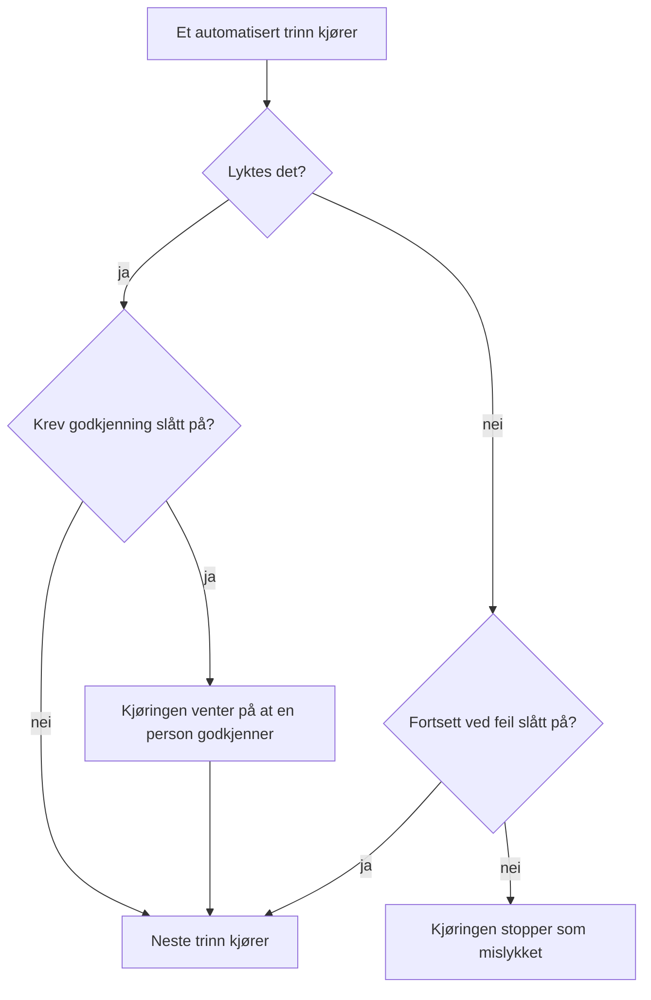

# Skrive et runbook

Du skriver et runbook som en ordnet liste med trinn på siden **Trinn**. Denne siden viser hvordan du oppretter et runbook, hvordan du setter opp hver av de sju trinntypene, og hvordan feil og godkjenninger endrer forløpet til en kjøring.

:::cards
- [Opprett et runbook](#opprett-et-runbook): Fra et tomt runbook til lagrede trinn.
- [Trinntyper](#trinntyper): Manual, JavaScript, HTTP request, Bash, SSH, Kubernetes og AI.
- [Feilhåndtering og godkjenninger](#feilhåndtering-og-godkjenninger): Hva som skjer når et trinn feiler eller lykkes.
- [Et gjennomgått eksempel](#et-gjennomgått-eksempel): En database-failover i fem trinn.
:::

## Før du begynner

- **En rolle som skriver runbooks.** Project Owner, Project Admin og Runbook Admin oppretter runbooks og lagrer trinnene deres. Med detaljerte tillatelser trenger du **Create Runbook** og **Edit Runbook**. Se [Tillatelser](/docs/runbooks/configuration#tillatelser).
- **En Runner, for JavaScript-, Bash-, SSH- og Kubernetes-trinn.** Disse trinnene kjører på en [Runner](/docs/runbooks/agents) i din egen infrastruktur, aldri på OneUptime Worker. Installer en først.
- **Påloggingsinformasjon, for SSH- og Kubernetes-trinn, og tillatelse til å lese den.** Se [Runbook-påloggingsinformasjon](/docs/runbooks/credentials). Et trinn kan bare peke på påloggingsinformasjon hvis du har lov til å lese runbook-påloggingsinformasjon: Project Owner, Project Admin eller **Read Runbook Credential**. Runbook Admin omfatter ikke dette.
- **En LLM-leverandør, for AI-trinn.** Se [LLM-leverandører](/docs/ai/llm-provider).

## Opprett et runbook

:::steps
### Åpne Runbooks

Åpne **Produkter → Runbooks**. Runbooks ligger i gruppen **Dashbord og automatisering**.

### Opprett runbooket

Klikk **Opprett Runbook**, skriv inn et **Navn** og eventuelt en **Beskrivelse** av hva runbooket er til. Under **Flere felt** ligger bryteren **Aktivert**, som er slått på som standard, og **Etiketter**. Det nye runbooket vises i listen: åpne det.

### Legg til trinn

Gå til **Trinn**. Under **Start your runbook** velger du typen for det første trinnet; under det siste trinnet tilbyr **Add another step** de samme sju typene. Hvert trinn åpnes med **Tittel**, **Beskrivelse** (Markdown, vises for den som håndterer hendelsen) og innstillingene for typen. Når runbooket har et trinn, legger **Legg til trinn** øverst på kortet til et Manual-trinn.

### Sett trinnene i rekkefølge

Trinn kjører **i rekkefølge**. Du endrer rekkefølgen ved å dra et trinn i håndtaket til venstre i overskriften; med tastaturet setter du fokus på håndtaket, trykker mellomrom, flytter trinnet med piltastene og trykker mellomrom igjen.

### Lagre trinnene

Klikk **Save Steps**. Inntil du gjør det, viser redigeringsverktøyet **Ulagrede endringer**. Når de er lagret, ser du **Lagret**, og runbooket er klart til å [kjøres](/docs/runbooks/running).
:::

## Hvordan et trinn er bygd opp

Hvert trinn har disse feltene:

| Felt | Formål |
| --- | --- |
| **Tittel** | En kort etikett som vises i trinnlisten og ved hver kjøring. |
| **Beskrivelse** | Valgfri kontekst for den som håndterer hendelsen, i Markdown. På et Manual-trinn er det instruksjonen personen leser. |
| **Fortsett ved feil** | Bare automatiserte trinn. Når den er slått på, stopper ikke et trinn som feiler kjøringen: neste trinn kjører likevel. |
| **Krev godkjenning** | Bare automatiserte trinn. Når den er slått på, tar runbooket pause etter dette trinnet og venter på at en person godkjenner før neste trinn kjører. Bryteren heter **Krev godkjenning før det neste trinnet kjøres**. |
| Typespesifikke innstillinger | Skriptet, URL-en, Runneren, påloggingsinformasjonen eller prompten. Se [Trinntyper](#trinntyper). |

## Trinntyper

| Type | Kjører på | Krever |
| --- | --- | --- |
| [Manual](#manual) | En person | Ingenting |
| [JavaScript](#javascript) | En Runner | En Runner |
| [HTTP request](#http-request) | OneUptime Worker | Ingenting |
| [Bash](#bash) | En Runner | En Runner |
| [SSH](#ssh) | En Runner | En Runner og SSH-påloggingsinformasjon |
| [Kubernetes](#kubernetes) | En Runner | En Runner og Kubernetes-påloggingsinformasjon |
| [AI](#ai) | OneUptime Worker | En LLM-leverandør |

### Manual

Et sjekklistepunkt for en person. Kjøringen tar pause når den når et Manual-trinn, og blir værende i `WaitingForManualStep` (**Venter på deg**) til noen klikker **Mark complete** eller **Hopp over**. En kjøring som venter på en person, utløper aldri.

Bruk det til det bare et menneske kan kontrollere eller gjøre: "Bekreft i lastbalansererens dashbord at trafikken er flyttet til den sekundære regionen."

### JavaScript

Et stykke JavaScript som kjører i en `isolated-vm`-sandkasse på en [runbook-agent](/docs/runbooks/agents) i din egen infrastruktur, ikke på OneUptime Worker.

| Felt | Hva det gjør | Standard |
| --- | --- | --- |
| **Runner** | Runneren som kjører trinnet. Bare den Runneren kan ta jobben. | — |
| **Script** | JavaScript-koden som skal kjøre. Returner en verdi med `return` for å registrere den; hver linje fra `console.log` registreres også. En kastet feil får trinnet til å feile. | — |
| **Execution timeout** | Hvor lenge Runneren lar koden kjøre før den river ned sandkassen. | 30 sekunder |
| **Claim timeout** | Hvor lenge Workeren venter på at Runneren tar jobben. | 2 minutter |

```javascript
const start = Date.now();
// ... your logic ...
console.log("replica lag checked");
return { durationMs: Date.now() - start };
```

Sandkassen har 128 MB minne og ingen tilgang til filsystemet eller prosesser. Den kan sende HTTP-forespørsler med `axios`, men bare til offentlige adresser: en forespørsel til et privat nettverk, til Runnerens egen vert eller til et metadataendepunkt i skyen avvises. Bruk et [Bash](#bash)-trinn med `curl` for å nå en tjeneste i nettverket ditt.

### HTTP request

Et utgående HTTP-kall, gjort av OneUptime Worker. Ingen Runner trengs.

| Felt | Hva det gjør | Standard |
| --- | --- | --- |
| **Method** | `GET`, `POST`, `PUT`, `PATCH`, `DELETE` eller `HEAD`. | `GET` |
| **URL** | Endepunktet som skal kalles. | Tom |
| **Headers (JSON)** | Et JSON-objekt, for eksempel `{ "Authorization": "Bearer ..." }`. Headere som ikke er gyldig JSON, får trinnet til å feile. | Ingen |
| **Body** | Sendes som JSON når den kan leses som JSON, ellers som tekst. | Ingen |
| **Request timeout** | Hvor lenge det ventes på svar fra endepunktet før trinnet feiler. | 30 sekunder |

Trinnet lykkes ved et `2xx`- eller `3xx`-svar og feiler ved alt annet, med `HTTP <status>` som feil. Omdirigeringer følges ikke. Svarets status, headere og body registreres, opptil 50 KB.

> [!NOTE]
> Workeren kaller aldri loopback- eller link-local-adresser, for eksempel et metadataendepunkt i skyen. På OneUptime Cloud kaller den bare offentlige adresser. En selvhostet OneUptime når også private nettverk, med mindre `DATA_SOURCE_BLOCK_PRIVATE_ADDRESSES` er `true`. Bruk et [Bash](#bash)-trinn med `curl` for å kalle en tjeneste i nettverket ditt fra OneUptime Cloud.

Nyttig til: å åpne en PagerDuty-hendelse, poste til en Slack-webhook, kalle API-et til skyleverandøren din eller ditt eget offentlige API.

### Bash

Et bash-skript som kjøres med `bash -c <script>` på en [runbook-agent](/docs/runbooks/agents) i din egen infrastruktur. Bash kjører aldri på OneUptime Worker.

| Felt | Hva det gjør | Standard |
| --- | --- | --- |
| **Runner** | Runneren som kjører trinnet. Bare den Runneren kan ta jobben. | — |
| **Bash-skript** | Skriptet. Output (stdout og stderr) registreres opptil 50 KB, og en exitkode som ikke er null, får trinnet til å feile. | — |
| **Execution timeout** | Hvor lenge Runneren lar skriptet kjøre før den dreper det med `SIGKILL`. Øk den for trinn som med god grunn tar minutter. | 30 sekunder |
| **Claim timeout** | Hvor lenge Workeren venter på at Runneren tar jobben. | 2 minutter |

Skriptet kjører i Runnerens container med verktøyene imaget leveres med, som `curl`, `wget` og `ssh`-klienten, og med nettverkstilgangen til verten det kjører på. For eksempel for å sjekke en tjeneste som bare nettverket ditt kan nå:

```bash
set -euo pipefail
HTTP_CODE=$(curl -s -o /tmp/resp.txt -w "%{http_code}" "http://payments.internal:8080/health")
echo "HTTP $HTTP_CODE"
cat /tmp/resp.txt
if [[ "$HTTP_CODE" != "200" ]]; then
  echo "Health check failed"
  exit 1
fi
```

Hvis den valgte Runneren er frakoblet når kjøringen når dette trinnet, venter trinnet opptil **claim timeout** (2 minutter som standard) og feiler deretter på grunn av tidsavbrudd. Legg til en agent under **Runbooks → Runbook-agenter** før du regner med et Bash-trinn.

> [!TIP]
> Hold passord og tokens utenfor skriptet. Lagre dem som runbook-hemmeligheter, og skriv `{{runbookSecrets.NAME}}` i et Bash- eller JavaScript-skript: Runneren mottar skriptet med verdien fylt inn. Se [Hemmeligheter for skript](/docs/runbooks/credentials#hemmeligheter-for-skript).

### SSH

Kjør én kommando på en vert som Runneren kan nå via SSH. I motsetning til `ssh host cmd` i et Bash-trinn er tilgangen administrert [påloggingsinformasjon](/docs/runbooks/credentials) i stedet for en privat nøkkel på Runnerens disk: kryptert i hvile, tildelt bestemte Runnere og aldri lesbar igjen via API-et.

| Felt | Hva det gjør |
| --- | --- |
| **Runner** | Runneren som åpner forbindelsen. Den må kunne nå verten over nettverket. |
| **Credential** | SSH-påloggingsinformasjon med vert, port, bruker og nøkkel eller passord. Den må være tildelt Runneren du valgte, ellers feiler trinnet i stedet for å kjøre med feil tilgang. |
| **Command** | Kjøres på den eksterne verten som brukeren i påloggingsinformasjonen. Output registreres opptil 50 KB, og en exitkode som ikke er null, får trinnet til å feile. |
| **Execution timeout** | Dekker tilkobling, autentisering og kjøring av kommandoen samlet, så en kommando som henger, ikke kan holde trinnet åpent. Standard 30 sekunder. |
| **Claim timeout** | Hvor lenge Workeren venter på at Runneren tar jobben. Standard 2 minutter. |

### Kubernetes

Start på nytt eller skaler en arbeidsbelastning i en klynge. Handlingene er bevisst et lukket sett: et trinn som kunne endre vilkårlige objekter, ville vært et administratorskall for klyngen, og denne trinntypen finnes for å gjøre de vanlige utbedringene trygge nok for automatisk utbedring.

| Felt | Hva det gjør |
| --- | --- |
| **Runner** | Runneren som kaller klyngens API-server. Den må kunne nå den. |
| **Credential** | Kubernetes-påloggingsinformasjon: API-serverens URL, et serviceaccount-token og klyngens CA. Bind den serviceaccounten til en rolle som bare tillater det runbookene dine trenger. |
| **Handling** | **Restart workload** endrer pod-malen slik at kontrolleren gjenoppretter podene, slik `kubectl rollout restart` gjør. **Scale workload** setter antallet replikaer. |
| **Workload kind** | **Utrulling**, **StatefulSet** eller **DaemonSet**. |
| **Navnerom** og **Workload name** | Arbeidsbelastningen det handles på. |
| **Replikaer** | Bare ved skalering. Null er tillatt: å tømme en arbeidsbelastning er en legitim utbedring. Et DaemonSet kjører én pod per node og kan ikke skaleres; start det på nytt i stedet. |
| **Execution timeout** | Hvor lenge Runneren venter på at API-serveren godtar endringen. Standard 30 sekunder. |
| **Claim timeout** | Hvor lenge Workeren venter på at Runneren tar jobben. Standard 2 minutter. |

Hvis API-serveren avviser endringen, vises dens egen melding på trinnet, så en tillatelsesfeil forteller deg hvilken rollebinding du må utvide.

### AI

Be AI om å analysere, oppsummere eller bestemme noe midt i kjøringen. Svaret blir trinnets output på kjøringen. AI-trinn kjører på OneUptime Worker; ingen Runner trengs.

| Felt | Hva det gjør |
| --- | --- |
| **Prompt** | Hva AI-en skal gjøre. For eksempel: "Gå gjennom outputen fra de forrige trinnene, og si om det er trygt å fortsette med utbedringen." |
| **LLM provider** | Valgfritt. **Project default** bruker prosjektets standardleverandør. Fest en leverandør når trinnet trenger en bestemt modell, for eksempel en selvhostet modell for data som ikke skal forlate nettverket ditt. Se [LLM-leverandører](/docs/ai/llm-provider). |
| **Include previous step context** | Når den er slått på, ser AI-en alt om trinnene som kjørte før dette: tittel, type, status, output og feilmeldinger. Den får opptil 4 000 tegn av hvert trinns output. |
| **Include trigger context** | Når den er slått på, ser AI-en hva som startet kjøringen: den tilknyttede hendelsen, varselet eller den planlagte vedlikeholdshendelsen (beskrivelse, alvorlighetsgrad, nåværende tilstand, berørte monitorer, rotårsak, tilstandstidslinje og offentlige notater), eller hvem som kjørte runbooket manuelt. |

Kombiner et AI-trinn med **Krev godkjenning** for å holde et menneske i løkken: AI-en analyserer, en person leser svaret og godkjenner, og først da kjører det neste (utbedrende) trinnet.

**Hva AI-en aldri ser.** Svaret fra et AI-trinn lagres som trinnoutput på kjøringen, og kjøringer kan leses av alle med lesetilgang til runbooks, et bredere publikum enn hendelsens. Derfor utelater utløserkonteksten **private interne notater** og **kanalmeldinger fra Slack og Microsoft Teams**. Outputen fra tidligere trinn skannes etter hemmeligheter (tokens, nøkler, påloggingsinformasjon), som maskeres før den sendes til modellen. Innebygde bilder og lange kodede data, for eksempel et skjermbilde limt inn i beskrivelsen av en hendelse, utelates også, med et kort notat i stedet.

AI-trinn måles og faktureres som enhver annen AI-funksjon. Trinnet feiler med en melding som sier hvorfor, når det ikke har noen prompt, når AI-funksjoner er slått av for prosjektet, når ingen LLM-leverandør er tilgjengelig, eller når den festede leverandøren ikke lenger er tilgjengelig for prosjektet. Slå på **Fortsett ved feil** hvis resten av runbooket fortsatt skal kjøre.

## Feilhåndtering og godkjenninger



Som standard stopper et trinn som feiler kjøringen og markerer den som `Failed`, med trinnets feil som årsak. Med **Fortsett ved feil** slått på registreres feilen, og neste trinn kjører, noe som passer for runbooks av typen "prøv disse tre tingene, og varsle så". **Krev godkjenning** gjelder etter at et trinn har lyktes: kjøringen venter på det trinnet til noen klikker **Approve & continue** eller **Hopp over**.

## Lagre og redigere

Endringer i trinnene trer i kraft når du klikker **Save Steps**. Hver kjøring arbeider ut fra øyeblikksbildet som ble tatt da den startet, så pågående kjøringer beholder trinnene de startet med, og redigering skriver aldri om historikken for tidligere kjøringer.

## Et gjennomgått eksempel

Et runbook for "DB primary unreachable":

| # | Type | Hva det gjør |
| --- | --- | --- |
| 1 | JavaScript | Hent den nåværende primære verten fra konfigurasjonstjenesten din, og logg den. |
| 2 | Manual | "Bekreft at replikeringsforsinkelsen på den sekundære er under 5 sekunder." |
| 3 | HTTP request | `POST` til API-et til failover-orkestratoren din. |
| 4 | Manual | "Kontroller at skrivinger nå går til den nye primære." |
| 5 | HTTP request | `POST` en avblåsningsmelding til en Slack-webhook. |

Den som håndterer hendelsen, ser trinn 1 kjøre, krysser av trinn 2, ser trinn 3 kjøre, krysser av trinn 4, og kjøringen avsluttes med trinn 5. Outputen fra hvert trinn registreres til postmortem.

## Neste steg

:::cards
- [Kjøre et runbook](/docs/runbooks/running): Start en kjøring, og fullfør, godkjenn eller hopp over trinnene.
- [Runbook-regler](/docs/runbooks/rules): Start dette runbooket automatisk ved hendelser som treffer.
- [Runbook-agenter](/docs/runbooks/agents): Installer Runneren som skripttrinnene dine trenger.
- [Runbook-påloggingsinformasjon](/docs/runbooks/credentials): Gi SSH- og Kubernetes-trinn administrert tilgang.
:::
