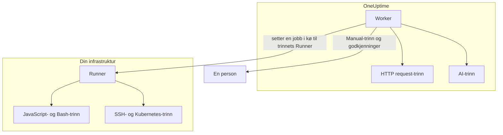

# Runbook-konfigurasjon & sikkerhet

Dette er referansen for driftsfolk og sikkerhetsgjennomgang: hvor hver type trinn kjører, hvilke grenser og tidsavbrudd et trinn holdes til, hvem som kan gjøre hva, og hvordan runbooks er herdet.

:::cards
- [Hvor hver trinntype kjører](#hvor-hver-trinntype-kjører): Workeren, en Runner eller en person.
- [Grenser for output og tidsavbrudd](#grenser-for-output-og-tidsavbrudd): Hver grense et trinn holdes til.
- [Tillatelser](#tillatelser): Detaljerte tillatelser, de tre runbook-rollene og hvilke runbooks en rolle når.
- [Herdingsmerknader](#herdingsmerknader): Sandkasse, nettverkstilgang og autentisering av Runnere.
:::

## Hvor hver trinntype kjører

| Trinntype | Kjører på | Hvordan |
| --- | --- | --- |
| Manual | En person | Kjøringen venter til noen fullfører trinnet eller hopper over det. |
| JavaScript | En Runner | I en `isolated-vm`-sandkasse. |
| HTTP request | OneUptime Worker | Et utgående HTTP-kall. |
| Bash | En Runner | `bash -c <script>`. |
| SSH | En Runner | En SSH-forbindelse med [påloggingsinformasjon](/docs/runbooks/credentials). |
| Kubernetes | En Runner | Et kall til klyngens API-server med påloggingsinformasjon. |
| AI | OneUptime Worker | Et kall til prosjektets LLM-leverandør. |

## Slik sendes Runner-trinn ut

JavaScript-, Bash-, SSH- og Kubernetes-trinn **kjører aldri på OneUptime Worker**. De sendes som jobber til en bestemt [runbook-agent](/docs/runbooks/agents): en liten prosess du installerer på en vert i din egen infrastruktur.

Utsendingsmodellen:

1. Den som skriver runbook-trinnet, velger en Runner fra nedtrekkslisten.
2. Når trinnet kjører, setter Workeren inn en rad i `RunnerJob` med `targetAgentId` satt til ID-en til den Runneren og statusen `Pending`.
3. Nettopp den Runneren (og bare den) tar jobben atomisk, kjører den lokalt — Bash via `bash -c <script>`, JavaScript i en `isolated-vm`-sandkasse, SSH og Kubernetes med påloggingsinformasjonen til trinnet — og sender resultatet tilbake.
4. Workeren fortsetter runbooket med resultatet.

Det finnes ikke lenger noe miljøflagg `RUNBOOK_BASH_ENABLED`. Om disse trinnene virker i en installasjon, avhenger bare av om prosjektet har en tilkoblet Runner med **Kjører runbooks** slått på.

## Grenser for output og tidsavbrudd

| Grense | Verdi | Gjelder for |
| --- | --- | --- |
| Output per trinn | **50 KB**. Lengre output kuttes med en markør. | Hvert automatiserte trinn |
| Kjøringstidsavbrudd | **30 sekunder** som standard | JavaScript-, Bash-, SSH- og Kubernetes-trinn |
| Forespørselstidsavbrudd | **30 sekunder** som standard | HTTP request-trinn |
| Overtakelsestidsavbrudd | **2 minutter** som standard: hvor lenge Workeren venter på at den valgte Runneren tar jobben før den feiles | JavaScript-, Bash-, SSH- og Kubernetes-trinn |
| Intervall for tidsavbrudd | **1 sekund til 1 time** | Hvert tidsavbrudd |
| Venter på en person | Ingen grense | Manual-trinn og godkjenninger |

Angi tidsavbruddene per trinn på runbookets side **Trinn**; la et felt stå tomt for å beholde standarden. En verdi utenfor intervallet begrenses når trinnet kjører, slik at en feilskrevet konfigurasjon verken kan slå av tidsavbruddet eller holde en Worker-plass opptatt i det uendelige.

## Tillatelser

Runbook-tillatelser ligger i tillatelsesgruppen `Runbook`:

- `CreateRunbook`, `EditRunbook`, `DeleteRunbook`, `ReadRunbook` — administrer runbook-maler.
- `CreateRunbookExecution`, `EditRunbookExecution`, `DeleteRunbookExecution`, `ReadRunbookExecution` — start, kryss av, slett og les kjøringer.
- `CreateRunbookRule`, `EditRunbookRule`, `DeleteRunbookRule`, `ReadRunbookRule` — administrer regler for automatisk start.
- `CreateRunner`, `EditRunner`, `DeleteRunner`, `ReadRunner` — administrer Runnere som kjører trinn i din egen infrastruktur. (De het `*RunbookAgent` før omdøpingen til Runner; eksisterende tildelinger er migrert, så ingenting må tildeles på nytt.)
- `RunbookAdmin`, `RunbookMember`, `RunbookViewer` (roller) — `RunbookAdmin` bygger runbooks, reglene deres og Runnerne de kjører på, og kjører dem. `RunbookMember` åpner runbooks og kjøringene deres og kjører dem — starter en kjøring, fullfører eller hopper over trinnene og avbryter den — men oppretter, endrer og sletter ingen runbooks eller Runnere. `RunbookViewer` leser runbooks og kjøringene deres og kjører ingenting. `RunbookAdmin` samler alle de detaljerte tillatelsene ovenfor.

En rolle kjører runbookene omfanget dens når. En tildeling av `RunbookMember`, `RunbookAdmin` eller `ProjectMember` som er begrenset til bestemte etiketter, starter og fører videre kjøringer av runbookene som har de etikettene, en tildeling begrenset til **Owned** kjøringer av runbookene teamet eier, og et teams blokkering av en etikett tar de runbookene fra det. `CreateRunbookExecution` og `EditRunbookExecution` handler om kjøringer, som ikke har etiketter, så de når alle runbooks i prosjektet. Å godkjenne et utbedringsforslag som starter et runbook, kontrolleres på samme måte.

Påloggingsinformasjon og hemmeligheter ligger utenfor `RunbookAdmin`. Å administrere dem krever `ProjectOwner` eller `ProjectAdmin` eller tillatelsene `CreateRunbookCredential`, `EditRunbookCredential`, `DeleteRunbookCredential`, `ReadRunbookCredential` og `CreateRunbookSecret`, `EditRunbookSecret`, `DeleteRunbookSecret`, `ReadRunbookSecret`. Se [Runbook-påloggingsinformasjon](/docs/runbooks/credentials).

Eierreglene og etikettreglene under **Runbooks → Innstillinger** ligger også utenfor `RunbookAdmin`. Å administrere dem krever `ProjectOwner` eller `ProjectAdmin` eller tillatelsene `CreateRunbookOwnerRule` og `CreateRunbookLabelRule` og motstykkene deres for redigering, sletting og lesing.

Hvordan roller og detaljerte tillatelser virker sammen, kan du lese under [Brukere, team og tillatelser](/docs/permissions/index).

## Kø og worker

Runbook-kjøringer kjører i BullMQ-køen `Runbook`. Hver Worker-prosess kjører opptil 25 kjøringer samtidig; tallet er fastsatt i koden og settes ikke med en miljøvariabel.

Når et manuelt trinn krysses av via API-et, settes kjøringen i kø igjen for å fortsette fra neste trinn. Den venter som `Scheduled` til en Worker tar den igjen, og en kjøring i kø feiles aldri fordi den venter.

## Herdingsmerknader

- **JavaScript, Bash, SSH og Kubernetes** kjører på en Runner-vert du kontrollerer, ikke på OneUptime Worker. JavaScript kjører i sitt eget `isolated-vm`-isolat med 128 MB minne og uten tilgang til Runnerens filsystem eller prosesser; det kan sende HTTP-forespørsler med `axios`, men forespørsler til private nettverk, loopback- og link-local-adresser avvises. Bash kjører via `bash -c`, med et tidsavbrudd som håndheves på Runneren.
- **HTTP-trinn** bruker en tillatende statusvalidering, slik at et 4xx- eller 5xx-svar registreres som et mislykket trinn i stedet for å bli kastet som et unntak, og den registrerte outputen viser hva motparten faktisk returnerte. Omdirigeringer følges ikke. Workeren kaller aldri loopback- eller link-local-adresser, for eksempel et metadataendepunkt i skyen; på OneUptime Cloud avviser den også private nettverksadresser, og en selvhostet OneUptime avviser dem med `DATA_SOURCE_BLOCK_PRIVATE_ADDRESSES=true`.
- **AI-trinn** ser aldri private hendelsesnotater eller meldinger fra Slack og Microsoft Teams, og outputen fra tidligere trinn skannes etter hemmeligheter, som sladdes før den når modellen. Innebygde bilder og lange kodede data utelates fra prompten. Se [AI](/docs/runbooks/authoring#ai).
- **Autentisering av Runnere** skjer med ID og hemmelig nøkkel, satt som miljøvariabler på Runner-containeren. På serveren kommer Runnerens gjeldende identitet fra databaseraden som hører til den framviste ID-en og nøkkelen: en klient kan ikke utgi seg for å være en annen Runner, heller ikke med en kompromittert nøkkel.
- **Påloggingsinformasjon og hemmeligheter** er kryptert i hvile, returneres aldri av API-et og leveres bare ut til Runnerne de er tildelt, når disse tar et trinn.

## Databasetabeller

| Tabell | Hva den inneholder |
| --- | --- |
| `Runbook` | Malen: navn, slug, beskrivelse, `isEnabled`, etiketter og trinnene som JSON. |
| `RunbookExecution` | Én rad per kjøring, med de valgfrie fremmednøklene `incidentId`, `alertId` og `scheduledMaintenanceId` og en JSON-matrise `stepExecutions` som fryser trinnene og tilstanden til hvert trinn. |
| `RunbookRule` | Regler for automatisk start, med en diskriminator `triggerEntityType` (Incident, Alert, ScheduledMaintenance), en mange-til-mange-relasjon til runbookene som skal startes, og det de treffer på: en JSON-kolonne `criteria` (betingelsene) pluss mange-til-mange-koblinger til monitorer, alvorlighetsgrader for hendelser, alvorlighetsgrader for varsler, etiketter og monitoretiketter samt mønstre for tittel, beskrivelse, monitornavn og monitorbeskrivelse. |
| `Runner` | Én rad per installert Runner: navn, hemmelig nøkkel, `lastAlive`, `connectionStatus`, vertsinformasjon og funksjoner. |
| `RunnerJob` | Én rad per trinn sendt til en Runner: `targetAgentId` (Runneren forfatteren av trinnet valgte), trinntype, skript eller nyttelast, status (`Pending` → `Claimed` → `Running` → `Succeeded`, `Failed`, `TimedOut` eller `Cancelled`), frist for overtakelse, lease, output og exitkode. |
| `RunbookCredential` | SSH- og Kubernetes-påloggingsinformasjon med krypterte hemmelige felt og Runnerne den er tildelt. |
| `RunbookSecret` | Runbook-hemmeligheter, kryptert, og Runnerne som får motta dem. |

## Driftstips

- **Sørg for at Runneren du velger på et trinn, er frisk.** Trenger du redundans, kjører du en Runner til og fordeler trinnene mellom dem, eller har et reserve-runbook som peker mot den andre Runneren.
- **Lagre URL-er, ikke blobs.** Gir et trinn mer enn noen få KB output, skriver du den til objektlagring eller loggstakken din og returnerer URL-en.
- **Idempotens betyr noe.** Et HTTP request- eller AI-trinn kjører på nytt hvis Workeren starter på nytt midt i trinnet og kjøringen gjenopptas. Et trinn på en Runner sendes høyst én gang per kjøring, men et skript kan ha kjørt delvis før en feil, og du kjører kanskje runbooket på nytt. Utform trinn slik at de tåler å bli gjentatt.

## Neste steg

:::cards
- [Runbook-agenter](/docs/runbooks/agents): Installer, drift og feilsøk Runnere.
- [Runbook-påloggingsinformasjon](/docs/runbooks/credentials): Administrert SSH- og Kubernetes-tilgang og hemmeligheter for skript.
- [Brukere, team og tillatelser](/docs/permissions/index): Hvordan roller, etiketter og team avgjør hvem som kjører hva.
:::
