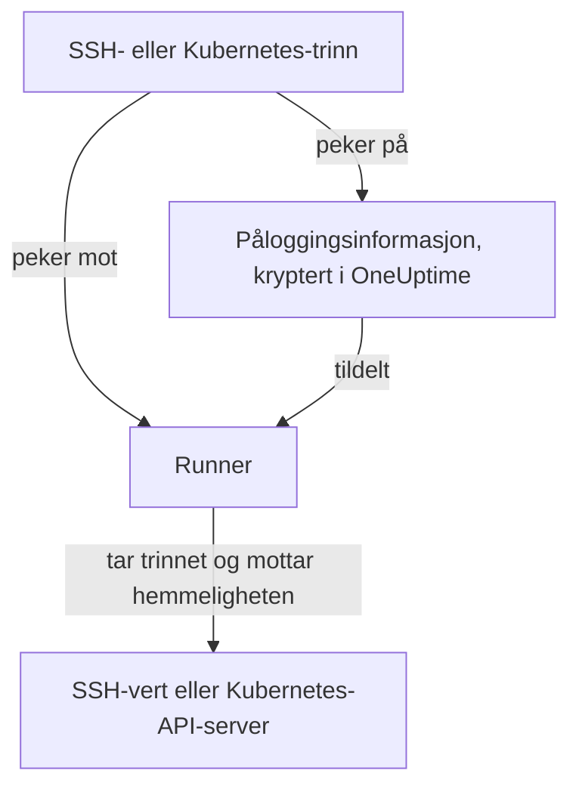

# Runbook-påloggingsinformasjon

Påloggingsinformasjon er måten et runbook når noe som **ikke** er Runnerens egen vert: en server via SSH eller en Kubernetes-klynge. Uten den betyr "start tjenesten på nytt" at du skriver et skallskript og legger en nøkkel eller en kubeconfig manuelt på Runnerens vert, der den ligger på disken utenfor OneUptimes kontroll. Påloggingsinformasjon er den samme tilgangen som et administrert objekt: kryptert i hvile, tildelt bestemte Runnere og referert ved navn fra et trinn.

Administrer den under **Runbooks → Runbook-agenter → Påloggingsinformasjon**.

:::cards
- [Opprett påloggingsinformasjon](#opprett-påloggingsinformasjon): Tilgangen og Runnerne som får bruke den.
- [Minste privilegium på den andre siden](#minste-privilegium-på-den-andre-siden): Begrens hva nøkkelen eller tokenet kan gjøre.
- [Hemmeligheter for skript](#hemmeligheter-for-skript): Gi et Bash- eller JavaScript-skript et passord eller et token.
:::

## Slik brukes påloggingsinformasjon



Et SSH- eller Kubernetes-trinn peker på påloggingsinformasjon og en Runner. Når den Runneren tar trinnet, kontrollerer OneUptime at påloggingsinformasjonen er tildelt den, dekrypterer hemmeligheten og leverer den bare ut i svaret på den overtakelsen. Hemmeligheten lagres aldri på jobben og kan aldri leses via API-et.

## Før du begynner

- **En rolle som administrerer påloggingsinformasjon.** Project Owner og Project Admin, eller alle med tillatelsen **Create Runbook Credential**. Rollen Runbook Admin omfatter den ikke. Å tildele SSH-påloggingsinformasjon til en Runner som kjører kommandoene til OneUptime AI, krever også **Read Runbook Credential**; se [Runnere som kjører kommandoene til OneUptime AI](#runnere-som-kjører-kommandoene-til-oneuptime-ai).
- **Et abonnement som omfatter den.** På OneUptime Cloud krever runbook-påloggingsinformasjon abonnementet **Growth** eller høyere.
- **En [Runner](/docs/runbooks/agents)** som kan nå verten eller API-serveren til klyngen over nettverket.

## Opprett påloggingsinformasjon

:::steps
### Åpne Påloggingsinformasjon

Åpne **Runbooks → Runbook-agenter → Påloggingsinformasjon**, og klikk **Opprett Runbook Credential**.

### Gi den et navn, og velg typen

I trinnet **Credential** skriver du inn et **Navn**, for eksempel `prod-cluster`, en valgfri **Beskrivelse** og **Type**: **SSH** eller **Kubernetes**. Typen kan ikke endres senere; opprett ny påloggingsinformasjon i stedet.

### Skriv inn tilgangen

:::tabs
@tab SSH
Under **SSH-vert** skriver du inn **Vertsnavn**, **Port** (22 hvis feltet er tomt) og **Brukernavn**. Under **SSH-autentisering** limer du inn en **Private Key (PEM)** med tilhørende **Private Key Passphrase** hvis den har en, eller skriver inn et **Passord** for en vert uten nøkkeltilgang. En nøkkel er det beste valget når du kan velge.
@tab Kubernetes
Under **Kubernetes** skriver du inn **API Server URL**, for eksempel `https://10.0.0.1:6443`, **Service Account Token** og **CA Certificate (PEM)**, slik at Runneren kan verifisere API-serveren. La bare CA-en stå tom hvis API-serveren presenterer et sertifikat som Runneren allerede stoler på.
:::

### Tildel den til Runnere

I trinnet **Runbook-agenter** velger du Runnerne som får bruke påloggingsinformasjonen, og klikker deretter **Opprett Runbook Credential**. Påloggingsinformasjon som ikke er tildelt noen Runner, kan ikke brukes av noe trinn.

### Bruk den i et trinn

I et [SSH- eller Kubernetes-trinn](/docs/runbooks/authoring#trinntyper) velger du en av disse Runnerne og deretter påloggingsinformasjonen under **Credential**. Et trinn tilbyr bare påloggingsinformasjon av sin egen type, og å lagre et trinn som peker på påloggingsinformasjon, krever tillatelse til å lese runbook-påloggingsinformasjon.
:::

## Hva som lagres

| Type | Felt |
| --- | --- |
| SSH | Vertsnavn, port (22 som standard), brukernavn og enten en privat PEM-nøkkel (med valgfri passordfrase) eller et passord. |
| Kubernetes | API-serverens URL, et serviceaccount-token og klyngens CA-sertifikat. |

## Hemmelige verdier kan bare skrives

Private nøkler, passordfraser, passord og serviceaccount-tokens er kryptert i hvile, og API-et **returnerer dem aldri**: verken til dashbordet, til en arbeidsflyt eller til en eksport. Tabellen kan vise deg hva påloggingsinformasjonen *er*, uten noen gang å vise hva den inneholder.

Det finnes derfor ingen "vis" for en hemmelig verdi, bare "erstatt": å skrive inn en verdi på nytt er måten å bytte den på. Har du mistet originalen, utsteder du en ny nøkkel på målsystemet og oppdaterer påloggingsinformasjonen.

## Tildel påloggingsinformasjon til Runnere

Påloggingsinformasjon kan bare brukes av Runnerne du tildeler den, og et trinn må peke mot en av dem. Hvis et trinn peker på påloggingsinformasjon som ikke er tildelt Runneren, **feiler trinnet i stedet for å kjøre**: en Runner som i stillhet ikke gjør noe, ser nøyaktig ut som en som virket.

Tildelingen er tilgangsgrensen, så hold den smal: en Runner som bare noen gang starter én klynge på nytt, trenger ikke SSH-nøkkelen til databasevertene dine.

### Runnere som kjører kommandoene til OneUptime AI

På en Runner med **Kjører AI-utbedringskommandoer** slått på velger OneUptime AI blant SSH-påloggingsinformasjonen som er tildelt Runneren, for kommandoene den kjører der. Derfor når SSH-påloggingsinformasjon bare en slik Runner gjennom en person som har lov til å lese runbook-påloggingsinformasjon (**Read Runbook Credential**, eller en Project Owner eller Project Admin), uansett hva som lagres først:

- **Tildel påloggingsinformasjonen.** Å opprette SSH-påloggingsinformasjon med en slik Runner, eller legge til en slik Runner i den, krever den tillatelsen. Uten den avvises lagringen og nevner Runneren: tildel påloggingsinformasjonen til Runnere som ikke kjører AI-utbedringskommandoer, eller be noen med tillatelsen om å tildele den.
- **Slå på bryteren.** Å slå på **Kjører AI-utbedringskommandoer** for en Runner som har SSH-påloggingsinformasjon, krever samme tillatelse.

Å fjerne Runnere fra påloggingsinformasjon, lagre påloggingsinformasjon med Runnerne den allerede har, og Kubernetes-påloggingsinformasjon krever ikke mer: kubectl-kommandoene til OneUptime AI kjører med påloggingsinformasjonen som er bundet til klyngen deres. Tildelinger av påloggingsinformasjon og påslåing av bryteren gjort av noen uten den tillatelsen lagres én om gangen i et prosjekt, slik at de to ikke kan bestå kontrollene sine sammen; en lagring som kommer mens en annen lagres, venter på den, og tar det for lang tid, avvises den med *Try again in a moment*. Lagre på nytt.

Et trinn i en arbeidsflyt handler som Project Admin, men låner ikke lesingen av runbook-påloggingsinformasjon fra en Project Admin: et trinn har den bare hvis personen som sist lagret trinnene i arbeidsflyten, har den. Se [Hva arbeidsflyttrinn kan gjøre](/docs/workflows/configuration#hva-arbeidsflyttrinn-kan-gjøre).

## Minste privilegium på den andre siden

OneUptime kan ikke begrense hva påloggingsinformasjonen din får gjøre på målsystemet: det er målsystemets oppgave, og det er verdt å gjøre:

- **SSH** — foretrekk en nøkkel framfor et passord, gi brukeren bare kommandoene den trenger (en tvungen kommando eller et begrenset skall der det er praktisk), og gjenbruk ikke den personlige nøkkelen til en administrator.
- **Kubernetes** — bind serviceaccounten til en Role som tillater `patch` på nøyaktig de arbeidsbelastningene runbookene dine rører, i nøyaktig de navnerommene de kjører i. **Restart workload** endrer selve arbeidsbelastningen, og **Scale workload** endrer underressursen `scale`: mer trengs ikke.

For eksempel en serviceaccount som kan starte på nytt og skalere én Deployment og ingenting annet:

```yaml title="oneuptime-runbooks-rbac.yaml"
apiVersion: v1
kind: ServiceAccount
metadata:
  name: oneuptime-runbooks
  namespace: checkout
---
apiVersion: rbac.authorization.k8s.io/v1
kind: Role
metadata:
  name: oneuptime-runbooks
  namespace: checkout
rules:
  # Restart workload: patches the Deployment's pod template.
  - apiGroups: ["apps"]
    resources: ["deployments"]
    resourceNames: ["checkout-api"]
    verbs: ["patch"]
  # Scale workload: patches the Deployment's scale subresource.
  - apiGroups: ["apps"]
    resources: ["deployments/scale"]
    resourceNames: ["checkout-api"]
    verbs: ["patch"]
---
apiVersion: rbac.authorization.k8s.io/v1
kind: RoleBinding
metadata:
  name: oneuptime-runbooks
  namespace: checkout
subjects:
  - kind: ServiceAccount
    name: oneuptime-runbooks
    namespace: checkout
roleRef:
  apiGroup: rbac.authorization.k8s.io
  kind: Role
  name: oneuptime-runbooks
```

For et StatefulSet eller DaemonSet bruker du `statefulsets` eller `daemonsets` i stedet. Et DaemonSet kan ikke skaleres, så det trenger ingen `scale`-regel.

## Hemmeligheter for skript

Bash- og JavaScript-trinn har ikke noe felt **Credential**. For å gi et skript et passord, et token eller en API-nøkkel uten å skrive den inn i runbooket lagrer du den som en **runbook-hemmelighet**. Hemmeligheter administreres under **Runbooks → Innstillinger → Hemmeligheter** av Project Owners og Project Admins eller med tillatelsen **Create Runbook Secret**.

:::steps
### Opprett hemmeligheten

Klikk **Opprett Runbook Secret**. I trinnet **Hemmelighet** skriver du inn et **Navn** (bokstaver, tall, bindestreker og understreker), en valgfri **Beskrivelse** og **Verdi for hemmelighet**. I trinnet **Tilgang** velger du Runnerne under **Runbook-agenter som har tilgang til denne hemmeligheten**.

### Bruk den i et skript

Skriv `{{runbookSecrets.NAME}}` der verdien skal stå:

```bash
curl -s -X POST \
  -H "Authorization: Bearer {{runbookSecrets.CDN_API_TOKEN}}" \
  "https://api.cdn.example.com/v1/purge"
```

Når en Runner som hemmeligheten er tildelt, tar trinnet, mottar den skriptet med verdien fylt inn.
:::

I likhet med de hemmelige feltene i påloggingsinformasjon er verdien til en hemmelighet kryptert i hvile og returneres aldri av API-et: **Oppdater hemmelig verdi** erstatter den. På OneUptime Cloud krever runbook-hemmeligheter også abonnementet **Growth** eller høyere.

| | Påloggingsinformasjon | Runbook-hemmelighet |
| --- | --- | --- |
| Brukes av | SSH- og Kubernetes-trinn | Bash- og JavaScript-skript |
| Inneholder | En vert og nøkkelen til den, eller URL-en og tokenet til en klynge | En hvilken som helst enkeltverdi |
| Administreres under | **Runbooks → Runbook-agenter → Påloggingsinformasjon** | **Runbooks → Innstillinger → Hemmeligheter** |
| Når Runneren | I svaret på overtakelsen av et trinn som peker på den | Fylt inn i skriptet for trinnet den tar |
| Kan leses igjen via API-et | Bare de ikke-hemmelige feltene | Aldri verdien |

## Hvem kan se dem

Å opprette, redigere og slette påloggingsinformasjon krever tillatelsene for runbook-påloggingsinformasjon (eller Project Owner/Admin). Å lese påloggingsinformasjon viser bare de ikke-hemmelige feltene.

Merk at **agentnøkkelen** til en Runner tilsvarer påloggingsinformasjonen som er tildelt den Runneren: alt som har nøkkelen, kan ta arbeid som den Runneren og motta påloggingsinformasjon. Derfor kan agentnøkler bare leses av Project Owners, Project Admins og Runbook Admins: behandle dem slik du ville behandlet selve påloggingsinformasjonen.

## Neste steg

:::cards
- [Skrive et runbook](/docs/runbooks/authoring): Skriv SSH- og Kubernetes-trinnene som bruker påloggingsinformasjon.
- [Runbook-agenter](/docs/runbooks/agents): Installer Runneren som påloggingsinformasjonen tildeles.
- [Runbook-konfigurasjon & sikkerhet](/docs/runbooks/configuration): Tillatelser og herding for hele runbook-stakken.
:::
