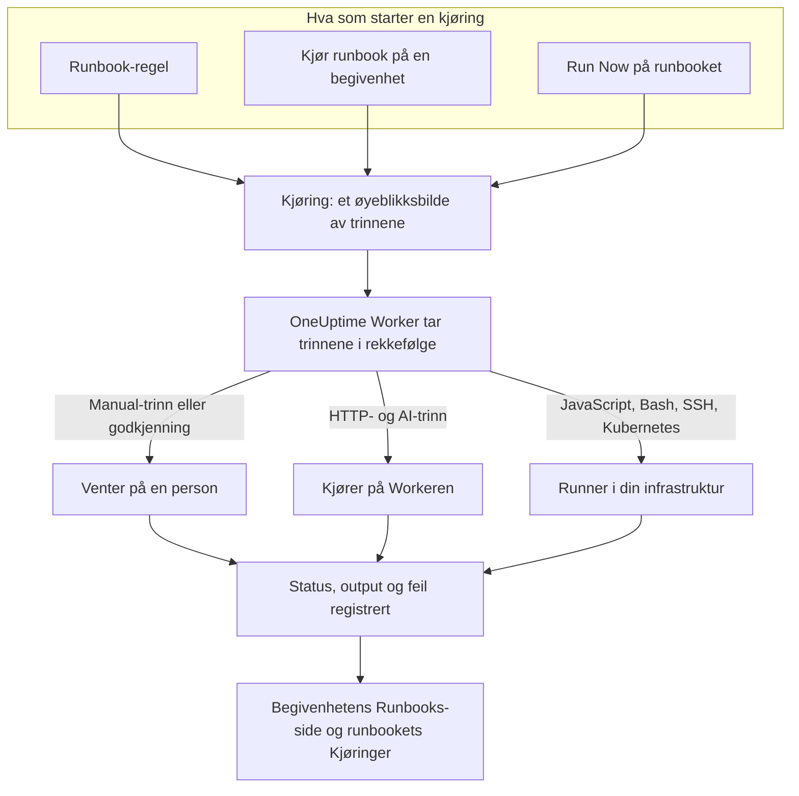

# Runbooks – Oversikt

Et runbook er en gjenbrukbar responsprosedyre: en ordnet liste med manuelle og automatiserte trinn som du kjører på en hendelse, et varsel eller en planlagt vedlikeholdshendelse. Det gjør tråden "hva gjør vi nå?" om til en sjekkliste som alle på vakt kan følge klokken 3 om natten, med skript, API-kall og godkjenninger allerede skrevet. Runbooks er for vakthavende ingeniører som håndterer hendelser, og for plattformteam som automatiserer den håndteringen.

:::cards
- [Skrive et runbook](/docs/runbooks/authoring): Opprett et runbook, og skriv trinnene.
- [Runbook-regler](/docs/runbooks/rules): Start runbooks ved nye hendelser, varsler og vedlikeholdshendelser.
- [Kjøre et runbook](/docs/runbooks/running): Start en kjøring, fullfør og godkjenn trinnene, avbryt den.
- [Runbook-agenter](/docs/runbooks/agents): Installer Runneren som kjører skriptene dine i din egen infrastruktur.
:::

## Slik kjører et runbook



Hver gang et runbook kjøres, opprettes en **kjøring**. Når den starter, kopieres runbookets trinn over på den, og OneUptime går gjennom dem i rekkefølge. Et Manual-trinn, eller et trinn som krever godkjenning, setter kjøringen på pause til noen handler.

HTTP- og AI-trinn kjører på OneUptime Worker. JavaScript-, Bash-, SSH- og Kubernetes-trinn kjører på en [Runner](/docs/runbooks/agents) som du installerer i din egen infrastruktur, slik at skriptene dine aldri kjører på OneUptimes servere. Hvert trinns status, output og feilmelding registreres på kjøringen, som blir liggende på hendelsen, varselet eller begivenheten den kjørte for.

## Sentrale begreper

| Begrep | Betydning |
| --- | --- |
| **Runbook** | Malen. En navngitt, gjenbrukbar prosedyre med en ordnet liste med trinn og en bryter **Kjør dette runbooket**. |
| **Trinn** | Ett punkt i et runbook. Det har en type (Manual, JavaScript, HTTP request, Bash, SSH, Kubernetes eller AI), en tittel, en beskrivelse og typespesifikke innstillinger. |
| **Runbook-regel** | En regel som automatisk knytter ett eller flere runbooks til hendelser, varsler eller planlagte vedlikeholdshendelser som oppfyller betingelsene: monitorene deres, alvorlighetsgrad, etiketter, monitoretiketter, tittel eller beskrivelse. |
| **Kjøring** | Én kjøring av et runbook. Opprettes når en regel utløses, når noen klikker **Kjør runbook** på en begivenhet, eller når noen klikker **Run Now** på selve runbooket. Den inneholder et øyeblikksbilde av trinnene og hvert trinns status og output. |
| **Øyeblikksbilde** | Den frosne kopien av runbookets trinn som ligger på hver kjøring. Du kan redigere runbooket senere uten å skrive om historikken for tidligere kjøringer. |
| **Runner** | En liten agent som du kjører på en vert i din egen infrastruktur. Den kjører JavaScript-, Bash-, SSH- og Kubernetes-trinnene som peker på den. Kalles også en runbook-agent. |
| **Påloggingsinformasjon** | Administrert SSH- eller Kubernetes-tilgang som SSH- og Kubernetes-trinn bruker. Kryptert i hvile og bare utlevert til Runnerne du tildeler den. |
| **Hemmelighet** | En enkelt verdi, for eksempel et API-token, som et Bash- eller JavaScript-skript bruker som `{{runbookSecrets.NAME}}`. Kryptert i hvile og bare utlevert til Runnerne du tildeler den. |

## Trinntyper

Velg typen som passer hvert trinn. [Skrive et runbook](/docs/runbooks/authoring) beskriver innstillingene for hver type.

| Trinntype | Kjører på | Bruk den når … | Eksempel |
| --- | --- | --- | --- |
| **Manual** | En person | Et menneske må kontrollere noe, gjøre en vurdering eller handle der OneUptime ikke kan. | "Bekreft at trafikken er flyttet til den sekundære regionen." |
| **JavaScript** | En Runner | Du trenger en liten, avgrenset beregning i en sandkasse. | Beregn replikaforsinkelsen, og avgjør om du skal fortsette. |
| **HTTP request** | OneUptime Worker | Du kaller et eksisterende API: en skyleverandør, PagerDuty, en Slack-webhook, din egen tjeneste. | `POST` til failover-orkestratoren din. |
| **Bash** | En Runner | Du trenger skallkommandoer på din egen infrastruktur. | Kjør `kubectl rollout restart` eller et gjenopprettingsskript. |
| **SSH** | En Runner | Du trenger én kommando på en ekstern vert med administrert SSH-påloggingsinformasjon. | Start en tjeneste på nytt på en webserver. |
| **Kubernetes** | En Runner | Du må starte på nytt eller skalere en Deployment, et StatefulSet eller et DaemonSet. | Start `checkout-api` på nytt i `production`. |
| **AI** | OneUptime Worker | Du vil ha en analyse, et sammendrag eller en vurdering midt i kjøringen fra prosjektets LLM-leverandør. | "Gå gjennom diagnostikken ovenfor. Er det trygt å gjøre failover?" |

Et runbook kan blande alle sammen. Styrken ved runbooks er å flette menneskelige kontroller sammen med automatisering og AI-analyse.

## Hva som starter en kjøring

| Hvordan | Hvor | Kjøringen knyttes til |
| --- | --- | --- |
| En runbook-regel | **Hendelser**, **Varsler** eller **Planlagt vedlikehold** → **Regler** → **Runbook-regler** | Den nye hendelsen, varselet eller begivenheten |
| **Kjør runbook** | Siden **Runbooks** for en hendelse, et varsel eller en planlagt vedlikeholdshendelse | Den begivenheten |
| **Run Now** | Runbookets side **Oversikt** | Ingenting: en ad hoc-kjøring |
| En regel for automatisk utbedring | Se [AI SRE](/docs/ai/ai-sre) | Hendelsen eller varselet |

Et runbook der bryteren **Kjør dette runbooket** er slått av på siden **Innstillinger**, startes ikke av noen av disse. Kjøringer som allerede er startet, fortsetter.

## Hvor runbooks ligger i dashbordet

Runbooks ligger under **Produkter**, i gruppen **Dashbord og automatisering**.

| Side | Hva du gjør der |
| --- | --- |
| **Produkter → Runbooks** | Bla gjennom, opprett og åpne runbooks. |
| Et runbooks **Trinn** | Skriv og omorganiser trinnene, og velg deretter **Save Steps**. |
| Et runbooks **Oversikt** | Se den siste kjøringen og resultatene, og klikk **Run Now**. |
| Et runbooks **Kjøringer** | Alle kjøringer av dette runbooket, filtrert etter status eller startdato. |
| Et runbooks **Eiere** | Legg til personene og teamene som er ansvarlige for det. |
| Et runbooks **Innstillinger** | Slå av **Kjør dette runbooket** uten å slette runbooket. |
| **Runbooks → Kjøringer** | Alle kjøringer av alle runbooks i prosjektet. |
| **Runbooks → Runbook-agenter** og **Runbooks → Runbook-agenter → Påloggingsinformasjon** | Installer [Runnere](/docs/runbooks/agents), og administrer [påloggingsinformasjon](/docs/runbooks/credentials). |
| **Runbooks → Innstillinger** | Administrer [hemmeligheter](/docs/runbooks/credentials#hemmeligheter-for-skript) for skript, samt **Eierregler** og **Etikettregler** som legger til eiere og etiketter på nye runbooks. |
| **Hendelser / Varsler / Planlagt vedlikehold → Regler → Runbook-regler** | Opprett reglene som starter runbooks automatisk. |
| En hendelse, et varsel eller en vedlikeholdshendelse → **Runbooks** | Se kjøringene som er knyttet til den, og klikk **Kjør runbook** for å starte en. |

## Et gjennomgått eksempel

Anta at hver hendelse med "db-primary" i tittelen skal starte et runbook for database-failover med fem trinn.

:::steps
### Opprett runbooket

Under **Runbooks** klikker du **Opprett Runbook** og kaller det "DB primary failover". Åpne det, gå til **Trinn**, legg til disse trinnene, og klikk deretter **Save Steps**:

| # | Type | Tittel |
| --- | --- | --- |
| 1 | JavaScript | Registrer replikaforsinkelsen før failover |
| 2 | Manual | Bekreft i DBA-dashbordet at replikaen er frisk |
| 3 | HTTP request | `POST` til failover-orkestratoren |
| 4 | Manual | Kontroller at skrivinger går til den nye primære |
| 5 | HTTP request | Send avblåsningen til `#db-incidents` i Slack |

### Legg til en regel

Under **Hendelser → Regler → Runbook-regler** oppretter du en regel med én betingelse og runbooket som skal startes:

```text
Conditions:  Incident Title starts with db-primary
Runbooks:    [DB primary failover]
```

### La det kjøre

En monitor åpner hendelsen `INC-4821 · db-primary connection timeout`. Regelen treffer, og en kjøring starter:

- Trinn 1 (JavaScript) kjører på Runneren du valgte for det. Returverdien, for eksempel `{ lagMs: 412 }`, registreres.
- Trinn 2 (Manual) setter kjøringen på pause, og den viser **Venter på deg**. Den vakthavende sjekker dashbordet og klikker **Mark complete**.
- Trinn 3 (HTTP request) kjører, og svaret på `POST` registreres.
- Trinn 4 (Manual) setter kjøringen på pause igjen til noen fullfører det.
- Trinn 5 (HTTP request) kjører, og kjøringen er **Fullført**.

### Gå gjennom den

Kjøringen blir liggende på hendelsens side **Runbooks**. Når du skriver postmortem, er hvert trinns output, feil og tidsbruk ett klikk unna.
:::

## Vanlige bruksområder

- **Database-failover**: registrer tilstanden med JavaScript, be den vakthavende DBA-en bekrefte replikaens tilstand (Manual), kall orkestratoren (HTTP request), bekreft DNS (Manual), send avblåsningen (HTTP request).
- **Tømming av cache**: én HTTP-forespørsel, og deretter et Manual-trinn "bekreft at treffraten i cachen er på vei opp igjen".
- **Hendelse som rammer kunder**: Manual "publiser en oppdatering på statussiden", en HTTP-forespørsel for å varsle supportteamet, JavaScript for å hente listen over berørte kontoer.
- **Forhåndssjekk før planlagt vedlikehold**: ta et øyeblikksbilde av metrikker, bekreft endringsvinduet med interessentene (Manual), slå på vedlikeholdsmodus på lastbalansereren (HTTP request).
- **Diagnostiser, og rett deretter**: et Bash-trinn samler inn diagnostikk, et AI-trinn med **Krev godkjenning** leser den og anbefaler en løsning, og et Kubernetes-trinn starter arbeidsbelastningen på nytt først når en person har godkjent.
- **Hygiene som alltid kjører**: en regel uten betingelser som registrerer systemets tilstand ved hver hendelse til postmortem.

## Slik passer runbooks inn i resten av OneUptime

- **Monitorer** åpner hendelser og varsler, og **runbook-regler** gjør dem om til runbook-kjøringer: oppdag, utløs, håndter, registrer.
- **[Vaktpolicyer](/docs/on-call/schedules)** avgjør hvem som blir tilkalt. Runbooks avgjør hva den personen gjør når hen er våken.
- **[Workspace-tilkoblinger](/docs/workspace-connections/slack)** som Slack og Microsoft Teams er naturlige mål for HTTP-forespørselstrinn som sender oppdateringer.
- **[Statussider](/docs/status-pages/index)** oppdateres ofte som et Manual-trinn i et kunderettet runbook.

## Neste steg

:::cards
- [Skrive et runbook](/docs/runbooks/authoring): Opprett ditt første runbook og trinnene i det.
- [Runbook-agenter](/docs/runbooks/agents): Installer en Runner før du skriver et JavaScript-, Bash-, SSH- eller Kubernetes-trinn.
- [Runbook-regler](/docs/runbooks/rules): Start runbooks automatisk når det opprettes hendelser.
- [Runbook-konfigurasjon & sikkerhet](/docs/runbooks/configuration): Grenser, tidsavbrudd, tillatelser og herding.
:::
