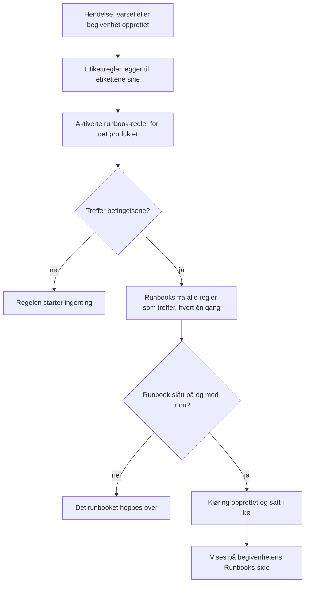

# Runbook-regler

Runbook-regler starter runbooks automatisk når en **hendelse**, et **varsel** eller en **planlagt vedlikeholdshendelse** opprettes, så ingen må huske å kjøre dem midt i et driftsavbrudd. Hvert produkt har sin egen regelside i menyen **Regler**:

- Hendelser → Regler → **Runbook-regler**
- Varsler → Regler → **Runbook-regler**
- Planlagt vedlikehold → Regler → **Runbook-regler**

Alle tre sidene redigerer samme slags regel, filtrert til reglene for det aktuelle produktet.

:::cards
- [Opprett en runbook-regel](#opprett-en-runbook-regel): Fire trinn: et navn, betingelser og runbookene som skal startes.
- [Betingelser](#betingelser): Hvert kriterium og hver operator en regel kan bruke.
- [Treffregler](#treffregler): Flere regler, monitorbetingelser og etikettregler.
- [Eksempler](#eksempler): Tre regler å kopiere.
:::

## Slik starter en regel et runbook



Når en regel utløses, skjer dette for hvert runbook den peker på:

1. Runbooket lastes inn.
2. Trinnene kopieres som et **øyeblikksbilde** over på en ny runbook-kjøring.
3. Kjøringen settes i køen til runbook-workeren.
4. Kjøringen knyttes til kildeenheten: den vises på siden **Runbooks** for hendelsen, varselet eller den planlagte vedlikeholdshendelsen og i runbookets liste **Kjøringer**.

Du ser alle kjøringer, startet av en regel eller ikke, under **Runbooks → Kjøringer**, filtrert etter status, runbook eller startdato.

## Før du begynner

- **Et runbook som kan kjøre.** Det må ha minst ett trinn og **Kjør dette runbooket** slått på på siden **Innstillinger**. Se [Skrive et runbook](/docs/runbooks/authoring).
- **Tillatelse til å administrere regler.** Project Owner, Project Admin og Runbook Admin oppretter runbook-regler, det samme gjør alle med tillatelsen **Create Runbook Rule**.

## Opprett en runbook-regel

:::steps
### Åpne Runbook-regler

I **Hendelser**, **Varsler** eller **Planlagt vedlikehold** åpner du **Regler → Runbook-regler** og klikker **Opprett Runbook Rule**.

### Gi regelen et navn

Under **Grunnleggende informasjon** skriver du inn et **Navn**, for eksempel "Start DB-failover ved databasehendelser", og eventuelt en **Beskrivelse**.

### Legg til betingelser

Under **Treffkriterier** klikker du **Legg til betingelse**, velger et kriterium og en operator og skriver inn eller velger verdien. Legg til flere betingelser om du trenger det, og velg **Samsvar med alle** eller **Samsvar med én**. Legg ikke til noen for å starte runbooks ved hver ny begivenhet av denne typen.

### Velg runbooks

Under **Runbooks** velger du ett eller flere **Runbooks å starte** og klikker **Opprett Runbook Rule**. Regelen er aktiv så snart den er opprettet, og vises i listen med statusen **Aktivert**.
:::

## Hvordan en regel er bygd opp

| Felt | Formål |
| --- | --- |
| **Navn** | En kort, lesbar etikett for regelen. |
| **Beskrivelse** | Valgfri kontekst for kolleger. |
| **Aktivert** | Slått på for en ny regel. Slå den av i regelens redigeringsskjema for å sette den på pause uten å slette den. |
| **Betingelser** | Hva regelen treffer, i trinnet **Treffkriterier**. La det stå tomt for å treffe hver begivenhet av sin type. |
| **Runbooks å starte** | Ett eller flere runbooks som startes når regelen utløses. |

## Betingelser

Hver betingelse sammenligner én ting ved hendelsen, varselet eller den planlagte vedlikeholdshendelsen med en verdi du angir. En runbook-regel tilbyr de samme kriteriene som produktets andre regler: en runbook-regel for hendelser treffer på det samme som en personvern- eller vaktregel for hendelser.

| Kriterium | Hva det kontrollerer |
| --- | --- |
| **Monitorer** | Monitorene hendelsen eller den planlagte vedlikeholdshendelsen berører, eller monitoren som utløste varselet. |
| **Hendelse Alvorligheter** / **Varsel Alvorligheter** | Alvorlighetsgraden til hendelsen eller varselet. Planlagte vedlikeholdshendelser har ingen alvorlighetsgrad, så reglene deres tilbyr det ikke. |
| **Hendelsesetiketter** / **Varseletiketter** | Etikettene på selve hendelsen, varselet eller vedlikeholdshendelsen (for planlagt vedlikehold heter kriteriet også **Hendelsesetiketter**), inkludert dem etikettregler la til ved opprettelsen. |
| **Overvåkingsetiketter** | Etikettene på monitorene. Gi monitorene dine etiketten `production` eller `staging` for å kjøre et runbook bare i ett miljø. |
| **Hendelsestittel** / **Varseltittel** | Tittelen (også for planlagt vedlikehold, der dashbordet bruker **Hendelsestittel**). |
| **Hendelsesbeskrivelse** / **Varselbeskrivelse** | Beskrivelsen (også for planlagt vedlikehold, der dashbordet bruker samme betegnelse). |
| **Overvåkingsnavn** / **Overvåkingsbeskrivelse** | Navnet eller beskrivelsen til monitorene. |

Velg en operator for hver betingelse:

- Et listekriterium — **Monitorer**, alvorlighetsgradene og etikettene — bruker **Har en av**, **Har alle** eller **Har ingen av** de valgte verdiene.
- Et tekstkriterium bruker **Inneholder** (som en ny betingelse starter med), **Inneholder ikke**, **Er lik**, **Er ikke lik**, **Starter med**, **Slutter med** eller **Samsvarer med mønster** / **Samsvarer ikke med mønster** for et regulært uttrykk uten skille mellom store og små bokstaver eller et `*`-jokertegn. Tekstsammenligninger skiller ikke mellom store og små bokstaver.

Med to eller flere betingelser velger du **Samsvar med alle** (hver betingelse må være sann) eller **Samsvar med én** (minst én må være det).

## Treffregler

- En regel uten betingelser gjelder hver begivenhet av sin type (en global "kjør alltid"-regel).
- Flere regler kan treffe samme begivenhet. Hvert treff utløses, og unionen av runbookene deres kjører: hvert runbook får sin egen kjøring, og et runbook som to regler som treffer peker på, kjører én gang.
- Monitorbetingelser kontrolleres én monitor om gangen. Med **Samsvar med alle** krever "**Overvåkingsnavn** inneholder `api`" og "**Overvåkingsetiketter** har en av _Production_" én monitor som oppfyller begge, ikke én monitor for hver.
- Runbook-regler kjører etter etikettregler, så en etikett som en etikettregel setter på en ny hendelse, et nytt varsel eller en ny begivenhet, kan starte et runbook.
- En hendelse eller et varsel som opprettes allerede løst, starter ingen runbooks: det var over før det ble registrert. Se [Erklært allerede bekreftet eller løst](/docs/incidents/declaring-incidents#erklært-allerede-bekreftet-eller-løst).
- En betingelse på et annet produkts alvorlighetsgrad — for eksempel **Varsel Alvorligheter** i en hendelsesregel — kan aldri bli sann, så API-et nekter å lagre den.
- Regler evalueres én gang, når begivenheten opprettes. Å redigere tittelen, alvorlighetsgraden eller etikettene til en hendelse senere utløser ikke reglene på nytt.

## Eksempler

### DB-failover ved databasehendelser

```text
Name:        Start DB failover for DB incidents
Trigger:     Incident
Conditions:  Incident Title matches pattern (?:^|\b)(db|database|postgres|mysql|mongo)
Runbooks:    [DB failover playbook, Notify DBA team]
```

Dette oppretter to runbook-kjøringer hver gang det opprettes en hendelse med "db", "database", "postgres" og så videre i tittelen.

### Bare ved kritiske produksjonshendelser

```text
Name:        Flush the CDN cache for critical production incidents
Trigger:     Incident
Conditions:  Match all
             Monitor Labels has any of Production
             Incident Severities has any of Critical
Runbooks:    [Flush CDN cache]
```

Kjører ved en kritisk hendelse på en monitor med etiketten _Production_, og ved ingenting i staging.

### Hygieneregel som alltid kjører

```text
Name:        Always-run pre-flight check
Trigger:     Incident
Conditions:  (none)
Runbooks:    [Capture pre-incident state]
```

Utløses ved hver hendelse: nyttig for å registrere øyeblikksbilder av systemets tilstand, metrikker og lignende til postmortem.

## Deaktiverte runbooks

Hvis en regel peker på et runbook som er slått av (**Kjør dette runbooket** slått av på runbookets side **Innstillinger**, `isEnabled = false`), treffer regelen fortsatt, men runbook-kjøringen hoppes over. Slå bryteren på igjen for å fortsette. Et runbook uten trinn hoppes over på samme måte.

## Test en regel

Før du stoler på en regel i produksjon, oppretter du en testhendelse (eller et testvarsel) som oppfyller betingelsene til regelen, og kontrollerer at de forventede runbookene vises på siden **Runbooks**.

> [!NOTE]
> Runbook-regler virker bare på nye begivenheter. I motsetning til etikett- og eierregler kan de ikke [kjøres på eksisterende poster](/docs/configuration/run-rules-now): det ville startet runbooks for hendelser som allerede er over.

## Feilsøking

:::details En regel traff, men ingen runbooks kjørte
Kontroller i denne rekkefølgen:

- Regelen er **Aktivert**.
- Hvert runbook har **Kjør dette runbooket** slått på på siden **Innstillinger** og minst ett lagret trinn.
- Hendelsen eller varselet ble ikke opprettet allerede løst.
- Kjøringen av runbooket venter ikke bare: åpne den fra begivenhetens side **Runbooks**. Et Manual-trinn eller en godkjenning viser **Venter på deg**.
:::

:::details En regel treffer aldri
Regler ser begivenheten slik den ble opprettet, med etikettene etikettregler la til i det øyeblikket. En etikett, alvorlighetsgrad eller tittel som endres etterpå, blir ikke sett. Med flere betingelser kontrollerer du **Samsvar med alle** mot **Samsvar med én** og husker at monitorbetingelser alle må gjelde én monitor.
:::

:::details API-et avviser en regel med "can only be used by"
Et alvorlighetskriterium hører til ett produkt. **Varsel Alvorligheter** i en hendelsesregel, eller **Hendelse Alvorligheter** i en varselregel, kunne aldri treffe, så regelen avvises med en melding som "Alert Severities can only be used by alert runbook rules." Fjern den betingelsen. Dashbordet tilbyr bare hvert produkts egne kriterier.
:::

## Neste steg

:::cards
- [Kjøre et runbook](/docs/runbooks/running): Hva de som håndterer hendelsen, ser når en regel starter en kjøring.
- [Skrive et runbook](/docs/runbooks/authoring): Skriv runbookene som reglene dine starter.
- [Opprette en hendelse](/docs/incidents/declaring-incidents): Hvordan hendelser opprettes, og når regler ser dem.
:::
