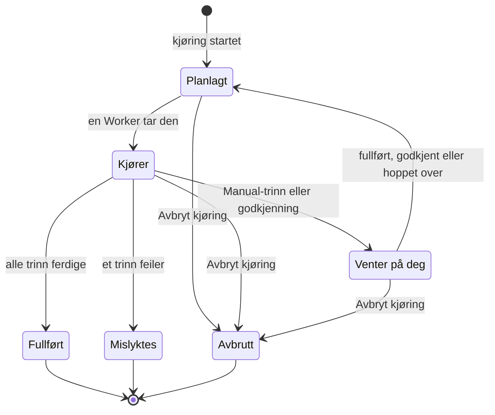

# Kjøre et runbook

Hver gang et runbook kjøres, blir det en **kjøring**: et øyeblikksbilde av runbookets trinn som gås gjennom i rekkefølge, med status og output registrert for hvert trinn. Denne siden er for dem som håndterer hendelser, starter kjøringer og fører dem videre: hvordan en kjøring starter, hva kjøringssiden viser, og hvordan du fullfører, godkjenner, hopper over og avbryter trinn.

:::cards
- [Start en kjøring](#start-en-kjøring): Fra en hendelse, et varsel eller en begivenhet, eller fra selve runbooket.
- [Kjøringsvisningen](#kjøringsvisningen): Hva hvert trinn viser mens en kjøring pågår.
- [Fullfør, godkjenn og hopp over trinn](#fullfør-godkjenn-og-hopp-over-trinn): Hvilket trinn som tar imot en beslutning, og når.
- [Feilsøking](#feilsøking): Kjøringer som ikke starter eller ikke blir ferdige.
:::

## Slik beveger en kjøring seg

En ny kjøring er **Planlagt** til en Worker tar den og markerer den som **Kjører**. Den tar pause som **Venter på deg** ved et Manual-trinn, eller etter et trinn som krever godkjenning, og går tilbake i køen så snart noen handler. En kjøring som venter på en person, utløper aldri. Den avsluttes som **Fullført**, **Mislyktes** eller **Avbrutt**.

## Start en kjøring

En runbook-kjøring opprettes på tre måter:

1. **Automatisk via en regel**: en [runbook-regel](/docs/runbooks/rules) starter den når en hendelse, et varsel eller en planlagt vedlikeholdshendelse som treffer, opprettes. En regel for automatisk utbedring kan også starte en; se [AI SRE](/docs/ai/ai-sre).
2. **Manuelt fra en begivenhet**: klikk **Kjør runbook** på en hendelse, et varsel eller en planlagt vedlikeholdshendelse. Kjøringen knyttes til den begivenheten.
3. **Manuelt fra runbookets side**: klikk **Run Now** på siden **Oversikt** for et runbook. Kjøringen knyttes ikke til noen hendelse, noe varsel eller noen planlagt vedlikeholdshendelse.

Slik starter du en manuelt:

:::tabs
@tab Fra en begivenhet
1. Åpne hendelsen, varselet eller den planlagte vedlikeholdshendelsen, og gå til siden **Runbooks**.
2. Klikk **Kjør runbook**. Dialogen **Kjør en runbook** viser prosjektets runbooks som er slått på.
3. Klikk **Run** ved runbooket. Kjøringen vises i begivenhetens liste: klikk **Vis** for å åpne den.
@tab Fra runbooket
1. Åpne runbooket fra **Runbooks**.
2. Klikk **Run Now** på **Oversikt**.
3. Kjøringssiden åpnes.
:::

For å starte en kjøring trenger du Project Owner, Project Admin, Project Member, Runbook Admin eller Runbook Member, eller tillatelsen **Create Runbook Execution**. Runbook Viewer og Viewer ser **Run Now** låst, med begrunnelsen. Se [Tillatelser](/docs/runbooks/configuration#tillatelser).

## Kjøringsvisningen

Åpne en kjøring for å se sjekklisten. Øverst på siden vises kjøringens **Status**, **Progress** (ferdige trinn av alle trinn), **Startet** (når den begynte) og **Utløst av** (hva som startet den). Hvert trinn viser:

- **Statusmerke** — Venter, Kjører, Venter på deg, Ferdig, Hoppet over, Mislyktes eller Avbrutt.
- **Tittel og beskrivelse** — kopiert fra runbooket da kjøringen startet.
- **Output** (kan felles sammen) — stdout, returverdier, HTTP-svar eller svaret fra AI-en.
- **Feilmelding**, hvis trinnet feilet.
- På trinnet kjøringen venter på: **Mark complete** (et Manual-trinn) eller **Approve & continue** (et trinn med **Krev godkjenning**) og **Hopp over**.
- Mens kjøringen har pause, **Hopp over** på senere automatiserte trinn som ikke krever godkjenning.

Mens kjøringen pågår, oppdaterer siden seg selv hvert 30. sekund. Klikk **Oppdater** for å se den nyeste tilstanden med en gang.

## Fullfør, godkjenn og hopp over trinn

Bare trinnet kjøringen venter på, kan fullføres, godkjennes eller hoppes over slik at kjøringen fortsetter. Et Manual-trinn eller et trinn med **Krev godkjenning** kan ikke krysses av eller hoppes over før kjøringen når det: jobben deres er å stoppe kjøringen, så de tar først imot en beslutning når kjøringen er der (for en godkjenning: når trinnet har kjørt og du kan se outputen).

Mens kjøringen har pause, kan du også hoppe over et senere automatisert trinn som ikke krever godkjenning, slik at det ikke kjører når kjøringen fortsetter. Kjøringen har fortsatt pause ved trinnet som venter på deg. Du kan ikke hoppe over mens trinn kjører: vent til kjøringen tar pause, eller avbryt den. Hvert trinn registrerer hvem som fullførte det eller hoppet over det.

| Trinnet | Fullfør eller godkjenn | Hopp over |
| --- | --- | --- |
| Det kjøringen venter på | Ja | Ja |
| Et senere automatisert trinn uten **Krev godkjenning** | Nei | Ja, mens kjøringen har pause |
| Et senere Manual-trinn, eller et med **Krev godkjenning** | Nei | Nei |
| Ethvert trinn mens trinn kjører | Nei | Nei |

Å fullføre, godkjenne, hoppe over og avbryte krever de samme rollene som å starte en kjøring, eller tillatelsen **Edit Runbook Execution**.

## Flett manuelle og automatiserte trinn

Det klassiske forløpet:

| # | Trinn | Hva som skjer |
| --- | --- | --- |
| 1 | Bash: registrer systemets tilstand | Kjører på sin Runner så snart kjøringen starter. |
| 2 | Manual: "Varsle kundene med banneret på statussiden." | Kjøringen tar pause til noen klikker **Mark complete**. |
| 3 | HTTP request: tilkall DBA-en via PagerDuty | Kjører på Workeren. |
| 4 | Manual: "Bekreft at den sekundære databasen nå er primær." | Kjøringen tar pause igjen. |
| 5 | HTTP request: send avblåsningen til en Slack-webhook | Kjører, og kjøringen er **Fullført**. |

Trinn 2 og 4 setter kjøringen på pause til noen krysser dem av. Trinn 1, 3 og 5 kjører automatisk. Hele kjøringen er én kjøring, én tidslinje og én kilde til sannhet.

## Avbryt en kjøring

Klikk **Avbryt kjøring** på kjøringssiden. Statusen blir `Cancelled`, og ingen senere trinn starter. Et trinn som allerede kjører, avbrytes ikke, men resultatet registreres ikke: trinnet forblir `Cancelled`. Jobber som fortsatt venter på en Runner, avbrytes; en Runner som allerede kjører et skript, gjør det ferdig, men resultatet godtas ikke.

## Grenser for output

Output per trinn er begrenset til **50 KB**, slik at et løpsk skript ikke blåser opp databasen. Lengre output kuttes med en markør. Trenger du større artefakter, skriver du dem fra skriptet til objektlagring eller et loggsystem og legger URL-en i outputen.

## Kjør et runbook på nytt

En kjøring er en engangs, uforanderlig post. Klikk **Kjør igjen** på en avsluttet kjøring, eller **Run Now** på runbooket, for å kjøre det på nytt. Begge oppretter en ny kjøring ut fra runbookets nåværende trinn, ikke knyttet til noen begivenhet. Bruk **Kjør runbook** på hendelsens side **Runbooks** for å kjøre det på nytt på en hendelse. Den opprinnelige kjøringen forblir uendret for revisjonssporet.

## Finn tidligere kjøringer

| Hvor | Hva den viser |
| --- | --- |
| **Kjøringer** for et runbook | Alle kjøringer av det runbooket, med filtre for status og startdato og en kolonne **Utløst av**. |
| **Runbooks → Kjøringer** | Alle kjøringer av alle runbooks i prosjektet. |
| Siden **Runbooks** for en hendelse, et varsel eller en begivenhet | Kjøringene som er knyttet til den. Begivenhetens oversikt viser dem også så snart det finnes noen. |

## Feilsøking

:::details Run Now er låst
Rollen din leser runbooks, men kjører dem ikke: knappen sier "Du har ikke tillatelse til å starte runbook-kjøringer i dette prosjektet." Be om Runbook Member eller tillatelsen **Create Runbook Execution**.
:::

:::details Oppstart av en kjøring feiler med "Runbook is disabled" eller "Runbook has no steps to run"
Runbookets bryter **Kjør dette runbooket** er slått av på siden **Innstillinger**, eller det har ingen lagrede trinn. Slå bryteren på, eller legg til trinn, og klikk **Save Steps**.
:::

:::details Et trinn feilet fordi det mangler en Runner eller påloggingsinformasjon
Meldingen lyder for eksempel "Bash step is missing a Runner. Pick one under Runbooks → Runners." Trinnet ble lagret uten **Runner**, eller et SSH- eller Kubernetes-trinn uten **Credential**. Åpne runbookets **Trinn**, velg det trinnet mangler, klikk **Save Steps**, og kjør runbooket på nytt.
:::

:::details Et trinn feilet fordi ingen runbook-agent tok det
Meldingen lyder "No runbook agent picked up this step before the wait window expired." Trinnets Runner tok ikke jobben innenfor sin claim timeout. Kontroller under **Runbooks → Runbook-agenter** at Runneren er **Tilkoblet** og at **Kjører runbooks** er slått på. Se [Runbook-agenter](/docs/runbooks/agents#feilsøking).
:::

:::details Kjøringen har ventet i timevis
En kjøring som venter på en person, utløper aldri. Åpne den, og handle på trinnet som viser **Venter på deg**, eller klikk **Avbryt kjøring**.
:::

:::details Et trinn sier at det kanskje har kjørt delvis
OneUptime Worker-en som kjørte trinnet, startet på nytt eller sluttet å svare, og kjøringen ble markert som mislykket i stedet for å bli hengende. Kontroller målsystemet før du kjører runbooket på nytt.
:::

## Neste steg

:::cards
- [Skrive et runbook](/docs/runbooks/authoring): Legg til Manual-trinn og godkjenninger der en person må bestemme.
- [Runbook-regler](/docs/runbooks/rules): Start kjøringer automatisk ved nye hendelser.
- [Runbook-agenter](/docs/runbooks/agents): Hold Runnerne som trinnene dine trenger, tilkoblet.
:::
