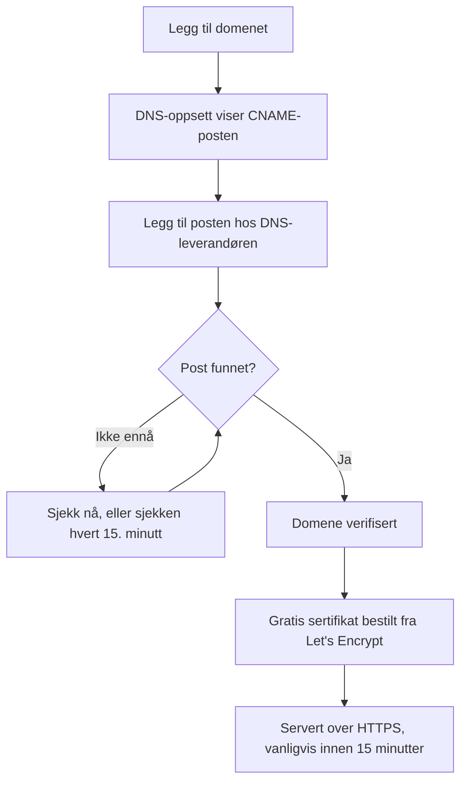

# Statusside – merkevare og domener

Statussiden din er den ene skjermen i OneUptime kundene dine ser på, så den bør ligne din egen og ligge på ditt eget domene, som `status.yourcompany.com`. Denne siden går gjennom siden **Merkevare** kort for kort og legger deretter statussiden på domenet ditt: legg til domenet, legg til én DNS-post, så følger det gratis SSL-sertifikatet av seg selv.

:::cards
- [Siden Merkevare](#siden-merkevare): Logo, tittel, favicon, lenker, bunntekst, farger og språk.
- [Egendefinert HTML, CSS og JavaScript](#egendefinert-html-css-og-javascript): Alt de innebygde innstillingene ikke dekker.
- [Egendefinerte domener](#egendefinerte-domener): Ditt eget vertsnavn, med et gratis sertifikat.
- [Kolonnen Status](#slik-leser-du-domenets-kolonne-status): Hvor langt hvert domene har kommet på vei mot HTTPS.
:::

## Hvor hver merkevareinnstilling ligger

Åpne en statusside: seksjonen **Merkevare** i sidemenyen har tre elementer:

| Side | Hva du angir der |
| ---- | ------------------ |
| **Merkevare** | Logo og forsidebilde, sidetittel og -beskrivelse, favicon, topptekstlenker, beskrivelsen av oversiktssiden, opphavsrettslinjen og bunntekstlenker. Sammenslått under **Flere innstillinger**: historikkdiagrammets farger, språk og indeksering i søkemotorer. |
| **Egendefinerte domener** | Ditt eget domene, DNS-posten og det gratis SSL-sertifikatet. |
| **HTML, CSS og JavaScript** | Topptekst-HTML, bunntekst-HTML, egendefinert CSS, egendefinert JavaScript. |

Tre ting som ligner merkevare, ligger i stedet under **Statussider → siden din → Avansert → Avanserte innstillinger** (`{id}/settings`), fordi de avgjør hva siden viser, og ikke hvordan den ser ut: den samlede oppetidsprosenten, hvilke monitorstatuser som teller mot oppetiden, og linjen «Powered by OneUptime». Alle tre er rader på kortet **Hva statussiden din viser** der.

Merkevaren var tidligere delt på separate skjermer for **Grunnleggende merkevare**, **Topptekst**, **Bunntekst**, **Oversiktsside** og **Språk**. De gamle adressene deres (`{id}/header-style`, `{id}/footer-style`, `{id}/overview-page-branding` og `{id}/languages`) åpner nå siden **Merkevare**, så gamle bokmerker og lenker virker fortsatt.

## Siden Merkevare

**Statussider → siden din → Merkevare → Merkevare** (`{id}/branding`). Hvert kort lagres for seg. Etter logoen, tittelen og faviconet følger kortene statussiden din fra topp til bunn: lenkene i toppteksten, teksten øverst i oversikten og deretter bunnteksten. Det få endrer, ligger sammenslått under **Flere innstillinger** nederst.

### Logo og forsidebilde

Det første kortet, **Logo og forsidebilde**, har knappen **Edit Images**, som åpner to trinn:

| Trinn | Felt |
| ---- | ------ |
| **Logo** | Opplastingen av logoen (plassholder `Upload logo`) og **Logo Alt Text** (plassholder `Logo of My Company`). La alt-teksten stå tom, så brukes statussidens tittel i stedet. |
| **Forsidebilde** | **Forside**, en opplasting (plassholder `Upload cover image`) for det brede banneret bak toppteksten, og **Cover Image Alt Text**. La alt-teksten stå tom hvis forsiden bare er pynt. |

Logoen, forsidebildet og faviconet er filer som er lastet opp i statussidens eget prosjekt, og det sjekkes hver gang ett av dem lagres, fra dashbordet, API-et, Terraform eller en arbeidsflyt. En fil som er lastet opp i et annet prosjekt, avvises med ordene en fil som ikke lenger finnes, får: «The logo's file could not be found. Upload the logo again.», «The cover image's file could not be found. Upload the cover image again.» eller «The favicon's file could not be found. Upload the favicon again.» Å laste opp bildet på nytt fra siden løser det.

Statussiden din viser bare bilder fra sitt eget prosjekt; et bilde den ikke kan vise, utelates, som om siden ikke hadde noe. Dashbordet, API-et og Terraform leser sidens bilder på samme måte: et bilde fra et annet prosjekt kommer tilbake som ikke noe bilde i det hele tatt. E-postene siden sender (til abonnenter, og til private brukere om påloggingen deres), viser logoen på samme måte: en logo siden ikke kan vise, utelates også fra dem i stedet for å vises som et ødelagt bilde.

### Tittel, beskrivelse og favicon

- **Tittel og beskrivelse**: kortet nevner at dette også brukes til SEO. **Rediger** åpner **Sidetittel** (plassholder `Please enter page title here.`) og **Sidebeskrivelse**. Søkemotorer og forhåndsvisninger av lenker viser dem, så skriv dem for en kunde, ikke for teamet ditt.
- **Favicon**: **Edit Favicon** åpner opplastingen **Favicon**: det lille ikonet i nettleserfanen.

### Topptekstlenker

Tabellen **Topptekstlenker** inneholder lenkene i statussidens topptekst, som nettstedet ditt, dokumentasjonen din eller en kundestøtteportal. Hver lenke har en **Tittel** og en **Lenke** (en URL, plassholder `https://link.com`), og du endrer rekkefølgen ved å dra. Uten lenker sier tabellen **Ingen statustoppteksttekstlenke for denne statussiden**, med **Opprett Statusside Topptekst Lenke** under.

### Beskrivelse av oversiktssiden

**Beskrivelse av oversiktsside** er det første på statussidens oversikt, over kunngjøringene, den samlede statusen og ressursene dine. **Rediger beskrivelse** åpner et markdown-felt. Bruk det til en setning med kontekst: hva siden dekker, og hvor man får hjelp. Et bilde du legger i det, vises til alle som besøker siden.

### Bunntekst

- **Opphavsrettsinformasjon**: **Edit Copyright** åpner ett felt, **Opphavsrettsinformasjon**, med plassholderen `Acme, Inc.`.
- **Bunntekstlenker**: det samme paret **Tittel** og **Lenke** som topptekstlenkene, sortert ved å dra. Uten lenker står det «Ingen statusbunntekstlenke for denne statussiden.»

Topptekstlenker er for navigering; bunntekstlenker er for det med liten skrift, som juridisk informasjon, personvern og vilkår.

### Flere innstillinger

Sidens siste seksjon ligger sammenslått under **Flere innstillinger**, fordi få noen gang endrer det som står der. Sammenslått nevner overskriften de fire seksjonene (**Standard stolpefarge**, **Regler for stolpefarger**, **Språk** og **Indeksering i søkemotorer**) og viser hver av dem som avviker fra det en ny statusside starter med: en annen standard stolpefarge enn den grønne alle sider starter med, en hvilken som helst regel for stolpefarger, et annet standardspråk enn engelsk, en kortere liste over språk eller indeksering i søkemotorer slått av. Klikk på den for å åpne den: det er ett kort med de fire seksjonene under hverandre, hver med egen tittel og knapp, atskilt med skillelinjer.

**Historikkdiagrammets farger.** Dette er de eneste innebygde fargeinnstillingene på en statusside.

- **Standard stolpefarge for historikkdiagrammet**: **Edit Default Bar Color** åpner velgeren **Standard stolpefarge**. Alle nye statussider starter med grønn. Med regler for stolpefarger er det også fargen for en dag ingen regel samsvarer med. En dag siden ikke har data for, tegnes alltid grå.
- **Rules for Bar Colors of History Chart**: en ordnet tabell med regler du sorterer ved å dra. Hver regel har **Når oppetid % er større enn eller lik** og **Bruk så denne stolpefargen**; tabellens kolonner heter `When Uptime Percent >=` og `Then, Bar Color is`. Fargen på en ny regel er allerede valgt, en som de andre reglene ikke bruker ennå; velg heller den du vil ha. Rekkefølgen betyr noe, så sorter reglene slik du vil at de skal evalueres. Uten regler får hver dags stolpe fargen til dagens laveste monitorstatus.

Hvor mange dager diagrammet dekker, angis ikke her. Det er **Oppetidshistorikk** på kortet **Hva statussiden din viser** under **Avansert → Avanserte innstillinger**, fra 1 til 90 dager. Hvilke monitorstatuser som teller som nede, er **Teller som nedetid**, i samme rad på det kortet.

**Språk.** Seksjonen **Språk** angir språkvelgeren besøkende får i sidens bunntekst. **Rediger språk** åpner to felt:

| Felt | Hva det gjør |
| ----- | ------------ |
| **Standardspråk** | Språket førstegangsbesøkende ser, valgt fra en liste som nevner hvert språk på språket selv og på engelsk (`Deutsch (German)`). Standard er engelsk, og besøkende kan alltid bytte fra bunnteksten. |
| **Aktiverte språk** | En flervalgsliste, plassholder `All languages`. La den stå tom, så tilbys alle støttede språk; velg noen få, så viser bunnteksten bare dem. |

OneUptime leveres med sytten språk: engelsk, tysk, fransk, spansk, italiensk, portugisisk, nederlandsk, dansk, norsk, svensk, russisk, japansk, koreansk, kinesisk (forenklet), kinesisk (tradisjonell), hindi og persisk.

**Indeksering i søkemotorer.** Én bryter, **Tillat søkemotorer å indeksere denne statussiden**, avgjør om Google, Bing og andre søkemotorer kan vise siden. Den er slått på som standard. Det finnes ingen knapp **Rediger**: bryteren lagres i det øyeblikket du slår den om. Slå den av, så serveres siden med `noindex, nofollow` (en robots-metatag og hodet `X-Robots-Tag`); alle med lenken kan fortsatt åpne den. Søkemotorer kan bruke noen uker på å fjerne en side de allerede har indeksert.

> [!TIP]
> Slå av **Tillat søkemotorer å indeksere denne statussiden** mens en side bare er intern eller fortsatt settes opp, slik at en halvferdig side ikke begynner å rangere på merkenavnet ditt.

## Oppetidsprosent og nedetidsstatuser

Begge ligger i raden **Oppetidshistorikk** på kortet **Hva statussiden din viser** under **Statussider → siden din → Avansert → Avanserte innstillinger** (`{id}/settings`). Det finnes ingen knapp **Rediger**: hver innstilling lagres i det øyeblikket du endrer den.

- **Vis samlet oppetidsprosent**: en bryter, slått av som standard. Mens den er slått på, velger **Presisjon** ved siden av hvor mange desimaler prosenten viser: `99%`, `99.9%`, `99.99%` (standard) eller `99.999%`. På OneUptime Cloud krever det planen **Scale** å slå på prosenten; presisjonen kan endres på alle planer.
- **Teller som nedetid**: monitorstatusene, som fargede merker, der tiden teller mot oppetiden på denne siden. Her avgjør du for eksempel om en redusert status teller mot oppetiden. Minst én status forblir valgt.

De var tidligere to egne kort, **Samlet oppetidsprosent** og **Overvåkerstatuser for nedetid**, hvert bak en knapp **Rediger**. Se [Å velge hva som vises på siden](/docs/status-pages/index#å-velge-hva-som-vises-på-siden) for resten av kortet.

## Egendefinert HTML, CSS og JavaScript

**Statussider → siden din → Merkevare → HTML, CSS og JavaScript** (`{id}/custom-code`) har fire kort, som hvert redigeres for seg og lagres i en kolonne på statussiden:

| Kort | Kolonne | Hva det inneholder |
| ---- | ------ | ------------- |
| **Topptekst-HTML** | `headerHTML` | HTML som legges til i sidens topptekst (plassholder `Insert Custom HTML here.`). |
| **Bunntekst-HTML** | `footerHTML` | HTML som legges til i sidens bunntekst. |
| **Egendefinert CSS** | `customCSS` | Stiler for hele siden (plassholder `Insert Custom CSS here.`). |
| **Egendefinert JavaScript** | `customJavaScript` | Et skript siden kjører (plassholder `Insert Custom JavaScript here.`). |

> [!IMPORTANT]
> Egendefinert HTML, CSS og JavaScript serveres bare på et verifisert egendefinert domene. De er slått av på standardadressen `/status-page/:id`, fordi den adressen deler opprinnelse med stedet der man er logget på OneUptime.

På OneUptime Cloud krever det planen **Growth** å legge til eller endre noen av dem. Å tømme ett av dem fungerer på alle planer, så egendefinert kode som ble lagt til i en prøveperiode, alltid kan fjernes.

**Det finnes ingen temavelger.** OneUptimes statussider har ingen innstilling for tema eller merkevarefarge: de eneste innebygde fargeinnstillingene noe sted er **Standard stolpefarge** og reglene for historikkdiagrammets stolpefarger, under **Flere innstillinger** på siden **Merkevare**. Skrifttyper, bakgrunnsfarger, aksentfarger og justeringer av oppsettet går alle gjennom **Egendefinert CSS**. Hvis du har lett etter et felt for en «merkevarefarge», er dette svaret: det finnes ikke, og denne boksen er måten å gjøre det på.

> [!WARNING]
> Egendefinert JavaScript kjører i nettleserne til de besøkende, på en side folk åpner nettopp når de tror noe er ødelagt. Hold det lite, host selv det det laster inn, der du kan, og test det før du stoler på det.

## Egendefinerte domener

Som standard kan en statusside nås på forhåndsvisnings-URL-en på skjermen **Oversikt**. For å legge den på ditt eget vertsnavn går du til **Statussider → siden din → Merkevare → Egendefinerte domener** (`{id}/domains`).

Kortet **Egendefinerte domener** sier hva du skal gjøre: pek hvert domenes CNAME-post til installasjonens CNAME-post for statussider, så utsteder OneUptime domenets SSL-sertifikat og fornyer det for deg. Uten noe satt opp sier tabellen **Ingen egendefinerte domener funnet**, med **Opprett Statusside Domene** under. Tabellen har to kolonner, **Domene** og **Status**, og filtre for **Domene**, **CNAME gyldig** og **SSL klargjort**.

Å legge siden på domenet ditt tar tre trinn, og bare de to første er dine:

1. **Legg til domenet**: et underdomene og ett av de verifiserte domenene dine.
2. **Legg til CNAME-posten** hos DNS-leverandøren din. Dialogen **DNS-oppsett** viser posten så snart du legger til domenet.
3. **Det gratis SSL-sertifikatet utstedes automatisk** så snart posten er funnet. Det finnes ingen knapp å trykke på.



### Før du starter

- **Det overordnede domenet må være verifisert.** Nedtrekkslisten **Domene** viser bare domenene som er verifisert under **Prosjektinnstillinger → Domener**, der du med en TXT-post beviser at du eier et domene. Lenken **Legg til et domene** ved siden av feltet åpner den siden i en ny fane.
- **Installasjonen din trenger en CNAME-post for statussider.** OneUptime Cloud har en. På en egendriftet installasjon setter du den til et vertsnavn som peker på OneUptime-serveren din (en A-post), og sørger for at serveren svarer på port 80, der Let's Encrypt sjekker den. Uten den sier kortet og dialogen **DNS-oppsett** «Custom Domains not enabled for this OneUptime installation» i stedet for å vise en post.

:::tabs
@tab Docker Compose
```ini title="config.env"
STATUS_PAGE_CNAME_RECORD=oneuptime.yourcompany.com
```
@tab Kubernetes
```yaml title="values.yaml"
statusPage:
  cnameRecord: oneuptime.yourcompany.com
```
:::

### Legg til domenet

:::steps
#### Åpne Opprett Statusside Domene

Klikk på **Opprett Statusside Domene** under **Egendefinerte domener**. Dialogen består av én side.

#### Skriv inn underdomenet

I **Underdomene** (plassholder `status (leave blank for root)`) skriver du bare etiketten, som `status`, ikke hele vertsnavnet. La det stå tomt, eller skriv `@`, for å bruke rotdomenet (apex).

#### Velg domenet

I **Domene** (plassholder `Select domain`) velger du ett av de verifiserte domenene dine. Et domene du ikke har verifisert, vises ikke, fordi det ville blitt avvist.

#### Behold det gratis sertifikatet, eller last opp ditt eget

**Flere felt** er slått sammen, og overskriften sier hvilket sertifikat domenet skal bruke: «Vi utsteder et gratis SSL-sertifikat for dette domenet og fornyer det automatisk.» Åpne det bare for å bruke ditt eget sertifikat: slå på **Last opp tilpasset sertifikat**, og lim deretter inn **Sertifikat** og **Sertifikatets private nøkkel** i PEM-format. Begge er da påkrevd.

#### Opprett domenet

Klikk på **Opprett Statusside Domene**. Dialogen lukkes, og **DNS-oppsett** for det nye domenet åpnes, med posten som skal legges til.
:::

Et domenes fulle navn ligger fast når du legger det til, så **Rediger** endrer bare sertifikatet. For å bruke et annet underdomene legger du til det domenet og sletter det gamle.

### DNS-oppsett og verifisering

Dialogen **DNS-oppsett** viser posten du skal legge til hos DNS-leverandøren din, ett felt per rad, hvert med en kopieringsknapp:

| Felt | Hva du skal skrive inn |
| ----- | ------------- |
| **Type** | `CNAME` |
| **Navn** | Hele domenet du la til, for eksempel `status.yourcompany.com` |
| **Verdi** | Installasjonens CNAME-post for statussider |

> [!NOTE]
> For et rotdomene, uten underdomene, legger dialogen til en merknad: mange DNS-leverandører tillater ikke en CNAME-post der. Bruk i stedet leverandørens ALIAS-, ANAME- eller CNAME-flattening-post med samme verdi.

OneUptime sjekker hvert uverifiserte domene hvert 15. minutt og verifiserer ditt så snart posten er aktiv, enten du kommer tilbake eller ikke. For å sjekke med en gang klikker du på **Sjekk nå**:

- **Posten er ikke funnet ennå.** Dialogen forblir åpen og sier hvilken post den lette etter. En ny DNS-post kan bruke litt tid på å dukke opp: klikk på **Sjekk nå** igjen senere, eller overlat det til sjekken hvert 15. minutt.
- **Posten er funnet.** Dialogen sier «CNAME-posten din er verifisert.» og hva som skjer med sertifikatet videre. Det gratis sertifikatet bestilles i det øyeblikket.

Til et domene er verifisert og sertifikatet er på plass, har raden handlingen **DNS-oppsett**, som åpner den samme dialogen. På et verifisert domene der sertifikatbestillingen stadig mislykkes, eller der sertifikatet er utløpt, bestiller **Sjekk nå** der på nytt og viser hvorfor den siste bestillingen mislyktes. Den bestiller høyst én gang per domene hvert 15. minutt; i mellomtiden fortsetter OneUptime selv å prøve på nytt.

### SSL-sertifikater

Hvert egendefinerte domene får et gratis sertifikat fra Let's Encrypt, som utstedes og fornyes automatisk. Det er ingenting å klikke på:

- **Sjekk nå** bestiller sertifikatet i det øyeblikket posten blir funnet. Dialogen sier deretter at sertifikatet vanligvis er aktivt innen 15 minutter.
- Når sjekken hvert 15. minutt verifiserer et domene, bestiller den domenets sertifikat i samme sjekk.
- Fornyelse skjer automatisk, i god tid før sertifikatet utløper. Hvis DNS-en din ikke svarer et øyeblikk mens et sertifikat fornyes, fortsetter sertifikatet å bli servert og fornyes i et senere forsøk. En mislykket DNS-sjekk fjerner aldri et sertifikat som fortsatt er gyldig.

Et nytt sertifikat serveres innen 15 minutter etter at det er utstedt, fordi sertifikatene så ofte skrives ut til serverne som svarer for domenet ditt. Kolonnen Status sier _vanligvis_ innen 15 minutter: når mange domener venter samtidig, behandles de noen få om gangen.

Hvert OneUptime-sertifikat bestilles fra én delt Let's Encrypt-konto, og Let's Encrypt begrenser hvor mange nye bestillinger én konto kan legge inn på kort tid, og hvor ofte en bestilling for det samme domenet kan mislykkes. OneUptime holder alle bestillingene sine (nye domener, **Sjekk nå**, nyutstedelser og fornyelser) innenfor de grensene samlet, og fornyelser kommer alltid først, så en bølge av nye domener aldri holder igjen fornyelsene som holder eksisterende domener tilkoblet.

Hvis en bestilling mislykkes, sier domenets kolonne Status det, med årsaken på linjen under, og **Sjekk nå** i **DNS-oppsett** viser det også. OneUptime fortsetter selv å prøve og venter litt lenger etter hver feil på rad, så et domene der bestillingen stadig mislykkes, ikke bruker opp bestillingene alle andre domener trenger. De vanlige årsakene er en CAA-post på domenet ditt som ikke tillater `letsencrypt.org`, og, på en egendriftet installasjon, en server Let's Encrypt ikke når på port 80; på en egendriftet installasjon står detaljene i workerens logger. Når du har rettet årsaken, klikker du på **Sjekk nå** for å bestille på nytt med en gang. Den legger inn høyst én bestilling per domene hvert 15. minutt; et klikk i mellomtiden viser hvordan den siste bestillingen gikk.

Hvis du har lastet opp ditt eget sertifikat under **Flere felt**, serverer OneUptime det i stedet, innen 15 minutter etter at du lagret. Last opp erstatningen før det utløper, ved å redigere domenet.

### Utsted et sertifikat på nytt

Automatisk fornyelse dekker det vanlige tilfellet, men noen ganger vil du ha et helt nytt sertifikat med en gang: en privat nøkkel du helst ikke vil beholde, et sertifikat din egen skanner ikke liker, eller et domene som er endret et annet sted. Så snart det er bestilt et gratis sertifikat for et domene, viser raden handlingen **Reissue SSL**.

Dialogen, **Reissue SSL Certificate for this Status Page**, ber Let's Encrypt om et nytt sertifikat for domenet og erstatter det som serveres, med det. Statussiden din forblir tilkoblet med det eksisterende sertifikatet i mellomtiden, og det nye sertifikatet serveres innen 15 minutter. Klikk på **Reissue SSL Certificate** for å bestille det.

> [!NOTE]
> Et domene kan bare utstedes på nytt én gang hver 24. time. Let's Encrypt begrenser hvor ofte det samme domenet kan utstedes, og hvert OneUptime-sertifikat bestilles fra én delt konto, også de automatiske fornyelsene som holder alle andres sider tilkoblet. Innenfor det vinduet sier dialogen hvor lang tid som gjenstår, i stedet for å bestille. Hvis et sertifikat for domenet bestilles i det øyeblikket, eller installasjonens Let's Encrypt-bestillinger er brukt opp for øyeblikket, sier dialogen det, ingenting bestilles, og trykket teller ikke som nyutstedelsen din.

Handlingen vises ikke på et domene som bruker et sertifikat du har lastet opp: det finnes ikke noe Let's Encrypt-sertifikat å utstede på nytt, så last heller opp et nytt ved å redigere domenet. Den vises heller ikke før domenets første sertifikat er bestilt, noe som skjer av seg selv så snart CNAME-posten er verifisert.

Den samme knappen, med den samme grensen på 24 timer, finnes på dashbordenes egendefinerte domener under **Dashbord → dashbordet ditt → Merkevare → Egendefinerte domener**, som fungerer på samme måte som statussidenes egendefinerte domener: se [Deling & offentlige dashbord](/docs/dashboards/sharing#egendefinerte-domener).

### Slik leser du domenets kolonne Status

Kolonnen **Status** sier hvor langt hvert domene har kommet på vei mot HTTPS, i én av sju tilstander. Når en bestilling mislyktes, står årsaken på linjen under.

| Hva kolonnen Status sier | Hva det betyr |
| --------------------------- | ------------- |
| Venter på DNS: legg til CNAME-posten. | CNAME-posten er ikke funnet ennå. Åpne **DNS-oppsett** for å se posten, legg den til hos DNS-leverandøren din, og klikk deretter på **Sjekk nå**, eller vent på sjekken hvert 15. minutt. |
| Utsteder et gratis sertifikat, vanligvis innen 15 minutter. | Posten er verifisert, og sertifikatet bestilles eller skrives ut. Du trenger ikke gjøre noe. |
| Kunne ikke utstede et gratis sertifikat ennå. Vi fortsetter å prøve. | Posten er verifisert, men bestillingen av sertifikatet mislyktes, av årsaken på linjen under. Rett årsaken, åpne deretter **DNS-oppsett** og klikk på **Sjekk nå** for å bestille på nytt med en gang. |
| Sertifikatet er utløpt. Vi fortsetter å prøve å fornye det. | Domenets sertifikat er utløpt fordi fornyelsene mislyktes. Åpne **DNS-oppsett** og klikk på **Sjekk nå** for å fornye det med en gang og se hvorfor. |
| Sertifikat utstedt, fornyes automatisk. | Ferdig. Domenet serverer sertifikatet sitt over HTTPS, og OneUptime fornyer det. |
| Sertifikat utstedt, men fornyelsen mislyktes. Vi fortsetter å prøve. | Domenet serverer fortsatt et gyldig sertifikat, men den siste fornyelsen mislyktes, av årsaken på linjen under. OneUptime prøver igjen i god tid før sertifikatet utløper. |
| Bruker det opplastede sertifikatet ditt. | Posten er verifisert, og domenet serveres med sertifikatet du lastet opp. |

:::details Et domene blir stående på «Venter på DNS» lenge etter at jeg la til posten
Sjekk at postens navn er hele domenet, som `status.yourcompany.com`, og at verdien samsvarer nøyaktig med installasjonens CNAME-post. På et rotdomene bruker du en ALIAS-, ANAME- eller flattened CNAME-post. Klikk deretter på **Sjekk nå** i **DNS-oppsett**.
:::

:::details Kolonnen Status sier at den ikke kunne utstede et gratis sertifikat
Se etter en CAA-post på domenet ditt som utelater `letsencrypt.org`, og sjekk på en egendriftet installasjon at serveren din svarer på port 80. Rett årsaken, og klikk deretter på **Sjekk nå** i **DNS-oppsett** for å bestille på nytt.
:::

### Hvem som kan sjekke og utstede på nytt

**Sjekk nå**, bestilling av et domenes sertifikat og **Reissue SSL** endrer domenet, så de krever tillatelse til å redigere det: **Edit Status Page Domain**, eller en rolle som inneholder den (Project Owner, Project Admin, Project Member, Status Page Admin eller Status Page Member).

Den som bare kan lese domenet, som en Viewer eller en Status Page Viewer, ser fortsatt kolonnen **Status** og posten som skal legges til, i **DNS-oppsett**. For dem er **Sjekk nå** og **Reissue SSL** låst og sier hvilken tillatelse som trengs. OneUptime fortsetter uansett selv å sjekke hvert domene og bestille sertifikatet.

Det samme gjelder API-nøkler. En nøkkel som bare kan lese statussidedomener, kan ikke kalle `verify-cname`, `order-ssl` eller `reissue-ssl` på `/status-page-domain`. Gi den **Read Status Page Domain** og **Edit Status Page Domain** hvis den trenger det.

## Powered by OneUptime

Linjen «Powered by OneUptime» er ikke en merkevareinnstilling. Den er den siste bryteren på kortet **Hva statussiden din viser** under **Statussider → siden din → Avansert → Avanserte innstillinger** (`{id}/settings`): **Vis «Powered By OneUptime»-merkevarebygging**, slått på som standard. Slå den av for å skjule linjen; den lagres med en gang. På OneUptime Cloud krever det planen **Scale** å skjule den.

## Neste steg

:::cards
- [Statussider – Oversikt](/docs/status-pages/index): Hva siden viser, og hvem som kan se den.
- [Statusside – ressurser og grupper](/docs/status-pages/resources-and-groups): Velg hva besøkende faktisk ser på siden.
- [Abonnenter og kunngjøringer](/docs/status-pages/subscribers): E-postene som bærer logoen din og lenker til domenet ditt.
- [Offentlig API](/docs/status-pages/public-api): Les siden som JSON, også på ditt eget domene.
:::
