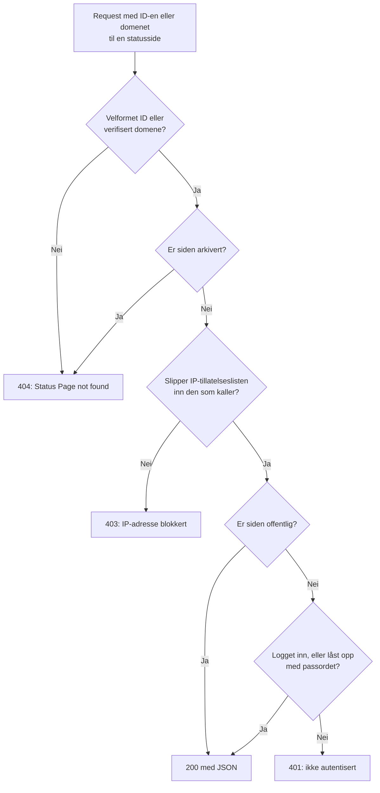

# Offentlig API

Hver statusside svarer på et lite sett med JSON-endepunkter som bare leser: oversikten, oppetiden, hendelsene, episodene, planlagte vedlikeholdshendelser og kunngjøringene. Det er endepunktene statussiden selv laster, så de returnerer nøyaktig det en besøkende ser, og en offentlig side trenger ingen API-nøkkel. Bruk dem til å vise statusen din i din egen app, en chatbot eller på en veggskjerm.

:::cards
- [Endepunkter](#endepunkter): Ett endepunkt for hver ting siden viser.
- [Les oversikten](#les-oversikten): Hele siden i én request, med curl, Node.js og Python.
- [Oppetid for et datointervall](#oppetid-for-et-datointervall): Oppetid per ressurs og gruppe, for opptil 90 dager.
- [Feil](#feil): Hva hver statuskode betyr.
:::

## Slik besvares en request

Hver request oppgir statussiden med ID-en eller et av de egendefinerte domenene. OneUptime finner siden, bruker de samme tilgangsreglene som en besøkende møter, og svarer med JSON.



En privat side svarer bare en nettleser som har logget inn på den eller låst den opp med passordet: API-et leser den samme økten som siden. Bruk en offentlig side til et skript. Se [Å begrense hvem som kan se siden](/docs/status-pages/index#å-begrense-hvem-som-kan-se-siden).

En velformet ID som ingen statusside har, går samme vei som en privat side og får svaret `401`. Svarer en offentlig side med `401`, så sjekk ID-en.

## Før du begynner

- **ID-en til statussiden.** Åpne siden i dashbordet (**Statussider → Alle statussider**, deretter siden). Kortet **Detaljer for statusside** på **Oversikt** viser **Statusside-ID**.
- **Basis-URL-en.** Alle endepunktene nedenfor ligger under `/status-page-api`:

| Hvor siden kjører | Basis-URL |
| ------------------- | -------- |
| OneUptime Cloud | `https://oneuptime.com/status-page-api` |
| Selvhostet OneUptime | `https://<your-oneuptime-host>/status-page-api` |
| Et egendefinert domene for siden | `https://status.example.com/status-page-api` |

Der en sti nedenfor sier `{statusPageIdOrDomain}`, kan du sende ID-en til siden eller et av de verifiserte egendefinerte domenene, for eksempel `status.example.com`. Oppetidsendepunktet tar bare ID-en.

## Endepunkter

| Endepunkt | Metoder | Returnerer |
| -------- | ------- | ------- |
| `/overview/{statusPageIdOrDomain}` | `GET`, `POST` | Alt oversikten viser: den samlede statusen, ressurser og grupper, aktive hendelser og episoder, planlagt vedlikehold, aktuelle kunngjøringer og dataene bak oppetidsstolpene. |
| `/uptime/{statusPageId}` | `POST` | Oppetidsprosenter per ressurs og per gruppe, for et datointervall. |
| `/incidents/{statusPageIdOrDomain}` | `GET`, `POST` | Hendelsene siden viser, med offentlige notater og tilstandsendringer. |
| `/incidents/{statusPageIdOrDomain}/{incidentId}` | `POST` | Én hendelse. |
| `/episodes/{statusPageIdOrDomain}` | `POST` | Hendelsesepisodene siden viser. |
| `/episodes/{statusPageIdOrDomain}/{episodeId}` | `POST` | Én episode. |
| `/scheduled-maintenance-events/{statusPageIdOrDomain}` | `GET`, `POST` | De planlagte vedlikeholdshendelsene siden viser, med offentlige notater og tilstandsendringer. |
| `/scheduled-maintenance-events/{statusPageIdOrDomain}/{scheduledMaintenanceId}` | `POST` | Én planlagt vedlikeholdshendelse. |
| `/announcements/{statusPageIdOrDomain}` | `GET`, `POST` | Kunngjøringene siden viser. |
| `/announcements/{statusPageIdOrDomain}/{announcementId}` | `POST` | Én kunngjøring. |

Endepunktene følger sidens egne innstillinger, i kortet **Hva statussiden din viser** (se [Å velge hva som vises på siden](/docs/status-pages/index#å-velge-hva-som-vises-på-siden)):

- En liste som er slått av, avviser endepunktet sitt, for eksempel med `Incidents are not enabled on this status page.`
- Hver liste går så langt tilbake som innstillingen **Vis de siste … dagene** (14 som standard). Hendelseslisten tar i tillegg med alle hendelser som ikke er løst ennå, og listen over planlagt vedlikehold alle hendelser som kommer eller pågår.
- Etter ID returneres en hendelse, episode, vedlikeholdshendelse eller kunngjøring uansett hvor gammel den er, så en lenke til en eldre fortsetter å virke. En som siden ikke viser i det hele tatt, for eksempel en hendelse på en monitor som ikke er på siden, kommer tilbake som en tom liste, og en episode som `404`.

**Hvilke hendelser en side returnerer.** Hendelsesendepunktet returnerer hendelsene på sidens monitorer, minus dem som er begrenset til andre statussider, og minus alle hendelser som ikke er begrenset til denne siden hvis siden bare viser hendelser som er begrenset til den (se [Én statusside per målgruppe](/docs/status-pages/one-status-page-per-audience)). Hvilke sider en hendelse er begrenset til, er aldri en del av svaret.

## Les oversikten

Oversikten er én request for hele siden. Det er de samme dataene statussiden tegner, og de er høyst 15 sekunder gamle.

:::tabs
@tab curl
```bash
curl https://oneuptime.com/status-page-api/overview/YOUR_STATUS_PAGE_ID
```
@tab Node.js
```javascript title="status.mjs"
// Node.js 18 or later: fetch is built in. Run with `node status.mjs`.
const statusPageId = "YOUR_STATUS_PAGE_ID";

const response = await fetch(
  `https://oneuptime.com/status-page-api/overview/${statusPageId}`,
);
const body = await response.json();

if (!response.ok) {
  throw new Error(`${response.status}: ${body.error}`);
}

console.log(body.overallStatus?.name); // "Operational"
```
@tab Python
```python title="status.py"
# Python 3, standard library only. Run with `python3 status.py`.
import json
import urllib.request

STATUS_PAGE_ID = "YOUR_STATUS_PAGE_ID"
url = f"https://oneuptime.com/status-page-api/overview/{STATUS_PAGE_ID}"

with urllib.request.urlopen(url, timeout=10) as response:
    overview = json.load(response)

print((overview.get("overallStatus") or {}).get("name"))  # Operational
```
:::

Den samlede statusen er den verste nåværende statusen blant monitorene og monitorgruppene på siden, den med høyest prioritet. En monitorstatus ser slik ut:

```json
{
  "_id": "cc80b385-4190-42a3-ae8b-9b391e90d79f",
  "name": "Operational",
  "color": { "_type": "Color", "value": "#2ab57d" },
  "isOperationalState": true,
  "priority": 1
}
```

### Hva oversikten returnerer

| Nøkkel | Hva den inneholder |
| --- | ------------- |
| `overallStatus` | Sidens samlede status, en monitorstatus som over, eller `null` når det ikke er noe på siden. |
| `statusPage` | Sidens offentlige innstillinger: tittel, beskrivelse, merkevare og hva den viser. |
| `statusPageResources` | Hver ressurs: visningsnavn, beskrivelse, gruppe, monitor eller monitorgruppe og visningsvalg. |
| `resourceGroups` | Gruppene, med `parentStatusPageGroupId` for nestede grupper. |
| `monitorStatuses` | Alle monitorstatusene i prosjektet, fra lavest prioritet til høyest. |
| `monitorGroupCurrentStatuses`, `monitorsInGroup` | Nåværende status for hver monitorgruppe på siden, og monitorene i den. |
| `monitorStatusTimelines`, `uptimeDailyAggregate`, `monitorGroupMergedDowntime`, `statusPageHistoryChartBarColorRules` | Det oppetidsstolpene tegnes ut fra, og sidens fargeregler for stolpene. |
| `activeIncidents`, `incidentPublicNotes`, `incidentStateTimelines`, `incidentStates` | De uløste hendelsene siden viser, deres offentlige notater og tilstandsendringer, og prosjektets hendelsestilstander. |
| `timelineIncidents` | Hendelsene i tidsvinduet til oppetidsstolpene, løste hendelser medregnet, for verktøytipsene til stolpene. |
| `activeEpisodes`, `episodePublicNotes`, `episodeStateTimelines` | Det samme for hendelsesepisoder. |
| `scheduledMaintenanceEvents`, `scheduledMaintenanceEventsPublicNotes`, `scheduledMaintenanceStateTimelines`, `scheduledMaintenanceStates` | De planlagte vedlikeholdshendelsene som kommer eller pågår, deres offentlige notater og tilstandsendringer. |
| `activeAnnouncements` | Kunngjøringene som vises nå: startet og ikke avsluttet. |

## Oppetid for et datointervall

`POST /uptime/{statusPageId}` returnerer oppetiden for hver ressurs og gruppe på siden mellom to datoer. Begge datoene er valgfrie:

| Felt | Standard | Merknader |
| ----- | ------- | ----- |
| `startDate` | For 14 dager siden | En dato og et klokkeslett etter ISO 8601. |
| `endDate` | Nå | Kan ikke være før `startDate`. Intervallet kan dekke høyst 90 dager. |

:::tabs
@tab curl
```bash
curl -X POST https://oneuptime.com/status-page-api/uptime/YOUR_STATUS_PAGE_ID \
  -H "Content-Type: application/json" \
  -d '{"startDate": "2026-09-01T00:00:00Z", "endDate": "2026-09-30T23:59:59Z"}'
```
@tab Node.js
```javascript title="uptime.mjs"
// Node.js 18 or later. Run with `node uptime.mjs`.
const statusPageId = "YOUR_STATUS_PAGE_ID";

const response = await fetch(
  `https://oneuptime.com/status-page-api/uptime/${statusPageId}`,
  {
    method: "POST",
    headers: { "Content-Type": "application/json" },
    body: JSON.stringify({
      startDate: "2026-09-01T00:00:00Z",
      endDate: "2026-09-30T23:59:59Z",
    }),
  },
);
const uptime = await response.json();

for (const group of uptime.groupUptimes) {
  console.log(group.statusPageGroupName, group.uptimePercent);
}
```
@tab Python
```python title="uptime.py"
# Python 3, standard library only. Run with `python3 uptime.py`.
import json
import urllib.request

STATUS_PAGE_ID = "YOUR_STATUS_PAGE_ID"

request = urllib.request.Request(
    f"https://oneuptime.com/status-page-api/uptime/{STATUS_PAGE_ID}",
    data=json.dumps(
        {"startDate": "2026-09-01T00:00:00Z", "endDate": "2026-09-30T23:59:59Z"}
    ).encode(),
    headers={"Content-Type": "application/json"},
    method="POST",
)

with urllib.request.urlopen(request, timeout=10) as response:
    uptime = json.load(response)

for group in uptime["groupUptimes"]:
    print(group["statusPageGroupName"], group["uptimePercent"])
```
:::

Svaret:

```json
{
  "statusPageResourceUptimes": [
    {
      "statusPageResourceId": {
        "_type": "ObjectID",
        "value": "cfffa3c3-fdf3-4cd7-9585-d6d408a14663"
      },
      "uptimePercent": 99.98,
      "statusPageResourceName": "Checkout API",
      "currentStatus": {
        "_id": "cc80b385-4190-42a3-ae8b-9b391e90d79f",
        "name": "Operational",
        "color": { "_type": "Color", "value": "#2ab57d" },
        "isOperationalState": true,
        "priority": 1
      }
    }
  ],
  "groupUptimes": [
    {
      "statusPageGroupId": {
        "_type": "ObjectID",
        "value": "df7632c4-c5c0-453c-88bf-9ee3d68d45f2"
      },
      "parentStatusPageGroupId": null,
      "uptimePercent": 99.98,
      "statusPageResourceUptimes": [
        {
          "statusPageResourceId": {
            "_type": "ObjectID",
            "value": "8175534f-aa77-456c-ad5b-b8e7b85876aa"
          },
          "uptimePercent": 99.98,
          "statusPageResourceName": "Web app",
          "currentStatus": {
            "_id": "cc80b385-4190-42a3-ae8b-9b391e90d79f",
            "name": "Operational",
            "color": { "_type": "Color", "value": "#2ab57d" },
            "isOperationalState": true,
            "priority": 1
          }
        }
      ],
      "statusPageGroupName": "Web",
      "currentStatus": {
        "_id": "cc80b385-4190-42a3-ae8b-9b391e90d79f",
        "name": "Operational",
        "color": { "_type": "Color", "value": "#2ab57d" },
        "isOperationalState": true,
        "priority": 1
      }
    }
  ],
  "startDate": "2026-09-01T00:00:00.000Z",
  "endDate": "2026-09-30T23:59:59.000Z"
}
```

| Nøkkel | Hva den inneholder |
| --- | ------------- |
| `statusPageResourceUptimes` | Ressursene som ikke ligger i noen gruppe, de besøkende ser øverst på siden. |
| `groupUptimes` | Én oppføring per gruppe. `uptimePercent` og `currentStatus` for en gruppe dekker alle ressurser under den, nestede grupper medregnet; dens `statusPageResourceUptimes` viser bare ressursene som ligger rett i den. Bygg opp treet igjen med `parentStatusPageGroupId`. |
| `uptimePercent` | Avrundet til ressursens eller gruppens egen presisjon. `null` når ressursen eller gruppen ikke viser en oppetidsprosent. |
| `currentStatus` | `null` når ressursen eller gruppen ikke viser sin nåværende status. |

Tid teller som nedetid når monitorstatusen er en av sidens statuser under **Teller som nedetid**.

## Hendelser, episoder, vedlikehold og kunngjøringer

Listeendepunktene svarer på `GET` i tillegg til `POST`; endepunktene for enkeltoppføringer og episodeendepunktene svarer på `POST`.

:::tabs
@tab curl
```bash
# The incidents the page lists
curl https://oneuptime.com/status-page-api/incidents/YOUR_STATUS_PAGE_ID

# One scheduled maintenance event
curl -X POST https://oneuptime.com/status-page-api/scheduled-maintenance-events/YOUR_STATUS_PAGE_ID/EVENT_ID
```
@tab Node.js
```javascript title="incidents.mjs"
// Node.js 18 or later. Run with `node incidents.mjs`.
const statusPageId = "YOUR_STATUS_PAGE_ID";

const response = await fetch(
  `https://oneuptime.com/status-page-api/incidents/${statusPageId}`,
);
const { incidents } = await response.json();

for (const incident of incidents) {
  console.log(incident.title, incident.currentIncidentState?.name);
}
```
@tab Python
```python title="incidents.py"
# Python 3, standard library only. Run with `python3 incidents.py`.
import json
import urllib.request

STATUS_PAGE_ID = "YOUR_STATUS_PAGE_ID"
url = f"https://oneuptime.com/status-page-api/incidents/{STATUS_PAGE_ID}"

with urllib.request.urlopen(url, timeout=10) as response:
    incidents = json.load(response)["incidents"]

for incident in incidents:
    print(incident["title"], (incident.get("currentIncidentState") or {}).get("name"))
```
:::

| Endepunkt | Nøkler i svaret |
| -------- | -------------------- |
| Hendelser | `incidents`, `incidentPublicNotes`, `incidentStateTimelines`, `incidentStates`, `statusPageResources`, `monitorsInGroup` |
| Episoder | `episodes`, `episodePublicNotes`, `episodeStateTimelines`, `incidentStates`, `statusPageResources`, `monitorsInGroup` |
| Planlagte vedlikeholdshendelser | `scheduledMaintenanceEvents`, `scheduledMaintenanceEventsPublicNotes`, `scheduledMaintenanceStateTimelines`, `scheduledMaintenanceStates`, `statusPageResources`, `monitorsInGroup` |
| Kunngjøringer | `announcements`, `statusPageResources`, `monitorsInGroup` |

En request etter én oppføring svarer med de samme nøklene, som inneholder den ene posten.

## Feil

En feil svarer med en statuskode og JSON-innhold som forteller hvorfor:

```json
{ "error": "You can only get uptime for 90 days. Please select a date range within 90 days." }
```

| Status | Når |
| ------ | ---- |
| `400` | Requesten ber om noe siden ikke viser, for eksempel en liste som er slått av, eller oppetidsintervallet er lengre enn 90 dager eller slutter før det begynner. |
| `401` | Siden er privat, og requesten har verken en innlogget økt eller passordet til den. En velformet ID som ingen statusside har, får også svaret `401`. |
| `403` | IP-tillatelseslisten til siden inneholder ikke adressen til den som kaller. |
| `404` | ID-en er ikke velformet, ingen verifisert egendefinert domene passer, eller siden er arkivert. En episode som siden ikke viser, får også svaret `404`. |

## Andre måter å lese en statusside på

- **RSS.** Hver statusside leverer `/rss`, en strøm av hendelsene, kunngjøringene og de planlagte vedlikeholdshendelsene. Se [Det innebygde merket og RSS-strømmen](/docs/status-pages/index#det-innebygde-merket-og-rss-strømmen).
- **llms.txt.** Ved siden av `/rss` leverer hver statusside `/llms.txt`, som viser KI-agenter vei til RSS-strømmen og JSON-en for oversikten.
- **MCP.** KI-agenter kan lese siden gjennom MCP-serveren til OneUptime på `https://oneuptime.com/mcp`, uten API-nøkkel, ved å oppgi ID-en eller domenet til siden som `statusPageIdOrDomain`. Den er slått på som standard; slå den av med **Aktiver MCP-server** under **KI → MCP** i sidemenyen til siden. Se [MCP-server](/docs/ai/mcp-server).
- **REST-API-et.** For å opprette eller endre statussider, ressurser, abonnenter og kunngjøringer bruker du [OneUptime API-et](/docs/api-reference/api-reference) med en API-nøkkel.

## Neste steg

:::cards
- [Statussider – Oversikt](/docs/status-pages/index): Hva en statusside viser, og hvem som kan se den.
- [Statusside – ressurser og grupper](/docs/status-pages/resources-and-groups): Ressursene og gruppene disse endepunktene returnerer.
- [Én statusside per målgruppe](/docs/status-pages/one-status-page-per-audience): Hvorfor én side viser en hendelse som en annen ikke viser.
- [Statusside – merkevare og domener](/docs/status-pages/branding-and-domains): Lever siden, og disse endepunktene, på ditt eget domene.
:::
