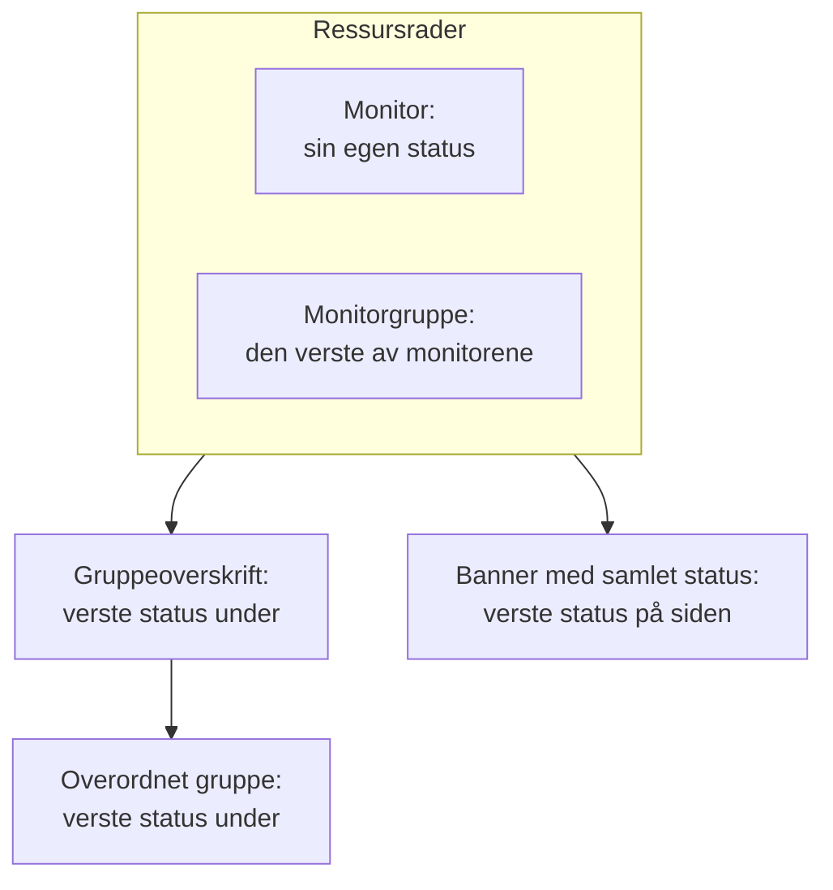

# Statusside – ressurser og grupper

En ressurs er én rad på statussiden din: en monitor eller en monitorgruppe, med et navn kundene dine forstår, gjeldende status og, hvis du vil, oppetid og historikk. Grupper er seksjoner som inneholder ressurser, slik at en side med førti monitorer leses som «API», «Webapp» og «Datapipeline» i stedet for én endeløs liste. Du bygger begge på én skjerm: åpne en statusside og velg **Ressurser** i sidemenyen.

:::cards
- [Legg til en monitor](#legg-til-en-monitor): Sett en monitor på siden, med navnet besøkende leser.
- [Grupper](#grupper): Del siden opp i seksjoner, og nøst dem.
- [Monitorregler](#legg-til-monitorer-automatisk-med-monitorregler): La en regel legge til alle samsvarende monitorer for deg.
- [Importer grupper fra CSV](#import-av-grupper-fra-csv): Bygg et dypt hierarki på én gang.
:::

Besøkende avgjør ut fra disse radene om «det er meg eller dem», så gi dem navnene kundene bruker om produktet ditt: **Checkout API**, ikke `prod-checkout-lb-healthcheck-us-east-1`.

## Slik beveger en status seg opp siden

Hver rad viser gjeldende status for monitoren sin. Hvert nivå over den viser den verste statusen for alt under, der den verste statusen er den med høyest prioritet blant monitorstatusene i prosjektet ditt.

En ressurs avgjør mer enn fargen på raden sin:

- **Arkiverte monitorer vises ikke.** En arkivert monitor sjekkes ikke lenger, så den siste statusen er frosset; siden utelater raden (og utelater den fra statusen til en monitorgruppe) i stedet for å vise den frosne statusen som om den var gjeldende. Raden beholdes, så når monitoren tas ut av arkivet, kommer den rett tilbake.
- **Ressurser avgjør hvilke hendelser siden viser.** En hendelse vises her, og sidens abonnenter får høre om den, når en av hendelsens monitorer er en ressurs på siden, direkte eller via en monitorgruppe. Sett den samme monitoren på flere sider, og hendelsene når alle, med mindre en hendelse er begrenset til noen av de sidene. Se [Én statusside per målgruppe](/docs/status-pages/one-status-page-per-audience).
- **En rad for en monitorgruppe står for alle monitorene i den, også for abonnenter.** På en side som lar abonnenter velge ressurser, får den som abonnerer på en monitorgruppe, høre om hendelser, planlagt vedlikehold og kunngjøringer for alle monitorer i gruppen, som om vedkommende hadde valgt den monitoren. Se [Abonnenter og kunngjøringer](/docs/status-pages/subscribers#la-abonnentene-velge-ressurser-og-hendelsestyper).

## Skjermen Ressurser

Elementet heter **Ressurser** i prosjekter der monitorgrupper er slått på, og **Monitorer** i de andre; det er den samme skjermen. Grupper hadde tidligere en egen side, og den gamle adressen `/groups` åpner nå denne skjermen.

Skjermen er delt i to:

| Del | Hva den inneholder |
| ---- | ------------- |
| **Gruppenavigator** (til venstre) | Alle gruppene på siden som et tre, med feltet **Search groups...** over og en telling under, som `3 groups · 12 resources`. En lang liste slutter med knappen **Show N more of M**. |
| **Top of page** | Navigatorens første rad: ressurser uten gruppe, som besøkende ser først, over alle grupper. På en side uten grupper heter det høyre panelet i stedet **All resources**. |
| **Ressurspanel** (til høyre) | Ressursene i den valgte gruppen. Overskriften inneholder **Edit Group**, hovedknappen **Legg til monitor** og menyen **More actions**. |
| Kortets overskrift | **New Group** og en meny med tre prikker med **Import groups from CSV** og **Oppdater**. |

**Tomme tilstander forteller deg hva du skal gjøre.** En tom gruppe viser **No monitors here yet** med **Legg til monitor**, **Add Multiple** og, bare så lenge siden ikke har noen grupper, **Create a Group**. Et søk uten treff viser **No resources match your search**.

## Legg til en monitor

:::steps
### Velg hvor raden skal stå

Velg i gruppenavigatoren gruppen ressursen hører til i, eller **Top of page** for en rad uten gruppe.

### Klikk på Legg til monitor

Dialogen **Add a monitor to {group}** åpnes. Den består av én side.

### Velg monitoren

Velg den i **Overvåking** (plassholder **Velg overvåking**). **Visningsnavn**, teksten besøkende leser, fylles ut med monitorens navn og følger med når du velger en annen monitor, til du skriver et eget navn. Det lagres atskilt fra monitorens eget navn, så å endre det her endrer ingenting i overvåkingen.

### Angi visningsalternativene, hvis du vil

**Flere felt** er slått sammen. Det inneholder **Beskrivelse** (valgfri markdown vist under raden, fin for en setning som forklarer hva tjenesten faktisk gjør; et bilde i den vises til alle besøkende) og [visningsalternativene](#visningsalternativer-for-en-ressurs). La det være lukket, så får ressursen standardverdiene deres.

### Lagre ressursen

Klikk på **Legg til monitor**. Raden vises i gruppen og på statussiden.
:::

I en rutenettgruppe ber dialogen også om raden og kolonnen monitoren skal stå i, over **Flere felt**; se [Listeoppsett eller rutenettoppsett](#listeoppsett-eller-rutenettoppsett).

> [!TIP]
> For å vise flere sjekker som én rad legger du til en monitorgruppe. Med bryteren **Monitorgrupper** slått på (**Prosjektinnstillinger** > **Avansert** > **Funksjonsflagg**, som lagres så snart du slår den om) står det en lenke under nedtrekkslisten: **Add a Monitor Group instead.** Klikk på den, så blir **Overvåking** til **Monitor Gruppe** (**Velg overvåkingsgruppe**); **Add a Monitor instead.** bytter tilbake.

### Legg til flere på én gang

**Add Multiple** (også **Add multiple monitors** i menyen **More actions**) åpner **Add Multiple Monitors**. Den er også én side: en flervalgsliste **Monitorer**, deretter de samme sammenslåtte **Flere felt**, der visningsalternativene gjelder for hver monitor du velger. Hver ressurs får visningsnavn og beskrivelse fra monitoren sin, og **Add Monitors** legger til alle. Det er den raskeste måten å fylle en ny side på.

Flervalgslisten har fanen **Etiketter**: klikk på en etikett, så velges alle monitorer med den på én gang.

### Det er trygt å legge til etter etikett to ganger

En statusside viser en monitor én gang. Tillegg er idempotent, så når du velger den samme etiketten igjen etter å ha gitt noen nye monitorer den, legges bare de nye til: monitorene som allerede er på siden, forblir nøyaktig som de er, med visningsnavnet og alternativene du ga dem.

Sammendraget etter tillegget av flere sier det samme: monitorer som ble lagt til, står under **Lagt til**, og de som allerede var der, under **Already Added**. Ingenting rapporteres som en feil, og ingenting skrives for dem.

Den samme regelen gjelder overalt ellers der en ressurs opprettes. Å legge til en monitor som allerede er på siden, fra skjemaet for én monitor, eller å la en eksisterende ressurs peke på den fra redigeringsskjemaet, avvises med *"This monitor is already added to this status page"*, også når den eksisterende ressursen står i en annen gruppe, for en besøkende ville fortsatt sett monitoren to ganger. For å vise en monitor i en annen gruppe sletter du ressursen den allerede har, og legger den til der du vil ha den.

## Visningsalternativer for en ressurs

Seksjonen **Flere felt** er den samme i skjemaet for én monitor og i dialogen for flere. Den starter sammenslått i begge, og også i **Rediger ressurs**, der den sammenslåtte overskriften viser hva i den som ikke står på standardverdien. Alt her gjelder per ressurs: to rader i samme gruppe kan være satt opp ulikt.

| Felt | Standard | Hva det gjør |
| ----- | ------- | ------------ |
| **Verktøytips** (`displayTooltip`) | Tom | Vises som verktøytips ved siden av ressursen på statussiden din. Bruk det for omfanget: «Kunder i USA og EU». |
| **Vis gjeldende ressursstatus** (`showCurrentStatus`) | På | Viser gjeldende status, som i drift, redusert eller frakoblet, ved siden av raden. |
| **Vis oppetid %** (`showUptimePercent`) | Av | Viser en oppetidsprosent ved siden av ressursen. |
| **Velg presisjon for oppetid** (`uptimePercentPrecision`) | Én desimal | Vises når **Vis oppetid %** er slått på, og er da påkrevd. |
| **Vis statushistorikkdiagram** (`showStatusHistoryChart`) | På | Viser ressursens daglige søyler med oppetidshistorikk. |

**Visningsnavn** (`displayName`) og **Beskrivelse** (`displayDescription`) er også bare for visning: de endrer aldri selve monitoren.

## Oppetidsprosenter og historikkdiagrammer

**Vis oppetid %** og **Vis statushistorikkdiagram** leser begge én innstilling for hele siden: hvor mange dager de dekker. Det er **Oppetidshistorikk** på kortet **Hva statussiden din viser** under **Statussider → siden din → Avansert → Avanserte innstillinger**. Den godtar 1 til 90 dager og er 90 som standard. Slå altså på bryterne per ressurs, og angi vinduet én gang for hele siden.

**Presisjon er et skjønnsspørsmål.** **Velg presisjon for oppetid** tilbyr `99% (No Decimal)`, `99.9% (One Decimal)`, `99.99% (Two Decimal)` og `99.999% (Three Decimal)`. Flere desimaler ser presise ut og inviterer til diskusjoner om den tredje; publiserer du en SLA på tre niere, så samsvar med den og ikke mer.

Grupper har sine egne utgaver av disse bryterne (se nedenfor), så en gruppe kan vise en samlet prosent mens monitorene i den holder seg stille, eller omvendt.

Fargene på historikkdiagrammets søyler angis under **Flere innstillinger** på siden **Merkevare**, og hvilke monitorstatuser som teller som «nede» under **Teller som nedetid** på kortet **Hva statussiden din viser** under **Avanserte innstillinger**; begge deler er beskrevet i [Statusside – merkevare og domener](/docs/status-pages/branding-and-domains).

## Grupper

De fleste grupper trenger bare et navn.

:::steps
### Klikk på New Group

**Create New Status Page Group** åpnes: to felt og deretter to sammenslåtte seksjoner.

### Gi gruppen et navn

Skriv **Gruppenavn**: seksjonsoverskriften besøkende ser.

### Nøst den, hvis den hører til i en annen gruppe

Velg en **Parent Group**, eller la den stå på **No parent group (top level)**. **Add a sub group** i en gruppes menyer fyller ut dette for deg.

### Opprett gruppen

Klikk på **Create Status Page Group**. Gruppen vises i navigatoren, klar for monitorer.
:::

De to feltene er **Gruppenavn** (`name`) og **Parent Group** (`parentStatusPageGroupId`). De to sammenslåtte seksjonene inneholder resten:

- **Oppsett**: den sammenslåtte overskriften sier **List** eller **Grid**. Den inneholder **Visningsmodus** og aksene til et rutenett (se [Listeoppsett eller rutenettoppsett](#listeoppsett-eller-rutenettoppsett)), og den åpner seg selv på en rutenettgruppe.
- **Flere felt**: gruppenivåets utgaver av ressursalternativene:
  - **Gruppebeskrivelse** (`description`): valgfri markdown, vist under overskriften. Et bilde i den vises til alle besøkende.
  - **Utvid på statusside som standard** (`isExpandedByDefault`): på som standard; avgjør om seksjonen starter åpen eller sammenslått for besøkende.
  - **Vis gjeldende gruppestatus** (`showCurrentStatus`): på som standard. Viser en status ved siden av gruppeoverskriften.
  - **Vis oppetid %** (`showUptimePercent`): av som standard, med **Velg presisjon for oppetid** når den er slått på.

For å endre en gruppe bruker du **Edit Group** i panelets overskrift, eller **Edit group** i navigatorens radmeny: **Edit Status Page Group** åpnes med knappen **Lagre endringer**. Panelets overskrift viser merker for innstillingene som er slått på (**Grid**, **Collapsed by default**, **Uptime %**), så du ser hvordan en gruppe er satt opp uten å åpne skjemaet.

### Administrer en gruppe

| Hvor | Handlinger |
| ----- | ------- |
| Navigatorens radmeny | **Edit group**, **Move up**, **Move down**, **Vis ID**, **Delete group** |
| Panelets meny **More actions** | **Edit this group**, **Add a sub group**, **Move group up**, **Move group down**, **Show group ID**, **Oppdater**, **Delete this group** |

En gruppe som er lagret uten navn, vises som **Untitled group**, et godt tegn på at du mente å skrive noe.

## Nøsting av grupper

Grupper kan nøstes: angi **Parent Group** på undergruppen, eller bruk **Add a sub group inside this group** i navigatoren. Skjemaets hjelpetekst beskriver formen det er laget for (noe i retning av Forretningsenheter › Region › Marked), og hvert nivå viser samlet status og oppetid for alt under.

Når en gruppe har undergrupper, viser ressurspanelet en rad med merker **Sub groups** som lenker rett til hver undergruppe, så du kan gå gjennom hierarkiet uten å gå tilbake til navigatoren.

Nøsting lønner seg på store sider: en vertsleverandør med regioner inne i produkter, eller en forhandler med markeder inne i forretningsenheter. På en side med tolv monitorer er ett flatt nivå vennligere.

## Listeoppsett eller rutenettoppsett

Seksjonen **Oppsett** i gruppeskjemaet angir gruppens **Visningsmodus** (`viewMode`), som endrer hvordan gruppen vises på statussiden.

| Hvis du vil… | Velg |
| --------------- | ---- |
| Vise en enkel loddrett liste over tjenester, én per rad | **List** (standard) |
| Vise den samme tjenesten i flere regioner eller leietakere som en matrise | **Grid** |

Velg **Grid**, så vises fire felt til:

| Felt | Hva du skal skrive inn |
| ----- | ------------- |
| **Etikett for radakse** | Navnet på raddimensjonen, plassholder `Service`. |
| **Verdier for radakse** | Radene, lagt til én om gangen med **Add Row** (plassholder `e.g. Auth`). |
| **Kolonneakseetikett** | Kolonnedimensjonen, plassholder `Region`. |
| **Kolonneakseverdier** | Kolonnene, lagt til med **Add Column** (plassholder `e.g. US-East`). |

Hver monitor i en rutenettgruppe står i en celle, så **Legg til monitor** og dialogen for flere ber om raden og kolonnen sammen med monitoren, med dine egne akseetiketter.

> [!IMPORTANT]
> Sett opp aksene før du legger til monitorer. En rutenettgruppe uten rader eller kolonner viser en melding om at det ennå ikke finnes noe sted å sette en monitor, med knappen **Set up the grid** som åpner gruppens skjema på seksjonen **Oppsett**, og gruppens knapp **Legg til monitor** er borte til du har gjort det.

## Rekkefølgen på det besøkende ser

Rekkefølgen bestemmer du selv, ikke alfabetet:

| Hva | Slik endrer du rekkefølgen |
| ---- | ----------------- |
| Ressurser i en gruppe | Dra en rad. Panelet sier det: **Drag a row to change the order visitors see**. |
| Grupper i forhold til hverandre | **Move up** / **Move down** i navigatorens radmeny, eller **Move group up** / **Move group down** i **More actions**. |
| Ressurser uten gruppe | De står i **Top of page** og vises alltid over alle grupper, så legg det alle sjekker først, der. |

**To tilfeller der dra er slått av.** Et søk i feltet **Search in {group}...** slår av omorganisering (panelet sier `N of M shown · drag to reorder is off while filtering`), så tøm søket først. Og rutenettgrupper omorganiseres aldri ved å dra, fordi plassen til en monitor kommer fra raden og kolonnen.

Legg tjenesten folk spør mest om, øverst. Besøkende som kommer til siden under et avbrudd, slutter som regel å lese etter første skjermbilde.

## Legg til monitorer automatisk med monitorregler

En monitorregel legger til monitorer på siden for deg: beskriv monitorene én gang, så havner hver monitor som samsvarer, i gruppen du valgte. Regler finnes under **Ressurser → Monitor Rules**, ved siden av skjermen Ressurser.

:::steps
### Åpne Monitor Rules

Åpne statussiden, velg **Monitor Rules** i seksjonen **Ressurser** i sidemenyen, og klikk på **Opprett Status Page Monitor Rule**.

### Gi regelen et navn

Skriv inn et **Navn** under **Grunnleggende informasjon**. **Aktivert** er slått på som standard.

### Angi hvilke monitorer den samsvarer med

Under **Treffkriterier** fyller du ut minst ett av **Overvåkingsetiketter** (en monitor med en hvilken som helst av dem samsvarer), **Overvåkingsnavn** og **Overvåkingsbeskrivelse**. En monitor må oppfylle hvert kriterium du fyller ut. De to mønstrene godtar et regulært uttrykk uten forskjell på store og små bokstaver (`^api-.*`) eller et jokertegn `*` (`*checkout*`); `.*` samsvarer med alle monitorer.

### Velg gruppen

Under **Gruppe** velger du **Add Monitors To Group**, eller du lar det stå tomt for å legge til monitorene uten gruppe. Deretter følger de samme visningsalternativene som for en ressurs; på en regel starter **Vis oppetid %** slått på.

### Lagre regelen

Regelen kjøres med en gang mot alle monitorer som allerede finnes, og listen viser under **Adds Monitors To** gruppen den legger til monitorer i.
:::

Etter det kjøres en regel på nytt for en monitor hver gang en opprettes, eller når etikettene, navnet eller beskrivelsen endres. En regel fjerner bare ressursene den selv har lagt til: å slå den av eller slette den fjerner dem fra siden, og en monitor du har lagt til for hånd, røres aldri. En monitor som allerede er på siden, legges aldri til to ganger.

## Import av grupper fra CSV

Det er tungvint å bygge et dypt hierarki for hånd. **Import groups from CSV** i kortoverskriftens meny med tre prikker åpner dialogen **Import Groups from CSV**.

:::steps
### Last ned malen

Klikk på **Download CSV Template** for å hente `status-page-groups-template.csv`.

### Fyll den ut

Én rad per gruppe. Bare `name` er påkrevd; kolonnene står nedenfor.

### Last opp og forhåndsvis

Klikk på **Choose CSV File**, velg filen din, og deretter **Preview Import** for å sjekke hva som blir opprettet før noe skrives.

### Importer

Kjør importen. Tabellen **Import results** viser hver rad som **Opprettet**, **Mislyktes** eller **Hoppet over**, med årsaken, så en feil rad aldri forsvinner i stillhet.
:::

| Kolonne | Hva den angir |
| ------ | ------------ |
| `name` | Gruppens navn. Påkrevd. |
| `parentName` | Navnet på gruppen denne er nøstet i. |
| `description` | Gruppens beskrivelse. |
| `isExpandedByDefault` | Om seksjonen starter åpen for besøkende. |
| `showCurrentStatus` | Om en status vises ved siden av gruppeoverskriften. |
| `showUptimePercent` | Om en oppetidsprosent vises ved siden av gruppen. |
| `uptimePercentPrecision` | Hvor mange desimaler prosenten bruker. |
| `viewMode` | `List` eller `Grid`. |
| `rowAxisLabel` | Navnet på raddimensjonen, for en rutenettgruppe. |
| `rowAxisValues` | Radverdiene, for en rutenettgruppe. |
| `columnAxisLabel` | Navnet på kolonnedimensjonen, for en rutenettgruppe. |
| `columnAxisValues` | Kolonneverdiene, for en rutenettgruppe. |

Importen oppretter grupper, ikke ressurser: legg til monitorer etterpå med **Legg til monitor**, **Add Multiple** eller en monitorregel.

## Feilsøking

:::details "This monitor is already added to this status page"
En side viser hver monitor én gang, også på tvers av grupper. Monitoren har allerede en ressurs, kanskje i en annen gruppe eller lagt til av en monitorregel. Søk etter den i navigatoren, slett den ressursen, og legg til monitoren der du vil ha den.
:::

:::details En monitor jeg la til, vises ikke på statussiden
Sjekk om monitoren er arkivert: raden til en arkivert monitor utelates til du tar den ut av arkivet. Sjekk også gruppen: en gruppe som er satt til å starte sammenslått (**Utvid på statusside som standard** slått av), skjuler radene sine til en besøkende åpner den.
:::

:::details Det finnes ingen knapp Legg til monitor i en rutenettgruppe
Rutenettet har ennå ingen rader eller kolonner. Klikk på **Set up the grid**, legg til akseverdiene i seksjonen **Oppsett**, så kommer **Legg til monitor** tilbake.
:::

:::details Jeg kan ikke dra rader
Tøm feltet **Search in {group}...**: omorganisering er slått av mens panelet er filtrert. Rutenettgrupper omorganiseres aldri ved å dra.
:::

## Neste steg

:::cards
- [Statusside – merkevare og domener](/docs/status-pages/branding-and-domains): Logo, favicon, historikkdiagrammets farger og ditt eget domene.
- [Abonnenter og kunngjøringer](/docs/status-pages/subscribers): Hvem som får beskjed når disse ressursene endrer seg.
- [Én statusside per målgruppe](/docs/status-pages/one-status-page-per-audience): Den samme monitoren på mange sider, og en hendelse som bare når noen av dem.
- [Offentlig API](/docs/status-pages/public-api): Les ressurser, grupper og oppetid som JSON.
:::
