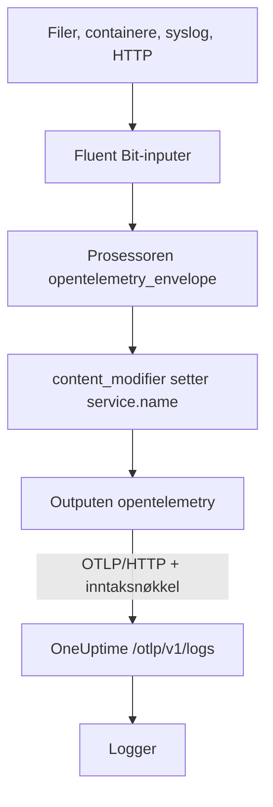

# Fluent Bit

[Fluent Bit](https://docs.fluentbit.io/manual) er en lett agent som samler logger fra filer, systemd, containere, syslog, HTTP og mange andre kilder. [OpenTelemetry-outputen](https://docs.fluentbit.io/manual/pipeline/outputs/opentelemetry) sender det den samler, til OpenTelemetry-endepunktet (OTLP) i OneUptime, der loggene blir søkbare under **Produkter → Logger**.

:::cards
- [Konfigurer Fluent Bit](#konfigurer-fluent-bit): Legg til OpenTelemetry-outputen, og gi tjenesten din et navn.
- [Fullstendig eksempel](#fullstendig-eksempel): En hel konfigurasjonsfil å starte fra.
- [Selvhostet OneUptime](#selvhostet-oneuptime): Pek Fluent Bit mot din egen instans.
:::

## Slik fungerer det



Fluent Bit pakker hver post inn i en OpenTelemetry-konvolutt, slik at den kan bære ressursattributter som `service.name`. OpenTelemetry-outputen sender så postene til OneUptime med inntaksnøkkelen din i headeren `x-oneuptime-token`. OneUptime lagrer dem under tjenesten som `service.name` angir, og oppretter den tjenesten første gang den sender.

## Før du begynner

- **Installer Fluent Bit** – se [installasjonsveiledningen](https://docs.fluentbit.io/manual/installation/getting-started-with-fluent-bit). Konfigurasjonen på denne siden bruker YAML-formatet til Fluent Bit og prosessoren `opentelemetry_envelope`, så bruk en oppdatert versjon.
- **Et OneUptime-prosjekt.** I OneUptime Cloud faktureres telemetri per inntatt GB – se [priser](https://oneuptime.com/pricing) – og et prosjekt på Free-planen trenger en betalingsmetode før det kan sende telemetri.
- **En inntaksnøkkel for telemetri.** Hvis du ikke har en:

:::steps
### Åpne inntaksnøklene

Gå til **Produkter → Prosjektinnstillinger**, åpne **Telemetri og APM** i sidemenyen, og velg **Inntaksnøkler**.


### Opprett en nøkkel

Klikk på **Opprett ingestion-nøkkel**. Dialogen har allerede fylt inn navnet på nøkkelen og valgt **Server** – den typen nøkkel en applikasjon eller en collector sender med – så klikk på **Opprett ingestion-nøkkel** for å opprette den, eller gi den nytt navn først.

### Kopier hemmeligheten

Den nye nøkkelen åpnes på sin egen side. Kopier **Hemmelig nøkkel**: Det er `YOUR_TELEMETRY_INGESTION_TOKEN` i konfigurasjonen nedenfor.


:::

## Konfigurer Fluent Bit

Fluent Bit leser YAML-konfigurasjonen sin fra en fil som `/etc/fluent-bit/fluent-bit.yaml`.

:::steps
### Legg til OpenTelemetry-outputen

Legg til en `opentelemetry`-output som sender til OneUptime. Behold `stdout`-outputen mens du tester, hvis du vil se postene lokalt:

```yaml title="fluent-bit.yaml"
pipeline:
  outputs:
    - name: stdout
      match: "*"
    - name: opentelemetry
      match: "*"
      host: "oneuptime.com"
      port: 443
      metrics_uri: "/otlp/v1/metrics"
      logs_uri: "/otlp/v1/logs"
      traces_uri: "/otlp/v1/traces"
      tls: On
      header:
        - x-oneuptime-token YOUR_TELEMETRY_INGESTION_TOKEN
```

### Pakk loggene inn i en OpenTelemetry-konvolutt, og gi tjenesten et navn

Legg prosessoren `opentelemetry_envelope` til hver input, etterfulgt av en `content_modifier` som setter `service.name`. Erstatt `YOUR_SERVICE_NAME` med navnet loggene skal vises under i OneUptime:

```yaml title="fluent-bit.yaml"
pipeline:
  inputs:
    - name: tail # or any other input
      path: /var/log/my-app/*.log

      processors:
        logs:
          - name: opentelemetry_envelope

          - name: content_modifier
            context: otel_resource_attributes
            action: upsert
            key: service.name
            value: YOUR_SERVICE_NAME
```

### Start Fluent Bit på nytt

Start Fluent Bit-tjenesten på nytt, eller start den med `fluent-bit -c /etc/fluent-bit/fluent-bit.yaml`. Etter noen sekunder vises loggene under **Produkter → Logger**, og tjenesten står under **Produkter → Tjenester**.
:::

## Fullstendig eksempel

Denne konfigurasjonen tar imot logger over HTTP på port `8888` og sender dem videre til OneUptime:

```yaml title="fluent-bit.yaml"
service:
  flush: 1
  log_level: info

pipeline:
  inputs:
    - name: http
      listen: 0.0.0.0
      port: 8888

      processors:
        logs:
          - name: opentelemetry_envelope

          - name: content_modifier
            context: otel_resource_attributes
            action: upsert
            key: service.name
            value: YOUR_SERVICE_NAME

  outputs:
    - name: stdout
      match: "*"
    - name: opentelemetry
      match: "*"
      host: "oneuptime.com"
      port: 443
      metrics_uri: "/otlp/v1/metrics"
      logs_uri: "/otlp/v1/logs"
      traces_uri: "/otlp/v1/traces"
      tls: On
      header:
        - x-oneuptime-token YOUR_TELEMETRY_INGESTION_TOKEN
```

Erstatt `http`-inputen med inputene du trenger – for eksempel `tail` for loggfiler eller `systemd` for journalen – og behold de to prosessorene på hver av dem.

## Selvhostet OneUptime

Sett `host` til verten for OneUptime-instansen din. Hvis den betjenes over vanlig HTTP i stedet for HTTPS, setter du også `port` til porten den lytter på (vanligvis `80`) og fjerner `tls`:

```yaml title="fluent-bit.yaml"
pipeline:
  outputs:
    - name: stdout
      match: "*"
    - name: opentelemetry
      match: "*"
      host: "your-oneuptime-instance.com"
      port: 80
      metrics_uri: "/otlp/v1/metrics"
      logs_uri: "/otlp/v1/logs"
      traces_uri: "/otlp/v1/traces"
      header:
        - x-oneuptime-token YOUR_TELEMETRY_INGESTION_TOKEN
```

## Feilsøking

:::details Fluent Bit logger `401` fra OpenTelemetry-outputen
Inntaksnøkkelen mangler, er ukjent eller utløpt. Sjekk `header`-linjen: Den er `x-oneuptime-token`, et mellomrom og så nøkkelens **Hemmelig nøkkel**.
:::

:::details Fluent Bit logger `402` eller `422`
`402`: I OneUptime Cloud er prosjektet på Free-planen og har ingen betalingsmetode. Legg til en under **Prosjektinnstillinger → Fakturering og fakturaer → Fakturering**. `422`: Nøkkelen er deaktivert, eller det er en nettlesernøkkel. Slå **Aktivert** på igjen i nøkkelens innstillinger, eller opprett en **Server**-nøkkel.
:::

:::details Loggene kommer under en uventet tjeneste
Tjenesten kommer fra `service.name`. Sjekk at hver input har prosessoren `opentelemetry_envelope` etterfulgt av `content_modifier` som setter den.
:::

:::details Ingenting kommer frem, og Fluent Bit logger tilkoblingsfeil
Sjekk at `tls: On` og `port: 443` er satt for et HTTPS-endepunkt, og at verten som kjører Fluent Bit, når OneUptime-verten din på den porten.
:::

Har du spørsmål eller trenger hjelp med konfigurasjonen, kan du skrive til oss på support@oneuptime.com.

## Neste steg

:::cards
- [Loggpipelines](/docs/telemetry/log-pipelines): Tolk og berik loggene Fluent Bit sender.
- [Søkesyntaks](/docs/telemetry/search-syntax): Finn loggene i loggutforskeren.
- [OpenTelemetry](/docs/telemetry/open-telemetry): Endepunkter, nøkler og grenser for all telemetri.
- [Fluentd](/docs/telemetry/fluentd): Bruk Fluentd i stedet.
:::
