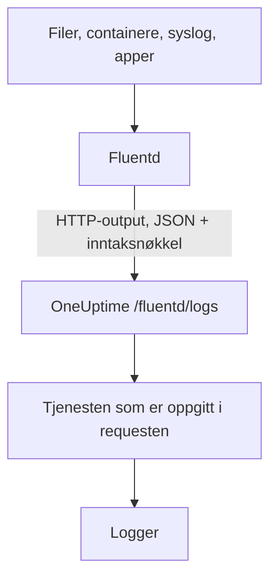

# Fluentd

[Fluentd](https://www.fluentd.org/) samler logger fra filer, containere, syslog, applikasjoner og [mange andre kilder](https://www.fluentd.org/datasources). Den innebygde [HTTP-outputen](https://docs.fluentd.org/output/http) sender dem til Fluentd-endepunktet i OneUptime, der de blir søkbare under **Produkter → Logger**.

:::cards
- [Konfigurer Fluentd](#konfigurer-fluentd): Legg til en HTTP-output som peker mot OneUptime.
- [Slik leses postene](#slik-leses-postene): Hvilke felt som blir meldingen, alvorlighetsgraden og attributter.
- [Selvhostet OneUptime](#selvhostet-oneuptime): Pek Fluentd mot din egen instans.
:::

## Slik fungerer det



Fluentd sender poster i bunker som JSON, med inntaksnøkkelen din i headeren `x-oneuptime-token` og tjenestenavnet i `x-oneuptime-service-name`. OneUptime gjør hver post til en logg for den tjenesten, og oppretter tjenesten første gang den sender.

## Før du begynner

- **Installer Fluentd** – se [installasjonsveiledningen](https://docs.fluentd.org/installation).
- **Et OneUptime-prosjekt.** I OneUptime Cloud faktureres telemetri per inntatt GB – se [priser](https://oneuptime.com/pricing) – og et prosjekt på Free-planen trenger en betalingsmetode før det kan sende telemetri.
- **En inntaksnøkkel for telemetri.** Hvis du ikke har en:

:::steps
### Åpne inntaksnøklene

Gå til **Produkter → Prosjektinnstillinger**, åpne **Telemetri og APM** i sidemenyen, og velg **Inntaksnøkler**.


### Opprett en nøkkel

Klikk på **Opprett ingestion-nøkkel**. Dialogen har allerede fylt inn navnet på nøkkelen og valgt **Server** – den typen nøkkel en applikasjon eller en collector sender med – så klikk på **Opprett ingestion-nøkkel** for å opprette den, eller gi den nytt navn først.

### Kopier hemmeligheten

Den nye nøkkelen åpnes på sin egen side. Kopier **Hemmelig nøkkel**: Det er `YOUR_SERVICE_TOKEN` i konfigurasjonen nedenfor.


:::

## Konfigurer Fluentd

Konfigurasjonsfilen til Fluentd er vanligvis `/etc/fluent/fluentd.conf`, eller `/etc/td-agent/td-agent.conf` for den eldre td-agent-pakken.

:::steps
### Legg til en HTTP-output

Legg til en `<match>`-seksjon som sender poster til OneUptime. Erstatt `YOUR_SERVICE_TOKEN` med inntaksnøkkelen din og `YOUR_SERVICE_NAME` med navnet loggene skal vises under – hvilket navn du vil:

```text title="fluentd.conf"
# Match all patterns
<match **>
  @type http

  endpoint https://oneuptime.com/fluentd/logs
  open_timeout 2

  headers {"x-oneuptime-token":"YOUR_SERVICE_TOKEN", "x-oneuptime-service-name":"YOUR_SERVICE_NAME"}

  content_type application/json
  json_array true

  <format>
    @type json
  </format>
  <buffer>
    flush_interval 10s
  </buffer>
</match>
```

`json_array true` sender hver tømming av bufferen som én JSON-matrise, og `flush_interval 10s` sender en bunke hvert 10. sekund.

### Start Fluentd på nytt

Start Fluentd-tjenesten på nytt, slik at den laster den nye outputen.

### Sjekk at loggene kommer frem

Noen sekunder etter neste tømming vises loggene under **Produkter → Logger**. Tjenesten står under **Produkter → Tjenester** – fantes den ikke fra før, oppretter OneUptime den.
:::

## Fullstendig eksempel

Denne konfigurasjonen tar imot poster over forward-protokollen til Fluentd på port `24224` og sender alle til OneUptime:

```text title="fluentd.conf"
####
## Source descriptions:
##

## built-in TCP input
## @see https://docs.fluentd.org/input/forward
<source>
  @type forward
  port 24224
  bind 0.0.0.0
</source>

<match **>
  @type http

  endpoint https://oneuptime.com/fluentd/logs
  open_timeout 2

  headers {"x-oneuptime-token":"YOUR_SERVICE_TOKEN", "x-oneuptime-service-name":"YOUR_SERVICE_NAME"}

  content_type application/json
  json_array true

  <format>
    @type json
  </format>
  <buffer>
    flush_interval 10s
  </buffer>
</match>
```

For å sende ulike kilder som ulike tjenester bruker du én `<match>`-seksjon per tag, hver med sin egen `x-oneuptime-service-name`.

## Slik leses postene

OneUptime leser disse feltene fra hver post:

| Loggfelt | Leses fra postens første tilstedeværende felt av | Merknader |
| --- | --- | --- |
| Innhold | `message`, `log`, `msg`, `body`, `text` | Logglinjen. En post uten noen av dem lagres i sin helhet, som JSON. |
| Alvorlighetsgrad | `level`, `severity`, `loglevel`, `log_level`, `priority`, `severityText`, `severity_text` | Navn som `trace`, `debug`, `info`, `notice`, `warn`, `error`, `critical` og `fatal`, med store eller små bokstaver. Alle andre verdier lagres som `Unspecified`. |
| Trace-ID | `trace_id`, `traceId`, `traceid` | Kobler loggen til sitt trace. |
| Span-ID | `span_id`, `spanId`, `spanid` | Kobler loggen til sitt span. |
| Tjeneste | headeren `x-oneuptime-service-name` | `Fluentd` når headeren ikke er satt. |
| Tid | — | Tidspunktet OneUptime mottar posten. |

Alle andre felt blir en attributt med navnet `fluentd.` etterfulgt av feltnavnet, som du kan søke og filtrere på: Et felt `container_name` er `@fluentd.container_name` i loggutforskeren. Et nestet objekt flates ut med punktum, som `fluentd.kubernetes.pod_name`, og en liste lagres som JSON.

Fluentd-logger går gjennom [loggpipelinene](/docs/telemetry/log-pipelines), drop-filtrene og maskeringsreglene dine som alle andre logger.

## Selvhostet OneUptime

Erstatt `https://oneuptime.com` i `endpoint` med URL-en til OneUptime-instansen din: `http(s)://YOUR_ONEUPTIME_HOST/fluentd/logs`.

## Feilsøking

:::details Fluentd logger `401` fra HTTP-outputen
Inntaksnøkkelen mangler, er ukjent eller utløpt. Sjekk verdien av `x-oneuptime-token` i `headers`.
:::

:::details Fluentd logger `402` eller `422`
`402`: I OneUptime Cloud er prosjektet på Free-planen og har ingen betalingsmetode. Legg til en under **Prosjektinnstillinger → Fakturering og fakturaer → Fakturering**. `422`: Nøkkelen er deaktivert, eller det er en nettlesernøkkel. Slå **Aktivert** på igjen i nøkkelens innstillinger, eller opprett en **Server**-nøkkel.
:::

:::details Loggene kommer under tjenesten `Fluentd`
Headeren `x-oneuptime-service-name` mangler. Legg den til i `headers` i hver `<match>`-seksjon.
:::

:::details Logginnholdet viser hele posten som JSON
OneUptime henter innholdet fra det første tilstedeværende feltet av `message`, `log`, `msg`, `body` eller `text`, og lagrer hele posten når den ikke har noen av dem. Gi feltet med logglinjen din nytt navn til ett av disse, for eksempel med filteret `record_transformer` i Fluentd.
:::

Har du spørsmål eller trenger hjelp med konfigurasjonen, kan du skrive til oss på support@oneuptime.com.

## Neste steg

:::cards
- [Loggpipelines](/docs/telemetry/log-pipelines): Tolk og berik loggene Fluentd sender.
- [Søkesyntaks](/docs/telemetry/search-syntax): Finn loggene i loggutforskeren.
- [Fluent Bit](/docs/telemetry/fluentbit): En lettere agent som sender over OpenTelemetry.
- [Logg-overvåking](/docs/monitor/logs-monitor): Varsle når samsvarende logger dukker opp.
:::
