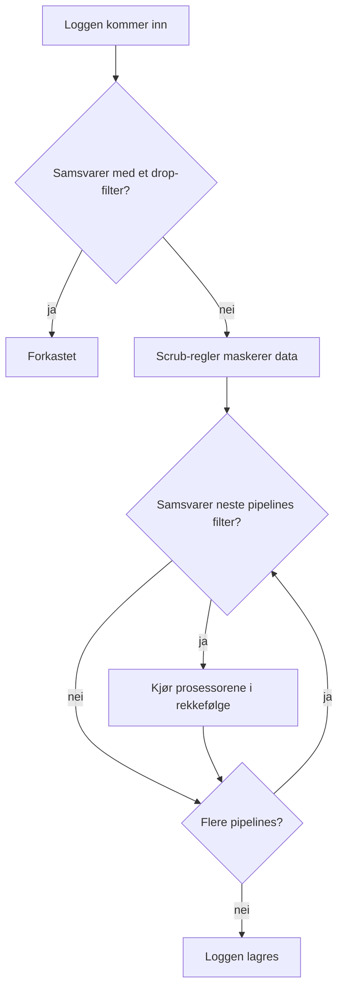

# Loggpipelines

Loggpipelines endrer logger mens OneUptime tar dem inn, før de lagres. En pipeline har et **filter** som avgjør hvilke logger den gjelder for, og en ordnet liste med **prosessorer** som hver endrer de loggene: trekker felt ut av meldingen, retter alvorlighetsgraden, gir et attributt nytt navn eller merker loggen med en kategori.

Pipelines finner du under **Logger → Innstillinger → Pipelines**.

:::cards
- [Slik kjører en pipeline](#slik-kjører-en-pipeline): Hvor pipelines sitter i inntaket, og i hvilken rekkefølge de kjører.
- [Opprette en pipeline](#opprette-en-pipeline): Velge noen logger og legge til prosessorer for dem.
- [Key=Value Parser](#keyvalue-parser): Gjøre brannmur- og logfmt-linjer om til attributter.
- [Eksempel: Sophos XGS-brannmur](#eksempel-sophos-xgs-brannmur): Tolke brannmur-syslog fra start til slutt.
:::

## Slik kjører en pipeline

Pipelines kjører på hver logg OneUptime tar inn, enten det er OpenTelemetry-logger, syslog eller Fluentd, etter drop-filtre og scrub-regler og før loggen lagres:



- **Pipelines kjører i rekkefølge**: listens rekkefølge, som du endrer ved å dra radene. En pipeline berører bare loggene filteret samsvarer med, og alle pipelines med samsvarende filter kjører, ikke bare den første.
- **Prosessorer kjører også i rekkefølge**, og hver ser det den forrige produserte, så en parser må komme før en prosessor som leser feltene den trekker ut. Filteret til en senere pipeline ser også det tidligere pipelines har endret.
- **Behandlingen skjer ved inntak.** En endring i en pipeline påvirker logger som kommer inn etterpå, innen omtrent ett minutt; logger som allerede er lagret, behandles ikke på nytt.
- **En prosessor forkaster eller tømmer aldri en logg.** En linje som en parser ikke kan lese, går uendret gjennom. Bruk **Logger → Innstillinger → Drop-filtre** for å forkaste logger.
- **Bare aktiverte pipelines og prosessorer kjører.** Slå av en på siden dens for å sette den på pause uten å miste oppsettet.

## Prosessortyper

| Prosessor | Hva den gjør |
| --- | --- |
| Grok Parser | Trekker felt ut av en linje med fast form (en nginx-tilgangslinje) med et navngitt mønster. |
| Key=Value Parser | Deler en linje med `key=value`-par (Sophos XGS, Fortinet, logfmt) opp i attributter, i vilkårlig rekkefølge. |
| Alvorlighetsgrad-omkartlegger | Tilordner et rått nivå som `warn` fra et attributt til loggens standard alvorlighetsgrad. |
| Attributt-ommapper | Gir et attributt nytt navn eller kopierer det, for eksempel `src_ip` til `source_ip`. |
| Kategoriprosessor | Merker en logg med et kategorinavn når den samsvarer med et filter, for eksempel "Payment Error". |

## Før du begynner

- Logger som kommer inn i OneUptime, via [OpenTelemetry](/docs/telemetry/open-telemetry), [syslog](/docs/telemetry/syslog), [Fluentd](/docs/telemetry/fluentd) eller en probe.
- Tillatelse til å endre pipelines. Prosjekteiere og administratorer har den; alle andre trenger tillatelsene **Create Log Pipeline** og **Create Log Pipeline Processor**.

## Opprette en pipeline

:::steps
### Opprett pipelinen

Gå til **Logger → Innstillinger → Pipelines**, og klikk på **Opprett Logg Pipeline**. Gi den et **Navn**, for eksempel *Tolk brannmurlogger*, og opprett den. Pipelinens side åpnes.

### Velg hvilke logger den gjelder for

Klikk på **Rediger** under **Filterbetingelser**, og legg til betingelser på **Alvorlighetsgrad**, **Loggtekst**, **Tjeneste-ID** eller et egendefinert attributt. Knytt dem sammen med **Alle betingelser** eller **En av betingelsene**, og klikk deretter på **Lagre endringer**. En pipeline uten betingelser gjelder for alle logger.

### Legg til prosessorer

Klikk på **Legg til prosessor** under **Prosessorer**, skriv inn et **Prosessornavn**, velg en **Prosessortype**, og fyll ut innstillingene. Grok- og Key=Value-parserne har en tester: lim inn en eksempellinje for å se hva de ville trekke ut. Klikk på **Opprett prosessor**.

### Sett dem i rekkefølge

Dra prosessorer for å endre rekkefølgen de kjører i, og dra pipelines i listen **Pipelines** på samme måte. Nye logger behandles innen omtrent ett minutt.
:::

### Filterbetingelser

Hver betingelse sammenligner et felt med en verdi. Bak byggeren er filteret en spørring som `severityText = 'Error' AND body LIKE 'timeout'`, som **Preview query** viser.

| Operator | I spørringen | Merknader |
| --- | --- | --- |
| er lik | `=` | Nøyaktig og skiller mellom store og små bokstaver. |
| er ikke lik | `!=` | Nøyaktig og skiller mellom store og små bokstaver. |
| inneholder | `LIKE` | Skiller ikke mellom store og små bokstaver. `%` i verdien er et jokertegn. |
| er en av | `IN` | En kommaseparert liste med nøyaktige verdier. |

Verdiene for alvorlighetsgrad er `Fatal`, `Error`, `Warning`, `Information`, `Debug`, `Trace` og `Unspecified`, så `severityText = 'Error'` samsvarer, og `'ERROR'` gjør det aldri. Et egendefinert attributt skrives `attributes.<key>`, for eksempel `attributes.networkDevice.name = 'hq-firewall'`.

## Key=Value Parser

Brannmurer og annet nettverksutstyr logger hver hendelse som én linje med `key=value`-par. Hvilke felt en linje har, og i hvilken rekkefølge, avhenger av hendelsen, så ikke ett enkelt grok-mønster kan beskrive dem. Key=Value Parser trenger ikke noe: den går gjennom linjen og gjør hvert par den finner om til et loggattributt, uansett rekkefølge. Som attributter kan du søke og filtrere på dem, bruke dem i en [logg-overvåking](/docs/monitor/logs-monitor) og få ett varsel per tunnel, grensesnitt eller bruker med [Grupper etter](/docs/monitor/logs-monitor#varsler-per-gruppe-group-by).

### Konfigurasjon

| Innstilling | Standard | Beskrivelse |
| --- | --- | --- |
| Source Field | `body` | Feltet som skal tolkes: `body` for loggmeldingen, eller et attributt som `attributes.raw_line`. |
| Target Prefix | ingen | Et navnerom for de uttrukne nøklene. `sophos` lagrer `con_name` som `sophos.con_name`. Et skilletegn legges til, med mindre prefikset allerede slutter med `.`, `_`, `-` eller `:`. |
| Pair Delimiter | vilkårlig mellomrom | Det som skiller ett par fra det neste. La det stå tomt for Sophos, Fortinet og logfmt; bruk `,`, `;` eller `\|` for andre formater. |
| Key-Value Delimiter | `=` | Det som skiller en nøkkel fra verdien, for eksempel `:` for `status:up`. |
| Overstyr ved konflikt | av | Om en nøkkel kan erstatte et attributt loggen allerede har. Av som standard: nøklene kommer fra selve linjen, så ellers kunne en linje overskrive attributter som ble satt ved inntaket, som enheten den kom fra. |

De to skilletegnene må være forskjellige, kan ikke inneholde hverandre og kan ikke inneholde anførselstegn eller omvendte skråstreker; hvert er høyst 8 tegn langt. Prosessorskjemaet sjekker dette før lagring, og testeren, **Test With a Sample Line**, viser nøyaktig hvilke attributter en eksempellinje ville gi.

### Tolkningsregler

- **Verdier i anførselstegn** beholder mellomrom og skilletegn: `message="IPSec Connection HQ-Branch1 terminated"` er én verdi. Både doble og enkle anførselstegn virker, og `\"` inne i en verdi er et bokstavelig anførselstegn. Et anførselstegn som aldri lukkes (en linje som er kuttet av en størrelsesgrense i syslog), går til slutten av linjen.
- **Verdier uten anførselstegn** går til neste parskilletegn, så `url=https://example.com/?a=b` beholder sitt `=`.
- **Tomme verdier** (`key=` og `key=""`) lagres som tomme strenger.
- **Verdier er alltid tekst.** `latency=11` lagres som `"11"`, akkurat som en grok-fangst uten type.
- **Nøkler** begynner med en bokstav eller et understrekingstegn og inneholder bokstaver, sifre og `. _ - @`. Tekst før det første paret, som et syslog-hode etter RFC 3164, og løse ord uten skilletegn hoppes over. En syslog-prioritet som henger fast i den første nøkkelen (`<30>device_name="SFW"`), fjernes, og nøkkelen beholdes.
- **En gjentatt nøkkel beholder sin første verdi**; senere ignoreres.
- **Grenser:** en linje på mer enn 32 KiB tolkes ikke, høyst 100 par tas fra én linje, nøkler på mer enn 256 tegn hoppes over, og verdier på mer enn 4096 tegn kortes ned.

### Eksempel: Sophos XGS-brannmur

Når en Sophos XGS-brannmur sender syslog til en [probe](/docs/monitor/network-device-monitor), lagres hver melding som en logg for nettverksenheten, med syslog-meldingen som tekst. Slik tolker du den:

:::steps
#### Opprett en pipeline for brannmuren

Gå til **Logger → Innstillinger → Pipelines**, og opprett en pipeline. Gi den et filter som samsvarer med brannmurens logger, for eksempel det egendefinerte attributtet `networkDevice.name` er lik `hq-firewall` (`attributes.networkDevice.name = 'hq-firewall'`), eller **Loggtekst** inneholder `log_component=` for å treffe alle Sophos-linjer.

#### Legg til parseren

Åpne pipelinen, og klikk på **Legg til prosessor**. Velg **Key=Value Parser**, behold **Source Field** som `body`, og sett **Target Prefix** til `sophos` (valgfritt, men det holder brannmurens felt samlet).

#### Test og lagre

Lim inn en linje fra brannmuren i **Test With a Sample Line** for å sjekke resultatet, og klikk deretter på **Opprett prosessor**.
:::

En Sophos IPsec-hendelse:

```text
device_name="SFW" timestamp="2024-05-02T11:03:12+0200" device_model="XGS2100" device_serial_id="X1234" log_id="010101600001" log_type="Event" log_component="IPSec" log_subtype="System" severity="Information" con_name="HQ-Branch1" src_ip="10.171.4.117" dst_ip="10.171.4.118" status="Terminated" message="IPSec Connection HQ-Branch1 between 10.171.4.117 and 10.171.4.118 for Child HQ-Branch1 terminated."
```

blir til disse attributtene (blant andre):

| Attributt | Verdi |
| --- | --- |
| `sophos.log_component` | `IPSec` |
| `sophos.con_name` | `HQ-Branch1` |
| `sophos.status` | `Terminated` |
| `sophos.src_ip` | `10.171.4.117` |
| `sophos.message` | `IPSec Connection HQ-Branch1 between 10.171.4.117 and 10.171.4.118 for Child HQ-Branch1 terminated.` |

En SD-WAN SLA-linje har andre felt i en annen rekkefølge, og samme prosessor håndterer den:

```text
log_id=158825619025 log_type="SD-WAN" log_component="SLA" profile_name="Branch-Internet" gw_name="WAN2" latency=11 jitter=2 packet_loss=0 gw_status="up" sla_status="SLA met"
```

gir `sophos.gw_name = WAN2`, `sophos.latency = 11`, `sophos.packet_loss = 0`, `sophos.gw_status = up` og `sophos.sla_status = SLA met`. Eldre SFOS-versjoner logger et eldre format (`device="SFW" date=2017-01-31 time=18:02:03 timezone="IST" ... connectionname="Tunnel A"`); det tolkes på samme måte, med tunnelnavnet i `connectionname` i stedet for `con_name`.

Hvordan du gjør de SLA-linjene om til målinger for latens, jitter og pakketap per gateway, ser du i eksempelet under [Opptaksregler for logger](/docs/telemetry/log-recording-rules).

### Eksempel: Fortinet FortiGate

FortiGate-logger følger samme stil:

```text
date=2024-01-01 time=10:00:00 devname="FG100" logid="0100032001" type="event" subtype="vpn" level="notice" action="tunnel-down" vpntunnel="HQ-to-Branch2" msg="IPsec tunnel down"
```

Med standardinnstillingene og et prefiks `fortigate` gir dette `fortigate.devname = FG100`, `fortigate.subtype = vpn`, `fortigate.action = tunnel-down`, `fortigate.vpntunnel = HQ-to-Branch2` og `fortigate.time = 10:00:00`: kolonene i et klokkeslett er en del av verdien, ikke et skilletegn.

### Ett varsel per tunnel

Med feltene tolket kan en [logg-overvåking](/docs/monitor/logs-monitor) telle feilene og utløse et eget varsel for hver tunnel: filtrer på `sophos.log_component` = `IPSec` med en tekst som inneholder `terminated`, og grupper etter `sophos.con_name`. Se [Varsler per gruppe](/docs/monitor/logs-monitor#varsler-per-gruppe-group-by).

## Grok Parser

Trekker strukturerte felt ut av en linje med fast form. Et grok-mønster er et regulært uttrykk med navngitte referanser: `%{IPV4:client_ip}` betyr "finn en IPv4-adresse og lagre den som `client_ip`". Mønsteret trenger ikke dekke hele linjen, og en linje som ikke samsvarer, forblir uendret.

| Innstilling | Standard | Beskrivelse |
| --- | --- | --- |
| **Source Field** | `body` | Feltet som skal tolkes, som for Key=Value Parser. |
| **Target Prefix** | ingen | Et navnerom for de uttrukne feltene, lagt til på samme måte. |
| **Grok Pattern** | — | Mønsteret. Skjemaet viser de tilgjengelige navngitte mønstrene. |

En fangst lagres som tekst, med mindre du gir den en type: `%{NUMBER:status:int}` lagrer den som et tall. Typene er `int`, `long`, `float`, `double`, `boolean` og `string`. Sjekk et mønster mot en eksempellinje i **Test Your Pattern** før du lagrer det.

| Loggtekst | Mønster | Attributter som legges til |
| --- | --- | --- |
| `10.0.1.5 - GET /health 200` | `%{IPV4:client_ip} - %{WORD:method} %{NOTSPACE:path} %{NUMBER:status:int}` | client_ip, method, path, status |

Bruk heller Key=Value Parser når linjen består av `key=value`-par der rekkefølgen varierer.

## Alvorlighetsgrad-omkartlegger

Leser en rå verdi fra et attributt og tilordner den en standard alvorlighetsgrad. Sett **Kildeattributt** til attributtet som inneholder nivået (`level` som standard), og legg deretter til **Tilordninger**: hver kobler en verdi applikasjonen din sender ut, for eksempel `warn`, med en alvorlighetsgrad, for eksempel Warning. Samsvaret skiller ikke mellom store og små bokstaver. En verdi uten tilordning lar loggens alvorlighetsgrad være som før.

## Attributt-ommapper

Flytter verdien fra ett attributt (**Kildenøkkel**) til et annet (**Målnøkkel**), for eksempel `src_ip` til `source_ip`.

| Innstilling | Standard | Virkning |
| --- | --- | --- |
| **Bevar kilde** | av | Av gir attributtet nytt navn: kildenøkkelen fjernes. På kopierer det og beholder kildenøkkelen. |
| **Overstyr ved konflikt** | på | På erstatter målet når det allerede finnes. Av lar målet være og hopper over ommappingen. |

## Kategoriprosessor

Vurderer en liste med regler i rekkefølge og lagrer navnet på den første regelen med samsvarende filter i et målattributt, slik at du kan finne alle "Payment Error"-logger på én gang. Sett **Målattributt** (`category` som standard), og legg deretter til **Kategoriregler**: et **Category name** og betingelsene under **When logs match**. Den første regelen som samsvarer, vinner; en logg som ikke samsvarer med noen, forblir uendret.

## Neste trinn

:::cards
- [Logg-overvåking](/docs/monitor/logs-monitor): Få varsel på attributtene pipelinene dine trekker ut.
- [Opptaksregler for logger](/docs/telemetry/log-recording-rules): Gjøre tolkede loggfelt om til målinger.
- [Syslog](/docs/telemetry/syslog): Sende syslog fra brannmurer og servere til OneUptime.
- [Søkesyntaks](/docs/telemetry/search-syntax): Søke på de nye attributtene i loggutforskeren.
:::
