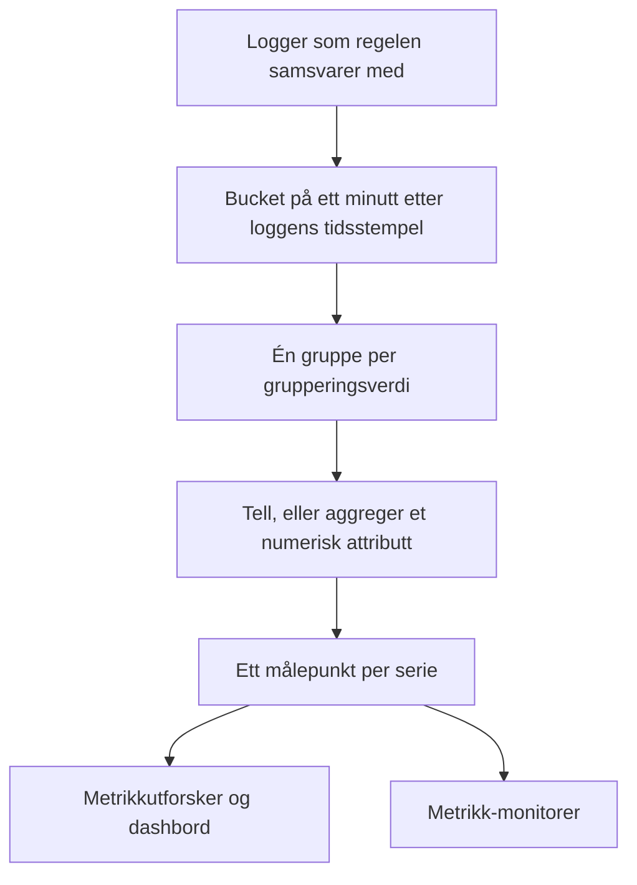
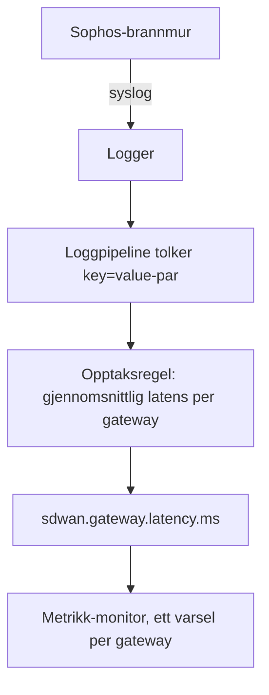

# Opptaksregler for logger

En **Log Recording Rule** gjør logger om til en måling. Hvert minutt tar den loggene filteret samsvarer med, og skriver ett tall per minutt til målingslageret: hvor mange logger som samsvarte, eller summen, gjennomsnittet, minimum, maksimum eller en persentil av et numerisk attributt i de loggene. Del resultatet opp etter opptil fem loggattributter, så får du én serie per verdi: én per gateway, per vert, per kunde.

:::cards
- [Slik virker en regel](#slik-virker-en-regel): Buckets, tidspunkter, innhenting og hull.
- [Opprette en regel](#opprette-en-regel): Feltene i regeleditoren.
- [Eksempel: latens for SD-WAN-gatewayer](#eksempel-latens-for-sd-wan-gatewayer-fra-en-sophos-brannmur): Fra brannmur-syslog til et varsel per gateway.
- [Tillatelser](#tillatelser): Hvem som kan opprette, endre og lese regler.
:::

## Oversikt

Resultatet er en vanlig måling. Vis den i **Metrikkutforsker** og på dashbord, og få varsler på den med en monitor av typen **Målinger**, også varsler per serie med **Grupper etter**.

Bruk en opptaksregel for logger når tallet du er interessert i, bare finnes i loggene dine: SLA-sammendragene til en brannmur, en batchjobb som logger hvor lang tid den brukte, svarstørrelsene i en tilgangslogg, eller ganske enkelt hvor mange feillogger en tjeneste skriver hvert minutt.

Opptaksregler for logger finner du under **Logger → Innstillinger → Opptaksregler**. Tilsvarende regler for målinger og spans ligger under **Målinger → Innstillinger → Opptaksregler** og **Spor → Innstillinger → Opptaksregler**.

## Slik virker en regel



- **Ett punkt per minutt per serie.** Logger grupperes i buckets på 1 minutt etter tidsstempelet. Hver bucket gir ett punkt for hver unike kombinasjon av verdiene i grupperingsattributtene.
- **Beregnes 30 sekunder etter at minuttet er over.** Den korte ventetiden lar logger som kommer litt sent, likevel havne i riktig minutt. En logg som kommer senere enn det, telles ikke.
- **Ingen hull, ingen dobbelttelling.** Hver regel husker det siste minuttet den skrev (vist som **Computed Until** i regellisten). Etter en omstart av workeren eller annen nedetid henter den inn minuttene den gikk glipp av, opptil 60 minutter tilbake, og den skriver aldri samme minutt to ganger.
- **En telling uten gruppering har aldri hull.** Et minutt uten samsvarende logger skrives som `0`. Alle andre regler skriver ingenting for et minutt uten noe å aggregere, så diagrammer og monitorer ser manglende data i stedet for en oppdiktet null.
- **Skrives som enhver annen avledet måling.** Punktene er Gauge-datapunkter med regelens **Navn på utdata-måling**, de bærer grupperingsattributtene og `oneuptime.derived.log_rule_id` (regelens ID), og de følger samme oppbevaring som punktene fra opptaksreglene for målinger og spor: 15 dager.

En endring i definisjonen av en regel gjelder fra neste minutt den skriver; punkter som allerede er skrevet, skrives ikke om. Slås en regel av, stopper den; slås den på igjen, henter den inn minuttene den gikk glipp av mens den var av, opptil de samme 60 minuttene.

## Opprette en regel

:::steps
### Åpne opptaksreglene

Gå til **Logger → Innstillinger → Opptaksregler**, og velg **Opprett Log Recording Rule**.

### Gi regelen et navn

Skriv inn et **Navn**. **Navn på utdata-måling** under det lages fra navnet mens du skriver; velg **Rediger** ved siden av for å skrive ditt eget.

### Velg loggene og hva som skal beregnes

Snevre inn regelen under **Which Logs** med telemetritjenester, alvorlighetsgrader, tekst og attributtfiltre. Velg en **Aggregering** og, for alt annet enn en telling, det **Numeric Attribute** som skal aggregeres.

### Del opp resultatet og lagre

Legg eventuelt til attributter under **Grupper etter** og en **Unit**. Sjekk linjen nederst i editoren, og lagre deretter. Innen noen få minutter viser regellisten et tidspunkt under **Computed Until**.
:::

| Felt | Hva det gjør |
| --- | --- |
| Navn | Hva regelen beregner, f.eks. *SD-WAN gateway latency*. |
| Navn på utdata-måling | Målingen regelen skriver. Lages fra navnet (*SD-WAN gateway latency* skriver `sd_wan_gateway_latency`), med mindre du velger **Rediger** og skriver ditt eget. Det må være unikt blant prosjektets opptaksregler. |
| Which Logs | Valgfrie filtre, alle kombinert med AND: telemetritjenester, alvorlighetsgrader, tekst som loggteksten inneholder, og attributtfiltre (et attributt lik en verdi). |
| Aggregering | `Count of logs`, eller en aggregering av et numerisk attributt (se nedenfor). |
| Numeric Attribute | For alle aggregeringer unntatt telling: attributtet der verdiene aggregeres, f.eks. `latency`. |
| Grupper etter | Valgfritt: opptil 5 attributtnøkler. Én serie per unike kombinasjon av verdiene deres. |
| Unit | Valgfritt: enheten til utdata-målingen, f.eks. `ms`. Vises overalt der målingen vises i et diagram. |
| Beskrivelse | Under **Flere felt**: hva regelen er til. |
| Aktivert | Under **Flere felt**: på som standard. Bare aktiverte regler beregnes. |

Linjen nederst i editoren sier hva regelen kommer til å skrive, f.eks. `avg(latency) by gw_name, profile_name`.

En regel kan filtrere på høyst 10 attributter og 100 telemetritjenester.

### Aggregeringer

| Aggregering | Hvert minutts punkt |
| --- | --- |
| Count of logs | Hvor mange logger som samsvarte med filteret. |
| Gjennomsnitt | Gjennomsnittet av verdiene til det numeriske attributtet. |
| Sum | Attributtets verdier lagt sammen. |
| Minimum | Den minste verdien. |
| Maksimum | Den største verdien. |
| p50 (median) | Medianverdien. |
| p75 | 75-persentilen. |
| p90 | 90-persentilen. |
| p95 | 95-persentilen. |
| p99 | 99-persentilen. |

### Numeriske attributter

Verdien til det numeriske attributtet må være et vanlig tall. Den kan komme som et tall (`latency=11` tolket som tall) eller som tekst (`"11"`, `"11.5"`, `"1e3"`). En logg der verdien mangler eller ikke er et tall (`"11ms"`, `"n/a"`, en tom streng), **hoppes over**. Den telles aldri som `0`, så en feilformatert logg kan ikke dra et gjennomsnitt ned.

### Attributtnøkler

Nøkler i attributtfiltre samsvarer uansett store og små bokstaver, akkurat som filtrene i loggutforskeren. Det numeriske attributtet og grupperingsnøklene må skrives nøyaktig slik loggene dine bærer dem, inkludert et prefiks som en loggpipeline legger til. Nøkkelfeltene foreslår nøklene loggene i prosjektet ditt bærer, så velg fra listen i stedet for å skrive en nøkkel for hånd.

Nøkler kan inneholde bokstaver, sifre og `. _ : / -`.

### Gruppering og grensen for serier

Hver grupperingsnøkkel ganger antallet serier en regel skriver, så grupper etter attributter som identifiserer noe du vil se eller få varsler på hver for seg (en gateway, en vert, en kunde), ikke etter attributter som er forskjellige i hver logg, som en forespørsels-ID eller IP-adressen til en klient.

En regel skriver høyst 1000 serier per minutt. Utover det beholdes seriene med flest samsvarende logger, og resten av det minuttet droppes. En logg som mangler et av grupperingsattributtene, telles likevel; serien dens skrives uten det attributtet.

## Eksempel: latens for SD-WAN-gatewayer fra en Sophos-brannmur

En Sophos XGS-brannmur med SD-WAN-logging slått på sender med noen minutters mellomrom et SLA-sammendrag per SD-WAN-profil og gateway:

```text
log_type="SD-WAN" log_component="SLA" profile_name="Branch-Internet" gw_name="WAN2" latency=11 jitter=2 packet_loss=0 gw_status="up" sla_status="SLA met"
```

Dette eksempelet gjør sammendragene om til en latensmåling per gateway og varsler når latensen til én gateway holder seg høy.



:::steps
### Få loggene inn, med feltene som attributter

1. Send brannmurens syslog til OneUptime: se [Syslog](/docs/telemetry/syslog).
2. Legg under **Logger → Innstillinger → Pipelines** til en pipeline med en prosessor som deler loggtekstens `key=value`-par opp i loggattributter, slik at hvert sammendrag bærer `log_type`, `log_component`, `profile_name`, `gw_name`, `latency`, `jitter` og `packet_loss` som attributter. [Key=Value Parser](/docs/telemetry/log-pipelines#keyvalue-parser) gjør dette.
3. Åpne utforskeren **Logger**, og sjekk attributtnavnene på en SLA-logg. Legger pipelinen din til et prefiks, bruker du navnene med prefiks nedenfor.

### Opprett opptaksregelen

Opprett en regel under **Logger → Innstillinger → Opptaksregler**:

- **Navn:** SD-WAN gateway latency
- **Navn på utdata-måling:** velg **Rediger**, og skriv `sdwan.gateway.latency.ms`
- **Which Logs:** attributtfiltre `log_type` = `SD-WAN` og `log_component` = `SLA`
- **Aggregering:** Gjennomsnitt, **Numeric Attribute:** `latency`
- **Grupper etter:** `gw_name` og `profile_name`
- **Unit:** `ms`

Via API-et, MCP eller Terraform er **definisjonen** av samme regel:

```json
{
  "filter": {
    "attributeFilters": [
      { "key": "log_type", "value": "SD-WAN" },
      { "key": "log_component", "value": "SLA" }
    ]
  },
  "aggregationType": "Avg",
  "valueAttribute": "latency",
  "groupByAttributes": ["gw_name", "profile_name"],
  "unit": "ms"
}
```

Gjenta med `jitter` (`sdwan.gateway.jitter.ms`, enhet `ms`) og `packet_loss` (`sdwan.gateway.packet_loss.percent`, enhet `%`) for de to andre SLA-målingene. En regel **Count of logs** filtrert på `gw_status` = `down` og gruppert etter `gw_name` teller meldingene om nede gatewayer per gateway.

Innen noen få minutter viser regellisten et tidspunkt under **Computed Until**, og `sdwan.gateway.latency.ms` dukker opp i metrikkutforskeren: velg den, grupper etter `gw_name`, og du har én latenslinje per gateway.

### Få varsel når latensen til én gateway holder seg høy

Opprett en monitor av typen **Målinger** (se [Metrikk-overvåking](/docs/monitor/metrics-monitor)):

1. **Metrikkspørring:** `sdwan.gateway.latency.ms`, aggregering **Gjennomsnitt**, **Grupper etter** `gw_name` og `profile_name`.
2. **Rullerende tidsvindu:** Past 15 Minutes. Brannmuren rapporterer med noen minutters mellomrom, så vinduet inneholder flere punkter per gateway.
3. **Aggregeringsstrategi:** **All Values**: hvert punkt i vinduet må overskride grensen, slik at ett tregt sammendrag ikke vekker noen. Bruk heller **Gjennomsnitt** for å få varsel ved et høyt gjennomsnitt.
4. **Kriterier:** Metric value **Greater Than** `150` åpner et varsel.
5. Bruk eventuelt grupperingsverdiene i tittelen på varselet, f.eks. `SD-WAN latency high on {{gw_name}} ({{profile_name}})`.

Med gruppering satt er hver gateway sin egen serie: blir WAN2 treg, åpnes et varsel bare for WAN2, og det løses av seg selv når WAN2 kommer seg. Se [Varsler per serie](/docs/monitor/metrics-monitor).
:::

## Greit å vite

- **Tidsstempler kommer fra loggene.** En logg havner i minuttet til sitt eget tidsstempel. En enhet der klokken går mer enn litt feil, legger loggene sine i feil minutt, eller helt utenfor vinduet.
- **Ingen tilbakeberegning.** En ny regel starter med minuttet før den første kjøringen; eldre logger beregnes ikke.
- **Å slette en regel** stopper den. Punktene den allerede har skrevet, blir værende til de utløper.
- **Opptaksregler ser alle prosjektets logger.** Alle som kan lese utdata-målingen, ser tall som er beregnet fra hver logg regelens filter samsvarer med, så det å opprette og redigere opptaksregler for logger er forbeholdt prosjekteiere, administratorer og tillatelsene **Create / Edit Log Recording Rule**.

## Tillatelser

| Tillatelse | Gir lov til |
| --- | --- |
| Create Log Recording Rule | Å opprette regler. |
| Edit Log Recording Rule | Å endre regler og slå dem av. |
| Delete Log Recording Rule | Å slette regler. |
| Read Log Recording Rule | Å se regler og hva de beregner. |

Prosjekteiere og administratorer kan gjøre alt dette. Prosjektmedlemmer, lesere og telemetrirollene kan lese regler.

## Neste trinn

:::cards
- [Metrikk-overvåking](/docs/monitor/metrics-monitor): Få varsel på målingene reglene dine skriver.
- [Loggpipelines](/docs/telemetry/log-pipelines): Trekk ut attributtene en regel aggregerer.
- [Syslog](/docs/telemetry/syslog): Send logger fra brannmurer og servere til OneUptime.
:::
